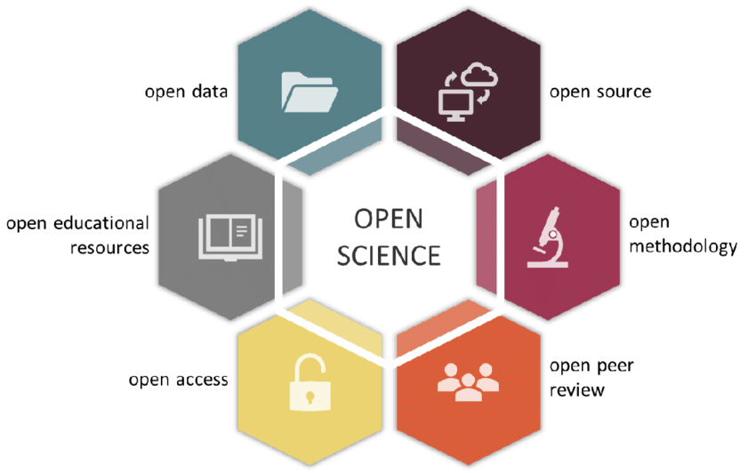

.. include:: cyverse_rst_defined_substitutions.txt
.. include:: custom_urls.txt

|CyVerse_logo|_

Introduction to Open Science
------------------------------

   .. admonition:: Learning Objectives

        After this lesson, learners should be able to:

        1. Describe and discuss features of Open Science
        2. Understand the structure of the FOSS workshop and final project
        3. Describe the core platforms and capabailities of CyVerse and learn more about them

       
What is Open Science?
~~~~~~~~~~~~~~~~~~~~~~~~~~~~~~~

Well, isn't this the million dollar question?

If you ask a dozen researchers, you will probably get just as many answers. The concept of Open Science is changing and growing as technology, expectations, and the reproducibility crisis change. What constitutes Open Science can also be very different across domains, based on both cultural expectations and more logistical limitations such as data privacy. This means that Open Science isn't necessarily a set of checkboxes you need to tick, but rather an holistic approach to doing science.

To get a feel for how Open Science can be multifaceted and different for each researcher, we will do a short breakout group session to discuss what Open Science means to you.

  .. admonition:: Discussion Question
    :class: admonition-question

        What does Open Science mean to you?

        What characteristics might a paper/project/lab require to qualify as "Open"?

        What are some limitations to you, your lab/group, or your domain?

Components of Open Science
===============================

One of the most fundamental, and certainly the most publicized component of Open Science is the accessibility of data. This makes sense- without access to your data, nothing else about your science can be all that open. While we will devote an entire week of this course to data, opening up your data is only one piece of the puzzle.

|open science pieces|
*Gallagher et al 2020, Nature Eco Evo*

This figure demonstrates the multiple intersecting pieces of Open Science, which go beyond simply making data accessible. While we focus primarily on Open Data, Open Source, and Open Methodology in FOSS, it's worth considering how other parts of the scientific process might be opened up more broadly.

Another component which sort of covers all of the pictured components, or at least links a lot of them together, might be referred to as Open Process. In response to the Reproducibility Crisis, many researchers, particularly in fields like psychology, have begun to advocate for **preregistration** of studies. This involves writing out and publishing your entire research plan, from data collection to analysis and publication, for the sake of avoiding practices like p-hacking or HARKing. What preregistration also does is make the process of your work more open, including many of the small decisions and tweaks you make to a project that probably wouldn't make it into a manuscript. To learn more about preregistration, you can check out the |Open Science Framework|, a project that provides a preregistration platform and other open science tools.

As mentioned above, it is worthwhile to think about Open Science not as a set of checkboxes, but rather a holistic approach to doing science. In that spirit, it can also be useful to think about Open Science as a spectrum, from less to more open. While you might not achieve some platonic ideal of openness for a variety of reasons, you can still make great progress in moving your science towards the Open end of the spectrum. In reality, a large scientific project probably consists of multiple spectra; you can move your data towards the open end of the spectrum while your software remains less open, and vice versa. All this is to say that doing open science is not a static set of goals you must achieve, it is a process that grows and changes with your science itself.

One of the biggest challenges of doing science is that you might have to wear many different hats: domain expert, lab manager, statistician, teacher, mentor, grant writer, manuscript author, public speaker... the list goes on. Doing Open Science is no different, but the list of skills may be even greater, since the goal is now to openly communicate each step of the process to a broader audience. This also makes teaching Open Science quite challenging- we will cover topics ranging from "soft skills" like project management and internal communications to more technical skills like software management and containers. We could probably teach this whole workshop on each single topic, but we clearly don't have the time to do that. Instead, we will focus on a higher-level look at the landscape of Open Science and introduce you to a wide variety of skills and concepts with the idea that you can go on to find ways to implement them in your own work.

Workshop Structure
~~~~~~~~~~~~~~~~~~~~~~~~~~~~~~~

Each week we will discuss a new topic, ranging from data management to documentation to software management. Much of the content will intersect and cross over from week to week, and many of the skills and approaches we discuss will interact with each other. As you already know, being a scientist requires you to wear many hats, and trying to do Open Science is no different.

As we mentioned, Open Science is not a set of boxes you need to check off to be "Certified Open", but an intersecting set of philosophies and approaches, all of which occur on some type of spectrum. Our ultimate goal in this workshop is for you to "level up" one or more of those philosophies/approaches/skills. For example, if your project currently has no documentation, you could level up to including a thorough README file laying out your project's structure. If you already have minimal documentation, maybe you level up to a GitHub pages website with some worked examples and guides.

Final Project Structure
===================================

The FOSS workshop has a final project that involves a combination of solo and group work. You can read more about it at the :doc:`final_project/overview` page, but the final project will involve two primary phases.

The first phase will be taking a skill or concept you've learned, generally pertaining to one week's worth of instruction, and putting it into action for one of your own projects. This could be something like improving documentation for an existing project or creating a Data Management Plan for a project proposal. 

The next phase of the final project will be working with a group of other FOSS learners who tackled your same topic. Together, you will discuss challenges, tips, and next steps for that topic, and put together a short presentation that will be delivered to the rest of the FOSS attendees durning our final meeting.

Introduction to CyVerse
~~~~~~~~~~~~~~~~~~~~~~~~~~~~~~~

There are many approaches to doing Open Science, and no single platform or tool is the "right" way. However, there can be some benefits to using a set of tools designed to work together; for example, Google Docs, Gmail, and Google Calendar tend to play nicely together.

CyVerse provides a series of tools that can help you do Open Science, from data storage to cloud-based analysis and collaboration, as well as support and training to get you up to speed. We will take a brief look at how CyVerse works and some of its main tools.

**About CyVerse**
=================

**CyVerse Vision:** Transforming science through data-driven discovery.

**CyVerse Mission:** Design, deploy, and expand a national
cyberinfrastructure for life sciences research and train scientists in
its use.

**CyVerse Homepage:** `http://www.cyverse.org <http://www.cyverse.org>`_

To do science with computers, you've gotta have hardware. That could be your laptop, a big computer in your lab, or even a supercomputer on your university campus. For a lot of things, you can work pretty directly with the hardware- you run some code on your laptop, you get some results. However, as your computational needs grow, you might have to step things up to a bigger computer or set of computers. All of a sudden, things get a lot more complicated, and a lot more systems are needed to manage these bigger resources. 

CyVerse has taken care of a lot of that hard work, creating a series of services that manage hardware, users, data storage, and more. These services can work with CyVerse's own hardware, or with other hardware at institutions worldwide. Multiple services can be stitched together to create custom applications or scientific pipelines. More advanced users have put services together to create custom projects, which we call Powered by CyVerse. We've also put a bunch of these services together to create a series of user-friendly platforms so you can store your data, run analyses, and share your work. We'll walk through a few of these platforms to show you what they can do.

|layer cake|

`Data Store <https://de.cyverse.org/de/>`_
^^^^^^^^^^^^^^^^^^^^^^^^^^^^^^^^^^^^^^^^^^

|datastorelogo|

**Securely store data for active analyses or sharing with your collaborators.**

- Upload, download and share your data
        - DE simple upload/download. Convenient but not good for large files.
        - Cyberduck is a third-party software with graphic interface for transferring data. Available for Mac and Windows.
        - iCommands is more powerful/flexible, good for large transfers but requires some command line knowledge
- Data limit of 100 GB (can request increase up to 10 TB)
- Share your data with collaborators
- `Data Store guide <https://cyverse-data-store-guide.readthedocs-hosted.com/en/latest/>`_

`Discovery Environment <https://de.cyverse.org/de/>`_
^^^^^^^^^^^^^^^^^^^^^^^^^^^^^^^^^^^^^^^^^^^^^^^^^^^^^

|DElogo|

**Use hundreds of bioinformatics apps and manage data in a simple web interface.**

    - Provides graphic interface for bioinformatics tools for scientists with no command line experience
    - User extensible. Users can add their own tools and make their own apps.
           - Share them with collaborators
           - Publish them
    - VICE (Visual and Interactive Computing Environment) for interactive use of Jupyter notebooks, RStudio and RShiny.
    - Integrated with the Data Store for ease of use
    - Share your data and analyses together with your collaborators
    - `DE guide <http://learning.cyverse.org/projects/cyverse-discovery-environment-guide/>`_
    - `VICE documentation <https://cyverse-visual-interactive-computing-environment.readthedocs-hosted.com/en/latest/index.html>`_

`Atmosphere <https://atmo.cyverse.org/application/images>`_
^^^^^^^^^^^^^^^^^^^^^^^^^^^^^^^^^^^^^^^^^^^^^^^^^^^^^^^^^^^

|atmologo|

**Create a custom cloud-based scientific analysis platform or use a ready-made one for your area of scientific interest.**

    - Cloud computing for life sciences
    - 100s of pre-built virtual machine images
    - Fully customize your software setup
    - Choose (or build) an image that best suits your needs
    - `Atmosphere guide <https://cyverse-atmosphere-guide.readthedocs-hosted.com/en/latest/>`_

`Data Commons <http://datacommons.cyverse.org/>`_
^^^^^^^^^^^^^^^^^^^^^^^^^^^^^^^^^^^^^^^^^^^^^^^^^

|DClogo|

**The Data Commons provides services to manage, organize, preserve, publish, discover, and reuse data.**

    - Access discoverable and reusable data with metadata features and functions
    - Browse Community Released Data and data curated by CyVerse
    - Easily publish data to the NCBI or directly to the CyVerse Data Commons

Taking It Further
^^^^^^^^^^^^^^^^^^^^^^^^

For more complex use cases, you can build customized apps, services, pipelines, etc. on top of CyVerse resources. This usually involves interfacing with lower-level components of CyVerse, which you saw on the tiered chart earlier.

`The CyVerse Learning Center <https://learning.cyverse.org/en/latest/#>`_
^^^^^^^^^^^^^^^^^^^^^^^^^^^^^^^

|LClogo|

**The CyVerse Learning center contains documentations and tutorials on using CyVerse tools.**

Intercom
^^^^^^^^^^^^

|intercomlogo|

Intercom is our live-chat user support app. You will find the Intercom 'smiley' logo in the bottom right corner of the Discovery Environment, Atmosphere, the Wiki and the user portal.

**Funding and Citations**

CyVerse is funded entirely by the National Science Foundation under
Award Numbers DBI-0735191, DBI-1265383 and DBI-1743442.

Please cite CyVerse appropriately when you make use of our resources,
`CyVerse citation
policy <http://www.cyverse.org/acknowledge-and-cite-cyverse>`__

.. |Github Repo Link|  raw:: html

   <a href="https://github.com/CyVerse-learning-materials/foss-2020/tree/master/CyVerse/intro_to_cyverse.rst" target="blank">Github Repo Link</a>

.. |cyverse logo| image:: img/cyverse_cmyk.png
  :width: 750
  :height: 175

.. |layer cake| image:: img/layercake.png
  :width: 750
  :height: 600

.. |datastorelogo| image:: img/data_store/datastore-icon.png
  :width: 88
  :height: 100

.. |DElogo| image:: img/de/de-icon.png
  :width: 100
  :height: 88

.. |atmologo| image:: img/atmosphere/atmosphere-icon.png
  :width: 100
  :height: 75

.. |bisquelogo| image:: img/bisque/bisque-icon.png
  :width: 100
  :height: 100

.. |dnasubwaylogo| image:: img/dna_subway/dnasubway-icon.png
  :width: 100
  :height: 75

.. |DClogo| image:: img/DataCommons_DrkBlue.png
  :width: 100
  :height: 100

.. |PBlogo| image:: img/PoweredbyCyverse_LogoSquare.png
  :width: 88
  :height: 100

.. |LClogo| image:: img/Learningcenter_DkBlue.png
  :width: 100
  :height: 100

.. |intercomlogo| image:: img/intercomlogo.png
  :width: 100
  :height: 100

.. |evolcyverse| image:: img/evolutionofcyverse.png
  :width: 750
  :height: 200

.. |sciAPIslogo| image:: img/agave/ScienceAPIs_DkBlue.png
  :width: 100
  :height: 75

.. |Open Science Framework| raw:: html

   <a href="https://osf.io/" target="blank">Open Science Framework</a>
