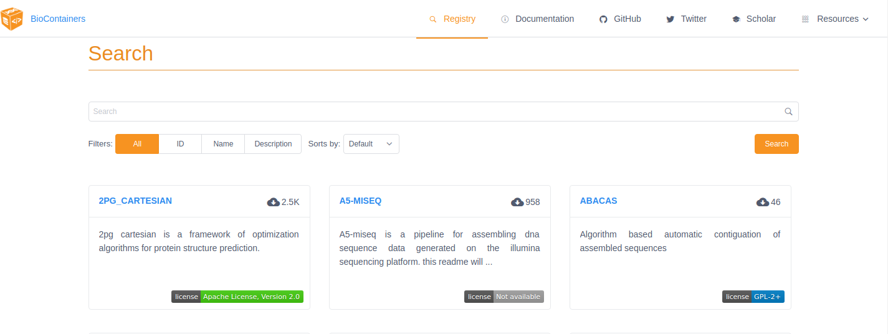
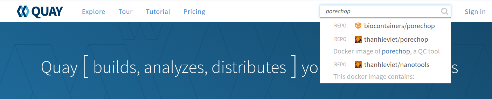
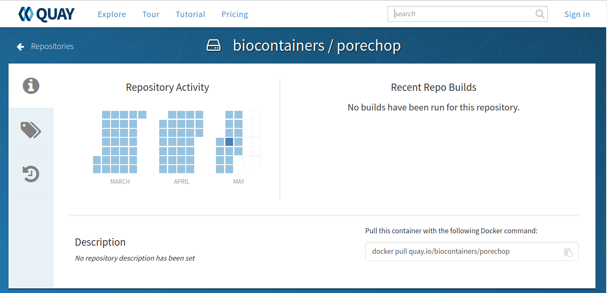
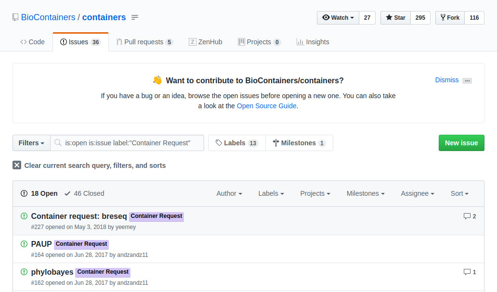
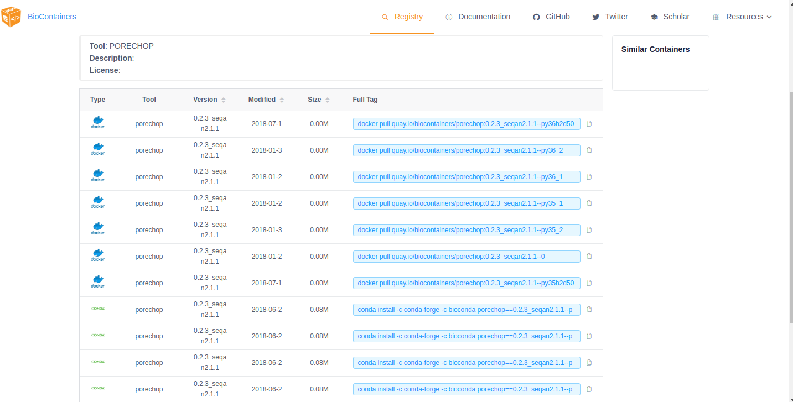

.. include:: ../cyverse_rst_defined_substitutions.txt

|CyVerse_logo2|_

|Home_Icon2|_
`Learning Center Home <http://learning.cyverse.org/>`_

**Introduction to BioContainers**
=================================

`BioContainers <https://biocontainers.pro/#/>`_ is a community-driven project that provides the infrastructure and basic guidelines to create, manage and distribute bioinformatics containers with **special focus in proteomics, genomics, transcriptomics and metabolomics**. BioContainers is based on the popular frameworks of Docker. 

|biocontainerlogo|

**BioContainers Goals**:

- Provide a base specification and images to easily build and deploy new bioinformatics/proteomics software including the source and examples.

- Provide a series of containers ready to be used by the bioinformatics community (https://github.com/BioContainers/containers).

- Define a set of guidelines and specifications to build a standardized container that can be used in combination with other containers and bioinformatics tools.

- Define a complete infrastructure to develop, deploy and test new bioinformatics containers using continuous integration suites such as Travis Continuous Integration (https://travisci. org/), Shippable (https://app.shippable.com/) or manually built solutions.

- Provide support and help to the bioinformatics community to deploy new containers for researchers that do not have bioinformatics support.

- Provide guidelines and help on how to create reproducible pipelines by defining, reusing and reporting specific container versions which will consistently produce the exact same result and always be available in the history of the container.

- Coordinate and integrate developers and bioinformaticians to produce best practice of documentation and software development.

**Introduction to Bioconda**
----------------------------
|biocondalogo|

`Bioconda <https://bioconda.github.io/>`_ is a channel for the conda package manager specializing in bioinformatics software. It consists of:

- A repository of recipes hosted on `GitHub <https://github.com/bioconda/bioconda-recipes/tree/master/recipes>`_
- A build system that turns these recipes into conda packages
- A repository of > 6000 bioinformatics packages ready to use with a simple conda install command
- **Each package added to Bioconda also has a corresponding Docker BioContainer automatically created and uploaded to Quay.io**
- Over 600 contributors that add, modify, update and maintain the recipes

.. Note::

	**Recipe vs package**
	A **recipe** is a directory containing a small set of files that defines name, version, dependencies, and URL for source code. A recipe 
	typically contains a meta.yaml file that defines these settings and a build.sh script that builds the software. A recipe is 
	converted into a package by running "conda-build" on the recipe. 
	A **package** is a bgzipped tar file (.tar.bz2) that contains the built software. Packages are uploaded to anaconda.org so that users can install them with "conda install" command.

You can `contribute <https://bioconda.github.io/contributing.html>`_ to the Bioconda project by building your own packages. Each package will also be made available as a BioContainer at `Quay.io <https://quay.io/organization/biocontainers>`_.

.. _getbiocontainer:

**Glossary**
------------
- **Image:** self-contained, read-only ‘snapshot’ of your applications and packages, with all their dependencies
- **Container:** a running instance of your image
- **Image registry:** a storage and content delivery system, holding named images, available in different tagged versions
- **Docker:** a program that runs and handles life-cycle of containers and images
- **CyVerse tool:** Software program that is integrated into the back end of the DE for use in DE apps
- **CyVerse app:** graphic interface of a tool made available for use in the DE

Where to Get a BioContainer
---------------------------

Images are made publicly available through image registries. There are several different image registries that provide access to BioContainers. The three major registries are detailed here.

The BioContainers Registry
^^^^^^^^^^^^^^^^^^^^^^^^^^
`BioContainers Registry <https://biocontainers.pro/#/registry>`_ UI provides the interface to search, tag, and document BioContainers across all the registries. Which means that if a BioContainer exists you can find it here.

To find the tool you want to use just search for it by name in the search box at the top of the registry page. The BioContainers registry returns partial matches and matches to the tool description. So, if you want to find all the tools relevant to Nanopore analysis you can search for 'nanopore'. 

|biocontainersregistry|

If the tool you are looking for is already available as a BioContainer click on that tile in the search results. This will display all the available BioContainers and Conda packages for this tool (ie. different versions of the tool). Choose the version of the tool you want to use (when in doubt, choose the most recent version). Select the icon at the right to copy the 'docker pull' command for that version.

|registrytags|

.. Note:: You want the docker images, not the Conda packages. Conda packages are not containers. 

.. Note:: If your tool is not already available as a BioContainer (ie. your search returned nothing) proceed to the `How to Request a BioContainer`_ or `How to Build a BioContainer`_ section below. 

Quay
^^^^
`Quay <https://quay.io/>`_ is another image registry. Unlike the BioContainers Registry, Quay.io is not specific to BioContainers. Anyone (including you) can create an account at Quay.io and host your own images but **an account is not necessary to use BioContainers (or other publicly available images)**.

Although anyone can create a BioContainer, the majority of BioContainers are created by the Bioconda project. Every Bioconda package has a corresponding BioContainer available at Quay.io. From the Quay.io page search for the tool you want by name. 

.. Note:: The Quay.io search will only find those tools with an exact match of the name (unlike the BioContainers Registry). 

.. Important:: Other users may also have images available that contain your tool. Be sure to choose the image that is part of the 'biocontainers' organization. BioContainers is a trusted source and you know what you're getting. 

|quayio|

.. Note:: If your search yields no results then double-check by searching the BioContainers Registry (just to be sure). If your tool isn't available as a BioContainer then proceed to the `How to request a BioContainer`_ or `How to build a BioContainer`_ section below.

From the repo page, choose the 'tags' tab on the left side of the screen and you will get a list of the available images. Unlike the BioContainers Registry, Quay.io will not display conda packages in the list. Again, when in doubt choose the most recent version available for your tool. Click on the 'fetch tag' icon to the right of your chosen version. Then select 'Docker pull (by tag)' from the drop-down and copy the 'docker pull' command.

|quayiotags|

|quayiopull| 

DockerHub
^^^^^^^^^
`DockerHub <https://hub.docker.com/>`_ is the most well-known and popular image registry for Docker containers. Like Quay.io, you can create an account at DockerHub and host your own images but **an account is not necessary to use BioContainers (or other publicly available images)**. 

There are fewer BioContainers images available at DockerHub than the other two registries. You can see them all by searching for 'biocontainers' in the search bar of the DockerHub page. 

|dockerhub|

.. Note:: You can also search for the name of the tool you want. Be sure that you choose images the belong to the BioContainers organization. There will be many other options available on DockerHub. BioContainers is a trusted source. 

The second image in this search results list is 'vcftools'. Select 'vcftools' and you will see the repo page for this tool. The 'docker pull' command can be copied from the overview page; however, there is no tag specified. To see the available versions, select the tags tab at the top of the page. You will need to supply the tag of the version you want following a colon at the end of your docker pull command to get a specific version.

.. code-block:: bash

   $ docker pull biocontainers/vcftools:v0.1.14_cv2

While DockerHub offers fewer BioContainers than the other registries it does offer some advantages for those who want to build their own BioContainers. 

- The first image in the  search results for 'biocontainers' is the 'biocontainers base image'. This image can be built upon if you wish to build your own BioContainers. 
- Dockerfiles are available for these containers so you can see exactly how they were built.

For more information on building your own BioContainer see `How to build a BioContainer`_ section below. 

.. _request:

How to Request a BioContainer
-----------------------------

If the tool you want isn't available as a BioContainer you can request that one be built for you.
Users can request a container by opening an issue in the `containers repository <http://github.com/BioContainers/containers/issues>`_ 

|requestcontainer|

The issue should contain:

- the name of the software
- the url of the code or binary to be packaged
- information about the software
- tag the issue with the 'Container Request' label 

When the container is deployed and fully functional, the issue will be closed by the developer or the contributor to BioContainers. When a container is deployed and the developer closes the issue in GitHub the user receives a notification that the container is ready.You can the find your container at Quay.io and use the 'docker pull' command to run it as you would any other container.

How to Use a BioContainer
-------------------------
To run your BioContainer you will need a computer with Docker installed. 
 
How to Install Docker
^^^^^^^^^^^^^^^^^^^^^

Installing Docker on your computer takes a little time but it is reasonably straight forward and it is a one-time setup. `Docker can be installed by following these directions. <https://learning.cyverse.org/projects/container_camp_workshop_2019/en/latest/docker/dockerintro.html>`_

Docker installation is much easier on an Atmosphere instance with the 'ezd' command.

.. code-block:: bash

    $ ezd
    

Get Data to Use with Your Container 
^^^^^^^^^^^^^^^^^^^^^^^^^^^^^^^^^^^^

`Set up iCommands. <https://learning.cyverse.org/projects/atmosphere-guide/en/latest/step4.html>`_ 

.. code-block:: bash

   $ iget /iplant/home/shared/iplantcollaborative/example_data/porechop/SRR6059710.fastq
   $ mv SRR6059710.fastq Desktop
   $ cd Desktop

Use 'docker pull' to Get the Image
^^^^^^^^^^^^^^^^^^^^^^^^^^^^^^^^^^

First, you will need to pull the image from the registry onto your computer. Use the 'docker pull' command you copied from the registry above (`Where to Get a BioContainer`_). 

.. code-block:: bash

   $ docker pull quay.io/biocontainers/porechop:0.2.3_seqan2.1.1--py36h2d50403_3

.. Note:: 
    If you are working on a system for which you don't have root permissions you will need to use 'sudo' and provide your password. Like this:

.. code-block:: bash

   $ sudo docker pull quay.io/biocontainers/porechop:0.2.3_seqan2.1.1--py36h2d50403_3

|pullquayio|

Use the 'docker run' Command to Run the Container
^^^^^^^^^^^^^^^^^^^^^^^^^^^^^^^^^^^^^^^^^^^^^^^^^^

The easiest way to test that the container will run is to run the help command for the tool. In this case '-h' is the help command.

.. code-block:: bash

	sudo docker run --rm -v $(pwd):/working-dir -w /working-dir --entrypoint="porechop" quay.io/biocontainers/porechop:0.2.3_seqan2.1.1--py36h2d50403_3 -h
	
From the result we are able to see the only required option is '-i INPUT'. Options in [square brackets] are not required.

Now we can run the container with our data file to see the output.

.. code-block:: bash
	
	sudo docker run --rm -v $(pwd):/working-dir -w /working-dir --entrypoint="porechop" quay.io/biocontainers/porechop:0.2.3_seqan2.1.1--py36h2d50403_3 -i SRR6059710.fastq -o porechop_output.fastq

We can break the command down into pieces so it is easier to read (the backslash represents where we have broken the line).

.. code-block:: bash

    sudo \ 
    docker run \
    --rm \
    -v $(pwd):/working-dir \
    -w /working-dir \
    --entrypoint="porechop" \
    quay.io/biocontainers/porechop:0.2.3_seqan2.1.1--py36h2d50403_3 \
    -i SRR6059710.fastq \
    -o porechop_out.fastq

What it All Means
^^^^^^^^^^^^^^^^^
- 'sudo' allows you to run the container with 'root' permissions--only required if you don't have root permissions on your machine
- 'docker run' tells docker to run the container
- '--rm' removes the container (not the image) from your system when the analysis is complete
-  '-v' mounts a *local* directory into a directory *within the container*
-  '-w' specifies the working directory within the container
-  '--entrypoint' tells the container what to do (usually the name of the tool; the command you would use to run the tool on the command line)
-  'quay.io/biocontainers/porechop:0.2.3_seqan2.1.1--py36h2d50403_3' is the name of the image we pulled from Quay.io
-  '-i' is the argument for the input file (FASTQ) for Porechop
-  '-o' is the arguemnt for the output file (trimmed FASTQ) for Porechop

.. Important:: 

    You must supply an entrypoint on the command line when you run a BioContainer. It is possible to build entrypoints into a container but that is not he case with BioContainers.

|porechoprun|
|porechoptrim|
|porechopdone|

The output from Porechop is saved into the working directory within the container. We ran the container we mounted our current *local* working directory into the working directory *within the container*. The analysis has finished, the container has been removed (remember --rm) and now we should find our outputs in our *local* current working directory. 

List the files:

.. code-block:: bash

    $ ls -l

|porechopout|

You can see the 'porechop_out.fastq' file is in our current working directory. Notice that the this file is owned by 'root'. This is because Docker containers always run as 'root'.

At this point you can run your container on any system with Docker installed. To use this container on an HPC system you will need to use Singularity (rather than Docker) to run your container. For more information about running Docker containers with Singularity see the `Singularity documentation <https://singularity.lbl.gov/quickstart>`_

.. Note::

	Reporting a problem with a container:
	If you find a problem with a BioContainer an issue should be opened in the `containers repository <http://github.com/BioContainers/containers/issues>`_, you should use the 'broken' tag (see tags). Developers of the project will pick-up the issue and deploy a new version of the container. A message will be delivered when the container has been fixed.

.. _buildbiocontainer:

How to Build a BioContainer
---------------------------

For more information on building Bioconda BioContainers see the `Bioconda docmentation <https://bioconda.github.io/contributing.html>`_

For more information on building Docker BioContainers see `BioContainers contribution guidelines <https://github.com/BioContainers/specs#33-how-to-create-a-docker-based-biocontainer>`_.

Useful Links
------------
- `BioContainers <https://biocontainers.pro/#/>`_
- `Bioconda <https://bioconda.github.io/>`_
- `Bioconda GitHub <https://github.com/bioconda/bioconda-recipes/tree/master/recipes>`_
- `Quay.io BioContainers organization <https://quay.io/organization/biocontainers>`_
- `BioContainers Registry <https://biocontainers.pro/#/registry>`_
- `DockerHub <https://hub.docker.com/>`_
- `Request a BioContainer <http://github.com/BioContainers/containers/issues>`_
- `Singularity documentation <https://singularity.lbl.gov/quickstart>`_
- `BioContainers contribution guidelines <https://github.com/BioContainers/specs#33-how-to-create-a-docker-based-biocontainer>`_

----

**Fix or improve this documentation:**

- On Github: |Github Repo Link|
- Send feedback: `Tutorials@CyVerse.org <Tutorials@CyVerse.org>`_

----

.. |Github Repo Link|  raw:: html

   <a href="https://github.com/CyVerse-learning-materials/foss-2019/tree/master/Containers/biocontainers.rst" target="blank">Github Repo Link</a>

.. |biocondalogo| image:: ../img/biocontainers13.png
  :width: 300

.. |biocontainerlogo| image:: ../img/biocontainers5a.png
  :width: 500

.. |quayiotags| image:: ../img/biocontainers3.png
  :width: 750

.. |quayiopull| image:: ../img/biocontainers8.png
  :width: 750

.. |dockerhub| image:: ../img/biocontainers16.png
  :width: 750

.. |pullquayio| image:: ../img/biocontainers11.png
  :width: 750
  
.. |porechoprun| image:: ../img/biocontainers6.png
  :width: 750

.. |porechoptrim| image:: ../img/biocontainers1.png
  :width: 750

.. |porechopdone| image:: ../img/biocontainers2.png
  :width: 750

.. |porechopout| image:: ../img/biocontainers12.png
  :width: 750
