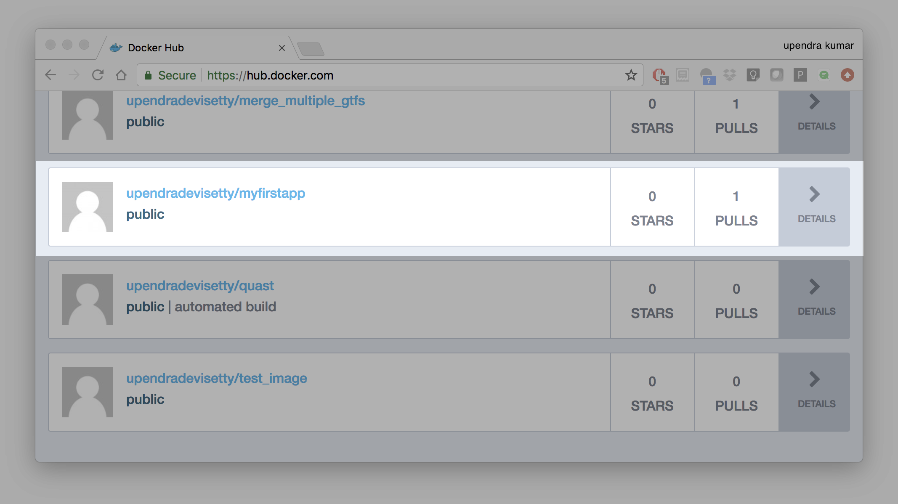
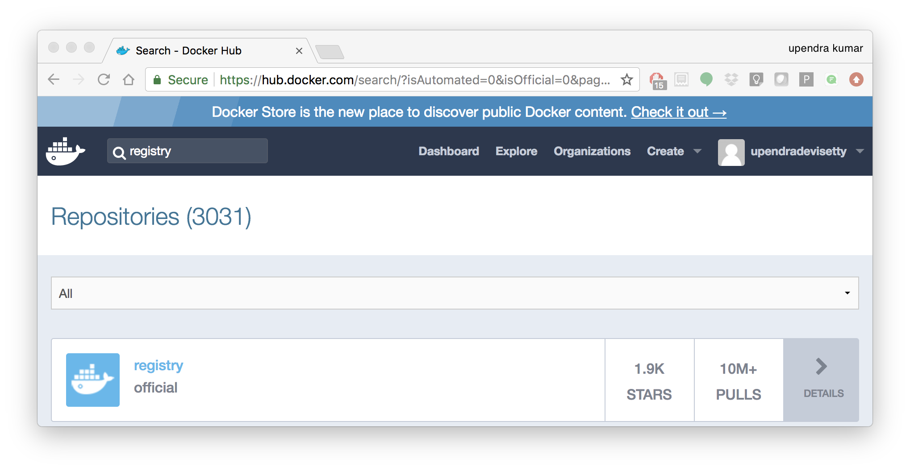
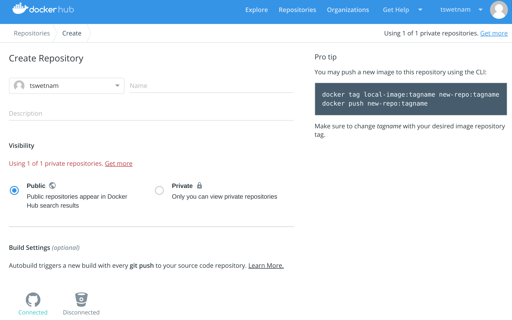
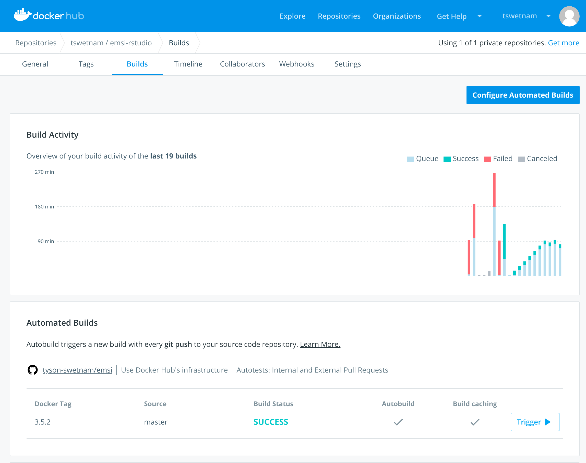
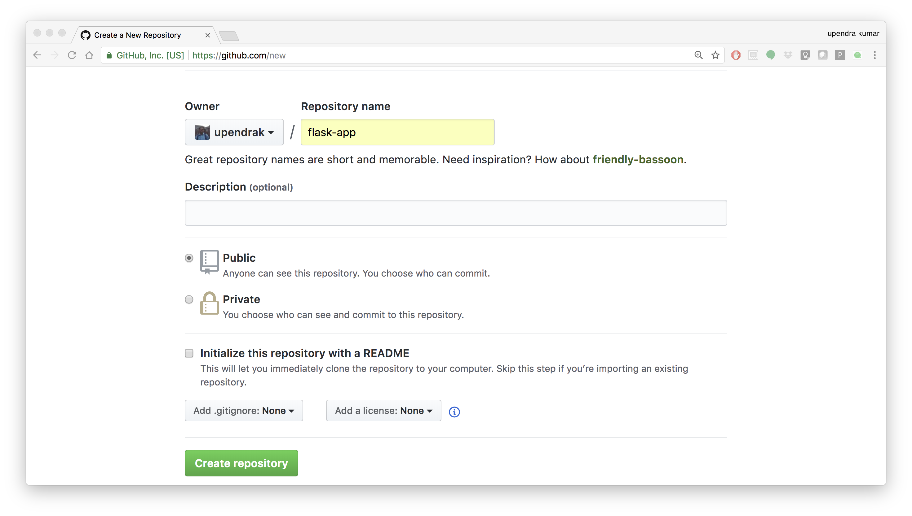
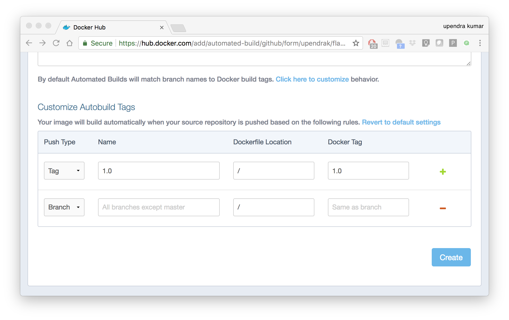
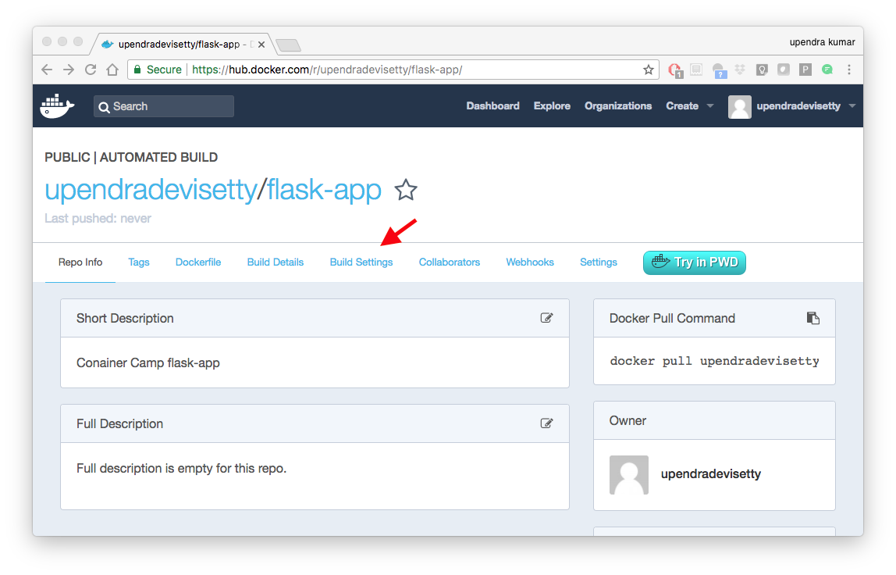
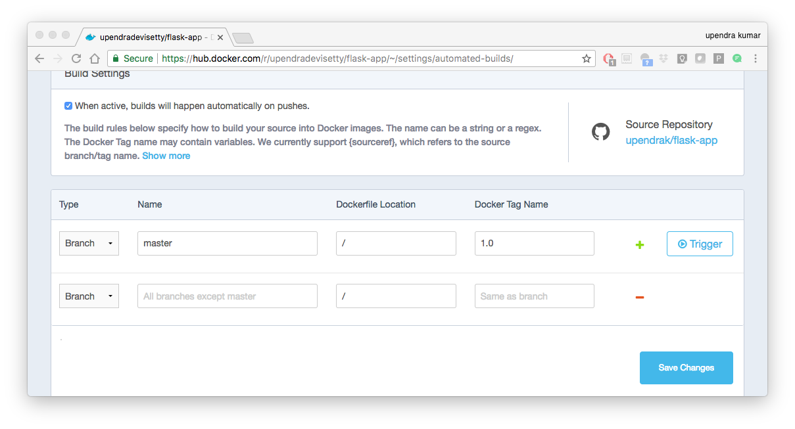

# **Advanced Docker**

Now that we are *relatively* comfortable with Docker, lets look at some
advanced Docker topics, such as:

-   Registry
-   Porting a Docker image to a Registry & Repository (public and
    private)
-   Managing data within containers
-   Deploying containers on cloud services

## 1. Docker Registries

To demonstrate the portability of what we just created, let's upload our
built Docker image to a Docker Registry and then run it somewhere else
(i.e. [CyVerse Atmosphere](https://atmo.cyverse.org)).

In this exercise, you\'ll learn how to push built containers to
registries, pull those containers from registries, and run those
containers on remote hosts (virtual machines).

This will benefit you when you want to deploy new containers to
production environments where testing is not possible.

::: important
::: title
Important
:::

So what *EXACTLY* is a **Registry**?

A registry is a collection of Repositories, and a Repository is a
collection of Images. A Docker Registry is sort of like a GitHub
Repository, except the code is already compiled, in this case, into a
container. You must have an account on a registry. You can create many
repositories. The Docker CLI uses Docker's public registry by default.
You can even set up your own private registry using Docker Trusted
Registry
:::

There are several things you can do with Docker registries:

-   Push images
-   Find images
-   Pull images
-   Share images

### 1.1 Popular Registries

Some examples of public/private registries to consider for your research
needs:

-   [Docker Cloud](https://cloud.docker.com/)
-   [Docker Hub](https://hub.docker.com/)
-   [Docker Trusted Registry](https://docs.docker.com/ee/dtr/)
-   [Amazon Elastic Container Registry](https://aws.amazon.com/ecr/)
-   [Google Container Registry](https://aws.amazon.com/ecr/)
-   [Azure Container
    Registry](https://azure.microsoft.com/en-us/services/container-registry/)
-   [NVIDIA GPU Cloud](https://ngc.nvidia.com/catalog/containers)
-   [Private Docker Registry](https://private-docker-registry.com/) -
    not official Docker
-   [Gitlab Container
    Registry](https://docs.gitlab.com/ce/administration/container_registry.html)
-   [CoreOS Quay](https://quay.io/)
-   [TreeScale](https://treescale.com/)
-   [Canister](https://www.canister.io/)

#### 1.1.1 Log into a Registry with your Docker ID

Now that you\'ve created and tested your image, you can push it to
Docker cloud or Docker hub.

::: note
::: title
Note
:::

If you don't have an account, sign up for one at [Docker
Cloud](https://cloud.docker.com/) or [Docker
Hub](https://hub.docker.com/). Make note of your username. There are
several advantages of registering to DockerHub which we will see later
on in the session
:::

First, you have to login to your Docker Hub account.

If you want to authenticate to a different Registry, type the name of
the registry after `login`:

``` bash
$ docker login <registry-name>
Authenticating with existing credentials...
WARNING! Your password will be stored unencrypted in /home/tswetnam/.docker/config.json.
Configure a credential helper to remove this warning. See
https://docs.docker.com/engine/reference/commandline/login/#credentials-store

Login Succeeded
```

If it is your first time logging in you will be queried for your
`username` and `password`.

Login with your Docker ID to push and pull images from Docker Hub or
private registry.

If you don\'t have a Docker ID, head over to <https://hub.docker.com> to
create one.

#### 1.1.2 Tagging images

The notation for associating a local image with a repository on a
registry is `username/repository:tag`. The tag is optional, but
recommended, since it is the mechanism that registries use to give
Docker images a version. Give the repository and tag meaningful names
for the context, such as `get-started:part2`. This will put the image in
the `get-started` repository and tag it as `part2`.

::: note
::: title
Note
:::

By default the docker image gets a `latest` tag if you don\'t provide
one. Thought convenient, it is not recommended for reproducibility
purposes.
:::

Now, put it all together to tag the image. Run docker tag image with
your username, repository, and tag names so that the image will upload
to your desired destination. For our docker image since we already have
our Dockerhub username we will just add tag which in this case is `1.0`

``` bash
$ docker tag username/appname:latest username/appname:1.0
```

#### 1.1.3 Publish the image

Upload your tagged image to the Dockerhub repository

``` bash
$ docker push username/appname:1.0
```

Once complete, the results of this upload are publicly available. If you
log in to Docker Hub, you will see the new image there, with its pull
command.

{width="500px"}

Congrats! You just made your first Docker image and shared it with the
world!

#### 1.1.4 Pull and run the image from the remote repository

Let\'s try to run the image from the remote repository on Cloud server
by logging into CyVerse Atmosphere, [launching an
instance](../atmosphere/boot.html)

First install Docker on Atmosphere using from here
`https://docs.docker.com/install/linux/docker-ce/ubuntu` or
alternatively you can use `ezd` command which is a short-cut command for
installing Docker on Atmosphere

``` bash
$ ezd
```

Now run the following command to run the docker image from Dockerhub

``` bash
$ sudo docker run -d -p 8888:8888 --name jupyter username/jupyter:1.0
```

::: note
::: title
Note
:::

You don\'t have to run `docker pull` since if the image isn't available
locally on the machine, Docker will pull it from the repository.
:::

Head over to `http://<vm-address>:8888` and your app should be live.

### 1.2 Private repositories

In an earlier part, we had looked at the Docker Hub, which is a public
registry that is hosted by Docker. While the Dockerhub plays an
important role in giving public visibility to your Docker images and for
you to utilize quality Docker images put up by others, there is a clear
need to setup your own private registry too for your team/organization.
For example, CyVerse has it own private registry which will be used to
push the Docker images.

#### 1.2.1 Pull down the Registry Image

You might have guessed by now that the registry must be available as a
Docker image from the Docker Hub and it should be as simple as pulling
the image down and running that. You are correct!

A Dockerhub search on the keyword `registry` brings up the following
image as the top result:

{width="500px"}

Run a container from `registry` Dockerhub image

``` bash
$ docker run -d -p 5000:5000 --name registry registry:2
```

Run `docker ps -l` to check the recent container from this Docker image

``` bash
$ docker ps -l
CONTAINER ID        IMAGE               COMMAND                  CREATED             STATUS              PORTS                    NAMES
6e44a0459373        registry:2          "/entrypoint.sh /e..."   11 seconds ago      Up 10 seconds       0.0.0.0:5000->5000/tcp   registry
```

#### 1.2.2 Tag the image that you want to push

Next step is to tag your image under the registry namespace and push it
there

``` bash
$ REGISTRY=localhost:5000

$ docker tag $YOUR_DOCKERHUB_USERNAME/myfirstapp:1.0 $REGISTRY/$(whoami)/myfirstapp:1.0
```

#### 1.2.2 Publish the image into the local registry

Finally push the image to the local registry

``` bash
$ docker push $REGISTRY/$(whoami)/myfirstapp:1.0
The push refers to a repository [localhost:5000/upendra_35/myfirstapp]
64436820c85c: Pushed
831cff83ec9e: Pushed
c3497b2669a8: Pushed
1c5b16094682: Pushed
c52044a91867: Pushed
60ab55d3379d: Pushed
1.0: digest: sha256:5095dea8b2cf308c5866ef646a0e84d494a00ff0e9b2c8e8313a176424a230ce size: 1572
```

#### 1.2.3 Pull and run the image from the local repository

You can also pull the image from the local repository similar to how you
pull it from Dockerhub and run a container from it

``` bash
$ docker run -d -P --name=myfirstapplocal $REGISTRY/$(whoami)/myfirstapp:1.0
```

## 2. Automated Docker image building from GitHub

An automated build is a Docker image build that is triggered by a code
change in a GitHub or Bitbucket repository. By linking a remote code
repository to a Dockerhub automated build repository, you can build a
new Docker image every time a code change is pushed to your code
repository.

A build context is a Dockerfile and any files at a specific location.
For an automated build, the build context is a repository containing a
Dockerfile.

Automated Builds have several advantages:

-   Images built in this way are built exactly as specified.
-   The Dockerfile is available to anyone with access to your Docker Hub
    repository.
-   Your repository is kept up-to-date with code changes automatically.
-   Automated Builds are supported for both public and private
    repositories on both GitHub and Bitbucket.

### 2.1 Prerequisites

To use automated builds, you first must have an account on [Docker
Hub](https://hub.docker.com) and on the hosted repository provider
([GitHub](https://github.com/) or [Bitbucket](https://bitbucket.org/)).
While Docker Hub supports linking both GitHub and Bitbucket
repositories, here we will use a GitHub repository. If you don\'t
already have one, make sure you have a GitHub account. A basic account
is free

::: note
::: title
Note
:::

-   If you have previously linked your Github or Bitbucket account, you
    must have chosen the Public and Private connection type. To view
    your current connection settings, log in to Docker Hub and choose
    Profile \> Settings \> Linked Accounts & Services.
-   Building Windows containers is not supported.
:::

### 2.2 Link your Docker Hub account to GitHub

1.  Log into Docker Hub.
2.  Click \"Create Repository+\"

{width="800px"}

3.  Click the Build Settings and select `GitHub`.

{width="800px"}

The system prompts you to choose between **Public and Private** and
**Limited Access**. The **Public** and **Private** connection type is
required if you want to use the Automated Builds.

4.  Press `Select` under **Public and Private** connection type. If you
    are not logged into GitHub, the system prompts you to enter GitHub
    credentials before prompting you to grant access. After you grant
    access to your code repository, the system returns you to Docker Hub
    and the link is complete.

{width="800px"}

After you grant access to your code repository, the system returns you
to Docker Hub and the link is complete. For example, github linked
hosted repository looks like this:

{width="800px"}

### 2.3 Automated Container Builds

Automated build repositories rely on the integration with a version
control system (GitHub or Gitlab) where your `Dockerfile` is kept.

Let\'s create an automatic build for our container using the
instructions below:

1.  Initialize git repository for the [jupyter]{.title-ref} directory
    you created for your `Dockerfile`

``` bash
$ git init
Initialized empty Git repository in /home/username/github/repository_name/

$ git status
On branch master

Initial commit

Untracked files:
(use "git add <file>..." to include in what will be committed)

    Dockerfileg

nothing added to commit but untracked files present (use "git add" to track)

$ git add * && git commit -m"Add files and folders"
[master (root-commit) cfdf021] Add files and folders
 4 files changed, 75 insertions(+)
 create mode 100644 Dockerfile
```

2.  Create a new repository on github by navigating to this url -
    <https://github.com/new>

{width="500px"}

3.  Push the repository to github

{width="500px"}

``` bash
$ git remote add origin https://github.com/username/jupyter.git

$ git push -u origin master
Counting objects: 7, done.
Delta compression using up to 8 threads.
Compressing objects: 100% (5/5), done.
Writing objects: 100% (7/7), 1.44 KiB | 0 bytes/s, done.
Total 7 (delta 0), reused 0 (delta 0)
To https://github.com/username/jupyter.git
 * [new branch]      master -> master
Branch master set up to track remote branch master from origin.
```

4.  Select `Create` \> `Create Automated Build` from Docker Hub.

-   The system prompts you with a list of User/Organizations and code
    repositories.
-   For now select your GitHub account from the User/Organizations list
    on the left. The list of repositories change.
-   Pick the project to build. In this case `jupyter`. Type in
    \"Container Camp Jupyter\" in the Short Description box.
-   If you have a long list of repos, use the filter box above the list
    to restrict the list. After you select the project, the system
    displays the Create Automated Build dialog.

{width="800px"}

::: note
::: title
Note
:::

The dialog assumes some defaults which you can customize. By default,
Docker builds images for each branch in your repository. It assumes the
Dockerfile lives at the root of your source. When it builds an image,
Docker tags it with the branch name.
:::

5.  Customize the automated build by pressing the
    `Click here to customize` behavior link.

{width="500px"}

Specify which code branches or tags to build from. You can build by a
code branch or by an image tag. You can enter a specific value or use a
regex to select multiple values. To see examples of regex, press the
Show More link on the right of the page.

-   Enter the `master` (default) for the name of the branch.
-   Leave the Dockerfile location as is.
-   Recall the file is in the root of your code repository.
-   Specify `1.0` for the Tag Name.

6.  Click `Create`.

::: important
::: title
Important
:::

During the build process, Docker copies the contents of your Dockerfile
to Docker Hub. The Docker community (for public repositories) or
approved team members/orgs (for private repositories) can then view the
Dockerfile on your repository page.

The build process looks for a README.md in the same directory as your
Dockerfile. If you have a README.md file in your repository, it is used
in the repository as the full description. If you change the full
description after a build, it's overwritten the next time the Automated
Build runs. To make changes, modify the README.md in your Git
repository.
:::

::: warning
::: title
Warning
:::

You can only trigger one build at a time and no more than one every five
minutes. If you already have a build pending, or if you recently
submitted a build request, Docker ignores new requests.
:::

It can take a few minutes for your automated build job to be created.
When the system is finished, it places you in the detail page for your
Automated Build repository.

7.  Manually Trigger a Build

Before you trigger an automated build by pushing to your GitHub
`jupyter` repo, you\'ll trigger a manual build. Triggering a manual
build ensures everything is working correctly.

From your automated build page choose `Build Settings`

{width="500px"}

Press `Trigger` button and finally click `Save Changes`.

::: note
::: title
Note
:::

Docker builds everything listed whenever a push is made to the code
repository. If you specify a particular branch or tag, you can manually
build that image by pressing the Trigger. If you use a regular
expression syntax (regex) to define your build branch or tag, Docker
does not give you the option to manually build.
:::

{width="500px"}

8.  Review the build results

The Build Details page shows a log of your build systems:

Navigate to the `Build Details` page.

Wait until your image build is done.

You may have to manually refresh the page and your build may take
several minutes to complete.

{width="500px"}

### Exercise 1 (5-10 mins): Updating and automated building

-   `git add`, `commit` and `push` to your GitHub or Gitlab repo
-   Trigger automatic build with a new tag (2.0) on Docker Hub
-   Pull your Docker image from Docker Hub to a new location.
-   Run the instance to make sure it works

## 3. Managing Data in Docker

It is possible to store data within the writable layer of a container,
but there are some limitations:

-   The data doesn't persist when that container is no longer running,
    and it can be difficult to get the data out of the container if
    another process needs it.
-   A container's writable layer is tightly coupled to the host machine
    where the container is running. You can't easily move the data
    somewhere else.
-   Its better to put your data into the container **AFTER** it is
    build - this keeps the container size smaller and easier to move
    across networks.

Docker offers three different ways to mount data into a container from
the Docker host:

> -   **volumes**,
> -   **bind mounts**,
> -   **tmpfs volumes**.

When in doubt, volumes are almost always the right choice.

### 3.1 Volumes

**Volumes** are created and managed by Docker. You can create a new
volume explicitly using the `docker volume create` command, or Docker
can create a volume in the container when the container is built.

When you run a container, you can bring a directory from the host system
into the container, and give it a new name and location using the `-v`
or `--volume` flag.

``` bash
$ docker run -v /home/username/your_data_folder:/data username/jupyter:latest
```

In the example above, you can mount a folder from your localhost, in
your home user directory into the container as a new directory named
`/data`.

When you create a Docker volume, it is stored within a directory on the
Docker Linux host (`/var/lib/docker/`

::: note
::: title
Note
:::

File location on Mac OS X is a bit different. [see
here](https://timonweb.com/posts/getting-path-and-accessing-persistent-volumes-in-docker-for-mac/).
:::

A given volume can be mounted into multiple containers simultaneously.
When no running container is using a volume, the volume is still
available to Docker and is not removed automatically. You can remove
unused volumes using `docker volume prune` command.

{width="500px"}

Volumes are often a better choice than persisting data in a container's
writable layer, because using a volume does not increase the size of
containers using it, and the volume's contents exist outside the
lifecycle of a given container. While bind mounts (which we will see
later) are dependent on the directory structure of the host machine,
volumes are completely managed by Docker. Volumes have several
advantages over bind mounts:

-   Volumes are easier to back up or migrate than bind mounts.
-   You can manage volumes using Docker CLI commands or the Docker API.
-   Volumes work on both Linux and Windows containers.
-   Volumes can be more safely shared among multiple containers.
-   A new volume's contents can be pre-populated by a container.

::: note
::: title
Note
:::

If your container generates non-persistent state data, consider using a
`tmpfs` mount to avoid storing the data anywhere permanently, and to
increase the container's performance by avoiding writing into the
container's writable layer.
:::

#### 3.1.1 Choose the -v or --mount flag for mounting volumes

Originally, the `-v` or `--volume` flag was used for standalone
containers and the `--mount` flag was used for swarm services. However,
starting with Docker 17.06, you can also use `--mount` with standalone
containers. In general, `--mount` is more explicit and verbose. The
biggest difference is that the `-v` syntax combines all the options
together in one field, while the `--mount` syntax separates them. Here
is a comparison of the syntax for each flag.

::: tip
::: title
Tip
:::

New users should use the `--mount` syntax. Experienced users may be more
familiar with the `-v` or `--volume` syntax, but are encouraged to use
`--mount`, because research has shown it to be easier to use.
:::

`-v` or `--volume`: Consists of three fields, separated by colon
characters (:). The fields must be in the correct order, and the meaning
of each field is not immediately obvious.

-   In the case of named volumes, the first field is the name of the
    volume, and is unique on a given host machine.
-   The second field is the path where the file or directory are mounted
    in the container.
-   The third field is optional, and is a comma-separated list of
    options, such as `ro`.

``` bash
-v /home/username/your_data_folder:/data:ro
```

#### 3.2 Bind mounts

`--mount`: Consists of multiple key-value pairs, separated by commas and
each consisting of a `<key>=<value>` tuple. The `--mount` syntax is more
verbose than `-v` or `--volume`, but the order of the keys is not
significant, and the value of the flag is easier to understand. - The
type of the mount, which can be **bind**, **volume**, or **tmpfs**. -
The source of the mount. For named volumes, this is the name of the
volume. For anonymous volumes, this field is omitted. May be specified
as **source** or **src**. - The destination takes as its value the path
where the file or directory is mounted in the container. May be
specified as **destination**, **dst**, or **target**. - The readonly
option, if present, causes the bind mount to be mounted into the
container as read-only.

::: note
::: title
Note
:::

The `--mount` and `-v` examples have the same end result.
:::

#### 3.3 Create and manage volumes

Unlike a bind mount, you can create and manage volumes outside the scope
of any container.

Let\'s create a volume

``` bash
$ docker volume create my-vol
```

List volumes:

``` bash
$ docker volume ls

local               my-vol
```

Inspect a volume by looking at the Mount section in the [docker volume
inspect]{.title-ref}

``` bash
$ docker volume inspect my-vol
[
    {
        "Driver": "local",
        "Labels": {},
        "Mountpoint": "/var/lib/docker/volumes/my-vol/_data",
        "Name": "my-vol",
        "Options": {},
        "Scope": "local"
    }
]
```

Remove a volume

``` bash
$ docker volume rm my-vol
```

#### 3.3.1 Populate a volume using a container

This example starts an `nginx` container and populates the new volume
`nginx-vol` with the contents of the container's `/var/log/nginx`
directory, which is where Nginx stores its log files.

``` bash
$ docker run -d -p 8889:80 --name=jupytertest --mount source=jupyter-vol,target=/var/log/jupyter username/jupyter:latest
```

So, we now have a copy of Jupyter volume running inside a Docker
container on our machine, and our host machine\'s port 5000 maps
directly to that copy of Jupyter\'s port 80. Let\'s use curl to do a
quick test request:

``` bash
cat jupyter-vol/_data/access.log
```

Use `docker inspect jupyter-vol` to verify that the volume was created
and mounted correctly. Look for the Mounts section:

``` bash
"Mounts": [
            {
                "Type": "volume",
                "Name": "jupyter-vol",
                "Source": "/var/lib/docker/volumes/jupyter-vol/_data",
                "Destination": "/var/log/jupyter",
                "Driver": "local",
                "Mode": "z",
                "RW": true,
                "Propagation": ""
            }
        ],
```

This shows that the mount is a volume, it shows the correct source and
destination, and that the mount is read-write.

After running either of these examples, run the following commands to
clean up the containers and volumes.

``` bash
$ docker stop jupytertest

$ docker rm jupytertest

$ docker volume rm jupyter-vol
```

### 3.4 Bind mounts

**Bind mounts:** When you use a bind mount, a file or directory on the
host machine is mounted into a container.

::: tip
::: title
Tip
:::

If you are developing new Docker applications, consider using named
**volumes** instead. You can't use Docker CLI commands to directly
manage bind mounts.
:::

{width="500px"}

::: warning
::: title
Warning
:::

One side effect of using bind mounts, for better or for worse, is that
you can change the host filesystem via processes running in a container,
including creating, modifying, or deleting important system files or
directories. This is a powerful ability which can have security
implications, including impacting non-Docker processes on the host
system.

If you use `--mount` to bind-mount a file or directory that does not yet
exist on the Docker host, Docker does not automatically create it for
you, but generates an error.
:::

#### 3.2.1 Start a container with a bind mount

``` bash
$ mkdir data

$ docker run -p 8888:8888 --name jupytertest --mount type=bind,source="$(pwd)"/data,target=/var/log/jupyter username/jupyter:latest
```

Use [docker inspect jupytertest]{.title-ref} to verify that the bind
mount was created correctly. Look for the \"Mounts\" section

``` 
$ docker inspect jupytertest
```

This shows that the mount is a bind mount, it shows the correct source
and target, it shows that the mount is read-write, and that the
propagation is set to rprivate.

Stop the container:

``` bash
$ docker rm -f juptertest
```

#### 3.4.1 Use a read-only bind mount

For some development applications, the container needs to write into the
bind mount, so changes are propagated back to the Docker host. At other
times, the container only needs read access.

This example modifies the one above but mounts the directory as a
read-only bind mount, by adding `ro` to the (empty by default) list of
options, after the mount point within the container. Where multiple
options are present, separate them by commas.

``` bash
$ docker run -d -p 8888:8888 --name jupytertest --mount type=bind,source="$(pwd)"/data,target=/var/log/jupyter,readonly username/jupyter:latest
```

Use `docker inspect jupytertest` to verify that the bind mount was
created correctly. Look for the Mounts section:

Stop the container:

``` bash
$ docker rm -f jupytertest
```

Remove the volume:

``` bash
$ docker volume rm jupytertest
```

### 3.3 tmpfs Mounts

**tmpfs mounts:** A tmpfs mount is not persisted on disk, either on the
Docker host or within a container. It can be used by a container during
the lifetime of the container, to store non-persistent state or
sensitive information. For instance, internally, swarm services use
tmpfs mounts to mount secrets into a service's containers.

{width="500px"}

**Volumes** and **bind mounts** are mounted into the container's
filesystem by default, and their contents are stored on the host
machine. There may be cases where you do not want to store a container's
data on the host machine, but you also don't want to write the data into
the container's writable layer, for performance or security reasons, or
if the data relates to non-persistent application state. An example
might be a temporary one-time password that the container's application
creates and uses as-needed. To give the container access to the data
without writing it anywhere permanently, you can use a tmpfs mount,
which is only stored in the host machine's memory (or swap, if memory is
low). When the container stops, the tmpfs mount is removed. If a
container is committed, the tmpfs mount is not saved.

``` bash
$ docker run -d -p 8888:8888 --name jupytertest --mount type=tmpfs,target=/var/log/jupyter username/jupyter:latest
```

Use [docker inspect jupytertest]{.title-ref} to verify that the bind
mount was created correctly. Look for the Mounts section:

``` bash
$ docker inspect jupytertest
```

You can see from the above output that the `Source` filed is empty which
indicates that the contents are not avaible on Docker host or host file
system.

Stop the container:

``` bash
$ docker rm -f jupytertest
```

Remove the volume:

``` bash
$ docker volume rm jupytertest
```

## 4. Docker Compose for multi-container apps

**Docker Compose** is a tool for defining and running your
multi-container Docker applications.

Main advantages of Docker compose include:

-   Your applications can be defined in a YAML file where all the
    options that you used in `docker run` are now defined
    (Reproducibility).
-   It allows you to manage your application as a single entity rather
    than dealing with individual containers (Simplicity).

Let\'s now create a simple web app with Docker Compose using Flask
(which you already seen before) and Redis. We will end up with a Flask
container and a Redis container all on one host.

::: note
::: title
Note
:::

The code for the above compose example is available
[here](https://github.com/upendrak/compose_flask)
:::

1.  You'll need a directory for your project on your host machine:

``` bash
$ mkdir compose_flask && cd compose_flask
```

2.  Add the following to [requirements.txt]{.title-ref} inside
    [compose_flask]{.title-ref} directory:

``` bash
flask
redis
```

3.  Copy and paste the following code into a new file called
    [app.py]{.title-ref} inside [compose_flask]{.title-ref} directory:

``` bash
from flask import Flask
from redis import Redis

app = Flask(__name__)
redis = Redis(host='redis', port=6379)

@app.route('/')
def hello():
    redis.incr('hits')
    return 'This Compose/Flask demo has been viewed %s time(s).' % redis.get('hits')

if __name__ == "__main__":
    app.run(host="0.0.0.0", debug=True)
```

4.  Create a Dockerfile with the following code inside `compose_flask`
    directory:

``` bash
FROM python:2.7
ADD . /code
WORKDIR /code
RUN pip install -r requirements.txt
CMD python app.py
```

5.  Add the following code to a new file, `docker-compose.yml`, in your
    project directory:

``` bash
version: '2'
services:
    web:
        restart: always
        build: .
        ports:
            - "8888:5000"
        volumes:
            - .:/code
        depends_on:
            - redis
    redis:
        restart: always
        image: redis
```

A brief explanation of `docker-compose.yml` is as below:

-   `restart: always` means that it will restart whenever it fails.
-   We define two services, **web** and **redis**.
-   The web service builds from the Dockerfile in the current directory.
-   Forwards the container's exposed port (5000) to port 8888 on the
    host.
-   Mounts the project directory on the host to /code inside the
    container (allowing you to modify the code without having to rebuild
    the image).
-   `depends_on` links the web service to the Redis service.
-   The redis service uses the latest Redis image from Docker Hub.

::: note
::: title
Note
:::

Docker for Mac and Docker Toolbox already include Compose along with
other Docker apps, so Mac users do not need to install Compose
separately. Docker for Windows and Docker Toolbox already include
Compose along with other Docker apps, so most Windows users do not need
to install Compose separately.

For Linux users

``` bash
sudo curl -L https://github.com/docker/compose/releases/download/1.19.0/docker-compose-`uname -s`-`uname -m` -o /usr/local/bin/docker-compose

sudo chmod +x /usr/local/bin/docker-compose
```
:::

5.  Build and Run with `docker-compose up -d` command

``` bash
$ docker-compose up -d

Building web
Step 1/5 : FROM python:2.7
2.7: Pulling from library/python
f49cf87b52c1: Already exists
7b491c575b06: Already exists
b313b08bab3b: Already exists
51d6678c3f0e: Already exists
09f35bd58db2: Already exists
f7e0c30e74c6: Pull complete
c308c099d654: Pull complete
339478b61728: Pull complete
Digest: sha256:8cb593cb9cd1834429f0b4953a25617a8457e2c79b3e111c0f70bffd21acc467
Status: Downloaded newer image for python:2.7
 ---> 9e92c8430ba0
Step 2/5 : ADD . /code
 ---> 746bcecfc3c9
Step 3/5 : WORKDIR /code
 ---> c4cf3d6cb147
Removing intermediate container 84d850371a36
Step 4/5 : RUN pip install -r requirements.txt
 ---> Running in d74c2e1cfbf7
Collecting flask (from -r requirements.txt (line 1))
  Downloading Flask-0.12.2-py2.py3-none-any.whl (83kB)
Collecting redis (from -r requirements.txt (line 2))
  Downloading redis-2.10.6-py2.py3-none-any.whl (64kB)
Collecting itsdangerous>=0.21 (from flask->-r requirements.txt (line 1))
  Downloading itsdangerous-0.24.tar.gz (46kB)
Collecting Jinja2>=2.4 (from flask->-r requirements.txt (line 1))
  Downloading Jinja2-2.10-py2.py3-none-any.whl (126kB)
Collecting Werkzeug>=0.7 (from flask->-r requirements.txt (line 1))
  Downloading Werkzeug-0.14.1-py2.py3-none-any.whl (322kB)
Collecting click>=2.0 (from flask->-r requirements.txt (line 1))
  Downloading click-6.7-py2.py3-none-any.whl (71kB)
Collecting MarkupSafe>=0.23 (from Jinja2>=2.4->flask->-r requirements.txt (line 1))
  Downloading MarkupSafe-1.0.tar.gz
Building wheels for collected packages: itsdangerous, MarkupSafe
  Running setup.py bdist_wheel for itsdangerous: started
  Running setup.py bdist_wheel for itsdangerous: finished with status 'done'
  Stored in directory: /root/.cache/pip/wheels/fc/a8/66/24d655233c757e178d45dea2de22a04c6d92766abfb741129a
  Running setup.py bdist_wheel for MarkupSafe: started
  Running setup.py bdist_wheel for MarkupSafe: finished with status 'done'
  Stored in directory: /root/.cache/pip/wheels/88/a7/30/e39a54a87bcbe25308fa3ca64e8ddc75d9b3e5afa21ee32d57
Successfully built itsdangerous MarkupSafe
Installing collected packages: itsdangerous, MarkupSafe, Jinja2, Werkzeug, click, flask, redis
Successfully installed Jinja2-2.10 MarkupSafe-1.0 Werkzeug-0.14.1 click-6.7 flask-0.12.2 itsdangerous-0.24 redis-2.10.6
 ---> 5cc574ff32ed
Removing intermediate container d74c2e1cfbf7
Step 5/5 : CMD python app.py
 ---> Running in 3ddb7040e8be
 ---> e911b8e8979f
Removing intermediate container 3ddb7040e8be
Successfully built e911b8e8979f
Successfully tagged composeflask_web:latest
```

And that's it! You should be able to see the Flask application running
on `http://localhost:8888` or `<ipaddress>:8888`

{width="500px" height="450px"}

``` bash
$ cat output.txt
Prediction of DecisionTreeClassifier:['apple' 'orange' 'apple']
```
