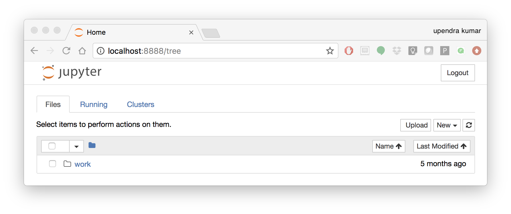
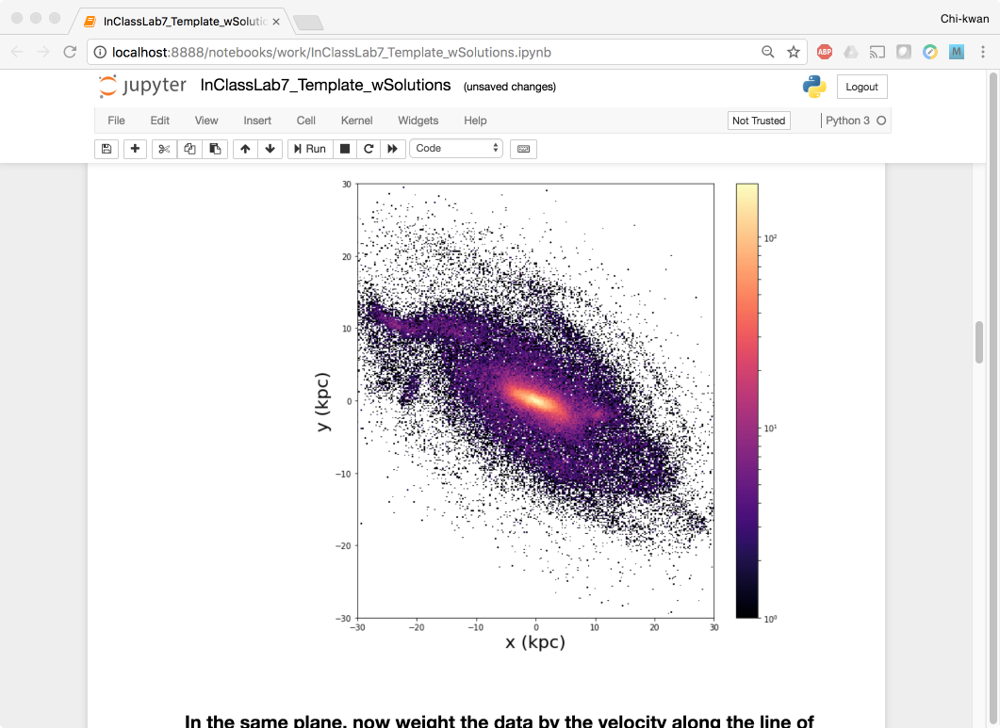

# **Docker hands-on exercises**

## Use case 1: Deploy a custom Docker image

-   Download the sample code from
    <https://github.com/Azure-Samples/docker-django-webapp-linux.git>
-   Build the image using the Dockerfile in that repo using
    `docker build` command
-   Run an instance from that image
-   Verify the web app and container are functioning correctly

## Use case 2: Simple Bioinformatics example

Let\'s say if you find a cool tool/software and want to run it on your
computer and as we found out in the morning session, it\'s not always
easy to install the tool onto your computer or on a server natively.
Since this workshop is about containers, let\'s containerize this tool.

For this simple hands-on exercise, let\'s containerize `fastqe` tool -
<https://github.com/lonsbio/fastqe>. For those of you who are not from
Bioinformatics, this tool generates read one or more FASTQ files, then
it will compute quality stats for each file and print those stats as
emoji\... for some reason.

{width="700px"}

Given a fastq file in Illumina 1.8+/Sanger format, calculate the mean
(rounded) score for each position and print a corresponding emoji!

::: tip
::: title
Tip
:::

Natively you would install this tool like `pip install fastqe`. Now
think of how you can dockerize this with appropriate base image and
dependencies
:::

After dockerizing the tool, for this exercise we don\'t have to bind
mount the volume but just print the [fastqe]{.title-ref} help and make
sure that it is actually working.

::: tip
::: title
Tip
:::

Natively you would print the help of the tool as `fastqe -h`
:::

## 1. Data Management Hands-on

Form the \"Introduction to Docker\" session this morning, we learned
that a running Docker container is an isolated environment created from
a Docker image. This means, although it is possible to store data within
the \"writable layer\" of a container, there are some limitations:

-   The data doesn\'t persist when that container is no longer running,
    and it can be difficult to get the data out of the container if
    another process needs it.
-   A container\'s writable layer is tightly coupled to the host machine
    where the container is running. You can\'t easily move the data
    somewhere else.

Docker offers three different ways to mount data into a container from
the Docker host: **volumes**, **bind mounts**, or **tmpfs volumes**. For
simplicity, we will only use bind mounts in our hands-on session, even
though volumes is the more powerful and usable option for most use
cases.

### 1.1 Bind mounts

**Bind mounts:** When you use a bind mount, a file or directory on the
host machine is mounted into a container.

{.align-center}

::: warning
::: title
Warning
:::

A side effect of using bind mounts, for better or for worse, is that you
can change the host filesystem via processes running in a container,
including creating, modifying, or deleting important system files or
directories. This is a powerful ability which can have security
implications, including impacting non-Docker processes on the host
system.

If you use `--mount` to bind-mount a file or directory that does not yet
exist on the Docker host, Docker does not automatically create it for
you, but generates an error.
:::

Let\'s clone a git repository to obtain our data sets:

``` bash
$ git clone https://github.com/CyVerse-learning-materials/ccw-2019-astro.git
```

We can `cd` into the HOPS work directory, and mount it to `/root` as we
launch the `eventhorizontelescope/hops` container:

``` bash
$ cd ccw-2019-astro/hops
$ ls
1234
$ docker run -it --rm --name hops -v $PWD:/root eventhorizontelescope/hops
Setup HOPS v3.19 with HOPS_ROOT=/root for x86_64-3.19
```

You will start at the `/root` work directory and the host data `1234` is
available in it:

``` bash
$ pwd
/root
$ ls
1234
```

You can open another terminal and use
`docker inspect hops | grep -A9 Mounts` to verify that the bind mount
was created correctly. Looking for the \"Mounts\" section,

``` bash
$ docker inspect hops | grep -A9 Mounts
    "Mounts": [
        {
            "Type": "bind",
            "Source": "/Users/ckchan/ccw-2019-astro/hops",
            "Destination": "/root",
            "Mode": "",
            "RW": true,
            "Propagation": "rprivate"
        }
    ],
```

This shows that the mount is a bind mount with correct source and
target. It also shows that the mount is read-write, and that the
propagation is set to rprivate.

### Use case 1: Processing VLBI data with HOPS in Docker

HOPS stands for the Haystack Observatory Postprocessing System. It is a
standard data analysis tool in Very-long-baseline interferometry (VLBI).
HOPS has a long history and it depends on legacy libraries. This makes
it difficult to compile on modern Unix/Linux systems. Nevertheless, with
Docker, you **have** already launched a HOPS envirnment that you can
analysis VLBI data!

The most basic step in analysis VLBI is called \"fringe fitting\", which
we will perform in the running HOPS container by

``` bash
$ ls 1234/No0055/
3C279.zxxerd  L..zxxerd  LL..zxxerd  LW..zxxerd  W..zxxerd  WW..zxxerd
$ fourfit 1234
fourfit: Warning: No valid data for this pass for pol 2
fourfit: Warning: No valid data for this pass for pol 3
$ ls 1234/No0055/
3C279.zxxerd  LL..zxxerd     LL.B.2.zxxerd  LW.B.3.zxxerd  W..zxxerd   WW.B.5.zxxerd
L..zxxerd     LL.B.1.zxxerd  LW..zxxerd     LW.B.4.zxxerd  WW..zxxerd
```

`fourfit` reads in the correlated data and create the so called \"fringe
files\". The warnings are normal because there are missing polarizations
in the data. In order to see the result of the fringe fitting, you can
use `fplot`:

``` bash
$ fplot -d %04d.ps 1234
$ ls
0000.ps  0001.ps  0002.ps  0003.ps  0004.ps  1234
```

Congratulations! You just created 4 fringe plots that show all important
information of the VLBI experiment! Now you can exit your HOPS container
and open them on your host machine.

## 2. Jupyter Notebook Hands-on

Mounting a host directory is one way to make a container connect with
the outside work. Another possible is through network by exposing a
port.

### Use case 2: Processing Galaxy Simulation with Jupyter in Docker

In this second hands-on, we will use Docker to run a \"ready to go\"
Jupyter notebook in a container. We will expose the port 8888 from the
container to the localhost so that you can connect to the notebook.

Inside the `ccw-2019-astro` git repository that you downloaded earlier,
there is a sample Galaxy simulation:

> \$ pwd /Users/ckchan/ccw-2019-astro/hops \$ cd ../galaxy/ \$ pwd
> /Users/ckchan/ccw-2019-astro/galaxy
>
> \# Specify the uid of the jovyan user. Useful to mount host volumes
> with specific file ownership. For this option to take effect, you must
> run the container with \--user root
>
> \$ docker run -it \--rm -v \$PWD:/home/jovyan/work -p 8888:8888 -e
> NB_UID=\$(id -u) \--user root astrocontainers/jupyter Set username to:
> jovyan usermod: no changes Set jovyan UID to: 1329 Executing the
> command: jupyter notebook \[I 23:36:09.446 NotebookApp\] Writing
> notebook server cookie secret to
> /home/jovyan/.local/share/jupyter/runtime/notebook_cookie_secret \[W
> 23:36:09.686 NotebookApp\] WARNING: The notebook server is listening
> on all IP addresses and not using encryption. This is not recommended.
> \[I 23:36:09.722 NotebookApp\] JupyterLab beta preview extension
> loaded from /opt/conda/lib/python3.6/site-packages/jupyterlab \[I
> 23:36:09.722 NotebookApp\] JupyterLab application directory is
> /opt/conda/share/jupyter/lab \[I 23:36:09.730 NotebookApp\] Serving
> notebooks from local directory: /home/jovyan \[I 23:36:09.730
> NotebookApp\] 0 active kernels \[I 23:36:09.730 NotebookApp\] The
> Jupyter Notebook is running at: \[I 23:36:09.730 NotebookApp\]
> <http://%5Ball> ip addresses on your
> system\]:8888/?token=a81dbeec92b286df393bb484fdf53efffab410fd64ec8702
> \[I 23:36:09.730 NotebookApp\] Use Control-C to stop this server and
> shut down all kernels (twice to skip confirmation). \[C 23:36:09.731
> NotebookApp\] Copy/paste this URL into your browser when you connect
> for the first time, to login with a token:
> <http://localhost:8888/?token=dfb50de6c1da091fd62336ac52cdb88de5fe339eb0faf478>

The last line is a URL that we need to copy and paste into our browser
to access our new Jupyter Notebook:

``` bash
http://localhost:8888/?token=dfb50de6c1da091fd62336ac52cdb88de5fe339eb0faf478
```

::: warning
::: title
Warning
:::

Do not copy and paste the above URL in your browser as this URL is
specific to my environment.
:::

{.align-center width="700px"
height="294px"}

You should be greeted by your own containerised Jupyter service! Now
open `galaxy/InClassLab7_Template_wSolutions.ipynb` and try analysis a
Galaxy simulation!

{.align-center width="700px"
height="510px"}

To shut down the container, simply hit `Ctrl-C` in the terminal/command
prompt twice. Your work will all be saved on your actual machine in the
path we set in our Docker compose file. And there you have it\-\--a
quick and easy way to start using Jupyter notebooks with the magic of
Docker.
