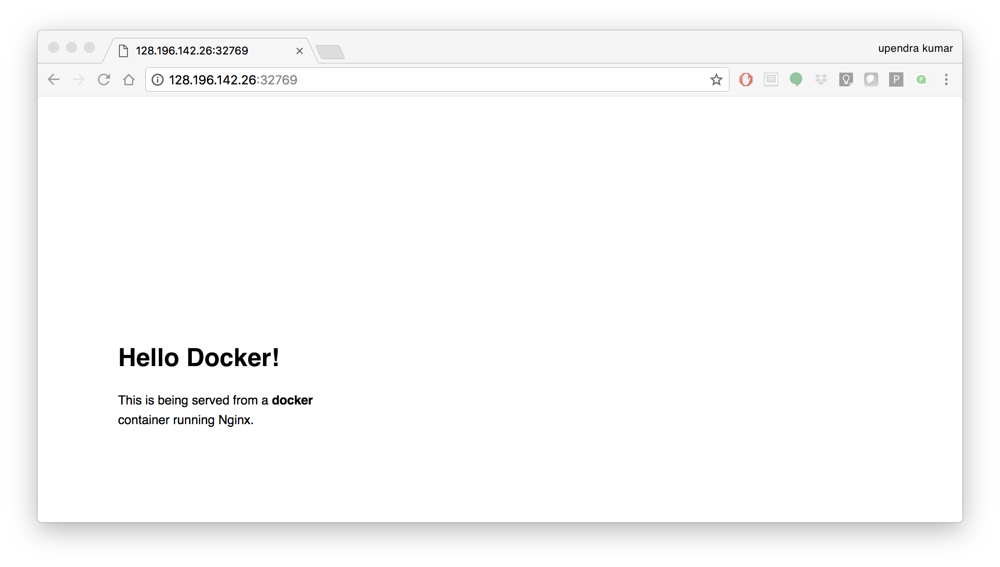
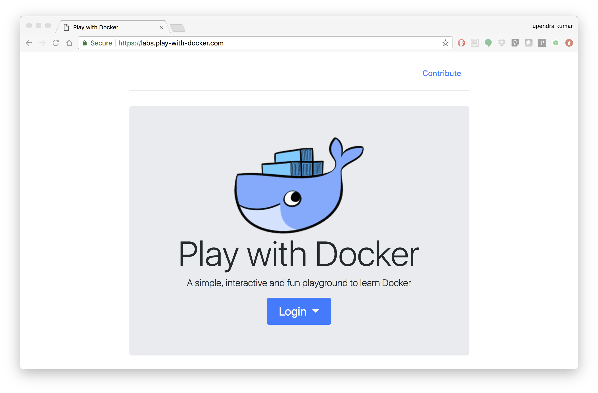
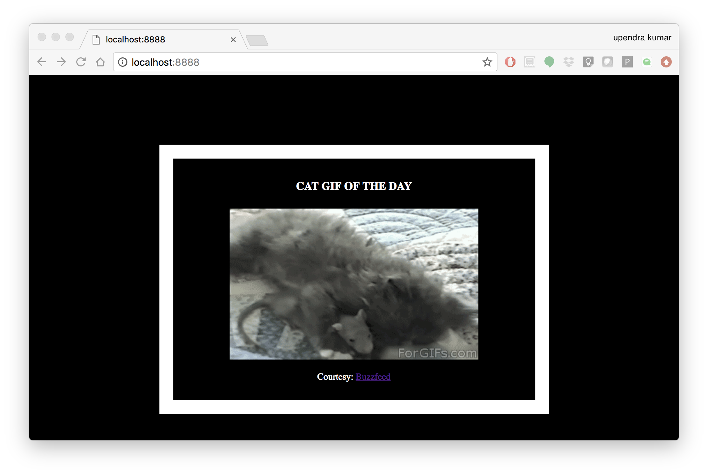

**Introduction to Docker**
--------------------------

|docker|

1. Prerequisites
================

There are no specific skills needed for this tutorial beyond a basic comfort with the command line and using a text editor. Prior experience in developing web applications will be helpful but is not required.

2. Docker Installation
======================

Getting all the tooling setup on your computer can be a daunting task, but not with Docker. Getting Docker up and running on your favorite OS (Mac/Windows/Linux) is very easy.

The getting started guide on Docker has detailed instructions for setting up Docker on `Mac <https://docs.docker.com/docker-for-mac/install/>`_/`Windows <https://docs.docker.com/docker-for-windows/install/>`_/`Linux <https://docs.docker.com/install/linux/docker-ce/ubuntu/>`_.

.. Note::

	If you're using Docker for Windows make sure you have `shared your drive <https://docs.docker.com/docker-for-windows/#shared-drives>`_.

	If you're using an older version of Windows or MacOS you may need to use `Docker Machine <https://docs.docker.com/machine/overview/>`_ instead.

	All commands work in either Bash or Powershell on Windows.

.. Note::

	Depending on how you've installed Docker on your system, you might see a ``permission denied`` error after running the above command. If you're on Linux, you may need to prefix your Docker commands with sudo. Alternatively to run docker command without sudo, you need to add your user (who has root privileges) to docker group.
	For this run:

	Create the docker group::

		$ sudo groupadd docker

	Add your user to the docker group::

		$ sudo usermod -aG docker $USER

	Log out and log back in so that your group membership is re-evaluated

2.1 Testing Docker installation
~~~~~~~~~~~~~~~~~~~~~~~~~~~~~~~

Once you are done installing Docker, test your Docker installation by running the following command to make sure you are using version 1.13 or higher:

.. code-block:: bash

	$ docker --version
	Docker version 18.09.3, build 774a1f4

When run without ``--version`` you should see a whole bunch of lines showing the different options available with ``docker``. Alternatively you can test your installation by running the following:

.. code-block:: bash

	$ docker run hello-world
	Unable to find image 'hello-world:latest' locally
	latest: Pulling from library/hello-world
	03f4658f8b78: Pull complete
	a3ed95caeb02: Pull complete
	Digest: sha256:8be990ef2aeb16dbcb9271ddfe2610fa6658d13f6dfb8bc72074cc1ca36966a7
	Status: Downloaded newer image for hello-world:latest

	Hello from Docker.
	This message shows that your installation appears to be working correctly.

	To generate this message, Docker took the following steps:
	 1. The Docker client contacted the Docker daemon.
	 2. The Docker daemon pulled the "hello-world" image from the Docker Hub.
	 3. The Docker daemon created a new container from that image which runs the
	    executable that produces the output you are currently reading.
	 4. The Docker daemon streamed that output to the Docker client, which sent it
	    to your terminal.
	.......

3. Running Docker containers from prebuilt images
=================================================

Now that you have everything setup, it's time to get our hands dirty. In this section, you are going to run a container from `Alpine Linux <https://www.alpinelinux.org/>`_ (a lightweight linux distribution) image on your system and get a taste of the ``docker run`` command.

But wait, what exactly is a container and image?

**Containers** - Running instances of Docker images — containers run the actual applications. A container includes an application and all of its dependencies. It shares the kernel with other containers, and runs as an isolated process in user space on the host OS.

**Images** - The file system and configuration of our application which are used to create containers. To find out more about a Docker image, run ``docker inspect hello-world``. In the demo above, you could have used the ``docker pull`` command to download the ``hello-world`` image. However when you executed the command ``docker run hello-world``, it also did a ``docker pull`` behind the scenes to download the ``hello-world`` image with ``latest`` tag (we will learn more about tags little later).

Now that we know what a container and image is, let's run the following command in our terminal:

.. code-block:: bash

	$ docker run alpine ls -l
	total 52
	drwxr-xr-x    2 root     root          4096 Dec 26  2016 bin
	drwxr-xr-x    5 root     root           340 Jan 28 09:52 dev
	drwxr-xr-x   14 root     root          4096 Jan 28 09:52 etc
	drwxr-xr-x    2 root     root          4096 Dec 26  2016 home
	drwxr-xr-x    5 root     root          4096 Dec 26  2016 lib
	drwxr-xr-x    5 root     root          4096 Dec 26  2016 media
	........

Similar to ``docker run hello-world`` command in the demo above, ``docker run alpine ls -l`` command fetches the ``alpine:latest`` image from the Docker registry first, saves it in our system and then runs a container from that saved image.

When you run ``docker run alpine``, you provided a command ``ls -l``, so Docker started the command specified and you saw the listing

You can use the ``docker images`` command to see a list of all images on your system

.. code-block:: bash

	$ docker images
	REPOSITORY              TAG                 IMAGE ID            CREATED             VIRTUAL SIZE
	alpine                 	latest              c51f86c28340        4 weeks ago         1.109 MB
	hello-world             latest              690ed74de00f        5 months ago        960 B

Let's try something more exciting.

.. code-block:: bash

	$ docker run alpine echo "Hello world"
	Hello world

OK, that's some actual output. In this case, the Docker client dutifully ran the ``echo`` command in our ``alpine`` container and then exited it. If you've noticed, all of that happened pretty quickly. Imagine booting up a virtual machine, running a command and then killing it. Now you know why they say containers are fast!

Try another command.

.. code-block:: bash

	$ docker run alpine sh

Wait, nothing happened! Is that a bug? Well, no. These interactive shells will exit after running any scripted commands such as ``sh``, unless they are run in an interactive terminal - so for this example to not exit, you need to ``docker run -it alpine sh``. You are now inside the container shell and you can try out a few commands like ``ls -l``, ``uname -a`` and others.

Before doing that, now it's time to see the ``docker ps`` command which shows you all containers that are currently running.

.. code-block:: bash

	$ docker ps
	CONTAINER ID        IMAGE               COMMAND             CREATED             STATUS              PORTS               NAMES

Since no containers are running, you see a blank line. Let's try a more useful variant: ``docker ps -a``

.. code-block:: bash

	$ docker ps -a
	CONTAINER ID        IMAGE               COMMAND                  CREATED             STATUS                      PORTS               NAMES
	36171a5da744        alpine              "/bin/sh"                5 minutes ago       Exited (0) 2 minutes ago                        fervent_newton
	a6a9d46d0b2f        alpine             "echo 'hello from alp"    6 minutes ago       Exited (0) 6 minutes ago                        lonely_kilby
	ff0a5c3750b9        alpine             "ls -l"                   8 minutes ago       Exited (0) 8 minutes ago                        elated_ramanujan
	c317d0a9e3d2        hello-world         "/hello"                 34 seconds ago      Exited (0) 12 minutes ago                       stupefied_mcclintock

What you see above is a list of all containers that you ran. Notice that the STATUS column shows that these containers exited a few minutes ago.

If you want to run scripted commands such as ``sh``, they should be run in an interactive terminal. In addition, interactive terminal allows you to run more than one command in a container. Let's try that now:

.. code-block:: bash

	$ docker run -it alpine sh
	/ # ls
	bin    dev    etc    home   lib    media  mnt    proc   root   run    sbin   srv    sys    tmp    usr    var
	/ # uname -a
	Linux de4bbc3eeaec 4.9.49-moby #1 SMP Wed Sep 27 23:17:17 UTC 2017 x86_64 Linux

Running the ``run`` command with the ``-it`` flags attaches us to an interactive ``tty`` in the container. Now you can run as many commands in the container as you want. Take some time to run your favorite commands.

Exit out of the container by giving the ``exit`` command.

.. code-block:: bash

	/ # exit

.. Note::

	If you type ``exit`` your **container** will exit and is no longer active. To check that, try the following::

		$ docker ps -l
		CONTAINER ID        IMAGE                 COMMAND                  CREATED             STATUS                          PORTS                    NAMES
		de4bbc3eeaec        alpine                "/bin/sh"                3 minutes ago       Exited (0) About a minute ago                            pensive_leavitt

	If you want to keep the container active, then you can use keys ``ctrl +p, ctrl +q``. To make sure that it is not exited run the same ``docker ps -a`` command again::

		$ docker ps -l
		CONTAINER ID        IMAGE                 COMMAND                  CREATED             STATUS                         PORTS                    NAMES
		0db38ea51a48        alpine                "sh"                     3 minutes ago       Up 3 minutes                                            elastic_lewin

	Now if you want to get back into that container, then you can type ``docker attach <container id>``. This way you can save your container::

		$ docker attach 0db38ea51a48

4. Build Docker images which contain your own code
==================================================

Great! so you have now looked at ``docker run``, played with a Docker containers and also got the hang of some terminology. Armed with all this knowledge, you are now ready to get to the real stuff — deploying your own applications with Docker.

4.1 Deploying a command-line app
~~~~~~~~~~~~~~~~~~~~~~~~~~~~~~~~

.. Note::

	Code for this section is in this repo in the `examples/ <https://github.com/CyVerse-learning-materials/container_camp_workshop_2019/tree/master/examples>`_ directory

In this section, let's dive deeper into what Docker images are. Later on we will build our own image and use that image to run an application locally.

4.1.1 Docker images
^^^^^^^^^^^^^^^^^^^

Docker images are the basis of containers. In the previous example, you pulled the ``alpine`` image from the registry and asked the Docker client to run a container based on that image. To see the list of images that are available locally on your system, run the ``docker images`` command.

.. code-block:: bash

	$ docker images
	REPOSITORY                 TAG                 IMAGE ID            CREATED             SIZE
	ubuntu                     bionic              47b19964fb50        4 weeks ago         88.1MB
	alpine                     latest              caf27325b298        4 weeks ago         5.53MB
	hello-world                latest              fce289e99eb9        2 months ago        1.84kB
	.........

Above is a list of images that I've pulled from the registry and those I've created myself (we'll shortly see how). You will have a different list of images on your machine. The **TAG** refers to a particular snapshot of the image and the **ID** is the corresponding unique identifier for that image.

For simplicity, you can think of an image akin to a git repository - images can be committed with changes and have multiple versions. When you do not provide a specific version number, the client defaults to latest.

For example you could pull a specific version of ubuntu image as follows:

.. code-block:: bash

	$ docker pull ubuntu:16.04

If you do not specify the version number of the image, as mentioned, the Docker client will default to a version named ``latest``.

So for example, the ``docker pull`` command given below will pull an image named ``ubuntu:latest``

.. code-block:: bash

	$ docker pull ubuntu

To get a new Docker image you can either get it from a registry (such as the Docker hub) or create your own. There are hundreds of thousands of images available on Docker hub. You can also search for images directly from the command line using ``docker search``.

.. code-block:: bash

	$ docker search ubuntu
	  NAME                                                   DESCRIPTION                                     STARS               OFFICIAL            AUTOMATED
	  ubuntu                                                 Ubuntu is a Debian-based Linux operating sys…   7310                [OK]
	  dorowu/ubuntu-desktop-lxde-vnc                         Ubuntu with openssh-server and NoVNC            163                                     [OK]
	  rastasheep/ubuntu-sshd                                 Dockerized SSH service, built on top of offi…   131                                     [OK]
	  ansible/ubuntu14.04-ansible                            Ubuntu 14.04 LTS with ansible                   90                                      [OK]
	  ubuntu-upstart                                         Upstart is an event-based replacement for th…   81                  [OK]
	  neurodebian                                            NeuroDebian provides neuroscience research s…   43                  [OK]
	  ubuntu-debootstrap                                     debootstrap --variant=minbase --components=m…   35                  [OK]
	  1and1internet/ubuntu-16-nginx-php-phpmyadmin-mysql-5   ubuntu-16-nginx-php-phpmyadmin-mysql-5          26                                      [OK]
	  nuagebec/ubuntu                                        Simple always updated Ubuntu docker images w…   22                                      [OK]
	  tutum/ubuntu                                           Simple Ubuntu docker images with SSH access     18
	  ppc64le/ubuntu                                         Ubuntu is a Debian-based Linux operating sys…   11
	  i386/ubuntu                                            Ubuntu is a Debian-based Linux operating sys…   9
	  1and1internet/ubuntu-16-apache-php-7.0                 ubuntu-16-apache-php-7.0                        7                                       [OK]
	  eclipse/ubuntu_jdk8                                    Ubuntu, JDK8, Maven 3, git, curl, nmap, mc, …   5                                       [OK]
	  darksheer/ubuntu                                       Base Ubuntu Image -- Updated hourly             3                                       [OK]
	  codenvy/ubuntu_jdk8                                    Ubuntu, JDK8, Maven 3, git, curl, nmap, mc, …   3                                       [OK]
	  1and1internet/ubuntu-16-nginx-php-5.6-wordpress-4      ubuntu-16-nginx-php-5.6-wordpress-4             2                                       [OK]
	  1and1internet/ubuntu-16-nginx                          ubuntu-16-nginx                                 2                                       [OK]
	  pivotaldata/ubuntu                                     A quick freshening-up of the base Ubuntu doc…   1
	  smartentry/ubuntu                                      ubuntu with smartentry                          0                                       [OK]
	  pivotaldata/ubuntu-gpdb-dev                            Ubuntu images for GPDB development              0
	  1and1internet/ubuntu-16-healthcheck                    ubuntu-16-healthcheck                           0                                       [OK]
	  thatsamguy/ubuntu-build-image                          Docker webapp build images based on Ubuntu      0
	  ossobv/ubuntu                                          Custom ubuntu image from scratch (based on o…   0
	  1and1internet/ubuntu-16-sshd                           ubuntu-16-sshd                                  0                                       [OK]

An important distinction with regard to images is between base images and child images and official images and user images (Both of which can be base images or child images.).

.. important::
	**Base images** are images that have no parent images, usually images with an OS like ubuntu, alpine or debian.

	**Child images** are images that build on base images and add additional functionality.

	**Official images** are Docker sanctioned images. Docker, Inc. sponsors a dedicated team that is responsible for reviewing and publishing all Official Repositories content. This team works in collaboration with upstream software maintainers, security experts, and the broader Docker community. These are not prefixed by an organization or user name. In the list of images above, the python, node, alpine and nginx images are official (base) images. To find out more about them, check out the Official Images Documentation.

	**User images** are images created and shared by users like you. They build on base images and add additional functionality. Typically these are formatted as ``user/image-name``. The user value in the image name is your Dockerhub user or organization name.

4.1.2 Meet our Python app
^^^^^^^^^^^^^^^^^^^^^^^^^

Now that you have a better understanding of images, it's time to create an image that sandboxes a small Python application. We'll do this by creating a small Python script which prints a welcome message, then dockerizing it by writing a Dockerfile, and finally we'll build the image and run it.

- Create a Python script
- Build the image
- Run your image

.. _Create a Python script:

1. Create a Python script which prints a welcome message

Start by creating a directory called ``simple-script`` where we'll create the following files:

- ``app.py``
- ``Dockerfile``

.. code-block:: bash

	$ mkdir simple-script && cd simple-script

.. _app.py:

1.1 **app.py**

Create the ``app.py`` file with the following content. You can use any of favorite text editor to create this file.

.. code-block:: bash

	print('hello world!')
	print('this is my first attempt')

.. Note::

	If you want, you can run this app through your laptop’s native Python installation first just to see what it looks like. Run ``python app.py``.

	You should see the message:

		:code:`hello world!`
		:code:`this is my first attempt`

	This is totally optional - but some people like to see what the app’s supposed to do before they try to Dockerize it.

.. _Dockerfile:

1.2. **Dockerfile**

A **Dockerfile** is a text file that contains a list of commands that the Docker daemon calls while creating an image. The Dockerfile contains all the information that Docker needs to know to run the app — a base Docker image to run from, location of your project code, any dependencies it has, and what commands to run at start-up. It is a simple way to automate the image creation process. The best part is that the commands you write in a Dockerfile are almost identical to their equivalent Linux commands. This means you don't really have to learn new syntax to create your own Dockerfiles.

We want to create a Docker image with this app. As mentioned above, all user images are based on a base image. Since our application is written in Python, we will build our own Python image based on ``Alpine``. We'll do that using a Dockerfile.

Create a file called Dockerfile in the ``simple-script`` directory, and add content to it as described below.

.. code-block:: bash

	# our base image# our base image
	FROM alpine:3.9

	# install python and pip
	RUN apk add --update py3-pip

	# copy files required for the app to run
	COPY app.py /usr/src/app/

	# run the application
	CMD python3 /usr/src/app/app.py

Now let's see what each of those lines mean..

1.2.1 We'll start by specifying our base image, using the FROM keyword:

.. code-block:: bash

	FROM alpine:3.9

1.2.2. The next step usually is to write the commands of copying the files and installing the dependencies. But first we will install the Python pip package to the alpine linux distribution. This will not just install the pip package but any other dependencies too, which includes the python interpreter. Add the following ``RUN`` command next:

.. code-block:: bash

	RUN apk add --update py3-pip

1.2.3. Copy the file you have created earlier into our image by using ``COPY`` command.

.. code-block:: bash

	COPY app.py /usr/src/app/

1.2.4. The last step is the command for running the application. Use the ``CMD`` command to do that:

.. code-block:: bash

	CMD python3 /usr/src/app/app.py

The primary purpose of ``CMD`` is to tell the container which command it should run by default when it is started.

.. _Build the image:

2. Build the image

Now that you have your Dockerfile, you can build your image. The ``docker build`` command does the heavy-lifting of creating a docker image from a Dockerfile.

The ``docker build command`` is quite simple - it takes an optional tag name with the ``-t`` flag, and the location of the directory containing the Dockerfile - the ``.`` indicates the current directory:

.. Note::

	When you run the ``docker build`` command given below, make sure to replace ``<YOUR_DOCKERHUB_USERNAME>`` with your username. This username should be the same one you created when registering on Docker hub. If you haven't done that yet, please go ahead and create an account in `Dockerhub <https://hub.docker.com>`_.

.. code-block:: bash

	YOUR_DOCKERHUB_USERNAME=<YOUR_DOCKERHUB_USERNAME>

For example this is how I assign my dockerhub username

.. code-block:: bash

	YOUR_DOCKERHUB_USERNAME=jpistorius

Now build the image using the following command:

.. code-block:: bash

	$ docker build -t $YOUR_DOCKERHUB_USERNAME/simple-script .
	Sending build context to Docker daemon  10.24kB
	Step 1/4 : FROM alpine:3.9
	 ---> caf27325b298
	Step 2/4 : RUN apk add --update py3-pip
	 ---> Using cache
	 ---> dad2a197fcad
	Step 3/4 : COPY app.py /usr/src/app/
	 ---> Using cache
	 ---> a8ebf6cd2735
	Step 4/4 : CMD python3 /usr/src/app/app.py
	 ---> Using cache
	 ---> a1fb2906a937
	Successfully built a1fb2906a937
	Successfully tagged jpistorius/simple-script:latest

If you don't have the ``alpine:3.9 image``, the client will first pull the image and then create your image. Therefore, your output on running the command will look different from mine. If everything went well, your image should be ready! Run ``docker images`` and see if your image ``$YOUR_DOCKERHUB_USERNAME/simple-script`` shows.

.. _Run your image:

3. Run your image

When Docker can successfully build your Dockerfile, test it by starting a new container from your new image using the docker run command.

.. code-block:: bash

	$ docker run $YOUR_DOCKERHUB_USERNAME/simple-script

You should see something like this:

.. code-block:: bash

	hello world!
	this is my first attempt

4.2 Deploying a Jupyter Notebook
~~~~~~~~~~~~~~~~~~~~~~~~~~~~~~~~

In this section, let's build a Docker image which can run a Jupyter Notebook

4.2.1 Suitable Docker images for a base
^^^^^^^^^^^^^^^^^^^^^^^^^^^^^^^^^^^^^^^

Search for images on Docker Hub which contain the string 'jupyter'

.. code-block:: bash

	$ docker search jupyter
	NAME                                   DESCRIPTION                                     STARS               OFFICIAL            AUTOMATED
	jupyter/datascience-notebook           Jupyter Notebook Data Science Stack from htt…   446
	jupyter/all-spark-notebook             Jupyter Notebook Python, Scala, R, Spark, Me…   223
	jupyterhub/jupyterhub                  JupyterHub: multi-user Jupyter notebook serv…   195                                     [OK]
	jupyter/scipy-notebook                 Jupyter Notebook Scientific Python Stack fro…   155
	jupyter/tensorflow-notebook            Jupyter Notebook Scientific Python Stack w/ …   116
	jupyter/pyspark-notebook               Jupyter Notebook Python, Spark, Mesos Stack …   95
	jupyter/minimal-notebook               Minimal Jupyter Notebook Stack from https://…   73
	ermaker/keras-jupyter                  Jupyter with Keras (with Theano backend and …   66                                      [OK]
	jupyter/base-notebook                  Small base image for Jupyter Notebook stacks…   60
	xblaster/tensorflow-jupyter            Dockerized Jupyter with tensorflow              52                                      [OK]
	jupyter/r-notebook                     Jupyter Notebook R Stack from https://github…   22
	jupyterhub/singleuser                  single-user docker images for use with Jupyt…   21                                      [OK]
	...

4.2.2 Meet our model
^^^^^^^^^^^^^^^^^^^^

Let's deploy a Python function inside a Docker image along with Jupyter.

- `Create a Python file containing a function`_
- `Build the image`_
- `Run your image`_

.. _Create a Python file containing a function:

1. Create a Python file containing a function

Start by creating a directory called ``myfirstapp`` where we'll create the following files:

- model.py
- Dockerfile

.. code-block:: bash

	$ mkdir myfirstapp && cd myfirstapp

.. _model.py:

1.1 **model.py**

Create the ``model.py`` file with the following content. You can use any of favorite text editor to create this file.

.. code-block:: bash

	def introduce(name):
	    return 'Hello ' + name

.. _Dockerfile:

1.2. **Dockerfile**

Since we want to use a Jupyter notebook to call our function, we will build an image based on ``jupyter/minimal-notebook``.

.. Note::

	This is one of the official Docker images provided by the Jupyter project for you to build your own data science notebooks on:

	https://jupyter-docker-stacks.readthedocs.io/en/latest/

Create a file called Dockerfile in the ``myfirstapp`` directory, and add content to it as described below.

.. code-block:: bash

	# our base image
	FROM jupyter/minimal-notebook

	# copy files required for the model to work
	COPY model.py /home/jovyan/work/

	# tell the port number the container should expose
	EXPOSE 8888

Now let's see what each of those lines mean..

1.2.1 We'll start by specifying our base image, using the FROM keyword:

.. code-block:: bash

	FROM jupyter/minimal-notebook

1.2.2. Copy the file you have created earlier into our image by using ``COPY`` command.

.. code-block:: bash

	COPY model.py /home/jovyan/work/

1.2.3. Specify the port number which needs to be exposed. Since Jupyter runs on 8888 that's what we'll expose.

.. code-block:: bash

	EXPOSE 8888

1.2.4. What about ``CMD``?

Notice that unlike our previous Dockerfile this one does not end with a ``CMD`` command. This is on purpose.

Remember: The primary purpose of ``CMD`` is to tell the container which command it should run by default when it is started.

Can you guess what will happen if we don't specify our own 'entrypoint' using ``CMD``?

.. _Build the image:

2. Build the image

.. Note::

	Remember to replace ``<YOUR_DOCKERHUB_USERNAME>`` with your username. This username should be the same one you created when registering on Docker hub.

.. code-block:: bash

	YOUR_DOCKERHUB_USERNAME=<YOUR_DOCKERHUB_USERNAME>

For example this is how I assign my dockerhub username

.. code-block:: bash

	YOUR_DOCKERHUB_USERNAME=jpistorius

Now build the image using the following command:

.. code-block:: bash

	$ docker build -t $YOUR_DOCKERHUB_USERNAME/myfirstapp .
	Sending build context to Docker daemon  3.072kB
	Step 1/3 : FROM jupyter/minimal-notebook
	 ---> 36c8dd0e1d8f
	Step 2/3 : COPY model.py /home/jovyan/work/
	 ---> b61aefd7a735
	Step 3/3 : EXPOSE 8888
	 ---> Running in 519dcabe4eb3
	Removing intermediate container 519dcabe4eb3
	 ---> 7983fe164dc6
	Successfully built 7983fe164dc6
	Successfully tagged jpistorius/myfirstapp:latest

If everything went well, your image should be ready! Run ``docker images`` and see if your image ``$YOUR_DOCKERHUB_USERNAME/myfirstapp`` shows.

.. _Run your image:

3. Run your image

When Docker can successfully build your Dockerfile, test it by starting a new container from your new image using the docker run command. Don’t forget to include the port forwarding options you learned about before.

.. code-block:: bash

	$ docker run -p 8888:8888 $YOUR_DOCKERHUB_USERNAME/myfirstapp

You should see something like this:

.. code-block:: bash

	Executing the command: jupyter notebook
	[I 07:21:25.396 NotebookApp] Writing notebook server cookie secret to /home/jovyan/.local/share/jupyter/runtime/notebook_cookie_secret
	[I 07:21:25.609 NotebookApp] JupyterLab extension loaded from /opt/conda/lib/python3.7/site-packages/jupyterlab
	[I 07:21:25.609 NotebookApp] JupyterLab application directory is /opt/conda/share/jupyter/lab
	[I 07:21:25.611 NotebookApp] Serving notebooks from local directory: /home/jovyan
	[I 07:21:25.611 NotebookApp] The Jupyter Notebook is running at:
	[I 07:21:25.611 NotebookApp] http://(29a022bb5807 or 127.0.0.1):8888/?token=copy-your-own-token-not-this-one
	[I 07:21:25.611 NotebookApp] Use Control-C to stop this server and shut down all kernels (twice to skip confirmation).
	[C 07:21:25.612 NotebookApp]

	    Copy/paste this URL into your browser when you connect for the first time,
	    to login with a token:
	        http://(29a022bb5807 or 127.0.0.1):8888/?token=copy-your-own-token-not-this-one

Head over to http://localhost:8888 and your Jupyter notebook server should be running.

Note: Copy the token from your own ``docker run`` output and paste it into the 'Password or token' input box.

5. Dockerfile commands summary
==============================

Here's a quick summary of the few basic commands we used in our Dockerfiles.

- **FROM** starts the Dockerfile. It is a requirement that the Dockerfile must start with the FROM command. Images are created in layers, which means you can use another image as the base image for your own. The FROM command defines your base layer. As arguments, it takes the name of the image. Optionally, you can add the Dockerhub username of the maintainer and image version, in the format username/imagename:version.

- **RUN** is used to build up the Image you're creating. For each RUN command, Docker will run the command then create a new layer of the image. This way you can roll back your image to previous states easily. The syntax for a RUN instruction is to place the full text of the shell command after the RUN (e.g., RUN mkdir /user/local/foo). This will automatically run in a /bin/sh shell. You can define a different shell like this: RUN /bin/bash -c 'mkdir /user/local/foo'

- **COPY** copies local files into the container.

- **CMD** defines the commands that will run on the Image at start-up. Unlike a RUN, this does not create a new layer for the Image, but simply runs the command. There can only be one CMD per a Dockerfile/Image. If you need to run multiple commands, the best way to do that is to have the CMD run a script. CMD requires that you tell it where to run the command, unlike RUN. So example CMD commands would be:

.. code-block:: bash

	CMD ["python", "./app.py"]

	CMD ["/bin/bash", "echo", "Hello World"]

- EXPOSE creates a hint for users of an image which ports provide services. It is included in the information which can be retrieved via ``$ docker inspect <container-id>``.

.. Note::

	The EXPOSE command does not actually make any ports accessible to the host! Instead, this requires publishing ports by means of the ``-p`` flag when using ``docker run``.

- PUSH pushes your image to Docker Cloud, or alternately to a private registry

.. Note::

	If you want to learn more about Dockerfiles, check out `Best practices for writing Dockerfiles <https://docs.docker.com/engine/userguide/eng-image/dockerfile_best-practices/>`_.

6. Demos
=========

6.1 Portainer
~~~~~~~~~~~~~

`Portainer <https://portainer.io/>`_ is an open-source lightweight managment UI which allows you to easily manage your Docker hosts or Swarm cluster.

- Simple to use: It has never been so easy to manage Docker. Portainer provides a detailed overview of Docker and allows you to manage containers, images, networks and volumes. It is also really easy to deploy, you are just one Docker command away from running Portainer anywhere.

- Made for Docker: Portainer is meant to be plugged on top of the Docker API. It has support for the latest versions of Docker, Docker Swarm and Swarm mode.

6.1.1 Installation
^^^^^^^^^^^^^^^^^^

Use the following Docker commands to deploy Portainer. Now the second line of command should be familiar to you by now. We will talk about first line of command in the Advanced Docker session.

.. code-block:: bash

	$ docker volume create portainer_data

	$ docker run -d -p 9000:9000 -v /var/run/docker.sock:/var/run/docker.sock -v portainer_data:/data portainer/portainer

- If you are on mac, you'll just need to access the port 9000 (http://localhost:9000) of the Docker engine where portainer is running using username ``admin`` and password ``tryportainer``

- If you are running Docker on Atmosphere/Jetstream or on any other cloud, you can open ``ipaddress:9000``. For my case this is ``http://128.196.142.26:9000``

.. Note::

	The `-v /var/run/docker.sock:/var/run/docker.sock` option can be used in mac/linux environments only.

|portainer_demo|

6.2 Play-with-docker (PWD)
~~~~~~~~~~~~~~~~~~~~~~~~~~

`PWD <https://labs.play-with-docker.com/>`_ is a Docker playground which allows users to run Docker commands in a matter of seconds. It gives the experience of having a free Alpine Linux Virtual Machine in browser, where you can build and run Docker containers and even create clusters in `Docker Swarm Mode <https://docs.docker.com/engine/swarm/>`_. Under the hood, Docker-in-Docker (DinD) is used to give the effect of multiple VMs/PCs. In addition to the playground, PWD also includes a training site composed of a large set of Docker labs and quizzes from beginner to advanced level available at `training.play-with-docker.com <https://training.play-with-docker.com/>`_.

6.2.1 Installation
^^^^^^^^^^^^^^^^^^

You don't have to install anything to use PWD. Just open ``https://labs.play-with-docker.com/`` <https://labs.play-with-docker.com/>`_ and start using PWD

.. Note::

	You can use your Dockerhub credentials to log-in to PWD

|pwd|

.. |docker| image:: ../img/docker.png
  :width: 250

.. |static_site_docker| image:: ../img/static_site_docker.png
  :width: 500

.. |portainer_demo| image:: ../img/portainer_demo.png
  :width: 500

