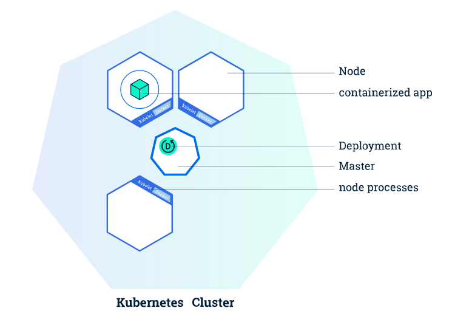
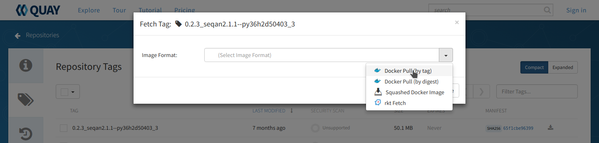
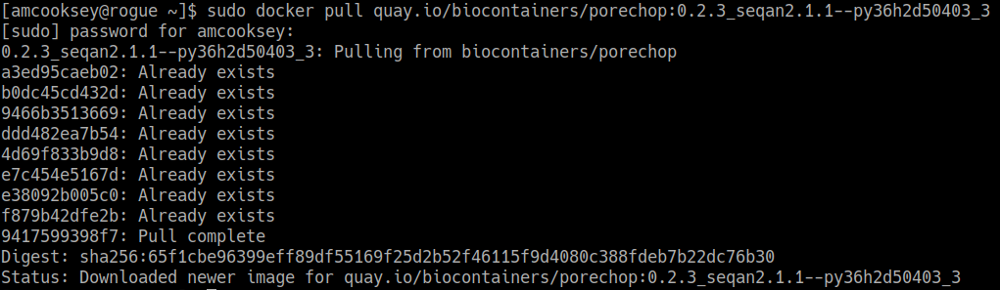
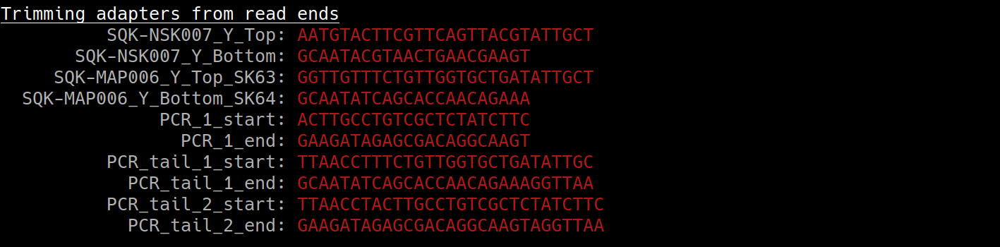

.. include:: ../cyverse_rst_defined_substitutions.txt

|CyVerse_logo|_

|Home_Icon2|_
`Learning Center Home <http://learning.cyverse.org/>`_

**Introduction to containers**
==============================

**What is a container?**
------------------------

A container is a standard unit of software that packages up code and all its dependencies so the application runs quickly and reliably from one computing environment to another. A container image includes everything needed to run an application: code, runtime, system tools, system libraries and settings.

**Why use containers?**
^^^^^^^^^^^^^^^^^^^^^^^

- **Flexible:** Even the most complex applications can be containerized.

- **Lightweight:** Containers leverage and share the host kernel, making them much more efficient in terms of system resources than virtual machines.

- **Portable:** You can build locally, deploy to the cloud, and run anywhere.

- **Loosely coupled:** Containers are highly self sufficient and encapsulated, allowing you to replace or upgrade one without disrupting others.

- **Scalable:** You can increase and automatically distribute container replicas across a datacenter.

- **Secure:** Containers apply aggressive constraints and isolations to processes without any configuration required on the part of the user.

We can move and scale our containerized applications; containers effectively guarantee that those applications will run the same way anywhere, allowing us to quickly and easily take advantage of all these environments.

**Working with containers**
---------------------------

- **Image:** self-contained, read-only ‘snapshot’ of your applications and packages, with all their dependencies
- **Container:** A virtualization of an operating system run within an isolated user space. A running instance of an image.

|docker|

|dockerdocs|
^^^^^^^^^^^^

Docker is a platform  to build, share, and run applications with containers. Docker Engine is available on a variety of |linuxdocker| , |macdocker| and |windowsdocker| through Docker Desktop.

Docker images are built from Dockerfiles. A **Dockerfile** is a text document that contains all the commands you would normally execute manually in order to build a Docker image. Docker can build images automatically by reading the instructions from a Dockerfile.

|builddocker|

Once you have a Docker image you can:

- run it as a container (anywhere)
- push it to a registry (make it available to others)
- link it to GitHub with automated builds

Other things to note about Docker:

- Docker **always runs as root**. This makes it unsuitable for use on large computing systems with many users such as HPC.
- Docker images and containers are **stored in the Docker directory** (where Docker is installed) so you won't see them in a list of your files. There are special Docker commands you can use to list/remove them.

|singularity|

|singularitydocs|
^^^^^^^^^^^^^^^^^
Singularity was created to run complex applications on HPC clusters in a simple, portable, and reproducible way. You are the **same user inside a container as outside**, and cannot gain additional privilege on the host system by default.

Singularity images are built from `definition files <https://sylabs.io/guides/3.5/user-guide/cli/singularity_build.html>`_. Like Dockerfiles, they provide a list of commands necessary to build the image. They also have a very specific format although it is a different format from Dockerfiles.

Fortunately, Singularity will automatically convert and run Docker images (so you may not need to learn how to build a Singularity image at all).

Once built, the Singularity image will be saved as a .sif file in your local working directory. You can easily see your image when you list your files but you may have images files saved to lots of different directories.

|kubernetes|

|kubernetesdocs|
^^^^^^^^^^^^^^^^

Kubernetes automates the distribution and scheduling of application containers across a cluster in a more efficient way. This allows you to scale-up your analyses as necessary.

A Kubernetes cluster consists of two types of resources:

- **master node:** responsible for deciding what runs on all of the cluster’s nodes. This can include scheduling workloads, like containerized applications, and managing the workloads’ lifecycle, scaling, and upgrades. The master also manages network and storage resources for those workloads.
- **worker node:** A cluster typically has one or more nodes, which are the worker machines that run your containerized applications and other workloads. Each node is managed from the master, which receives updates on each node’s self-reported status.

|cluster|

More worker nodes = more compute power. This means you can easily scale your app to run much faster/with larger datasets.

Once the application instances are created, a Kubernetes Deployment Controller continuously monitors those instances. If the Node hosting an instance goes down or is deleted, the Deployment controller replaces the instance with an instance on another Node in the cluster. This provides a self-healing mechanism to address machine failure or maintenance.

**Finding pre-built images**
----------------------------

**Image registry:** a storage and content delivery system, such as that used by Docker

.. Warning::

    Only use images from trusted sources or images for which you can see the Dockerfile. An image from an untrusted source could contain something other than what it's labeled (eg. malware). If you can see the Dockerfile you can see exactly what is in the image.

|dockerhub|
^^^^^^^^^^^

Docker Hub is a service provided by Docker for finding and sharing container images with your team. It provides the following major features:

- **Repositories:** Push and pull container images.
- **Teams & Organizations:** Manage access to private repositories of container images.
- **Official Images:** Pull and use high-quality container images provided by Docker.
- **Publisher Images:** Pull and use high- quality container images provided by external vendors. Certified images also include support and guarantee compatibility with Docker Enterprise.
- **Builds:** Automatically build container images from GitHub and Bitbucket and push them to Docker Hub.
- **Webhooks:** Trigger actions after a successful push to a repository to integrate Docker Hub with other services.

Docker Hub is the most well-known and popular image registry for Docker containers.

|biocontainerlogo|

|biocontainerreg|
^^^^^^^^^^^^^^^^^^

BioContainers is a community-driven project that provides the infrastructure and basic guidelines to create, manage and distribute bioinformatics containers with **special focus in proteomics, genomics, transcriptomics and metabolomics**. BioContainers is based on the popular frameworks of Docker.

Although anyone can create a BioContainer, the majority of BioContainers are created by the Bioconda project. Every Bioconda package has a corresponding BioContainer available at Quay.io.

|biocondalogo|

- **package manager:** collection of software tools that automates the process of installing, upgrading, configuring, and removing computer programs for a computer's operating system in a consistent manner

- |biocondagithub| is a channel for the conda package manager specializing in bioinformatics software. It consists of:

- Over 800 contributors that add, modify, update and maintain the recipes
- A repository of > 7000 bioinformatics packages ready to use
- **Each package added to Bioconda also has a corresponding Docker BioContainer automatically created and uploaded to Quay.io**
- You can `contribute <https://bioconda.github.io/contributing.html>`_ to the Bioconda project by building your own packages. Each package will also be made available as a BioContainer at |quayio|

.. Note::

    The BioContainers registry search returns partial matches and matches to the tool description. So, if you want to find all the tools relevant to Nanopore analysis you can search for 'nanopore'.

.. Note:: You want the docker images, not the Conda packages. Conda packages are not containers.

|quayio|
^^^^^^^^^
Quay is another general image registry. It works the same way as Docker Hub. However, Quay is home to all BioContainers made by the Bioconda project. Now we will find a BioContainer image at Quay, pull that image and run it on cloud virtual machine.

**Hands-on**
------------

To run your BioContainer you will need a computer with Docker installed.

Launch this Atmosphere instance: **Ubuntu 18.04 GUI XFCE Base**

How to install Docker
^^^^^^^^^^^^^^^^^^^^^

Installing Docker on your computer takes a little time but it is reasonably straight forward and it is a one-time setup. |How to install Docker|.

Docker installation is much easier on an Atmosphere instance with the 'ezd' command.

.. code-block:: bash

    $ ezd

Get data to use with your container
^^^^^^^^^^^^^^^^^^^^^^^^^^^^^^^^^^^^

|setupicommands|

.. code-block:: bash

   $ cd Desktop
   $ iget /iplant/home/shared/iplantcollaborative/example_data/porechop/SRR6059710.fastq

Use 'docker pull' to get the image
^^^^^^^^^^^^^^^^^^^^^^^^^^^^^^^^^^

Go to |quayio| and search for 'porechop' in the search bar at the top of the page.

Click on the 'tag' icon on the left side of the screen to show all the available 'porechop' images.

|biocontainers3|

Click the 'fetch tag' icon at the right and choose 'Docker pull (by tag)' from the dropdown. This will copy the docker pull command that we will need on the command line.

|biocontainers8|

Now you will need to pull the image from the registry onto your computer. Use the 'docker pull' command you copied from the registry above.

.. Note::
    If you are working on a system for which you don't have root permissions you will need to use 'sudo' and provide your password. Like this:

.. code-block:: bash

   $ sudo docker pull quay.io/biocontainers/porechop:0.2.3_seqan2.1.1--py36h2d50403_3

|pullquayio|

Use the 'docker run' command to run the container
^^^^^^^^^^^^^^^^^^^^^^^^^^^^^^^^^^^^^^^^^^^^^^^^^^

The easiest way to test the container to run the help command for the tool. In this case '-h' is the help command.

.. code-block:: bash

	$ sudo docker run --rm -v $(pwd):/working-dir -w /working-dir --entrypoint="porechop" quay.io/biocontainers/porechop:0.2.3_seqan2.1.1--py36h2d50403_3 -h

From the result we are able to see the only required option is '-i INPUT'. Options in [square brackets] are not required.

Now we can run the container with our data file to see the output.

.. code-block:: bash

	$ sudo docker run --rm -v $(pwd):/working-dir -w /working-dir --entrypoint="porechop" quay.io/biocontainers/porechop:0.2.3_seqan2.1.1--py36h2d50403_3 -i SRR6059710.fastq -o porechop_output.fastq

We can break the command down into pieces so it is easier to read (the backslash represents where we have broken the line).

.. code-block:: bash

    sudo \
    docker run \
    --rm \
    -v $(pwd):/working-dir \
    -w /working-dir \
    --entrypoint="porechop" \
    quay.io/biocontainers/porechop:0.2.3_seqan2.1.1--py36h2d50403_3 \
    -i SRR6059710.fastq \
    -o porechop_out.fastq

What it All Means
^^^^^^^^^^^^^^^^^
- 'sudo' allows you to run the container with 'root' permissions--only required if you don't have root permissions on your machine
- 'docker run' tells docker to run the container
- '--rm' removes the container (not the image) from your system when the analysis is complete
-  '-v' mounts a *local* directory into a directory *within the container*
-  '-w' specifies the working directory within the container
-  '--entrypoint' tells the container what to do (usually the name of the tool; the command you would use to run the tool on the command line)
-  'quay.io/biocontainers/porechop:0.2.3_seqan2.1.1--py36h2d50403_3' is the name of the image we pulled from Quay.io
-  '-i' is the argument for the input file (FASTQ) for Porechop
-  '-o' is the arguemnt for the output file (trimmed FASTQ) for Porechop

.. Important::

    You must supply an entrypoint on the command line when you run a BioContainer. It is possible to build entrypoints into a container but that is not he case with BioContainers.

|porechoprun|
|porechoptrim|
|porechopdone|

The output from Porechop is saved into the working directory within the container. We ran the container we mounted our current *local* working directory into the working directory *within the container*. The analysis has finished, the container has been removed (remember --rm) and now we should find our outputs in our *local* current working directory.

List the files:

.. code-block:: bash

    $ ls -l

|porechopout|

You can see the 'porechop_out.fastq' file is in our current working directory. Notice that the this file is owned by 'root'. This is because Docker containers always run as 'root'.

At this point you can run your container on any system with Docker installed. To use this container on an HPC system you will need to use Singularity (rather than Docker) to run your container. For more information about running Docker containers with Singularity see the `Singularity documentation <https://singularity.lbl.gov/quickstart>`_

Useful Links
^^^^^^^^^^^^
- `BioContainers <https://biocontainers.pro/#/>`_
- `Bioconda <https://bioconda.github.io/>`_
- `Request a BioContainer <http://github.com/BioContainers/containers/issues>`_
- `Singularity documentation <https://singularity.lbl.gov/quickstart>`_
- `BioContainers contribution guidelines <https://github.com/BioContainers/specs#33-how-to-create-a-docker-based-biocontainer>`_
- `Report BioContainers problems <http://github.com/BioContainers/containers/issues>`_

Some examples of public/private registries to consider for your research needs:

- `Docker Cloud <https://cloud.docker.com/>`_
- `Docker Hub <https://hub.docker.com/>`_
- `Docker Trusted Registry <https://docs.docker.com/ee/dtr/>`_
- `Amazon Elastic Container Registry <https://aws.amazon.com/ecr/>`_
- `Google Container Registry <https://aws.amazon.com/ecr/>`_
- `Azure Container Registry <https://azure.microsoft.com/en-us/services/container-registry/>`_
- `NVIDIA GPU Cloud <https://ngc.nvidia.com/catalog/containers>`_
- `Private Docker Registry <https://private-docker-registry.com/>`_ - not official Docker
- `Gitlab Container Registry <https://docs.gitlab.com/ce/administration/container_registry.html>`_
- `Quay <https://quay.io/>`_
- `TreeScale <https://treescale.com/>`_
- `Canister <https://www.canister.io/>`_
- `BioContainers Registry <https://biocontainers.pro/#/registry>`_

----

**Fix or improve this documentation:**

- On Github: |Github Repo Link|
- Send feedback: `Tutorials@CyVerse.org <Tutorials@CyVerse.org>`_

----

.. |Github Repo Link|  raw:: html

   <a href="https://github.com/CyVerse-learning-materials/foss-2019/tree/master/Containers/biocontainers.rst" target="blank">Github Repo Link</a>

.. |dockerdocs|  raw:: html

   <a href="https://docs.docker.com" target="blank">Docker</a>

.. |singularitydocs|  raw:: html

   <a href="https://sylabs.io/docs" target="blank">Singularity</a>

.. |kubernetesdocs|  raw:: html

   <a href="https://kubernetes.io/docs/home/" target="blank">Kubernetes</a>

.. |dockerhub|  raw:: html

   <a href="https://hub.docker.com" target="blank">Docker Hub</a>

.. |quayio|  raw:: html

   <a href="https://quay.io/" target="blank">Quay</a>

.. |biocontainerreg|  raw:: html

   <a href="https://biocontainers.pro/#/registry" target="blank">BioContainers Registry</a>

.. |biocondagithub|  raw:: html

   <a href="https://bioconda.github.io" target="blank">Bioconda</a>

.. |How to install Docker|  raw:: html

   <a href="https://learning.cyverse.org/projects/container_camp_workshop_2019/en/latest/docker/dockerintro.html" target="blank">How to install Docker</a>

.. |linuxdocker|  raw:: html

   <a href="https://docs.docker.com/install/linux/docker-ce/ubuntu" target="blank">Linux platforms</a>

.. |builddocker|  raw:: html

   <a href="https://cyverse-creating-docker-containers-quickstart.readthedocs-hosted.com/en/latest/step3.html" target="blank">More information on building Docker images</a>

.. |macdocker|  raw:: html

   <a href="https://docs.docker.com/docker-for-mac/install" target="blank">Mac</a>

.. |windowsdocker|  raw:: html

   <a href="https://docs.docker.com/docker-for-windows/install" target="blank">Windows</a>

.. |setupicommands|  raw:: html

    <a href="https://cyverse-data-store-quickstart.readthedocs-hosted.com/en/latest/" target="blank">Install iCommands</a>

.. |docker| image:: ../img/docker.png
  :width: 250

.. |singularity| image:: ../img/singularity.png
  :width: 150

.. |biocondalogo| image:: ../img/biocontainers13.png
  :width: 250

.. |biocontainerlogo| image:: ../img/biocontainers5a.png
  :width: 300

.. |biocontainers3| image:: ../img/biocontainers3.png
  :width: 750

.. |porechoprun| image:: ../img/biocontainers6.png
  :width: 750

.. |porechopdone| image:: ../img/biocontainers2.png
  :width: 750

.. |porechopout| image:: ../img/biocontainers12.png
  :width: 750
