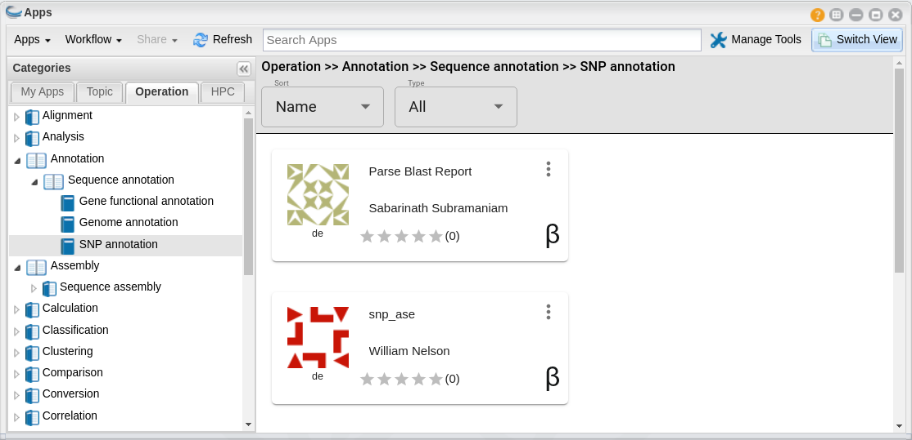
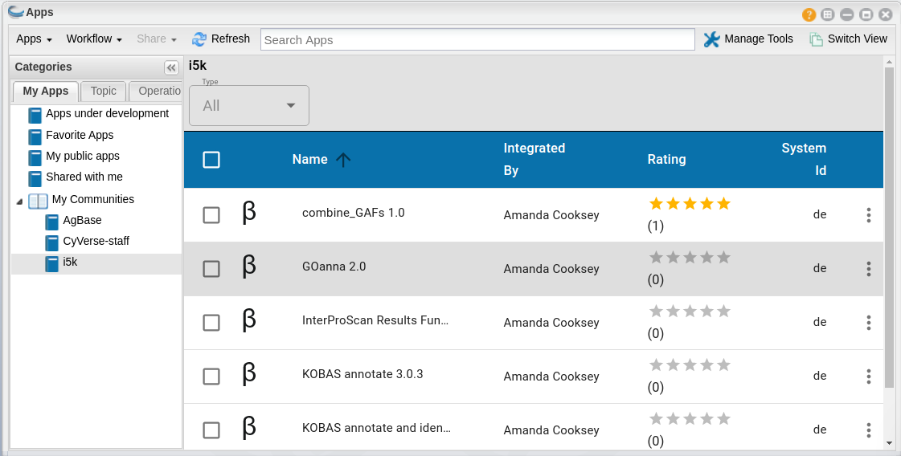

.. include:: ../cyverse_rst_defined_substitutions.txt

|CyVerse_logo|_

|Home_Icon2|_
`Learning Center Home <http://learning.cyverse.org/>`_

**Discovery Environment - Data Analysis**
=========================================
.. #### Comment: Overview of the DE and hands on of basic features

|DE_icon|

**Why use the DE?**
^^^^^^^^^^^^^^^^^^^

- Use hundreds of bioinformatics Apps without the command line
- Executable and interactive modes
- Seamlessly integrated with data and high performance computing – not dependent on your hardware
- Create and publish Apps and workflows so anyone can use them
- Analysis history and provenance – “avoid forensic bioinformatics”
- Securely and easily manage, share, and publish data

`Apps Window <https://wiki.cyverse.org/wiki/display/DEmanual/Using+the+Apps+Window+and+Submitting+an+Analysis>`_
---------------------------------------------------------------------------------------------------------------------

**Customizing the Apps window view**

|DE_switch_view|

**Finding Apps**
^^^^^^^^^^^^^^^^

**Find an app by** `searching <https://wiki.cyverse.org/wiki/display/DEmanual/Searching+for+an+App,+Workflow,+or+Tool>`_
""""""""""""""""""""""""""""""""""""""""""""""""""""""""""""""""""""""""""""""""""""""""""""""""""""""""""""""""""""""""""""""

**Browse by operation**
""""""""""""""""""""""""

|DE_apps_operation|

**Find apps by community**
""""""""""""""""""""""""""

When adding new apps to the DE, developers have the option of adding the app to a community. Users can join a community in the 'communities' menu under the person icon in the top right corner of the DE window. A new category will then be added to the left pane of the 'Apps' window called 'My Communities'. This can be an easy way to find apps related to a specific project and to see when new apps have been added to that project.

|DE_communities|

**Types of apps**
^^^^^^^^^^^^^^^^^^
 - **Executable**: user starts an analysis and when the analysis finishes they can find the output files in their 'Analyses' folder

    - **DE**: run locally on our cluster
    - **HPC**: labeled as 'Agave' in the DE. Run on XSEDE resources at Texas Advanced Computing Center (TACC)
    - **OSG**: run on the Open Science Grid

 - **Interactive**: also called Visual and Interactive Computing Environment (VICE). Allows users to open Integrated Development Environments (IDEs) including RStudio, Project Jupyter and RShiny and work interactively within them.

`Launch an executable analysis <https://wiki.cyverse.org/wiki/display/DEmanual/Using+Apps>`_
-------------------------------------------------------------------------------------------------

|DE_word_count|

`Analyses window <https://wiki.cyverse.org/wiki/display/DEmanual/Using+the+Analyses+Window>`_
-----------------------------------------------------------------------------------------------

The analysis window provides the status (submitted, running, failed, completed) of each of your analyses.

|DE_analyses|

A variety of information and tasks related to an analysis can be found in the 'three dots' menu at the right.

 - `Relaunch or cancel <https://wiki.cyverse.org/wiki/display/DEmanual/Relaunching%2C+Canceling%2C+and+Deleting+Analyses%2C+Viewing+Analysis+Outputs+and+Info>`_ an analysis
 - `Troubleshoot an analysis <https://wiki.cyverse.org/wiki/display/DEmanual/Relaunching%2C+Canceling%2C+and+Deleting+Analyses%2C+Viewing+Analysis+Outputs+and+Info>`_
 - `Share an analysis <https://wiki.cyverse.org/wiki/display/DEmanual/Sharing+and+Unsharing+an+Analysis>`_ with a collaborator.

`Launch an interactive analysis (VICE) <https://learning.cyverse.org/projects/vice/en/latest/>`_
-------------------------------------------------------------------------------------------------

Visual Interactive Computing Environment VICE introduces graphic user interfaces (GUIs) and common Integrated Development Environments (IDEs) such as Project Jupyter Notebooks & Lab, RStudio, Shiny Apps and Linux Desktop

Additional resources
--------------------

 - `DE Guide <https://learning.cyverse.org/projects/discovery-environment-guide/en/latest/>`_
 - `DE Manual <https://wiki.cyverse.org/wiki/display/DEmanual/Table+of+Contents>`_
 - `VICE Manual <https://learning.cyverse.org/projects/vice/en/latest/>`_
 - `Using CyVerse for a shared project <https://learning.cyverse.org/projects/cyverse-group-project-quickstart/en/latest/index.html?highlight=group%20project>`_
----

**Fix or improve this documentation:**

- On Github: |Github Repo Link|
- Send feedback: `Tutorials@CyVerse.org <Tutorials@CyVerse.org>`_

----

.. Comment: Place Images Below This Line

.. |DE_icon| image:: ../img/de/de-icon.png
    :width: 60
    :height: 50

.. |DE_analyses| image:: ../img/de/DE_analyses.png
    :width: 750

.. |DE_apps_operation| image:: ../img/de/DE_apps_operation.png
    :width: 750

.. |DE_blank| image:: ../img/de/DE_blank.png
    :width: 750

.. |DE_dots_menu| image:: ../img/de/DE_dots_menu.png
    :width: 750

.. |DE_word_count| image:: ../img/de/DE_word_count.png
    :width: 750

.. Comment: Place URLS Below This Line

   # Use this example to ensure that links open in new tabs, avoiding
   # forcing users to leave the document, and making it easy to update links
   # In a single place in this document

   .. |Substitution| raw:: html # Place this anywhere in the text you want a hyperlink

      <a href="REPLACE_THIS_WITH_URL" target="blank">Replace_with_text</a>

.. |Github Repo Link|  raw:: html

   <a href="https://github.com/CyVerse-learning-materials/foss-2020/tree/master/CyVerse/de-data-analysis.rst" target="blank">Github Repo Link</a>
