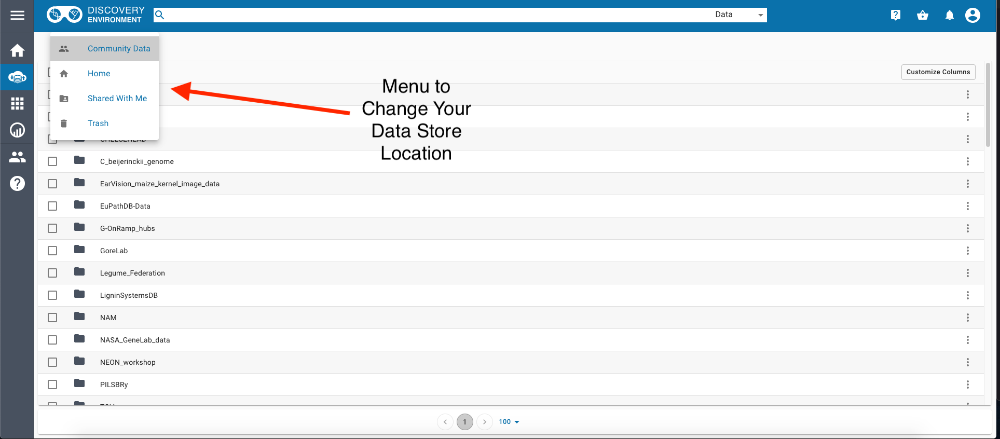
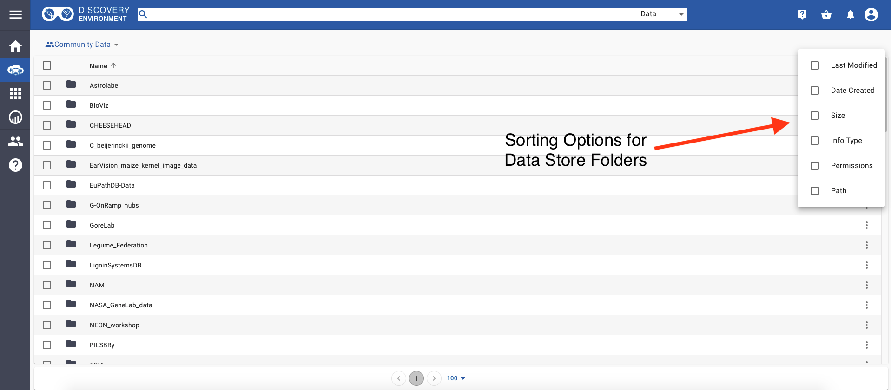
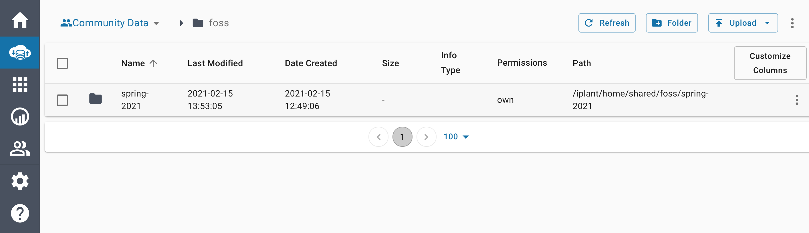
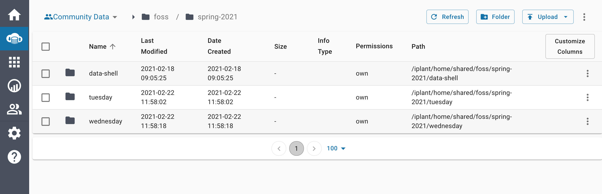

> \<a href=\"<https://atmo.cyverse.org>\"
> target=\"blank\"\>Atmosphere\</a\>

> \<a
> href=\"<https://wiki.cyverse.org/wiki/display/atmman/Atmosphere+Manual+Table+of+Contents>\"
> target=\"blank\"\>Atmosphere Manual\</a\>

> \<a
> href=\"<https://learning.cyverse.org/projects/atmosphere-guide/en/latest/>\"
> target=\"blank\"\>Atmosphere Guide\</a\>

> \<a href=\"<https://bisque.cyverse.org/client_service/>\"
> target=\"blank\"\>BisQue\</a\>

> \<a href=\"<https://wiki.cyverse.org/wiki/display/BIS>\"
> target=\"blank\"\>BisQue Manual\</a\>

> \<a href=\"<https://user.cyverse.org/>\" target=\"\_blank\"\>CyVerse
> User Portal\</a\>

> \<a href=\"<http://learning.cyverse.org>\" target=\"blank\"\>CyVerse
> Learning Center\</a\>

> \<a href=\"<https://wiki.cyverse.org>\" target=\"blank\"\>CyVerse
> Wiki\</a\>

> \<a href=\"<http://www.cyverse.org/data-store>\"
> target=\"\_blank\"\>Data Store\</a\>

> \<a
> href=\"<https://wiki.cyverse.org/wiki/display/DS/Data+Store+Table+of+Contents>\"
> target=\"blank\"\>Data Store Manual\</a\>

> \<a
> href=\"<https://learning.cyverse.org/projects/data_store_guide/en/latest/>\"
> target=\"blank\"\>Data Store Guide\</a\>

> \<a href=\"<https://de.cyverse.org/de/>\" target=\"blank\"\>Discovery
> Environment\</a\>

> \<a
> href=\"<https://wiki.cyverse.org/wiki/display/DEmanual/Table+of+Contents>\"
> target=\"blank\"\>DE Manual\</a\>

> \<a
> href=\"<http://learning.cyverse.org/projects/cyverse-discovery-environment-guide/>\"
> target=\"blank\"\>Discovery Environment Guide\</a\>

> \<a href=\"<https://dnasubway.cyverse.org/>\" target=\"blank\"\>DNA
> Subway\</a\>

> \<a
> href=\"<https://learning.cyverse.org/projects/dnasubway_guide/en/latest/>\"
> target=\"blank\"\>DNA Subway Manual\</a\>

> \<a
> href=\"<https://learning.cyverse.org/projects/dnasubway_guide/en/latest/>\"
> target=\"blank\"\>DNA Subway Guide\</a\>

> \<a href=\"<https://www.sciapps.org/>\"
> target=\"blank\"\>SciApps\</a\>

> \<a
> href=\"<https://learning.cyverse.org/projects/sciapps_guide/en/latest/>\"
> target=\"blank\"\>SciApps Manual\</a\>

> \<a
> href=\"<https://learning.cyverse.org/projects/sciapps_guide/en/latest/>\"
> target=\"blank\"\>SciApps Guide\</a\>

> \<a href=\"<https://cyverse-de.github.io/api/>\"
> target=\"blank\"\>Terrain DE API Docs\</a\>

> \<a href=\"<https://www.tacc.utexas.edu/tapis>\"
> target=\"blank\"\>Tapis TACC API\</a\>

> \<a href=\"<http://ask.iplantcollaborative.org/questions>\"
> target=\"blank\"\>Ask CyVerse\</a\>

> \<a href=\"<http://learning.cyverse.org/en/latest/>\"
> target=\"blank\"\>Agave Guide\</a\>

> \<a href=\"<http://developer.agaveapi.co/#introduction>\"
> target=\"blank\"\>Agave API\</a\>

> \<a href=\"<https://agaveapi.co>\" target=\"blank\"\>Agave Live
> Docs\</a\>

> \<a href=\"<http://learning.cyverse.org/en/latest/>\"
> target=\"blank\"\>BisQue Guide\</a\>

> \<a href=\"<http://datacommons.cyverse.org/>\" target=\"blank\"\>Data
> Commons\</a\>

\_

\_ [Learning Center Home](http://learning.cyverse.org/)

# **Discovery Environment - Data Management**

{width="60px" height="50px"}

## DE2 Data Store Walkthrough

> -   Log in at <https://de2.cyverse.org/>
>
> ::: admonition
> learning objectives
>
> -   Recognize the data store environment and how to navigate it
> -   Use data store through GUI to interact with community datasets
> -   Describe how to create a directory in the data store
> :::

*Data Window*


*Community Data on DE2*


*Changing Locations on DE2*



*Sorting Folders in DE2*



*Navigate to the FOSS Folder*

The folder is inside [Community Data]{.title-ref} and called
[foss]{.title-ref}


Which contains:



*Creating Folders in the Data Store*

Navigate to the [spring-2021]{.title-ref} folder, you should see the
following:



Inside the folder that matches the day that you attend FOSS, create a
folder that matches your CyVerse username.


*What can we do with this?*

::: admonition
Question

In small groups discuss the following questions:

1.  How might you use the Data Store in your work?
2.  Does the data store allow your data to be FAIR?
3.  What is one way you could use the data store in FOSS for your group
    work?
:::

## Leave Feedback on the DE2 Layout and User Interface

## Classic DE Data Store Walkthrough

> -   Log in at <https://de.cyverse.org/>


*Data Window*

> -   Open the data window and upload a file:


> -   [Create a new text
>     file](https://wiki.cyverse.org/wiki/display/DEmanual/Creating+New+Files+and+Folders)
>     and share it with someone in the class:


> -   [Download](https://wiki.cyverse.org/wiki/display/DEmanual/Downloading+Files+and+Folders)
>     the shared file.

*Using metadata in the Classic DE*

> -   [Using metadata in the
>     DE](https://wiki.cyverse.org/wiki/display/DEmanual/Using+Metadata+in+the+DE)
>     :


> -   [Search](https://wiki.cyverse.org/wiki/display/DEmanual/Searching+for+Data+Items)
>     for data in the DE:


> -   Try a simple search for the word \"maize\"
>
> -   Try an advanced search for attribute = subject and value = maize
>
> -   
>
>     Other options to be covered on Tuesday:
>
>     :   -   [bulk metadata
>             application](https://wiki.cyverse.org/wiki/display/DEmanual/Using+Metadata+in+the+DE#UsingMetadataintheDE-Addingbulkmetadatatomultiplefilesorfolders)
>         -   [metadata
>             templates](https://wiki.cyverse.org/wiki/display/DEmanual/Using+Metadata+in+the+DE#UsingMetadataintheDE-Usingmetadatatemplates)

*Advanced Metadata Usage in Classic DE*

The Data Commons provides advanced metadata features in the Discovery
Environment, including:

-   [metadata
    templates](https://wiki.cyverse.org/wiki/display/DEmanual/Using+Metadata+in+the+DE#UsingMetadataintheDE-Usingmetadatatemplates)

**Exercise:** - Open the DE - Apply a Plant Ontology template to a
folder. - Apply an ontology term to a file or folder.

-   [bulk metadata
    application](https://wiki.cyverse.org/wiki/display/DEmanual/Using+Metadata+in+the+DE#UsingMetadataintheDE-Addingbulkmetadatatomultiplefilesorfolders)

**Exercise:** 1. Copy the B123 file to your home directory - Using
icommands:

``` bash
$ icd /iplant/home/$username
$ icp -r /iplant/home/rwalls/B123 B123
$ ils
```

\- In the DE:

:   -   create a folder in your home directory called **B123**
    -   Move into B123
    -   Upload \>\> Import from URL\...
    -   paste each of the URLs below into a slot. This must be done in
        two batches.

    ``` bash
    https://raw.githubusercontent.com/CyVerse-learning-materials/foss-2020/master/slides/B123/012.txt
    https://raw.githubusercontent.com/CyVerse-learning-materials/foss-2020/master/slides/B123/123.txt
    https://raw.githubusercontent.com/CyVerse-learning-materials/foss-2020/master/slides/B123/234.txt
    https://raw.githubusercontent.com/CyVerse-learning-materials/foss-2020/master/slides/B123/345.txt
    https://raw.githubusercontent.com/CyVerse-learning-materials/foss-2020/master/slides/B123/456.txt
    https://raw.githubusercontent.com/CyVerse-learning-materials/foss-2020/master/slides/B123/567.txt
    https://raw.githubusercontent.com/CyVerse-learning-materials/foss-2020/master/slides/B123/678.txt
    https://raw.githubusercontent.com/CyVerse-learning-materials/foss-2020/master/slides/B123/789.txt
    https://raw.githubusercontent.com/CyVerse-learning-materials/foss-2020/master/slides/B123/Rice_metadata.csv
    ```

2\. Apply metadata - In the DE apply the DE apply metadata to the
contents of B123 - Browse to B123 - View the metadata for one of the
files using the *Metadata* menu or the three dots (it should be blank) -
View the contents of the file [Rice_metadata.csv]{.title-ref} - Browse
back to your home directory - Check the box next to B123 - Select
*Metadata* \> *Apply Bulk Metadata* - Select the file
B123/Rice_metadata.csv - Browse back to B123 - View the metadata of the
different files in the directory

3\. Advanced search - Click on the search magnifying glass - Click + -
Change File Name to Metadata - Under Attribute, type
[treatment]{.title-ref}, under Value type [cold]{.title-ref} - Hit
Search

### Additional Resources

> -   [DE
>     Guide](https://learning.cyverse.org/projects/discovery-environment-guide/en/latest/)
> -   [DE
>     Manual](https://wiki.cyverse.org/wiki/display/DEmanual/Table+of+Contents)
> -   [Using CyVerse for a shared
>     project](https://learning.cyverse.org/projects/cyverse-group-project-quickstart/en/latest/index.html?highlight=group%20project)

------------------------------------------------------------------------

**Fix or improve this documentation:**

-   On Github:
-   Send feedback: [Tutorials@CyVerse.org](Tutorials@CyVerse.org)

------------------------------------------------------------------------

> \<a href=\"<https://sonora.cyverse.org/help>\" target=\"blank\"\>Leave
> Feedback for the DE2\</a\>

> \# Use this example to ensure that links open in new tabs, avoiding \#
> forcing users to leave the document, and making it easy to update
> links \# In a single place in this document
>
> > \<a href=\"REPLACE_THIS_WITH_URL\"
> > target=\"blank\"\>Replace_with_text\</a\>

> \<a
> href=\"<https://github.com/CyVerse-learning-materials/foss/tree/master/CyVerse/de-data-manage.rst>\"
> target=\"blank\"\>Github Repo Link\</a\>
