.. include:: ../cyverse_rst_defined_substitutions.txt

|CyVerse_logo|_

|Home_Icon2|_
`Learning Center Home <http://learning.cyverse.org/>`_

**Discovery Environment - Data Management**
--------------------------------------------
.. #### Comment: Data management in the DE
|DE_icon|

DE2 Data Store Walkthrough
~~~~~~~~~~~~~~~~~~~~~~~~~~
 - Log in at https://de2.cyverse.org/

 .. admonition:: learning objectives

      - Recognize the data store environment and how to navigate it
      - Use data store through GUI to interact with community datasets
      - Describe how to create a directory in the data store

*Data Window*

|DE2_data_icon|

*Community Data on DE2*

|DE2_community_data|

*Changing Locations on DE2*

|DE2_change_location|

*Sorting Folders in DE2*

|DE2_sorting_options|

*Navigate to the FOSS Folder*

The folder is inside `Community Data` and called `foss`

|FOSS Folder Location|

Which contains:

|FOSS Folder Contents|

*Creating Folders in the Data Store*

Navigate to the `spring-2021` folder, you should see the following:

|FOSS Spring 2021 Contents|

Inside the folder that matches the day that you attend FOSS,
create a folder that matches your CyVerse username.

|Create a Folder|

*What can we do with this?*

.. admonition:: Question

    In small groups discuss the following questions:

    1. How might you use the Data Store in your work?

    2. Does the data store allow your data to be FAIR?

    3. What is one way you could use the data store in FOSS for your group work?

Leave Feedback on the DE2 Layout and User Interface
~~~~~~~~~~~~~~~~~~~~~~~~~~~~~~~~~~~~~~~~~~~~~~~~~~~~~~

|Feedback on DE2|

Classic DE Data Store Walkthrough
~~~~~~~~~~~~~~~~~~~~~~~~~~~~~~~~~
 - Log in at https://de.cyverse.org/

|DE_blank|

*Data Window*

 - Open the data window and upload a file:

|DE_data_upload|

 - `Create a new text file <https://wiki.cyverse.org/wiki/display/DEmanual/Creating+New+Files+and+Folders>`_ and share it with someone in the class:

|DE_dots_menu|

 - `Download <https://wiki.cyverse.org/wiki/display/DEmanual/Downloading+Files+and+Folders>`_ the shared file.

*Using metadata in the Classic DE*

 - `Using metadata in the DE <https://wiki.cyverse.org/wiki/display/DEmanual/Using+Metadata+in+the+DE>`_ :

|DE_metadata|

 - `Search <https://wiki.cyverse.org/wiki/display/DEmanual/Searching+for+Data+Items>`_ for data in the DE:

|DE_search|

 - Try a simple search for the word "maize"
 - Try an advanced search for attribute = subject and value = maize
 - Other options to be covered on Tuesday:
 	- `bulk metadata application <https://wiki.cyverse.org/wiki/display/DEmanual/Using+Metadata+in+the+DE#UsingMetadataintheDE-Addingbulkmetadatatomultiplefilesorfolders>`_
	- `metadata templates <https://wiki.cyverse.org/wiki/display/DEmanual/Using+Metadata+in+the+DE#UsingMetadataintheDE-Usingmetadatatemplates>`_

*Advanced Metadata Usage in Classic DE*

The Data Commons provides advanced metadata features in the Discovery Environment, including:

- `metadata templates <https://wiki.cyverse.org/wiki/display/DEmanual/Using+Metadata+in+the+DE#UsingMetadataintheDE-Usingmetadatatemplates>`_

**Exercise:**
- Open the DE
- Apply a Plant Ontology template to a folder.
- Apply an ontology term to a file or folder.

- `bulk metadata application <https://wiki.cyverse.org/wiki/display/DEmanual/Using+Metadata+in+the+DE#UsingMetadataintheDE-Addingbulkmetadatatomultiplefilesorfolders>`_

**Exercise:**
1. Copy the B123 file to your home directory
- Using icommands:

.. code-block:: bash

    $ icd /iplant/home/$username
    $ icp -r /iplant/home/rwalls/B123 B123
    $ ils

- In the DE:
 - create a folder in your home directory called **B123**
 - Move into B123
 - Upload >> Import from URL...
 - paste each of the URLs below into a slot. This must be done in two batches.

 .. code-block:: bash

      https://raw.githubusercontent.com/CyVerse-learning-materials/foss-2020/master/slides/B123/012.txt
      https://raw.githubusercontent.com/CyVerse-learning-materials/foss-2020/master/slides/B123/123.txt
      https://raw.githubusercontent.com/CyVerse-learning-materials/foss-2020/master/slides/B123/234.txt
      https://raw.githubusercontent.com/CyVerse-learning-materials/foss-2020/master/slides/B123/345.txt
      https://raw.githubusercontent.com/CyVerse-learning-materials/foss-2020/master/slides/B123/456.txt
      https://raw.githubusercontent.com/CyVerse-learning-materials/foss-2020/master/slides/B123/567.txt
      https://raw.githubusercontent.com/CyVerse-learning-materials/foss-2020/master/slides/B123/678.txt
      https://raw.githubusercontent.com/CyVerse-learning-materials/foss-2020/master/slides/B123/789.txt
      https://raw.githubusercontent.com/CyVerse-learning-materials/foss-2020/master/slides/B123/Rice_metadata.csv

2. Apply metadata
- In the DE apply the DE apply metadata to the contents of B123
	- Browse to B123
	- View the metadata for one of the files using the *Metadata* menu or the three dots (it should be blank)
	- View the contents of the file `Rice_metadata.csv`
	- Browse back to your home directory
	- Check the box next to B123
	- Select *Metadata* > *Apply Bulk Metadata*
	- Select the file B123/Rice_metadata.csv
	- Browse back to B123
	- View the metadata of the different files in the directory

3. Advanced search
- Click on the search magnifying glass
- Click +
- Change File Name to Metadata
- Under Attribute, type `treatment`, under Value type `cold`
- Hit Search

Additional Resources
====================

 - `DE Guide <https://learning.cyverse.org/projects/discovery-environment-guide/en/latest/>`_
 - `DE Manual <https://wiki.cyverse.org/wiki/display/DEmanual/Table+of+Contents>`_
 - `Using CyVerse for a shared project <https://learning.cyverse.org/projects/cyverse-group-project-quickstart/en/latest/index.html?highlight=group%20project>`_

----

**Fix or improve this documentation:**

- On Github: |Github Repo Link|
- Send feedback: `Tutorials@CyVerse.org <Tutorials@CyVerse.org>`_

----

.. Comment: Place Images Below This Line

.. |DE_icon| image:: ../img/de/de-icon.png
    :width: 60
    :height: 50

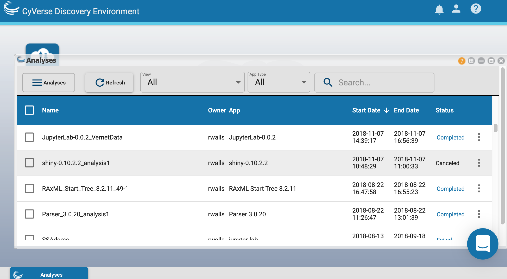

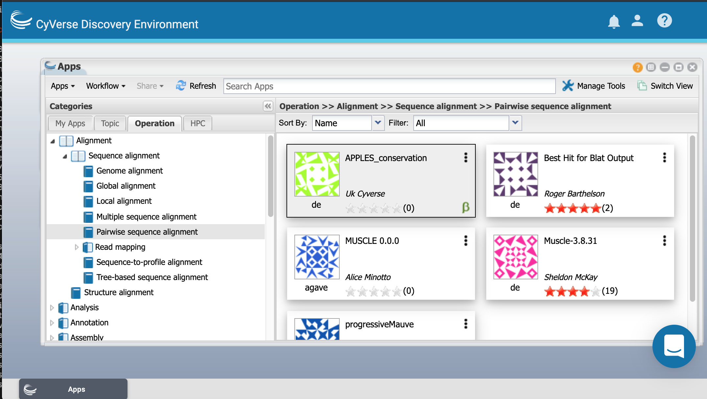

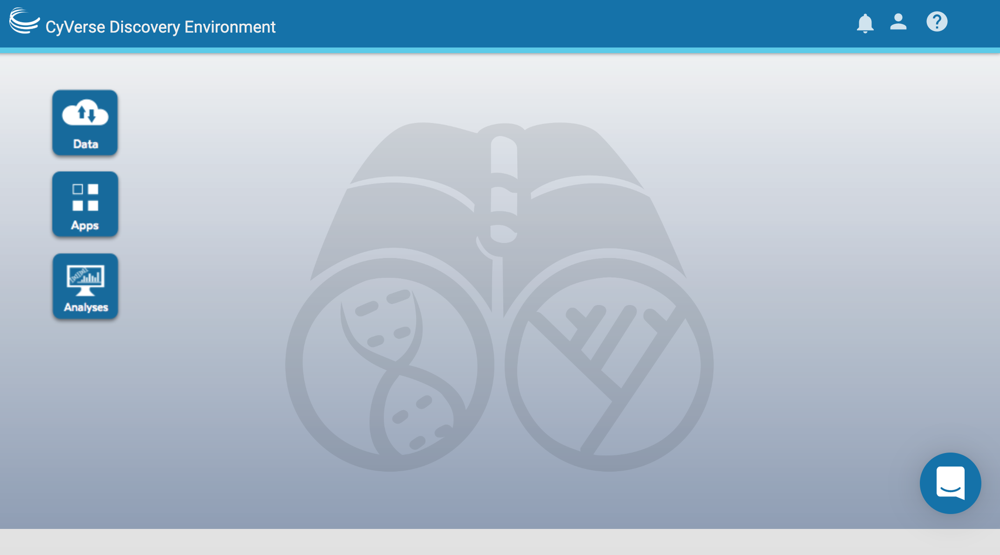

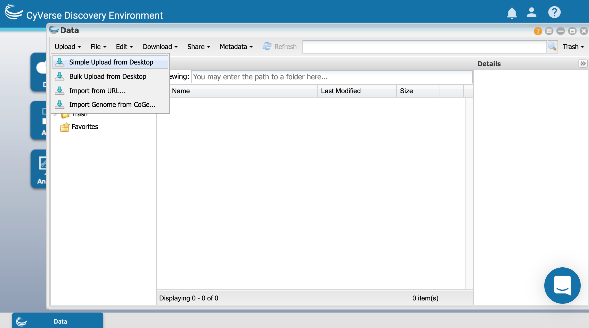

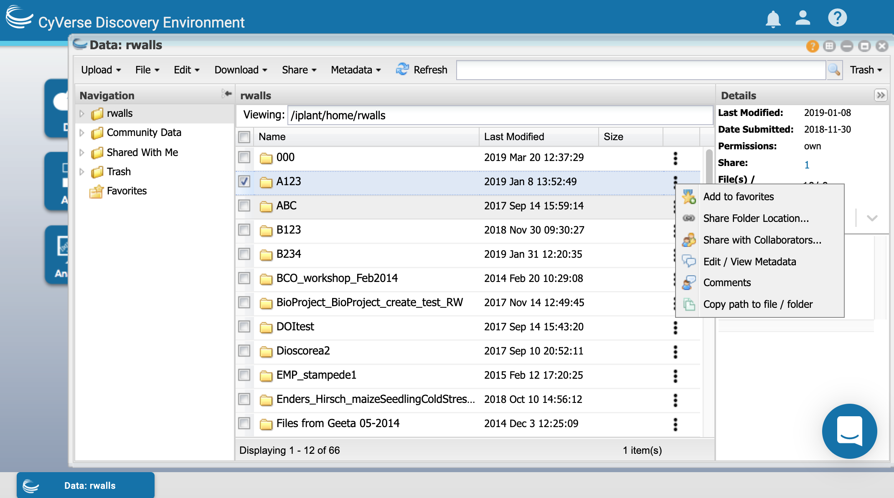

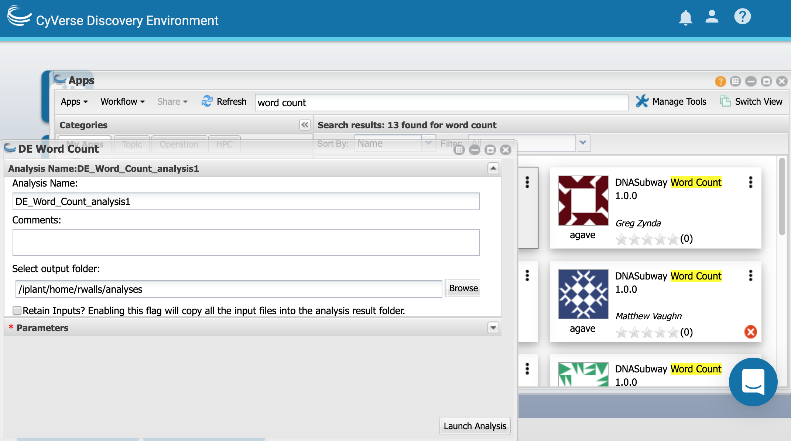

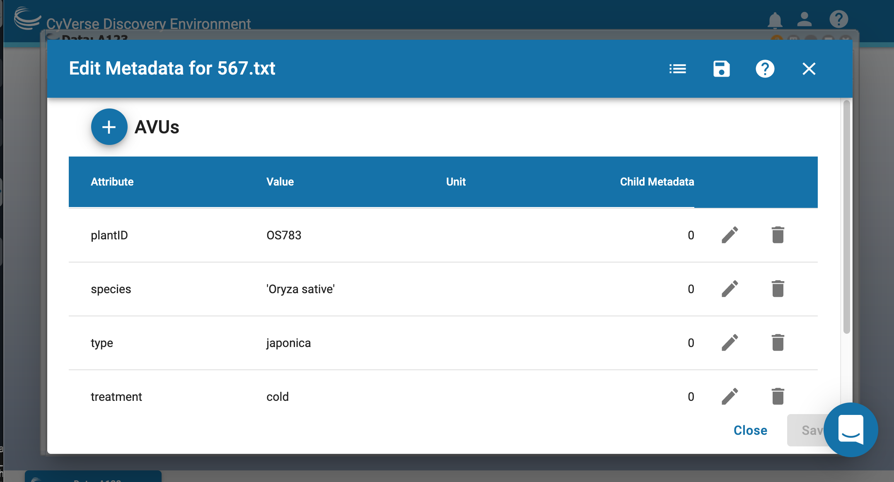

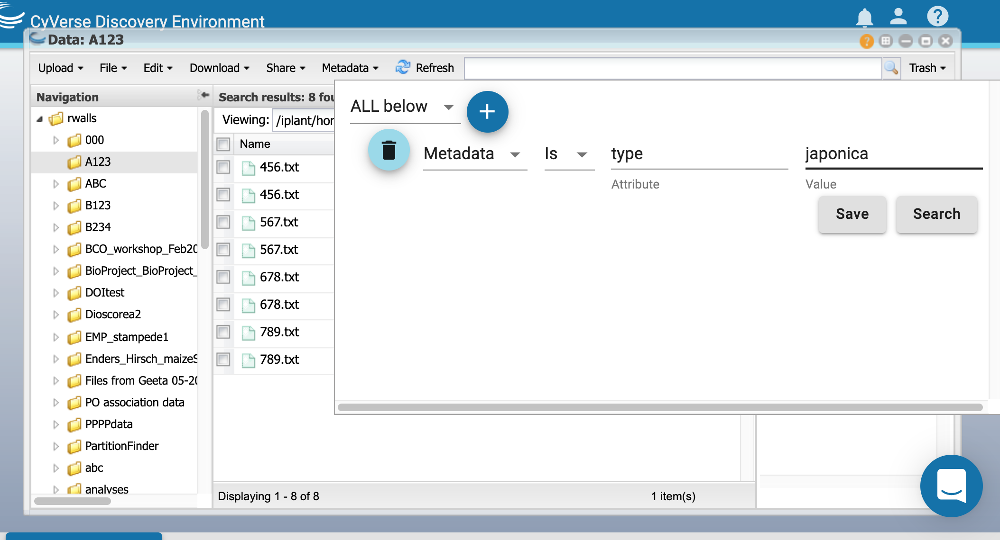

.. |FOSS Folder Location| image:: ../img/foss_folder_de2.png

.. |FOSS Folder Contents| image:: ../img/foss_folder_contents_de2.png

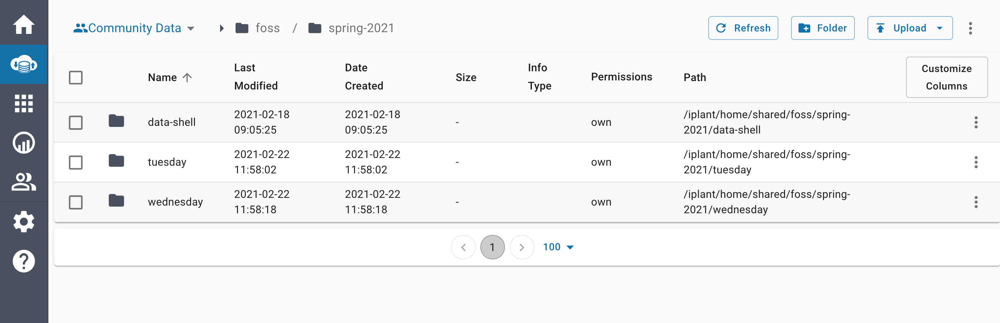

.. |Create a Folder| image:: ../img/spring_day_contents.png

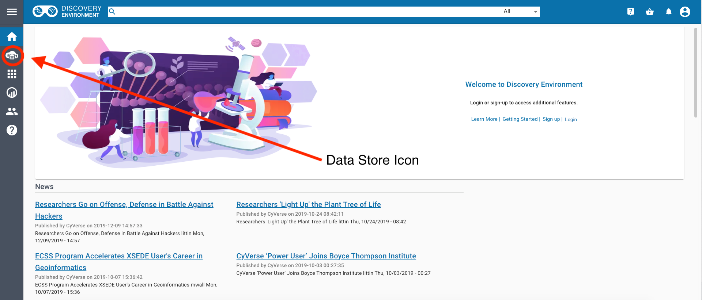

.. |DE2_community_data| image:: ../img/de2_datastore2.png

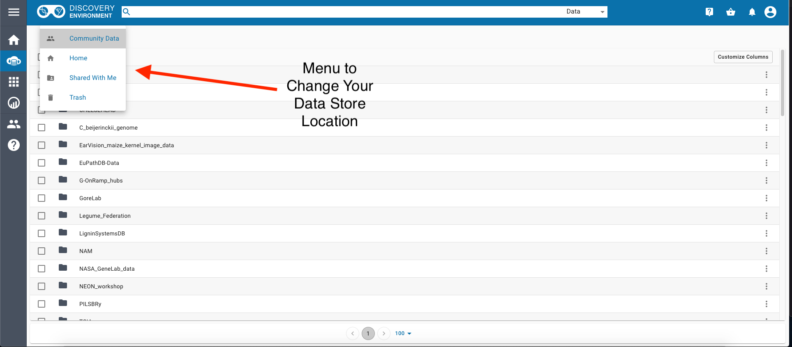

.. |DE2_sorting_options| image:: ../img/de2_datastore4.png

.. |Feedback on DE2| raw:: html

	<a href="https://sonora.cyverse.org/help" target="blank">Leave Feedback for the DE2</a>

.. Comment: Place URLS Below This Line

   # Use this example to ensure that links open in new tabs, avoiding
   # forcing users to leave the document, and making it easy to update links
   # In a single place in this document

   .. |Substitution| raw:: html # Place this anywhere in the text you want a hyperlink

      <a href="REPLACE_THIS_WITH_URL" target="blank">Replace_with_text</a>

.. |Github Repo Link|  raw:: html

   <a href="https://github.com/CyVerse-learning-materials/foss/tree/master/CyVerse/de-data-manage.rst" target="blank">Github Repo Link</a>
