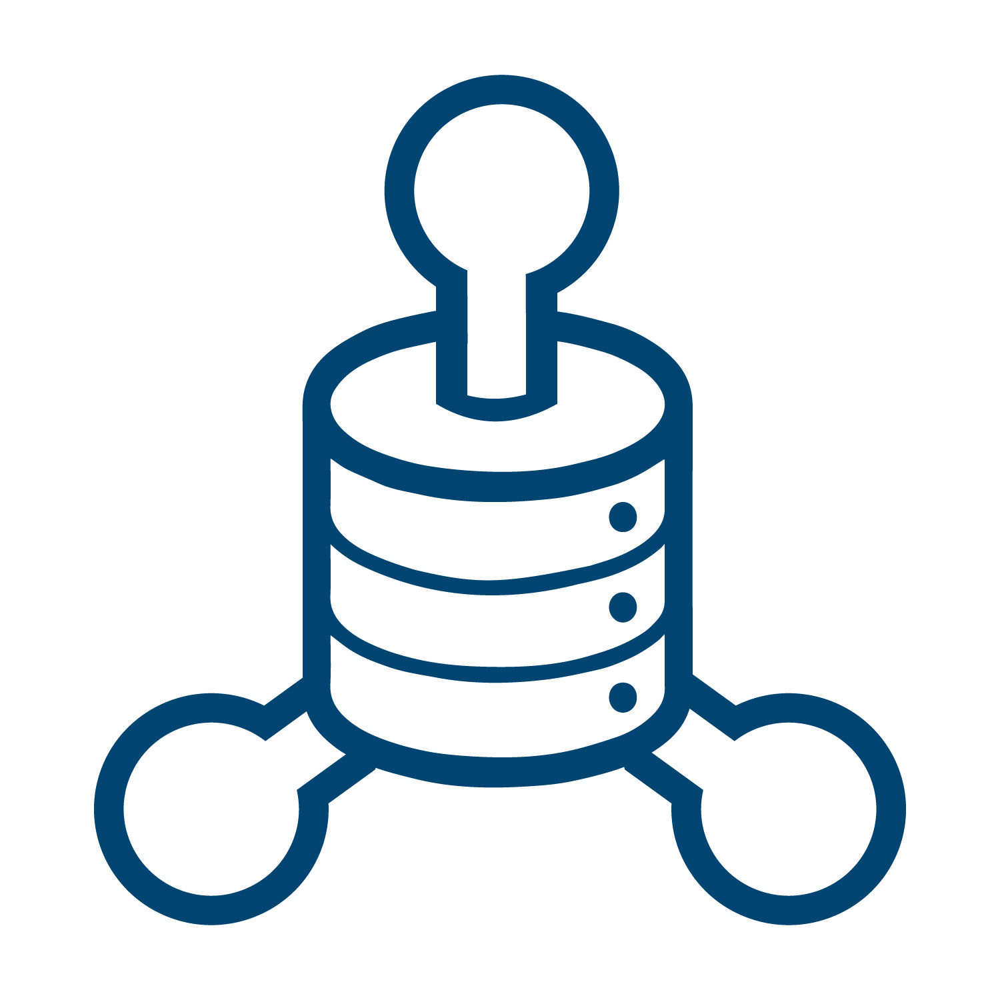

.. include:: ../cyverse_rst_defined_substitutions.txt

|CyVerse_logo|_

|Home_Icon2|_
`Learning Center Home <http://learning.cyverse.org/>`_

**About CyVerse**
=================

**CyVerse Vision:** Transforming science through data-driven discovery.

**CyVerse Mission:** Design, deploy, and expand a national
cyberinfrastructure for life sciences research and train scientists in
its use.

CyVerse provides life scientists with powerful computational
infrastructure to handle huge datasets and complex analyses, thus
enabling data-driven discovery. Our powerful extensible platforms
provide data storage, bioinformatics tools, image analyses, cloud
services, APIs, and more.

Originally created as the iPlant Collaborative to serve
U.S. plant science communities, the cyberinfrastructure we have built is germane
to all life sciences disciplines and works equally well on data from
plants, animals, or microbes. Thus, iPlant was renamed CyVerse to reflect the broader community now served by our infrastructure. By democratizing access to supercomputing
capabilities, we provide a crucial resource to enable scientists to find
solutions for the future. CyVerse is of, by, and for the community, and community-driven needs
shape our mission. We rely on your feedback to provide the
infrastructure you need most to advance your science, development, and
educational agenda.

**CyVerse Homepage:** `http://www.cyverse.org <http://www.cyverse.org>`_

**Evolution of CyVerse**

|evolcyverse|

CyVerse is an NSF-funded project. The project began in 2008 as 'iPlant' with the mission of 'empowering a new plant biology'. Funding was renewed in 2013 for another 5 years with the new mission of 'cyberinfrastructure for life sciences'. In 2016 the name of the project was changed from 'iPlant' to 'CyVerse' to reflect its role in all life scieneces, not just plants. In 2018 CyVerse was renewed for another 5 years with our current mission: 'to design, deploy, and expand a national Cyberinfrastructure for Life Sciences research, and to train scientists in its use'.

Over the past 10 years CyVerse priorities have focused on genomics and transcriptomics tools that were needed to deal with the huge increase in high-throughput seqeuncing data. While that is still a priority, CyVerse has since expanded to include image and geospatial analysis tools. CyVerse is built for data.

What is Cyberinfrastructure?
^^^^^^^^^^^^^^^^^^^^^^^^^^^^^^^^

Cyberinfrastructure is a combination of
    - platforms, tools and datasets researchers need to do their work
    - storage and compute hardware necessary for modern analyses
    - people who provide training and support

The CyVerse cyberinfrastructure can be thought of in layers. The bottom layer (on which everything else is built) consists of the hardware resources. On top of that are the services necessary to make a functional system. The next layer represents extensible services, or those parts of the system that may be adopted and used by thrid parties. Most users will interact primarily with the top layer which represents the various analysis and distribution platforms. While the bottom layers are the most flexible, the top layers are the most user-friendly.

|layer cake|

`User Portal <https://user.cyverse.org>`_
^^^^^^^^^^^^^^^^^^^^^^^^^^^^^^^^^^^^^^^^^

**The CyVerse user portal allows users to manage their accounts, subscriptions and events in a single place.** Some things you can do here include:

Create and manage your CyVerse account
    - Reset your password
    - Add an email address to your account
    - Change your name or username
    - Change your institution, department, position
    - Change your CyVerse subscriptions

Manage access to CyVerse platforms/services
    - Some CyVerse services (such as Atmosphere) have additional restrictions and access must be 'turned on'.

**Manage workshops you've attended or hosted**

**Access 'Powered by CyVerse' projects**

User portal forms
    - Request a Data Store allocation increase
    - Request a community released data folder
    - Request a workshop or webinar
    - Reserve Atmosphere cloud resources for workshops or classes
    - Request an External Collaborative Partnership (ECP)
    - Get Powered by CyVerse

`Data Store <https://de.cyverse.org/de/>`_
^^^^^^^^^^^^^^^^^^^^^^^^^^^^^^^^^^^^^^^^^^

|datastorelogo|

**Securely store data for active analyses or sharing with your collaborators.**

    - Upload, download and share your data
        - DE simple upload/download. Convenient but not good for large files.
        - Cyberduck is a third-party software with graphic interface for transferring data. Available for Mac and Windows.
        - iCommands is more powerful/flexible, good for large transfers but requires some command line knowledge
    - Data limit of 100 GB (can request increase up to 10 TB)
    - Data storage is integrated into the Discovery Environment (where analyses are run).
    - Share your data with collaborators
    - `Data Store guide <https://cyverse-data-store-guide.readthedocs-hosted.com/en/latest/>`_

`Discovery Environment <https://de.cyverse.org/de/>`_
^^^^^^^^^^^^^^^^^^^^^^^^^^^^^^^^^^^^^^^^^^^^^^^^^^^^^

|DElogo|

**Use hundreds of bioinformatics apps and manage data in a simple web interface.**

    - Provides graphic interface for bioinformatics tools for scientists with no command line experience
    - User extensible. Users can add their own tools and make their own apps.
           - Share them with collaborators
           - Publish them
    - VICE (Visual and Interactive Computing Environment) for interactive use of Jupyter notebooks, RStudio and RShiny.
    - Integrated with the Data Store for ease of use
    - Share your analyses with your collaborators
    - `DE guide <http://learning.cyverse.org/projects/cyverse-discovery-environment-guide/>`_
    - `VICE documentation <https://cyverse-visual-interactive-computing-environment.readthedocs-hosted.com/en/latest/index.html>`_

`Atmosphere <https://atmo.cyverse.org/application/images>`_
^^^^^^^^^^^^^^^^^^^^^^^^^^^^^^^^^^^^^^^^^^^^^^^^^^^^^^^^^^^

|atmologo|

**Create a custom cloud-based scientific analysis platform or use a ready-made one for your area of scientific interest.**

    - Cloud computing for life sciences
    - 100s of pre-built images
    - Fully customize your software setup
    - Choose (or build) an image that best suits your needs
    - `Atmosphere guide <https://cyverse-atmosphere-guide.readthedocs-hosted.com/en/latest/>`_

`Bisque <https://bisque.cyverse.org/client_service/>`_
^^^^^^^^^^^^^^^^^^^^^^^^^^^^^^^^^^^^^^^^^^^^^^^^^^^^^^

|bisquelogo|

**Bio-Image Semantic Query User Environment for the exchange and exploration of image data**

    - Exchange, explore, and analyze biological images and their metadata.
    - Image data analysis and management
    - `Bisque manual <https://wiki.cyverse.org/wiki/display/BIS>`_

`DNA Subway <https://dnasubway.cyverse.org/>`_
^^^^^^^^^^^^^^^^^^^^^^^^^^^^^^^^^^^^^^^^^^^^^^

|dnasubwaylogo|

**Teach classroom-friendly bioinformatics for genome analysis, DNA Barcoding, and RNA-Sequencing.**

    - Educational tool
    - Ties together key bioinformatics tools and databases to
            - assemble gene models
            - investigate genomes
            - work with phylogenetic trees
            - analyze DNA barcodes
    - Analyze your own data or the sample data provided
    - `DNA Subway guide <https://cyverse-dnasubway-guide.readthedocs-hosted.com/en/latest/>`_

`Data Commons <http://datacommons.cyverse.org/>`_
^^^^^^^^^^^^^^^^^^^^^^^^^^^^^^^^^^^^^^^^^^^^^^^^^

|DClogo|

**The Data Commons provides services to manage, organize, preserve, publish, discover, and reuse data.**

    - Access discoverable and reusable data with metadata features and functions
    - Browse Community Released Data and data curated by CyVerse
    - Easily publish data to the NCBI or directly to the CyVerse Data Commons

Science APIs
^^^^^^^^^^^^
|sciAPIslogo|

**Programmatic access to CyVerse services**

    - Science-as-a-service platform
    - Define your own compute, and storage resources (local and CyVerse)
    - Build your own app store of scientific codes and workflows
    - Agave API for HPC
    - Terrain API for DE

`SciApps <https://www.sciapps.org/>`_
^^^^^^^

**A cloud-based platform for building and sharing reproducible bioinformatics workflows across distributed computing and storage systems**

    - Build branching analysis workflows
    - `SciApps guide <https://cyverse-sciapps-guide.readthedocs-hosted.com/en/latest/index.html>`_

`Powered by CyVerse <http://www.cyverse.org/powered-by-cyverse>`_
^^^^^^^^^^^^^^^^^^^^^^^^^^^^^^^^^^^^^^^^^^^^^^^^^^^^^^^^^^^^^^^^^

|PBlogo|

**Third-party projects can leverage the CyVerse cyberinfrastructure components to provide services to their users.**

    Some 'Powered by CyVerse' projects you may be familiar with
        - CoGe
        - BioExtract Server
        - CIPRES
        - ClearedLeavesDB
        - Digital Imaging of Root Traits (DIRT)
        - Federated Plant Database Initiative for Legumes (LegFed)
        - Galaxy
        - Genomes to Fields
        - iMicrobe
        - Integrated Breeding Platform
        - SoyKB
        - TERRA-REF
        - TNRS- Taxonomic Name Resolution Service

`The CyVerse Learning Center <https://learning.cyverse.org/en/latest/#>`_
^^^^^^^^^^^^^^^^^^^^^^^^^^^^^^^

|LClogo|

**The CyVerse Learning center is a beta release of our learning materials in the popular “Read the Docs” formatting.**

    - We are transitioning our learning materials into this format to make them easier to search, use, and update.

`The CyVerse Wiki <https://wiki.cyverse.org>`_
^^^^^^^^^^^^^^^^^^^^^^^^^^^^^^^^^^^^^^^^^^^^^^

**This collaborative documentation site is used to record important information about CyVerse, its products and services, and community collaborators and their projects.**

    - Anyone with a CyVerse account is welcome to help out.
    - User have their own spaces and can add content
    - Much of the CyVerse documentation has been moved the Learning center but some things will continue to be in the Wiki
        - DE app documentation
        - Many tutorials

Intercom
^^^^^^^^^^^^

|intercomlogo|

Intercom is our live-chat user support app. You will find the Intercom 'smiley' logo in the bottom right corner of the Discovery Environment, Atmosphere, the Wiki and the user portal.

**Funding and Citations**

CyVerse is funded entirely by the National Science Foundation under
Award Numbers DBI-0735191, DBI-1265383 and DBI-1743442.

Please cite CyVerse appropriately when you make use of our resources,
`CyVerse citation
policy <http://www.cyverse.org/acknowledge-and-cite-cyverse>`__

----

**Fix or improve this documentation:**

- On Github: |Github Repo Link|
- Send feedback: `Tutorials@CyVerse.org <Tutorials@CyVerse.org>`_

----

.. Comment: Place URLS Below This Line

   # Use this example to ensure that links open in new tabs, avoiding
   # forcing users to leave the document, and making it easy to update links
   # In a single place in this document

   .. |Substitution| raw:: html # Place this anywhere in the text you want a hyperlink

      <a href="REPLACE_THIS_WITH_URL" target="blank">Replace_with_text</a>

.. |Github Repo Link|  raw:: html

   <a href="https://github.com/CyVerse-learning-materials/foss-2020/tree/master/CyVerse/intro_to_cyverse.rst" target="blank">Github Repo Link</a>

.. |cyverse logo| image:: ../img/cyverse_cmyk.png
  :width: 750
  :height: 175

.. |layer cake| image:: ../img/layercake.png
  :width: 750
  :height: 600

.. |datastorelogo| image:: ../img/data_store/datastore-icon.png
  :width: 88
  :height: 100

.. |DElogo| image:: ../img/de/de-icon.png
  :width: 100
  :height: 88

.. |atmologo| image:: ../img/atmosphere/atmosphere-icon.png
  :width: 100
  :height: 75

.. |PBlogo| image:: ../img/PoweredbyCyverse_LogoSquare.png
  :width: 88
  :height: 100

.. |LClogo| image:: ../img/Learningcenter_DkBlue.png
  :width: 100
  :height: 100

.. |intercomlogo| image:: ../img/intercomlogo.png
  :width: 100
  :height: 100

.. |evolcyverse| image:: ../img/evolutionofcyverse.png
  :width: 750
  :height: 200

.. |sciAPIslogo| image:: ../img/agave/ScienceAPIs_DkBlue.png
  :width: 100
  :height: 75
