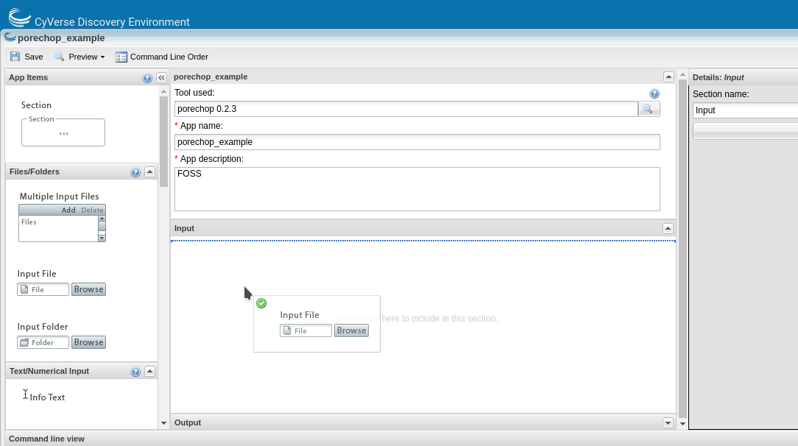

> \<a href=\"<https://atmo.cyverse.org>\"
> target=\"blank\"\>Atmosphere\</a\>

> \<a
> href=\"<https://wiki.cyverse.org/wiki/display/atmman/Atmosphere+Manual+Table+of+Contents>\"
> target=\"blank\"\>Atmosphere Manual\</a\>

> \<a
> href=\"<https://learning.cyverse.org/projects/atmosphere-guide/en/latest/>\"
> target=\"blank\"\>Atmosphere Guide\</a\>

> \<a href=\"<https://bisque.cyverse.org/client_service/>\"
> target=\"blank\"\>BisQue\</a\>

> \<a href=\"<https://wiki.cyverse.org/wiki/display/BIS>\"
> target=\"blank\"\>BisQue Manual\</a\>

> \<a href=\"<https://user.cyverse.org/>\" target=\"\_blank\"\>CyVerse
> User Portal\</a\>

> \<a href=\"<http://learning.cyverse.org>\" target=\"blank\"\>CyVerse
> Learning Center\</a\>

> \<a href=\"<https://wiki.cyverse.org>\" target=\"blank\"\>CyVerse
> Wiki\</a\>

> \<a href=\"<http://www.cyverse.org/data-store>\"
> target=\"\_blank\"\>Data Store\</a\>

> \<a
> href=\"<https://wiki.cyverse.org/wiki/display/DS/Data+Store+Table+of+Contents>\"
> target=\"blank\"\>Data Store Manual\</a\>

> \<a
> href=\"<https://learning.cyverse.org/projects/data_store_guide/en/latest/>\"
> target=\"blank\"\>Data Store Guide\</a\>

> \<a href=\"<https://de.cyverse.org/de/>\" target=\"blank\"\>Discovery
> Environment\</a\>

> \<a
> href=\"<https://wiki.cyverse.org/wiki/display/DEmanual/Table+of+Contents>\"
> target=\"blank\"\>DE Manual\</a\>

> \<a
> href=\"<http://learning.cyverse.org/projects/cyverse-discovery-environment-guide/>\"
> target=\"blank\"\>Discovery Environment Guide\</a\>

> \<a href=\"<https://dnasubway.cyverse.org/>\" target=\"blank\"\>DNA
> Subway\</a\>

> \<a
> href=\"<https://learning.cyverse.org/projects/dnasubway_guide/en/latest/>\"
> target=\"blank\"\>DNA Subway Manual\</a\>

> \<a
> href=\"<https://learning.cyverse.org/projects/dnasubway_guide/en/latest/>\"
> target=\"blank\"\>DNA Subway Guide\</a\>

> \<a href=\"<https://www.sciapps.org/>\"
> target=\"blank\"\>SciApps\</a\>

> \<a
> href=\"<https://learning.cyverse.org/projects/sciapps_guide/en/latest/>\"
> target=\"blank\"\>SciApps Manual\</a\>

> \<a
> href=\"<https://learning.cyverse.org/projects/sciapps_guide/en/latest/>\"
> target=\"blank\"\>SciApps Guide\</a\>

> \<a href=\"<https://cyverse-de.github.io/api/>\"
> target=\"blank\"\>Terrain DE API Docs\</a\>

> \<a href=\"<https://www.tacc.utexas.edu/tapis>\"
> target=\"blank\"\>Tapis TACC API\</a\>

> \<a href=\"<http://ask.iplantcollaborative.org/questions>\"
> target=\"blank\"\>Ask CyVerse\</a\>

> \<a href=\"<http://learning.cyverse.org/en/latest/>\"
> target=\"blank\"\>Agave Guide\</a\>

> \<a href=\"<http://developer.agaveapi.co/#introduction>\"
> target=\"blank\"\>Agave API\</a\>

> \<a href=\"<https://agaveapi.co>\" target=\"blank\"\>Agave Live
> Docs\</a\>

> \<a href=\"<http://learning.cyverse.org/en/latest/>\"
> target=\"blank\"\>BisQue Guide\</a\>

> \<a href=\"<http://datacommons.cyverse.org/>\" target=\"blank\"\>Data
> Commons\</a\>

\_

\_ [Learning Center Home](http://learning.cyverse.org/)

**Discovery Environment - Tools & Apps**
=====================================

-   **CyVerse tool:** Software program that is integrated into the back
    end of the DE for use in DE apps
-   
-   **CyVerse app:** graphic interface of a tool made available for use
    in the DE

The (containerized) tool must be integrated into the Cyverse DE first.
Then an app (interface) can be built for that tool.

# 

# **Building an App for Your Tool**

You can build an app for any tool that:

-   is private to you
-   is shared with you
-   is public

::: note
::: title
Note
:::

It is a good idea to check to see if the tool you want is already
integrated before you start. The tool my be there already and you can
build an app using it.
:::

In the \'Manage Tools\' window search for \'porechop\' in the search bar
at the top of the window. Select the porechop public tool and choose
\'Use in App\' from the \'Tools\' menu

{width="750px"}

This will open the \'Create App\' window. The tool to use will be
pre-populated. Choose an informative app name and description (eg. tool
name and version). Apps features can be added by dragging the feature
from the left pane into the center pane.

{width="750px"}

You can edit the details of an app feature by selecting it in the center
pane and editing in the right pane. Divide the app into sections
appropriate for that tool (input, options and output are usually
sufficient sections for simple apps).

{width="750px"}

For each option you add, you will need to specify what the option is,
the flag (if there is one) and whether that option is required. If an
option is not required be sure to check the \'exclude if nothing is
entered\' box. For tools that have positional agruments (no flags, eg.
-z) you can modify the order of the commands by clicking the \'command
line order\' at the top of the window.

{width="750px"}

As you add options to your app you will see in the bottom pane (command
line view) what the command would look like on the command line.

{width="750px"}

Although it is best to add all of the options for your tool, as it makes
the app the most useful, you can expose as many or as few options as you
like (as long as you add all the required options). Once you have
finished adding options click save and close your app.

Now test your app with appropriate data. Your app can now be found in
the \'My apps in development\' category of the \'Apps\' window (which
displays by default).

{width="750px"}

Once you know your app works correctly you can share or publish it as
you wish. Public apps must have example data located in an appropriately
named folder here:

``` bash
/iplant/home/shared/iplantcollaborative/example_data
```

All public apps also have a brief documentation page on the [CyVerse
Wiki](https://wiki.cyverse.org/wiki/display/DEapps/List+of+Applications)

To publish your app click on \'Share\' at the top of the \'Apps\' window
and select \'Make public\'. You will need to supply a:

-   Topic (eg. genomics)
-   Operation (eg. assembly)
-   location of the example data
-   brief description of inputs, required options and outputs
-   link to CyVerse Wiki documentation page
-   link to docmentation for the tool (provided by the developers)

------------------------------------------------------------------------

**Fix or improve this documentation:**

-   On Github:
-   Send feedback: [Tutorials@CyVerse.org](Tutorials@CyVerse.org)

\-\-\--.. Comment: Place URLS Below This Line

> \# Use this example to ensure that links open in new tabs, avoiding \#
> forcing users to leave the document, and making it easy to update
> links \# In a single place in this document
>
> > \<a href=\"REPLACE_THIS_WITH_URL\"
> > target=\"blank\"\>Replace_with_text\</a\>

> \<a
> href=\"<https://cyverse-de-tool-integration-quickstart.readthedocs-hosted.com/en/latest/index.html>\"
> target=\"blank\"\>Tool Integration into the DE\</a\>

> \<a
> href=\"<https://github.com/CyVerse-learning-materials/foss-2020/tree/master/CyVerse/tool_integration_app_building_DE.rst>\"
> target=\"blank\"\>Github Repo Link\</a\>
