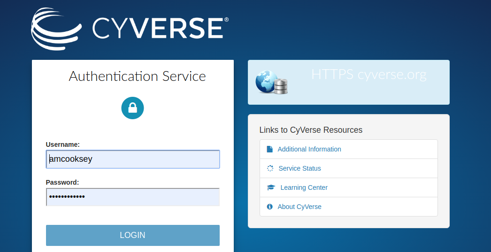
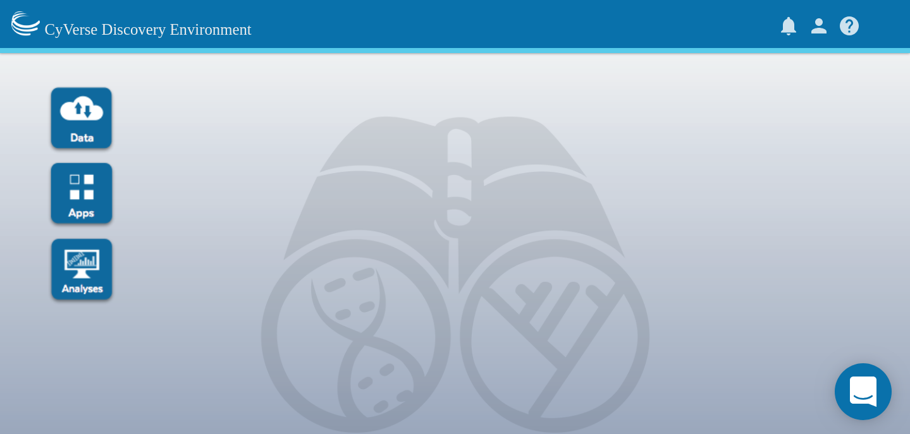
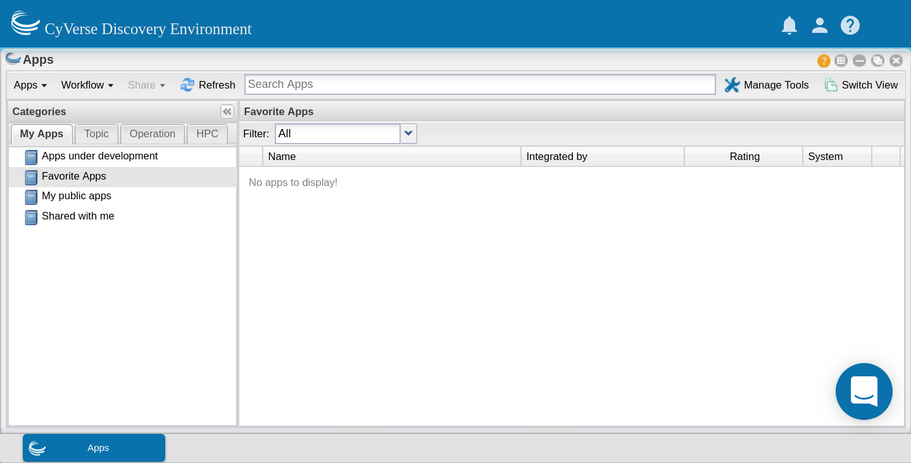
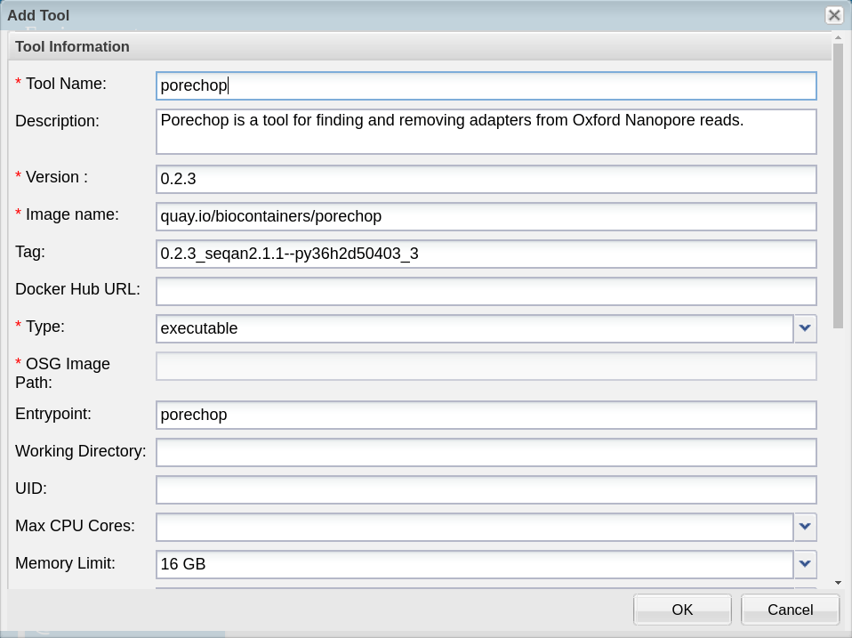
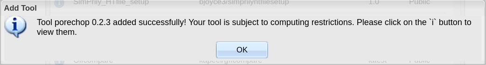
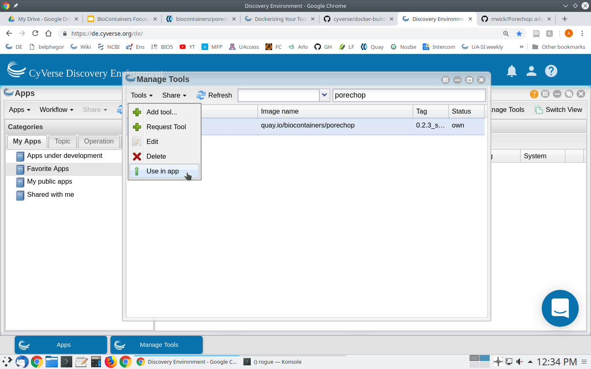
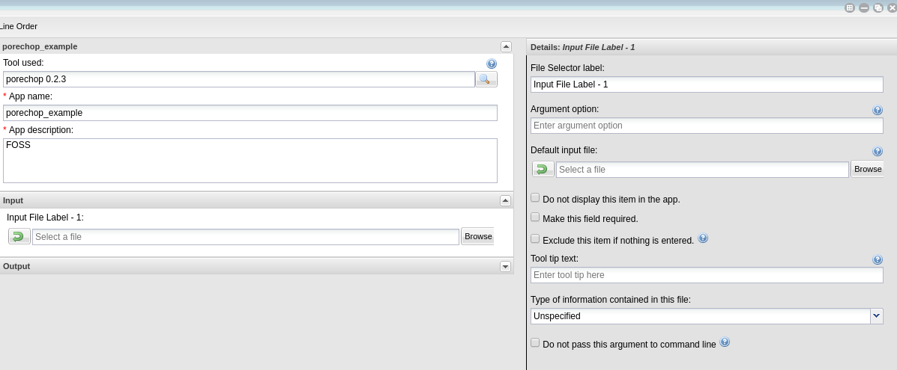

.. include:: ../cyverse_rst_defined_substitutions.txt

|CyVerse|_

|Home_Icon|_ `Learning Center Home <http://learning.cyverse.org/>`_

**Tool Integration into the DE**
=======================================================
The CyVerse Discovery Environment provides a graphic user interface for bioinformatics tools

**Glossary**
^^^^^^^^^^^^
- **Image:** self-contained, read-only ‘snapshot’ of your applications and packages, with all their dependencies
- **Container:** a running instance of your image
- **Image registry:** a storage and content delivery system, holding named images, available in different tagged versions
- **Docker:** a program that runs and handles life-cycle of containers and images
- **CyVerse tool:** Software program that is integrated into the back end of the DE for use in DE apps
- **CyVerse app:** graphic interface of a tool made available for use in the DE

**Tool Integration of a BioContainer**
^^^^^^^^^^^^^^^^^^^^^^^^^^^^^^^^^^^^^^
Log in to the `Discovery Environment <https://de.cyverse.org/de/>`_ (DE) using your CyVerse credentials

|DElogin|

Open the 'Apps' window

|Appswindowbutton|

Open the 'Manage Tools' window from within the 'Apps' window

|magagetoolsbutton|

Select 'Add Tool' from the 'Tools' menu

|addtool|

Fill in the form

|addtoolinfo|

- Give your tool an informative name (eg. tool name and version).
- Although description is not a required field adding a description is recommended. If you make your tool public other users can build apps with it as well. A description helps everyone to know what is available.
- Enter the name of your image as it was copied from the image registry. In this case the 'name' is the portion before the colon
- Enter the tag for your image as it was copied from the image registry. The tag is the portion after the colon
- Under tool type, selet 'executable', which should be selected by default. 

.. Important::

    Although it is not a required field, **you must enter an entrypoint when integrating a BioContainer**. BioContainers do NOT have entrypoints built in.

Click OK to complete the form. You should get a message that your tool has been integrated successfully.

|success|

**Building an App for Your Tool**
^^^^^^^^^^^^^^^^^^^^^^^^^^^^^^^^^

In the 'Manage Tools' window select 'Only my tools' from the dropdown box at the top of the window. Select the tool you just integrated and select 'Use in App' from the 'Tools' menu

|useinapp|

This will open the 'Create App' window. The tool to use will be pre-populated. Choose an informative app name and description (eg. tool name and version). Apps features can be added by dragging the feature from the left pane into the center pane. 

|draglefttocenter|

You can edit the details of an app feature by selecting it in the center pane and editing in the right pane. Divide the app into sections appropriate for that tool (input, options and output are usually sufficient sections for simple apps).

|adddetailright|

For each option you add, you will need to specify what the option is, the flag (if there is one) and whether that option is required. If an option is not required be sure to check the 'exclude if nothing is entered' box. For tools that have positional agruments (no flags, eg. -z) you can modify the order of the commands by clicking the 'command line order' at the top of the window.  

|commandlineorder|

As you add options to your app you will see in the bottom pane (command line view) what the command would look like on the command line.

|commandlineexp|

Although it is best to add all of the options for your tool, as it makes the app the most useful, you can expose as many or as few options as you like (as long as you add all the required options). Once you have finished adding options click save and close your app. 

Now test your app with appropriate data. Your app can now be found in the 'My apps in development' category of the 'Apps' window (which displays by default). 

|myappsdev|

Once you know your app works correctly you can share or publish it as you wish.
Public apps must have example data located in an appropriately named folder here:

.. code-block:: bash

    /iplant/home/shared/iplantcollaborative/example_data

All public apps also have a brief documentation page on the `CyVerse Wiki <https://wiki.cyverse.org/wiki/display/DEapps/List+of+Applications>`_

To publish your app click on 'Share' at the top of the 'Apps' window and select 'Make public'. You will need to supply a:

- Topic (eg. genomics) 
- Operation (eg. assembly) 
- location of the example data
- brief description of inputs, required options and outputs
- link to CyVerse Wiki documentation page
- link to docmentation for the tool (provided by the developers)

----

**Fix or improve this documentation:**

- On Github: |Github Repo Link|
- Send feedback: `Tutorials@CyVerse.org <Tutorials@CyVerse.org>`_

----
.. Comment: Place URLS Below This Line

   # Use this example to ensure that links open in new tabs, avoiding
   # forcing users to leave the document, and making it easy to update links
   # In a single place in this document

   .. |Substitution| raw:: html # Place this anywhere in the text you want a hyperlink

      <a href="REPLACE_THIS_WITH_URL" target="blank">Replace_with_text</a>

.. |Github Repo Link|  raw:: html

   <a href="https://github.com/CyVerse-learning-materials/foss-2019/tree/master/CyVerse/tool_integration_app_building_DE.rst" target="blank">Github Repo Link</a>

.. |addtool| image:: ../img/toolintegration3.png
  :width: 750

.. |draglefttocenter|  image:: ../img/toolintegration14.png
  :width: 750

.. |commandlineorder| image:: ../img/toolintegration17.png
  :width: 750

.. |commandlineexp|  image:: ../img/toolintegration18.png
  :width: 750

.. |Home_Icon| image:: ../img/homeicon.png
    :width: 25
.. _Home_Icon: http://learning.cyverse.org/    
