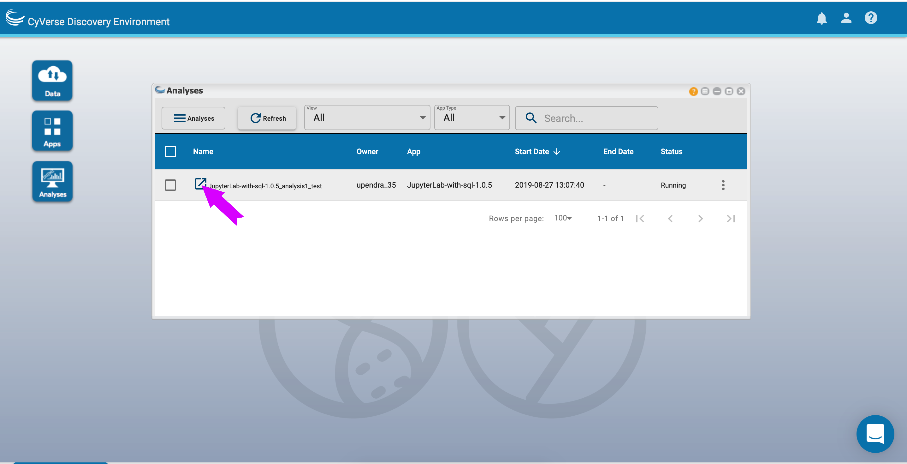

> \<a href=\"<https://atmo.cyverse.org>\"
> target=\"blank\"\>Atmosphere\</a\>

> \<a
> href=\"<https://wiki.cyverse.org/wiki/display/atmman/Atmosphere+Manual+Table+of+Contents>\"
> target=\"blank\"\>Atmosphere Manual\</a\>

> \<a
> href=\"<https://learning.cyverse.org/projects/atmosphere-guide/en/latest/>\"
> target=\"blank\"\>Atmosphere Guide\</a\>

> \<a href=\"<https://bisque.cyverse.org/client_service/>\"
> target=\"blank\"\>BisQue\</a\>

> \<a href=\"<https://wiki.cyverse.org/wiki/display/BIS>\"
> target=\"blank\"\>BisQue Manual\</a\>

> \<a href=\"<https://user.cyverse.org/>\" target=\"\_blank\"\>CyVerse
> User Portal\</a\>

> \<a href=\"<http://learning.cyverse.org>\" target=\"blank\"\>CyVerse
> Learning Center\</a\>

> \<a href=\"<https://wiki.cyverse.org>\" target=\"blank\"\>CyVerse
> Wiki\</a\>

> \<a href=\"<http://www.cyverse.org/data-store>\"
> target=\"\_blank\"\>Data Store\</a\>

> \<a
> href=\"<https://wiki.cyverse.org/wiki/display/DS/Data+Store+Table+of+Contents>\"
> target=\"blank\"\>Data Store Manual\</a\>

> \<a
> href=\"<https://learning.cyverse.org/projects/data_store_guide/en/latest/>\"
> target=\"blank\"\>Data Store Guide\</a\>

> \<a href=\"<https://de.cyverse.org/de/>\" target=\"blank\"\>Discovery
> Environment\</a\>

> \<a
> href=\"<https://wiki.cyverse.org/wiki/display/DEmanual/Table+of+Contents>\"
> target=\"blank\"\>DE Manual\</a\>

> \<a
> href=\"<http://learning.cyverse.org/projects/cyverse-discovery-environment-guide/>\"
> target=\"blank\"\>Discovery Environment Guide\</a\>

> \<a href=\"<https://dnasubway.cyverse.org/>\" target=\"blank\"\>DNA
> Subway\</a\>

> \<a
> href=\"<https://learning.cyverse.org/projects/dnasubway_guide/en/latest/>\"
> target=\"blank\"\>DNA Subway Manual\</a\>

> \<a
> href=\"<https://learning.cyverse.org/projects/dnasubway_guide/en/latest/>\"
> target=\"blank\"\>DNA Subway Guide\</a\>

> \<a href=\"<https://www.sciapps.org/>\"
> target=\"blank\"\>SciApps\</a\>

> \<a
> href=\"<https://learning.cyverse.org/projects/sciapps_guide/en/latest/>\"
> target=\"blank\"\>SciApps Manual\</a\>

> \<a
> href=\"<https://learning.cyverse.org/projects/sciapps_guide/en/latest/>\"
> target=\"blank\"\>SciApps Guide\</a\>

> \<a href=\"<https://cyverse-de.github.io/api/>\"
> target=\"blank\"\>Terrain DE API Docs\</a\>

> \<a href=\"<https://www.tacc.utexas.edu/tapis>\"
> target=\"blank\"\>Tapis TACC API\</a\>

> \<a href=\"<http://ask.iplantcollaborative.org/questions>\"
> target=\"blank\"\>Ask CyVerse\</a\>

> \<a href=\"<http://learning.cyverse.org/en/latest/>\"
> target=\"blank\"\>Agave Guide\</a\>

> \<a href=\"<http://developer.agaveapi.co/#introduction>\"
> target=\"blank\"\>Agave API\</a\>

> \<a href=\"<https://agaveapi.co>\" target=\"blank\"\>Agave Live
> Docs\</a\>

> \<a href=\"<http://learning.cyverse.org/en/latest/>\"
> target=\"blank\"\>BisQue Guide\</a\>

> \<a href=\"<http://datacommons.cyverse.org/>\" target=\"blank\"\>Data
> Commons\</a\>

\_

\_ [Learning Center Home](http://learning.cyverse.org/)

**Discovery Environment - VICE** ========

CyVerse data science workbench, the [Discovery
Environment](https://de.cyverse.org/de/), includes a feature called
[VICE (Visual Interactive Computing
Environment)](https://learning.cyverse.org/projects/vice/en/latest/)

VICE uses Docker containers to launch interactive programs, like
RStudio, R Shiny Apps, Project Jupyter, Data Mining, and WebGL
Applications that can be run in a browser. These programs allow users to
interact with their data and do analyses in one place (i.e. view outputs
in the same window code is executed). Researchers using VICE can explore
their datasets interactively in the Discovery Environment while using
the Data Store.

While VICE does require some coding knowledge, it is for anyone who
wants to interact with data in an iteritative way.

**Visual Interactive Computing Environment**

-   You can launch existing VICE images from the DE, or integrate your
    own using the Manage Tools.
-   VICE apps are containers, and your data are in the container until
    you move them off of it. Your results will be saved when the app
    terminates in your `/username/analyses` directory, unless you
    specify that the app results be saved elsewhere.

------------------------------------------------------------------------

# **Create a VICE app**

**1. Find the Docker image of your interactive tool/software of your
interest**

We will integrate RStudio as a VICE app in DE. There is a Docker image
available for RStudio on Dockerhub.

::: note
::: title
Note
:::

If there is no Docker image available for your tool of interest, then
you would either find a Dockerfile which you can use to build the Docker
image for your tool of interest or create one. You can get more help
with either of that from
[here](https://learning.cyverse.org/projects/container_camp_workshop_2019/en/latest)
:::

**2. Test the Docker image locally on your computer (Optional but
recommended)**

This is optional but highly recommended step to confirm that the Docker
image for your tool of interest is working as expected.

**2.1 Pull the image from Dockerhub**

``` bash
$ docker pull cyversevice/rstudio-verse:3.6.0
```

You could also use [Play with
Docker](https://labs.play-with-docker.com/), which is a free resource to
test and run the Docker container.

**2.2 Sample run**

``` bash
$ sudo docker run --rm -v /$HOME:/app --workdir /app -p 8787:80 -e REDIRECT_URL=YOUR_IP_ADDRESS:8787 cyversevice/rstudio-verse:3.6.0
```

In your browser address bar, type YOUR_IP_ADDRESS:8787 to access RStudio

::: note
::: title
Note
:::

The username and password for Rstudio is `rstudio` and `rstudio1`
respectively
:::

Once you can open the Rstudio, then you are ready to integrate the tool
in DE

**3. Add tool in CyVerse Discovery Environment**

**3.1 Log-in to CyVerse Discovery Environment and click on the \"Apps\"
window**

**3.2 Click \"Manage Tools\" -\> \"Tools\" -\> \"Add Tool\" and fill the
details for your Docker image**

Fill out the following details

``` bash
Tool-Name: FOSS-Rstudio
Description: RStudio VICE app
Version: 3.6.0
Type: interactive
Image Name: cyversevice/rstudio-verse
Docker Hub URL: https://hub.docker.com/repository/docker/cyversevice/rstudio-verse
Tag: 3.6.0
Working Directory: /home/rstudio
Port Number: 80
```

{width="750px"}

**3.3 Create a VICE app**

Click on the \"Apps\" window. Click \"Apps\" -\> \"Create New\"

{width="750px"}

::: note
::: title
Note
:::

For VICE apps, make sure to check \"Do not pass this argument to command
line\"

Example data:
/iplant/home/shared/iplantcollaborative/example_data/FOSS_2020/vice_exampledata
:::

# **Version control using Git within RStudio**

Step1: Make a new repo on GitHub

-   Create a New repository on GitHub. Click the green \"New\" button to
    create a new repo. Enter the name of the repo and check initialize
    this repo with a README file. Click \"Create Repository\" button.

{width="250px"}

Step2: Clone the new GitHub repo

-   From Github, copy the repo URL via the green \"Clone or Download\"
    button.
-   In RStudio, start a new project. File \> New Project \> Version
    Control \> Git. Paste the GitHub URL in the \"repository URL\".
-   Enter the name of the \"project directory\" which should be same as
    the name of your GitHub repo.
-   Click \"Create Project\".

Step3: Push your changes to GitHub

-   Make some changes (to README file or add a new code)

-   Click on Git (Check Git tab on upper right corner of your RStudio
    window)

-   Check the files that you want to commit. Click commit and enter a
    commit message on the next window.

-   After you commit, it will promot you to set your account\'s default
    identity. Go to terminal and configure your git user name and email
    using the following commands. You should be able to commit without
    any problems after you confgure.

    > -   git config \--global user.email \"<you@example.com>\"
    > -   git config \--global user.name \"Your Name\"

-   To push the changes to the remote GitHub repository press the Push
    button on the upper right corner of the commit window. You will be
    prompted to enter the username and password of your GitHub account.

{width="250px"}

# **Sharing VICE apps with collaborators**

You can share your VICE workspace with colleagues (with a CyVerse
account) who can see and edit your notebooks, logs, and outputs.

-   To share your workspace

{width="750px"}

-   Opening workspaces shared with you

{width="750px"}

{width="750px"}

# **Specific instructions for launching VICE applications**

\-[Jupyter
lab](https://learning.cyverse.org/projects/vice/en/latest/user_guide/quick-jupyter.html)

\-[Rstudio](https://learning.cyverse.org/projects/vice/en/latest/user_guide/quick-rstudio.html)

\-[Rshiny](https://learning.cyverse.org/projects/vice/en/latest/user_guide/quick-rshiny.html)

[List of Discovery Environment VICE
apps](https://learning.cyverse.org/projects/vice/en/latest/vice_apps/examples.html)

------------------------------------------------------------------------

------------------------------------------------------------------------

**Fix or improve this documentation:**

-   On Github:
-   Send feedback: [Tutorials@CyVerse.org](Tutorials@CyVerse.org)

------------------------------------------------------------------------

> \# Use this example to ensure that links open in new tabs, avoiding \#
> forcing users to leave the document, and making it easy to update
> links \# In a single place in this document
>
> > \<a href=\"REPLACE_THIS_WITH_URL\"
> > target=\"blank\"\>Replace_with_text\</a\>

> \<a
> href=\"<https://github.com/CyVerse-learning-materials/foss-2020/tree/master/CyVerse/vice.rst>\"
> target=\"blank\"\>Github Repo Link\</a\>
