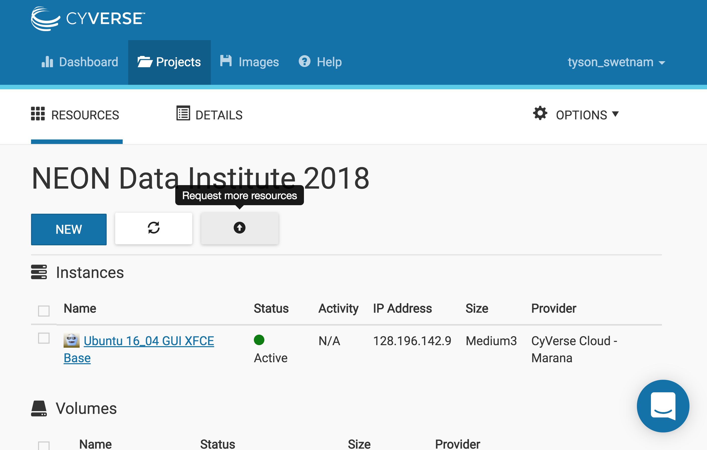
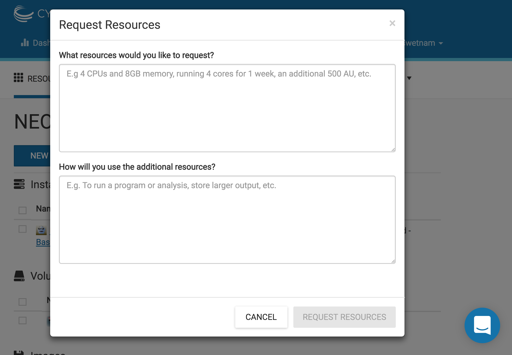

> \<a href=\"<https://atmo.cyverse.org>\"
> target=\"blank\"\>Atmosphere\</a\>

> \<a
> href=\"<https://wiki.cyverse.org/wiki/display/atmman/Atmosphere+Manual+Table+of+Contents>\"
> target=\"blank\"\>Atmosphere Manual\</a\>

> \<a
> href=\"<https://learning.cyverse.org/projects/atmosphere-guide/en/latest/>\"
> target=\"blank\"\>Atmosphere Guide\</a\>

> \<a href=\"<https://bisque.cyverse.org/client_service/>\"
> target=\"blank\"\>BisQue\</a\>

> \<a href=\"<https://wiki.cyverse.org/wiki/display/BIS>\"
> target=\"blank\"\>BisQue Manual\</a\>

> \<a href=\"<https://user.cyverse.org/>\" target=\"\_blank\"\>CyVerse
> User Portal\</a\>

> \<a href=\"<http://learning.cyverse.org>\" target=\"blank\"\>CyVerse
> Learning Center\</a\>

> \<a href=\"<https://wiki.cyverse.org>\" target=\"blank\"\>CyVerse
> Wiki\</a\>

> \<a href=\"<http://www.cyverse.org/data-store>\"
> target=\"\_blank\"\>Data Store\</a\>

> \<a
> href=\"<https://wiki.cyverse.org/wiki/display/DS/Data+Store+Table+of+Contents>\"
> target=\"blank\"\>Data Store Manual\</a\>

> \<a
> href=\"<https://learning.cyverse.org/projects/data_store_guide/en/latest/>\"
> target=\"blank\"\>Data Store Guide\</a\>

> \<a href=\"<https://de.cyverse.org/de/>\" target=\"blank\"\>Discovery
> Environment\</a\>

> \<a
> href=\"<https://wiki.cyverse.org/wiki/display/DEmanual/Table+of+Contents>\"
> target=\"blank\"\>DE Manual\</a\>

> \<a
> href=\"<http://learning.cyverse.org/projects/cyverse-discovery-environment-guide/>\"
> target=\"blank\"\>Discovery Environment Guide\</a\>

> \<a href=\"<https://dnasubway.cyverse.org/>\" target=\"blank\"\>DNA
> Subway\</a\>

> \<a
> href=\"<https://learning.cyverse.org/projects/dnasubway_guide/en/latest/>\"
> target=\"blank\"\>DNA Subway Manual\</a\>

> \<a
> href=\"<https://learning.cyverse.org/projects/dnasubway_guide/en/latest/>\"
> target=\"blank\"\>DNA Subway Guide\</a\>

> \<a href=\"<https://www.sciapps.org/>\"
> target=\"blank\"\>SciApps\</a\>

> \<a
> href=\"<https://learning.cyverse.org/projects/sciapps_guide/en/latest/>\"
> target=\"blank\"\>SciApps Manual\</a\>

> \<a
> href=\"<https://learning.cyverse.org/projects/sciapps_guide/en/latest/>\"
> target=\"blank\"\>SciApps Guide\</a\>

> \<a href=\"<https://cyverse-de.github.io/api/>\"
> target=\"blank\"\>Terrain DE API Docs\</a\>

> \<a href=\"<https://www.tacc.utexas.edu/tapis>\"
> target=\"blank\"\>Tapis TACC API\</a\>

> \<a href=\"<http://ask.iplantcollaborative.org/questions>\"
> target=\"blank\"\>Ask CyVerse\</a\>

> \<a href=\"<http://learning.cyverse.org/en/latest/>\"
> target=\"blank\"\>Agave Guide\</a\>

> \<a href=\"<http://developer.agaveapi.co/#introduction>\"
> target=\"blank\"\>Agave API\</a\>

> \<a href=\"<https://agaveapi.co>\" target=\"blank\"\>Agave Live
> Docs\</a\>

> \<a href=\"<http://learning.cyverse.org/en/latest/>\"
> target=\"blank\"\>BisQue Guide\</a\>

> \<a href=\"<http://datacommons.cyverse.org/>\" target=\"blank\"\>Data
> Commons\</a\>

{width="500px"}\_

\_ [Learning Center Home](http://learning.cyverse.org/)

# **Atmosphere**

CyVerse operates a cloud service called
[Atmosphere](http://www.cyverse.org/atmosphere). Users can request up to
5,000 allocation units \[units are hours (hr)\] per month. E.g. a 1-core
instance uses 1 AU/hr, a 4-core instance uses 4 AU/hr, and a 16-core
instance uses 16 AU/hr. Allocations are automatically reset to 128 AU on
the 1st of each month.

*Some things to remember about the platform*

-   Allocation Units can be requested each month, but expire at the end
    of the month. Users can request more AU by clicking the Request More
    Resources button in the Atmosphere UI. You can also get help by
    asking questions in the Intercom (blue button in the lower right of
    the CyVerse website pages).
-   Don\'t leave VMs running that aren\'t being used (be a good data
    science neighbor and free resources for others).

**Virtual Machines on Atmosphere or Jetstream** \-\-\-\-\-\-\-\-\-\-\--

## *Provision VM*

{width="750px"}

{width="750px"}

------------------------------------------------------------------------

## *Login*

Log into [CyVerse Atmosphere](http://atmo.cyverse.org/)

[Atmosphere Manual](https://cyverse.github.io/atmosphere-guides/)

Alternately, log into [XSEDE
Jetstream](https://use.jetstream-cloud.org/application)

Fill in your `username` and `password` and click \"LOGIN\"

## *Create a Project*

This is something you only need to do once.

-   Click on the \"Projects\" tab on the top and then click \"CREATE NEW
    PROJECT\"
-   Enter a name, e.g. \"FOSS2019\" into the Project Name field.
-   the Description can be something complex and long (like an extended
    abstract, or tutorial), or something short like \"CyVerse FOSS
    2019\".
-   Select the newly created project

## *Start a new Instance*

From your Project folder, you can select \"New\" and \"Instance\"

1.  Suggest you select a featured image with a Graphic User Interface
    (GUI).

**Suggested Atmosphere Image(s):**

**Atmosphere Image(s):**

Here are the tested Ubuntu images.

**Warning:** The latest version of Ubuntu (18.04) may not have current
packages for some software.

  Image Name             Version   Description                  Link
  ---------------------- --------- ---------------------------- -----------------------------------------------------------
  Ubuntu 18.04 GUI       1.0       Ubuntu 18.04 GUI XFCE Base   [Image](https://atmo.cyverse.org/application/images/1556)
  Ubuntu 18.04 non-GUI   1.0       Ubuntu 18.04 non-GUI Base    [Image](https://atmo.cyverse.org/application/images/1552)

-   Find the \"Ubuntu 18.04\" image, click on it
-   Give it a short name that is distinct \"my_first_vm\"
-   Select \'tiny1 (CPU: 1, Mem: 4GB, Disk: 30GB)\'. Because this is
    your first attempt at provisioning a virtual machine it doesn\'t
    need to be a workhorse (yet).
-   Leave rest of the fields as default.
-   Wait for it to become active
-   Be Patient (but not too patient - if it takes \>10 minutes the
    system may be at capacity, if you\'re trying to launch a large or
    extra large VM, try something smaller).
-   You can click on your new instance to get more information.

## *Accessing the Shell*

Once the instance is [active]{.title-ref}, you can access it via `ssh`
or by using the Web Shell provided by Atmosphere.

\- Click \"Open Web Shell\", *or*, if you know how to use ssh, you can
ssh in with your CyVerse username on the IP address of the machine

``` bash
ssh CyVerseUserName@<INSTANCE-IP-ADDRESS>
```

You should see something like this

> Welcome to Ubuntu 18.04.2 LTS (GNU/Linux 4.4.0-81-generic x86_64)
>
> > Get cloud support with Ubuntu Advantage Cloud Guest:
> >
> > :   <http://www.ubuntu.com/business/services/cloud>
>
> 155 packages can be updated. 0 updates are security updates.
>
> **\* System restart required**\* Welcome to \_ \_ \_ / \| \'\_ [
> \_]{.title-ref} / \_ / \_\_\| \'\_ \| \'\_ / \_ \'\_\_/ \_ / \_\_\_ \|
> \| \| \| \| (\_) \_\_ \| \| \| \_\_/ \| \| \_\_/ /\_/ \_\_\_
> \_\_\_/\_\| \_\_\_ \_\_\_\|
>
> <cyverse_username@vm142-39>:\~\$

Note, this instance is running an older version of Ubuntu 18.

A good practice before installing any new software is to run:

> sudo apt-get update && sudo apt-get upgrade

After the new updates are installed you can reboot the machine from
terminal or from the Atmosphere UI

> sudo reboot

If you\'re using the Web Shell, the instance will exit. Wait a few
minutes for the instance to reboot and refresh the screen.

::: note
::: title
Note
:::

To access the Clipboard in an Apache Guacamole Web Shell:

-   Open Clipboard and virtual keyboard
    -   On a standard keyboard: [ctrl]{.title-ref} + [alt]{.title-ref} +
        [shift]{.title-ref} key
    -   On a MAC OS X keyboard: [control]{.title-ref} + [command
        ⌘]{.title-ref} + [shift]{.title-ref} key
-   Select your text or paste text into the clipboard window.
-   Close the Clipboard window by selecting [control]{.title-ref} +
    [command ⌘]{.title-ref} + [shift]{.title-ref} keys again
-   Right click with your mouse or double tap fingers on touchpad to
    paste in the web shell or Desktop
:::

**Suspending an instance**

-   When you\'re done using an instance it is wise to \'Suspend\' the
    instance in the Actions.
-   This will kill any process that is still running.
-   Your data and all of your programs will be fine. It is however wise
    to move your data back onto your DataStore or back it up somewhere
    else so it will be available.
-   Suspending the instance will leave it ready for reuse when you want
    to \"resume\" working on it.
-   You will not be charged any AU while the instance is suspended.

**Deleting your instance**

-   To completely remove your instance, you can select the \"delete\"
    buttom from the instance details page.
-   This will open up a dialogue window. Select the \"Yes, delete this
    instance\" button.
-   It may take Atmosphere a few minutes to process your request. The
    instance should disappear from the project when it has been
    successfully deleted.

**Imaging an instance**

The use of Docker and Singularity take a lot of the problems out of
building unique software stacks on cloud - but sometimes these cannot be
avoided.

-   Have you created a unique software stack that you need to launch on
    a larger number of future instances?
-   Does it take a long time to compile your software stack each time
    you launch a new instance?
-   Only create images from the smallest possible versions of your
    instance. A larger imaged instance cannot be run on a smaller
    instance.

To request that your instance be imaged click the \"Image\" button from
Actions.

::: note
::: title
Note
:::

It is advisable to delete the machine if you are not planning to use it
in future to save valuable resources. However if you want to use it in
future, you can suspend it.

If you want to keep the instance for a future project, you can also
\"shelve\" the instance. It will take a longer period of time to resume
a shelved instance.
:::

## *EZ Installation of Project Jupyter*

We install Project Jupyter (Notebooks and Lab) using the [Anaconda
distribution](https://www.anaconda.com/). Within the Anaconda
distribution is the `conda` package manager which can be used to both
build and install software.

Anaconda is different than a basic Python installation. It serves as
both a package manager and an environment. While this has many benefits,
it also adds some complexity to running your Python environments. Still
confused? Read about the [myths and misconceptions of
Anaconda](http://jakevdp.github.io/blog/2016/08/25/conda-myths-and-misconceptions/).

For more details about installing software on Atmosphere visit the
CyVerse [Data Science Quickstart
Tutorial](https://cyverse-ez-quickstart.readthedocs-hosted.com/en/latest/)
or the [Jetstream EZ
Tutorial](https://iujetstream.atlassian.net/wiki/spaces/JWT/pages/348586006/Jetstream+Atmosphere+EZ+tools).
There are instructions for `ez` installation of Docker, Singularity, and
Anaconda.

If you\'re on an instance which already has Anaconda installed, you\'ll
still need to re-run `ez` to restart the Anaconda virtual environment.

1.  Install Anaconda with Python3 (`ez` comes preloaded on featured
    instances on Atmosphere and Jetstream) by typing:

    > > ezj

2.  Once the installation completes, you\'re done! A Jupyter Notebook
    should now be running on the VM.

{width="750px"}

3.  Click the link showing the notebook URL (notice this is not the
    localhost:8888).

::: note
::: title
Note
:::

To install your own packages you\'ll need to change ownership of the
Anaconda installation:

> > sudo chown \$(id -u):\$(id -g) /opt/anaconda3 -R

**Down version Python 3.6 to 3.5**

To use GDAL you may need to reverse version Python to an earlier version

[Kernel installation
instructions](https://ipython.readthedocs.io/en/stable/install/kernel_install.html/)

> > python -m pip install ipykernel
>
> > conda create -n ipykernel_py35 python=3.5 ipykernel source activate
> > ipykernel_py35 \# On Windows, remove the word \'source\' python -m
> > ipykernel install \--user

[List of Jupyter
Kernels](https://github.com/jupyter/jupyter/wiki/Jupyter-kernels/)

**R**

> > conda install -c r irkernel

**JavaScript**

> > sudo apt-get install nodejs-legacy npm ipython ipython-notebook sudo
> > npm install -g ijavascript ijsinstall

**Ruby**

> Add Jupyter PPA
>
> > sudo add-apt-repository ppa:chronitis/jupyter -y sudo apt-get update
> > sudo apt-get install -y iruby

**Python2 Kernel**

> > conda create -n ipykernel_py2 python=2 ipykernel source activate
> > ipykernel_py2 python -m ipykernel install \--user source deactivate
> > ipykernel_py2 conda activate base \# switch back to base Python3
> > environment

**Julia Kernel**

> First, install [Julia](https://julialang.org/downloads/), here we are
> installing v0.6.
>
> Once Julia as been installed, run `julia` from the prompt.
>
> > wget
> > <https://julialang-s3.julialang.org/bin/linux/x64/0.6/julia-0.6.3-linux-x86_64.tar.gz>
> > tar xvzf julia-0.6.3-linux-x86_64.tar.gz sudo mv julia-d55cadc350/
> > /opt/julia rm -rf julia-0.6.3-linux-x86_64.tar.gz sudo ln -s
> > /opt/julia/bin/julia /usr/local/bin/julia julia
>
> Now, from Julia prompt install the iJulia Kernel.
>
> > Pkg.add(\"IJulia\") ENV\[\"JUPYTER\"\] =
> > \"/opt/anaconda3/bin/jupyter\" Pkg.add(\"Feather\")
> > Pkg.add(\"DataFrames\") Pkg.add(\"NamedArrays\")

**Bash Kernel**

> > pip install bash_kernel python -m bash_kernel.install

**Geospatial dependencies**

> > conda install -c conda-forge gdal
>
> > sudo add-apt-repository -y ppa:ubuntugis/ubuntugis-unstable sudo apt
> > update sudo apt install gdal-bin python-gdal python3-gdal
> > libgdal1-dev

**Script of Scripts**

> [Official
> documentation](https://vatlab.github.io/sos-docs/#runningsos)
>
> > pip install sos pip install sos-notebook python -m
> > sos_notebook.install
:::

## *Installing RStudio-Server*

RStudio can be installed in several ways.

First, you can follow the RStudio-Server [instructions for
Linux](https://www.rstudio.com/products/rstudio/download-server/)

Second, you can use Docker (following the same `ez`
[documentation](https://cyverse-ez-quickstart.readthedocs-hosted.com/en/latest/index.html)
as for Anaconda). We suggest using containers from Docker Hub
[Rocker](https://hub.docker.com/r/rocker/geospatial/) on the instance.

> > ezd sudo usermod -aG docker \$USER exit docker pull
> > rocker/geospatial docker run -d -p 8787:8787 rocker/geospatial

Third, you can use
[Anaconda](https://cyverse-ez-quickstart.readthedocs-hosted.com/en/latest/rstudio.html)

Here we use `ezj` to install both Anaconda (Jupyter) and R

> > ezj -R

This will trigger the Ansible playbook to install `r-base`,
`r-essentials`, and a few other commonly used R Data Science packages.

After `ezj -R` has finished, you can install RStudio-Server

Install these misc. dependencies

> > export PATH=\"/opt/anaconda3/bin\":\$PATH sudo chown \$(id -u):\$(id
> > -g) /opt/anaconda3/ -R conda update conda conda install gxx_linux-64
> > conda install gcc_linux-64

Set Path and install `gdebi`

> > sudo apt-get install gdebi-core

Install RStudio-Server with `gdebi`:

> > echo \"export RSTUDIO_WHICH_R=\'/opt/anaconda3/bin/R\'\" \>\>
> > \~/.bash_profile wget
> > <https://download2.rstudio.org/rstudio-server-1.1.447-amd64.deb>
> > sudo gdebi \--non-interactive rstudio-server-1.1.447-amd64.deb

The installation of RStudio-Server is going to fail because we haven\'t
told it which R to use. Because we are using Anaconda\'s installation of
R, and not the basic installation of R, we have to reassign RStudio to
look for Anaconda

> > sudo sh -c \'echo \"rsession-which-r=/opt/anaconda3/bin/R\" \>\>
> > /etc/rstudio/rserver.conf\' \# export
> > RSTUDIO_WHICH_R=\'/opt/anaconda/lib/R/bin/R\' \# sudo sh -c \'echo
> > \"launchctl setenv RSTUDIO_WHICH_R \$RSTUDIO_WHICH_R\" \>\>
> > \~/.bash_profile\'

Restart the server

> > sudo rstudio-server start

4.  You can launch Jupyter Lab by exiting the notebook and typing
    [jupyter lab]{.title-ref} - but this will allow Lab to only be
    available on the localhost, with no way to connect from a remote
    terminal. Exit the notebook by pressing [ctrl + c]{.title-ref}
    twice, and then start a [Jupyter
    Lab](https://github.com/jupyterlab/jupyterlab).

**Hands On** \-\-\-\-\-\--

[Sateesh\'s Atmosphere
Exercises](https://snakemake2019.readthedocs.io/en/latest/Atmosphere_Cloud.html)

::: note
::: title
Note
:::

To ensure your session doesn\'t die when you close your terminal use
[tmux]{.title-ref} or [screen]{.title-ref} to start your remote sessions
and to detach the screen before exiting.

-   detach screen: [ctrl + b]{.title-ref} then [d]{.title-ref}
-   list tmux sessions: `tmux ls`
-   re-attach screen: `tmux attach -t <session id #>`
:::

## *Establishing a Secure Connection*

1.  On the VM start the Lab in terminal (don\'t forget to use
    [tmux]{.title-ref})

    > > jupyter lab \--no-browser \--ip=\* \--port=8888

**Option 1: SSH tunnel**

You must have the ability to use `ssh` on your localhost to use this
method.

1.  Start Jupyter

    > > jupyter lab \--no-browser \--ip=127.0.0.1 \--port=8888

2.  Open a new terminal on your localhost.

    > > ssh -nNT -L 8888:localhost:8888 CyVerseUserName@\<IPADDRESS\>
    >
    > Enter your password when prompted.
    >
    > The terminal should stop responding after this.

3.  In your browser, open a new tab and go to `http://localhost:8888`

**Option 2: Caddy**

You can use this method with `tmux` in the Web Shell

1.  Follow the same step #1 above

2.  In the terminal start a new `tmux` session. Then copy/paste the
    following:

    > > echo \"\$(hostname) proxy / 127.0.0.1:8888 { websocket
    > > transparent } \" \> Caddyfile curl <https://getcaddy.com> \|
    > > bash -s personal http.nobots caddy
    >
    > The [Caddyserver](https://caddyserver.com/) will output a secure
    > URL [https://]{.title-ref} for the Atmosphere VM which you can
    > then connect in a new browser tab.

3.  Copy / Paste the URL `https://vm142-xx.cyverse.org` into a new
    browser tab.

**Description of output and results**

Congratulations - you\'ve got a Virtual Machine ready to do some serious
data science!

{width="25px"}\_ [Learning Center
Home](http://learning.cyverse.org/)

------------------------------------------------------------------------

**Fix or improve this documentation:**

-   On Github:
-   Send feedback: [Tutorials@CyVerse.org](Tutorials@CyVerse.org)

------------------------------------------------------------------------

> \<a
> href=\"<https://github.com/CyVerse-learning-materials/foss-2020/tree/master/cloud_comput/atmo.rst>\"
> target=\"blank\"\>Github Repo Link\</a\>
