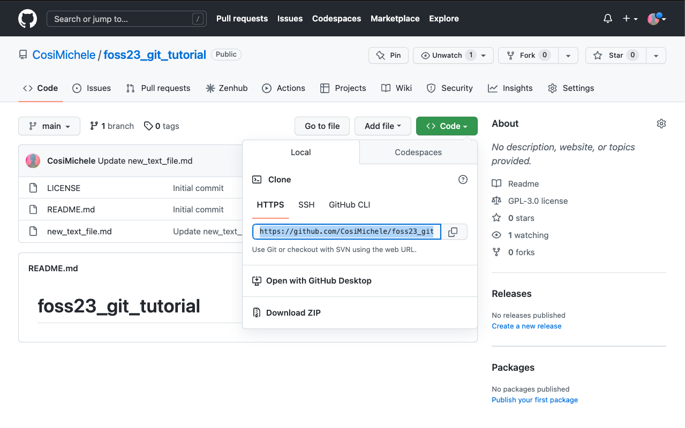
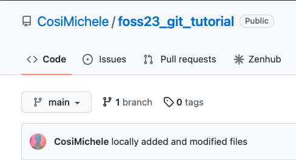
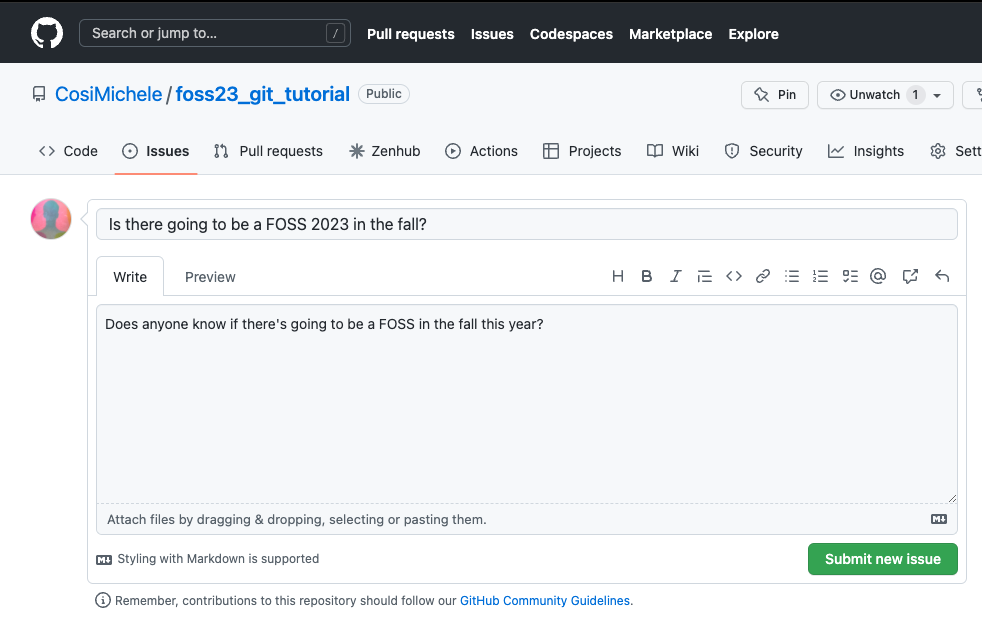
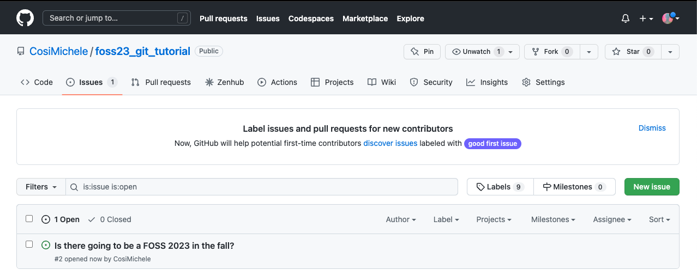
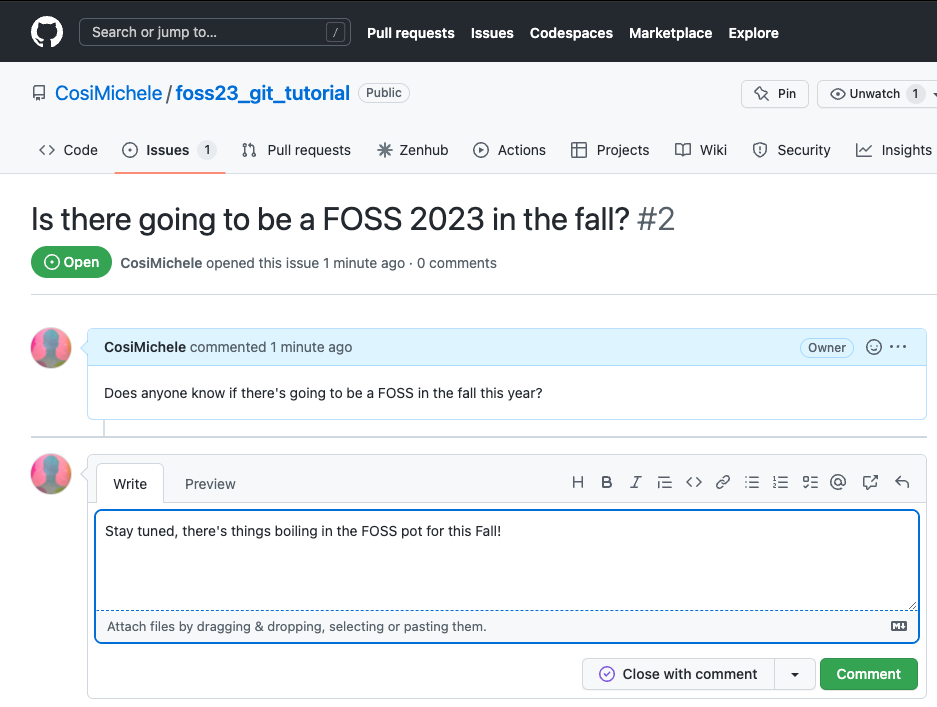

# The Unix Shell, Git and Github: an Introduction

### Requirements

Command Line Interfaces (CLI) are found throughout all Operating Systems, however we recommend the use of the Unix CLI. If you have a Unix based machine such as Linux/Ubuntu (or other Linux distributions), macOS, you are ready for the next step. If you use a Windows machine, please install the [Windows Subsistem for Linux (WSL)](https://docs.microsoft.com/en-us/windows/wsl/install) as seen in the [Before FOSS Starts](installation.md#Software) section.

---

## The Unix Shell

The computer is a tool. It evolved over the years from being an intricated calculator into an interactive machine with thousands of moving parts that keep us all connected through the Internet. It is now the norm to use a mouse, keyboard, and seeing flashing images on our screens through the Graphical User Interface (GUI). GUIs are central to the way we interact with computers, however, to best take advantage of the computer's many systems, one needs to learn of the **Command Line Interface (CLI)**. The CLI sees the computer stripped down to only a [Terminal](https://en.wikipedia.org/wiki/Terminal_emulator) from where one can run powerful commands executed through the [Shell](https://en.wikipedia.org/wiki/Shell_(computing)).

Whilst the GUI allows for *better accessbility* to a computer, the CLI allows for *advanced usage* of one's computer. 

### CLI vs Terminal vs Shell

- [CLI (Command Line Interface)](https://en.wikipedia.org/wiki/Command-line_interface): an interface that receives commands (and gives output) from a user in the form of lines of text.
- [Terminal](https://en.wikipedia.org/wiki/Terminal_emulator): **the** text based interface window.
- [Shell](https://en.wikipedia.org/wiki/Shell_(computing)): a computer program and scripting language that presents a CLI which allows you to control your computer using commands.

The **Shell** sends commands to the computer through the **CLI** accessible through a **Terminal** window

### Things-to-Know About Commands

- Shell commands are used to **navigate**, **visualize**, **modify** (files/folders) and **automate** (processes), and can only be executed through the shell's terminal window.
- For every command, typing `man` (manual) before the command, will open the manual for said command.
```
$ man ls
```
    - Doing the above command will result in opening the *manual* for the `ls` command. You can exist the man page by pressing `q`.
- Each command has **flags**, or options, which are summoned with a `-`, such as `<command> -<flag>`.
```
$ ls -a -l -h
```
    - Doing the above command calls for the `-a` (all), `-l` (long), `-h` (human readable) flags. This causes `ls` to output a list of *all* files (inculding hidden files/folders) with human readable file size (e.g., it will list 3MB instead of 3000000), permissions, creator, and date of creation.
    - If you do not know what flags are available, you can refer to the `man` command (or for many tools, use the `-h` (help) flag).
- `.` refers to *current* directory; `..` refers to *above* directory; `/` is the directory separator; `~` indicates the home directory.
```
$ ls .            # lists files and folders in the current directory
$ ls ..           # lists files and folders in the above directory
$ ls ~            # lists files and folders in the home directory
$ ls ~/Documents  # lists files and folders in Documents (a folder present in the home directory)
```

### Introductory Shell Commands

The following are introductory commands necessary when interacting with a computer through the Shell. These will help you orient, create and delete files. Most of this material is explained in more details in the [Carpentries' Shell Module](https://swcarpentry.github.io/shell-novice/). Visit the Carpentries' website for a more in-depth tutorial.

!!! info "A short tutorial introducing the Shell"
        Here below are quick explanations of a few elementary commands that will help you orient and navigate your files and folders through the Shell. If you would like to follow along the explanations for each command, feel free to download and unzip the [shell-lesson-data.zip](https://swcarpentry.github.io/shell-novice/data/shell-lesson-data.zip) file from the [Shell's Carpentry module](https://swcarpentry.github.io/shell-novice/setup.html).
        
        ??? question "Don't have access to a GUI?"
            Following along on a machine with no access to a GUI? Execute the following commands:
            ```
            $ sudo apt install unzip
            $ wget https://swcarpentry.github.io/shell-novice/data/shell-lesson-data.zip
            $ unzip shell-lesson-data.zip
            ``` 

#### Navigation

| Command | Explanation |
|---|---|
|`pwd`| print working directory |
|`ls`| list content of folder |
|`cd`| change directory |

By typing `pwd`, the current working directory is printed.

```
$ pwd
/mnt/d/
```

We can then use `ls` to see the contents of the current directory. By using the `-F` flag (`ls -F`) we can also see the type of file. **Note:** an asterisk (`*`) at the end of the object will denote a file, whilst a slash (`/`) will denote a folder.

```
$ ls -F 
shell-lesson-data/   shell-lesson-data.zip*
```

We can then move inside the folder of our choice doing `cd`. Doing `ls` following the opening of the folder of choice, will show the contents of the folder you just moved in. Feel free to explore the contents of the folders by using `cd` and `ls`.

```
$ cd shell-lesson-data
$ ls -F

exercise-data/  north-pacific-gyre/

$ ls -F exercise-data/

animal-counts/  creatures/  numbers.txt*  proteins/  writing/
```

!!! Tip "Use the Tab key to autocomplete"
        You do not need to type the entire name of a folder or file. By using the tab key, the Shell will autocomplete the name of the files or folders. For example, typing the following

        ```
        $ ls -F exer
        ```

        and pressing the tab key, will result in autocompletion.

        ```
        $ ls -F exercise-data/
        ```

        You can then press tab twice, to print a list of the contents of the folder.

        ```
        $ ls -F exercise-data/
        animal-counts/ creatures/     numbers.txt    proteins/      writing/ 
        ```

#### Working with Files and Directories

| Command | Explanation |
|---|---|
|`mkdir`| make a directory |
|`touch`| creat empty file |
|`nano` or `vim`| text editors |
|`mv`| move command |
|`cp`| copy command | 
|`rm`| remove command |


Return to `shell-lesson-data`, and crate a directory with `mkdir <name of folder>`.

```
$ mkdir my_folder
$ ls -F
exercise-data/  my_folder/  north-pacific-gyre/
```

Notice the new `my_folder` directory.

!!! danger "Naming your files"
        It is strongly suggested that you avoid using spaces when naming your files. When using the Shell to communicate with your machine, a space can cause errors when loading or transferring files. Instead, use dashes (`-`), underscores (`_`), periods (`.`) and CamelCase when naming your files.
        
        Acceptable naming:
        ```
        $ mkdir my_personal_folder
        $ mkdir my_personal-folder
        $ mkdir MyPersonal.Folder
        ```
        ??? Question
            What do you think will happen if you attempt creating a folder by typing spaces?
            
            ??? Success "Solution"
                You will obtain as many folders as typed words!
                ```
                $ mkdir my folder
                $ ls -F
                exercise-data/  folder/  my/  north-pacific-gyre/
                ```
                Notice the two folders `my` and `folder`.

Create an empty file with `touch <name of file>`.

```
$ touch new_file
```

`touch` will create an **empty** file, it is up to you to populate using whichever text editor you prefer. Refer to the carpentries material to know more about nano and its functionalities ([link](https://swcarpentry.github.io/shell-novice/03-create/index.html#create-a-text-file)).

!!! tip
        You can also use your text editor to look at the contents of your files!

Use `mv <name of file or folder you want to move> <name of destination folder>` to move your newly created file to the directory you created previously (you can then use `ls` to check if you successully moved the file).

```
$ ls -F
exercise-data/  new_file*  my_folder/  north-pacific-gyre/

$ mv new_file my_folder/
$ ls -F
exercise-data/  my_folder/  north-pacific-gyre/

$ ls -F my_folder/
new_file*
```
`mv` can also be used to **rename** a file or folder with  `mv <name of file or folder you want to change> <new name>`.

```
$ cd my_folder/
$ mv new_file my_file
$ ls -F
my_file*
```

`cp` is the command to copy a file with the syntax `cp <name of file you want to copy> <name of copy file>`

```
$ cp my_file copy_my_file
$ ls -F 
copy_my_file*  my_file*
```

!!! note "Copying folders"
        To copy folders and the content of these folders, you will have to use the `-r` flag (recursive) for `cp` in the following manner `cp -r <name of folder you want to copy> <name of copy folder>` (following example is from the `shell-lesson-data/` directory).
        ```
        $ cp -r my_folder/ copy_my_folder
        $ ls -F
        copy_my_folder/  exercise-data/  my_folder/  north-pacific-gyre/
        
        $ ls -F my_folder/
        copy_my_file*  my_file*

        $ ls -F copy_my_folder/
        copy_my_file*  my_file*
        ```

To remove an unwanted file, use `rm <name of file to remove>`.

```
$ rm copy_my_file
$ ls -F 
my_file
```

!!! note "Removing folders"
        Save as the "Copying Folders" note, you have to use the `-r` flag to remove a folder `rm -r <name of folder you want to remove>` (following example is from the `shell-lesson-data/` directory).
        ```
        $ rm -r copy_my_folder/
        $ ls -F
        exercise-data/  my_folder/  north-pacific-gyre/
        ```

#### Introductory Remarks

The commands listed here above are to help you better understand directories and files. There is a lot more that one can accomplish when communicating with you computer through the Shell. In case you want to know more, here are some useful links you can visit:

- [Pipes and Filters](https://swcarpentry.github.io/shell-novice/04-pipefilter/index.html)
- [Loops](https://swcarpentry.github.io/shell-novice/05-loop/index.html)
- [Scripts](https://swcarpentry.github.io/shell-novice/06-script/index.html)
- [Finding Things](https://swcarpentry.github.io/shell-novice/07-find/index.html)

---

## Git and Github

The concept of **version control** will be touched on in more depth [later](05_version_control.md) on in FOSS, however it is important to know the basics of Git and GitHub. 

- **Git**: 
    - First developed in 2005, git is a version control software that allows users to make changes and add versions to their code.
	- Changes and versions are saved locally.
	- Accessible through the Shell.

- **GitHub**:
	- First launched in 2008, its main focus is hosting and sharing code.
	- Changes and versions are saved online (requires an account).
	- Mainly administered through the web (it also has a desktop app).
	- Code can be **cloned** to your computer, changes can be **pulled**, **committed** and **pushed**.

!!! Info "The **O** in FOSS"
        FOSS stands for Foundational **Open** Science Skills: how many times have you worked on your code just to hit a bottleneck and found a solution on Stack Overflow? How many times have you found links that bring you to a GitHub repository with the exact snippet of code you needed?

        The beauty of the **O** is that it makes Science and its code available for all through the internet, sharing ideas and solutions for all.

        !!! Warning "Licences"
                Beware of what code you use and replicate, as a complete GitHub repository comes with a **licence**. Different licences allow the code to be accessed and shared in different methods, therefore always exercise care when looking at other people's code.

### Introducing GitHub

Since we are talking about making science accessible, we invite you to use GitHub to save and share your code. Please start by creating a GitHub account at https://github.com/.

#### Repositories

Repositories are where you code is stored. A suggestion is to have *one* repository for *one* project.

You can create repositories by clicking on the **Repositories** tab, and then clicking **New**.


Here, you can choose the name of your own repository, choose to make it private or public, adding a README and a licence. It is **strongly** reccomended that you choose to add an empty README file.


!!! Info "So, why a README?"
        There are two main reasons why you would like a README file:
        
        1. It adds structure to your repository *automatically* - otherwise you would need to create said structure by yourself (not recommended for beginners).
        2. It is the "default" file that GitHub reads upon opening the repository. It can be treated as the go-to file that explains what the repository is for, what each file does, how to cite your reasearch, amongst other things.

!!! Info "Adding a Licence"
        As discussed previously, the addition of a licence can heavily contribute to the shareability of your code. Make sure that whichever licence you choose is in line with your principals as well as your project's. GitHub comes with a list of licences which you can review. It is also common to choose a licence later on!

Ultimately, your new repository should look like the following screenshot. Notice the **LICENCE** document and the **README.md**


!!! Info "The Markdown Extension (.md)"
		Markdown is a lightweight markup language for creating formatted text using a plain-text editor well widespread throughout text files on the web. It uses symbols (*~-#`) for syntaxing text, and it is what GitHub (and this website!) use to format text. You can read more on Markdown on the [Markdown Guide](https://www.markdownguide.org/).

#### Adding and Modifying Code

GitHub allows you to add and modify code in two ways: through the online portal (the webpage you're seeing) and on your computer. 

##### **Adding Code through the GitHub web page**

Adding code to your repository through the web page is suggested if what you want to add is simple (Like a README file!).

- Click the **Add File** button, which will allow you to either create a new file, or upload files from your computer. Select **Create New File**.
- The editing page will open: choose a name and an extension on the top of the page.
- On the editing page you can modify code as you see necessary (writing, pasting)
- 
	- you can also see your changes (if formatted) with the preview function (with the **Preview** button).
- To "Save" your changes, you will need to **commit** your changes:
	- navigate at the bottom of the page, specify your commit with a name and add a description if necessary.
- 
- You will be able to see your newly created file on your repository home after committing your changes.

!!! info "Committing changes"
		**Committing** is the term used for *saving* changes you've made to your code. Each **commit** can be accessed within the GitHub web interface, which will show you the code prior and after the changes you've made. To see a list of all commits you made, click on the :fontawesome-solid-clock-rotate-left: icon under the **Code** button.

		- You can see from the picture below the lines that have been removed (in red), and the lines that have been added (in green).
		

		- Additionally, you can also see the full list of commits made to the file or repository.
		

##### **Adding Code locally**

Adding code locally is a more complex than adding code through the web page, but it allows for better control on what files you commit.

- To add or modify code locally, you need to **clone** the repository on your computer. This requries that you have `git` installed on your machine; If you do not have `git` installed, use the following commands:
```
$ sudo apt-get install -y git-all
```
- You can then clone the repository by clicking on the **Code** button, and copying the link shown
- 
- On your machine, open a terminal window and type the following command:
```
$ git clone <repository address>     # Replace <repository address> with the link you copied such as below

$ git clone https://github.com/CosiMichele/foss22_git_tutorial.git
Cloning into 'foss22_git_tutorial'...
remote: Enumerating objects: 13, done.
remote: Counting objects: 100% (13/13), done.
remote: Compressing objects: 100% (12/12), done.
remote: Total 13 (delta 5), reused 0 (delta 0), pack-reused 0
Unpacking objects: 100% (13/13), 14.47 KiB | 90.00 KiB/s, done.
```
- Your code is now available to you on your machine, and you can add and modify files as needed.

You have modified your code locally, however you still have to push it to the repository. Prior to doing so there are a couple of steps you should do:

- `git status`: it checkes on the status of the repository (files that have been modified, deleted, added - from either local or in the online repository)
- `git pull`: it checks and "pulls" changes from the online repository to your local repository. It ensures that you are always updated on the repository files *and* it can save a lot of time in case there are clashing commits from different users.

To do so:

- **Add** all fiels you have modified and want to commit:
```
$ git add .    # Recall that "." (period) stands for all files in a folder 
```
- **Commit** the changes. When committing changes, you have to add a message (in quotation marks) with the `-m` flag. This message is a concise and descriptive few words about what you did:
```
$ git commit -m "locally added and modified files"
[main 05f0ef6] locally added and modified files
 2 files changed, 11 insertions(+), 1 deletion(-)
 create mode 100644 file_from_local.md
```
- push your changes with **push**:
```
$ git push
Enumerating objects: 6, done.
Counting objects: 100% (6/6), done.
Delta compression using up to 12 threads
Compressing objects: 100% (4/4), done.
Writing objects: 100% (4/4), 585 bytes | 32.00 KiB/s, done.
Total 4 (delta 0), reused 0 (delta 0)
To https://github.com/CosiMichele/foss22_git_tutorial.git
   b649de3..05f0ef6  main -> main
```

!!! Warning "First time Pushing a commit?"
		GitHub is not going to blindly allow you to push changes to the repo, but it will be asking for you to log in.

		- When asked for the user name:
			- Add the username that you use to login into GitHub
		- When it asks you for the password:
			- **DO NOT PUT YOUR PASSWORD**, you will require a **token** instead
			- Generate the token by 
				- On GitHub, click on your avatar (top right, and navigate to **Settings**)
				- Scroll down to the bottom of the left hand menu, select **Developer settings**, and then **Personal access tokens**
				- Now click on **Generate new token** (Enter password if requested)
				- Choose the lenght of time for which this token is valid for, a note (for example, a reminder of what computer you're using this token on), and all the functionalities attached to it (as this is your private repository, you can select all the functionalities). Scroll to the bottom of the page and click **Generate token**
				- Once created, the token is going to appear: **copy the token and paste it in the password field in your terminal instead of your password**.

You can now see the changes you made locally on the GitHub repository page.


#### Branching

Branching allows you to develop your code whilst in a contained environment separate from your **main** environment. You can view the list and number of branches on the top of your repository.



!!! Info "Why working on branches?"
		Branches allow you to add/remove/change exisiting code independently from your main branch. This code can include alphas, betas and different versions of your code. Branches can be used to develop documentation or include different functionalitiets focused on Operating Systems and/or clusters and job schedulers. If needed, you can add these codes to your main branch later using [**pull requests**](00_basics.md#pull-requests).

To create a new branch select the :octicons-git-branch-16: branch icon (listing the number of branches). This will open the branch page, which will list all of the branches in this repository.


Select **New Branch** on the top right. Give the new branch a name of your choice, select the source of code (in this case the only source of code can be the main branch) and select **Create branch**.


You can now see the updated list of all your branches.


You can now use this new branch to create changes you are not yet ready to put in your main branch.

!!! warning "Want to delete a branch?"
		You can delete a branch from the branch web page by clicking on the :octicons-trash-16: trash can icon. **Beware!** All the changes you've made on that branch will be deleted!

!!! info "Working on your machine?"
		Once you create a branch online, you can change to the desired branch on your machine with `git switch <branch>`. Don't forget to push your changes first!
		
		!!! tip "Pull and Tab"
				- Don't forget to perform a `git pull`!
				- Don't know your branches? Tab! When typing `git switch`, press tab to see the options of all the branches you've created.

#### Pull Requests

Pull requests (PR) are proposed changes you can make on a repository. In this specific case, pull requests can be used to merge changes from a branch to another. Pull requests can also come from **forks** of your repository that another user or collaborator has made. 

Assuming you have made changes in your branch (added a file, for example), a pop up will notify you that a branch has pushed some changes. In case you want to merge the branch and the main repository, you can review and merge by clicking the **Compare & pull request** button. However, you may want to wait until more changes are made.


Once you are ready to merge the changes onto your main branch, click on the :octicons-git-branch-16: branch icon, and select **New pull request** from the branch you have just made changes. This will open a new page which will list all the changes made showing all files that have been modified, added, or deleted. When you're done reviewing your changes, click **Create pull request**.


!!! info "Pay attention to the information on the PR page!"
		The PR page will not only show you what changes you've made, but also where the changes are coming from (which branch), as well as reviewers, assigneers, labels and other information necessary when working on a big project. It will also show whether the changes are **Able** to be merged (:material-check:) or not (:octicons-x-16:)! 

Upon createing the pull request, a new page will open which will test whether the changes can be merged automatically. Changes that are not able to be merged usually clash with other changes other collaborators have made - this will require your revision prior to merging the PR! After revision, select **Merge pull request** and **Confirm merge**.


Your main repository should now have the files created in your other branch and merged through the PR!


#### Tracking Issues

Another great feature that comes with GitHub, is the Issue tracker. Issues are requests, questions, bug reports that you and your collaborators may have. You can create a new issue in the issue tab


In case you want to open a new issue, click on the **New issue** button. You can type the issue at hand in the new page and click **Submit new issue** (it supports markdown!). Your Issues page should be updated with a list of all open issues.




You can continue the conversation with a comment or Close the issue with a comment (and you can reopen later on as well if necessary!).


