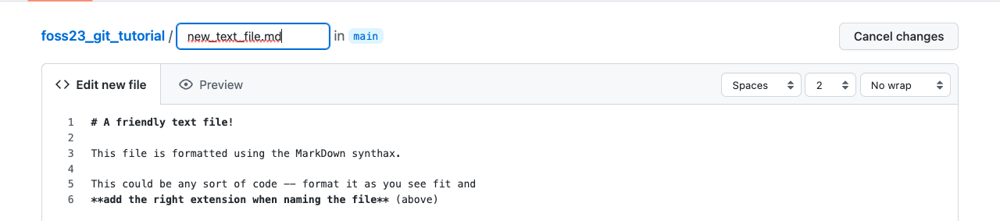

# The Unix Shell, Git, Github and LLMs: an Introduction

### Requirements

Command Line Interfaces (CLI) are found throughout all Operating Systems, however we recommend the use of the Unix CLI. If you have a Unix based machine such as Linux/Ubuntu (or other Linux distributions), macOS, you are ready for the next step. If you use a Windows machine, please install the [Windows Subsystem for Linux (WSL)](https://docs.microsoft.com/en-us/windows/wsl/install) as seen in the [Before FOSS Starts](installation.md#Software) section.

---

## The Unix Shell

The computer is a tool. It evolved over the years from being an intricated calculator into an interactive machine with thousands of moving parts that keep us all connected through the Internet. It is now the norm to use a mouse, keyboard, and seeing flashing images on our screens through the Graphical User Interface (GUI). GUIs are central to the way we interact with computers, however, to best take advantage of the computer's many systems, one needs to learn of the **Command Line Interface (CLI)**. The CLI sees the computer stripped down to only a [Terminal](https://en.wikipedia.org/wiki/Terminal_emulator) from where one can run powerful commands executed through the [Shell](https://en.wikipedia.org/wiki/Shell_(computing)).

Whilst the GUI allows for *better accessbility* to a computer, the CLI allows for *advanced usage* of one's computer. 

### CLI vs Terminal vs Shell

- [CLI (Command Line Interface)](https://en.wikipedia.org/wiki/Command-line_interface): an interface that receives commands (and gives output) from a user in the form of lines of text.
- [Terminal](https://en.wikipedia.org/wiki/Terminal_emulator): **the** text based interface window.
- [Shell](https://en.wikipedia.org/wiki/Shell_(computing)): a computer program and scripting language that presents a CLI which allows you to control your computer using commands.

The **Shell** sends commands to the computer through the **CLI** accessible through a **Terminal** window

### Things-to-Know About Commands

- Shell commands are used to **navigate**, **visualize**, **modify** (files/folders) and **automate** (processes), and can only be executed through the shell's terminal window.
- For every command, typing `man` (manual) before the command, will open the manual for said command.
```
$ man ls
```
    - Doing the above command will result in opening the *manual* for the `ls` command. You can exist the man page by pressing `q`.
- Each command has **flags**, or options, which are summoned with a `-`, such as `<command> -<flag>`.
```
$ ls -a -l -h
```
    - Doing the above command calls for the `-a` (all), `-l` (long), `-h` (human readable) flags. This causes `ls` to output a list of *all* files (inculding hidden files/folders) with human readable file size (e.g., it will list 3MB instead of 3000000), permissions, creator, and date of creation.
    - If you do not know what flags are available, you can refer to the `man` command (or for many tools, use the `-h` (help) flag).
- `.` refers to *current* directory; `..` refers to *above* directory; `/` is the directory separator; `~` indicates the home directory.
```
$ ls .            # lists files and folders in the current directory
$ ls ..           # lists files and folders in the above directory
$ ls ~            # lists files and folders in the home directory
$ ls ~/Documents  # lists files and folders in Documents (a folder present in the home directory)
```

### Introductory Shell Commands

The following are introductory commands necessary when interacting with a computer through the Shell. These will help you orient, create and delete files. Most of this material is explained in more details in the [Carpentries' Shell Module](https://swcarpentry.github.io/shell-novice/). Visit the Carpentries' website for a more in-depth tutorial.

!!! info "A short tutorial introducing the Shell"
    Here below are quick explanations of a few elementary commands that will help you orient and navigate your files and folders through the Shell. If you would like to follow along the explanations for each command, feel free to download and unzip the [shell-lesson-data.zip](https://swcarpentry.github.io/shell-novice/data/shell-lesson-data.zip) file from the [Shell's Carpentry module](https://swcarpentry.github.io/shell-novice/setup.html).
        
    ??? question "Don't have access to a GUI?"
        Following along on a machine with no access to a GUI? Execute the following commands:
        ```
        $ sudo apt install unzip
        $ wget https://swcarpentry.github.io/shell-novice/data/shell-lesson-data.zip
        $ unzip shell-lesson-data.zip
        ``` 

#### Navigation

| Command | Explanation |
|---|---|
|`pwd`| print working directory |
|`ls`| list content of folder |
|`cd`| change directory |

By typing `pwd`, the current working directory is printed.

```
$ pwd
/mnt/d/
```

We can then use `ls` to see the contents of the current directory. By using the `-F` flag (`ls -F`) we can also see the type of file. **Note:** an asterisk (`*`) at the end of the object will denote a file, whilst a slash (`/`) will denote a folder.

```
$ ls -F 
shell-lesson-data/   shell-lesson-data.zip*
```

We can then move inside the folder of our choice doing `cd`. Doing `ls` following the opening of the folder of choice, will show the contents of the folder you just moved in. Feel free to explore the contents of the folders by using `cd` and `ls`.

```
$ cd shell-lesson-data
$ ls -F

exercise-data/  north-pacific-gyre/

$ ls -F exercise-data/

animal-counts/  creatures/  numbers.txt*  proteins/  writing/
```

!!! Tip "Use the Tab key to autocomplete"
    You do not need to type the entire name of a folder or file. By using the tab key, the Shell will autocomplete the name of the files or folders. For example, typing the following

    ```
    $ ls -F exer
    ```

    and pressing the tab key, will result in autocompletion.

    ```
    $ ls -F exercise-data/
    ```

    You can then press tab twice, to print a list of the contents of the folder.

    ```
    $ ls -F exercise-data/
    animal-counts/ creatures/     numbers.txt    proteins/      writing/ 
    ```

#### Working with Files and Directories

| Command | Explanation |
|---|---|
|`mkdir`| make a directory |
|`touch`| creat empty file |
|`nano` or `vim`| text editors |
|`mv`| move command |
|`cp`| copy command | 
|`rm`| remove command |


Return to `shell-lesson-data`, and crate a directory with `mkdir <name of folder>`.

```
$ mkdir my_folder
$ ls -F
exercise-data/  my_folder/  north-pacific-gyre/
```

Notice the new `my_folder` directory.

!!! danger "Naming your files"
    It is strongly suggested that you avoid using spaces when naming your files. When using the Shell to communicate with your machine, a space can cause errors when loading or transferring files. Instead, use dashes (`-`), underscores (`_`), periods (`.`) and CamelCase when naming your files.
        
    Acceptable naming:
    ```
    $ mkdir my_personal_folder
    $ mkdir my_personal-folder
    $ mkdir MyPersonal.Folder
    ```
    ??? Question
        What do you think will happen if you attempt creating a folder by typing spaces?
            
        ??? Success "Solution"
            You will obtain as many folders as typed words!
            ```
            $ mkdir my folder
            $ ls -F
            exercise-data/  folder/  my/  north-pacific-gyre/
            ```
            Notice the two folders `my` and `folder`.

Create an empty file with `touch <name of file>`.

```
$ touch new_file
```

`touch` will create an **empty** file, it is up to you to populate using whichever text editor you prefer. Refer to the carpentries material to know more about nano and its functionalities ([link](https://swcarpentry.github.io/shell-novice/03-create/index.html#create-a-text-file)).

!!! tip
    You can also use your text editor to look at the contents of your files!

Use `mv <name of file or folder you want to move> <name of destination folder>` to move your newly created file to the directory you created previously (you can then use `ls` to check if you successully moved the file).

```
$ ls -F
exercise-data/  new_file*  my_folder/  north-pacific-gyre/

$ mv new_file my_folder/
$ ls -F
exercise-data/  my_folder/  north-pacific-gyre/

$ ls -F my_folder/
new_file*
```
`mv` can also be used to **rename** a file or folder with  `mv <name of file or folder you want to change> <new name>`.

```
$ cd my_folder/
$ mv new_file my_file
$ ls -F
my_file*
```

`cp` is the command to copy a file with the syntax `cp <name of file you want to copy> <name of copy file>`

```
$ cp my_file copy_my_file
$ ls -F 
copy_my_file*  my_file*
```

!!! note "Copying folders"
    To copy folders and the content of these folders, you will have to use the `-r` flag (recursive) for `cp` in the following manner `cp -r <name of folder you want to copy> <name of copy folder>` (following example is from the `shell-lesson-data/` directory).
    ```
    $ cp -r my_folder/ copy_my_folder
    $ ls -F
    copy_my_folder/  exercise-data/  my_folder/  north-pacific-gyre/
        
    $ ls -F my_folder/
    copy_my_file*  my_file*

    $ ls -F copy_my_folder/
    copy_my_file*  my_file*
    ```

To remove an unwanted file, use `rm <name of file to remove>`.

```
$ rm copy_my_file
$ ls -F 
my_file
```

!!! note "Removing folders"
    Save as the "Copying Folders" note, you have to use the `-r` flag to remove a folder `rm -r <name of folder you want to remove>` (following example is from the `shell-lesson-data/` directory).
    ```
    $ rm -r copy_my_folder/
    $ ls -F
    exercise-data/  my_folder/  north-pacific-gyre/
    ```

#### Introductory Remarks

The commands listed here above are to help you better understand directories and files. There is a lot more that one can accomplish when communicating with you computer through the Shell. In case you want to know more, here are some useful links you can visit:

- [Pipes and Filters](https://swcarpentry.github.io/shell-novice/04-pipefilter/index.html)
- [Loops](https://swcarpentry.github.io/shell-novice/05-loop/index.html)
- [Scripts](https://swcarpentry.github.io/shell-novice/06-script/index.html)
- [Finding Things](https://swcarpentry.github.io/shell-novice/07-find/index.html)

---

## Github and Git

FOSS stands for Foundational **Open** Science Skills: how many times have you worked on your code just to hit a bottleneck and found a solution on Stack Overflow? How many times have you found links that bring you to a GitHub repository with the exact snippet of code you needed?

The beauty of **Open** is that it makes Science and its code available for all through the internet, sharing ideas and solutions for all. Tools like Git and Github allow for the sharing of code, and the ability to collaborate on projects.

The following section will cover the very basics of Github so you can get up and running and using these tools. The concept of **version control** and the mechanics of using Git will be touched on in more depth [later](05_version_control.md) on in FOSS

- **Git**: 
    - First developed in 2005, git is a version control software that allows users to make changes and add versions to their code.
	- Changes and versions are saved locally.
	- Accessible through the Shell.

- **GitHub**:
	- First launched in 2008, its main focus is hosting and sharing code.
    - Uses Git version control software. 
	- Changes and versions are saved online (requires an account).
	- Mainly administered through the web (it also has a [desktop app](https://desktop.github.com/){target=_blank}).
    - Acquired by Microsoft in 2018.

<figure markdown>
  <a href="https://devmountain.com/blog/git-vs-github-whats-the-difference/" target="blank" rel="git_v_github"> </a>
    <figcaption> Git vs GitHub, simplified </figcaption>
</figure>

## Introducing GitHub

Since we are talking about making science accessible, we invite you to use GitHub to save and share your code. Please start by creating a GitHub account at https://github.com/.
<br/>
<br/>

#### User Profile

Just like in any other social media platform, you can create a profile for yourself. This is where you can add a picture, a description of yourself, and a link to your website. You can also add your location, your organization, and your pronouns. You can have a list of your most important repositories and show off your daily contributions. You are able to customize your profile to your liking. Check out [this profile](https://github.com/Gchism94) for fancy example. 


<br/>

#### Search

At the top of most pages, is a search bar. Use this to find repositories, users, and organizations. You can also use it to search for specific code within a repository.


<br/>

#### Starring Repositories

You can star repositories that you like. This is a way to bookmark repositories that you want to come back to later. You can also use this to show your appreciation for a repository. You can see all of your starred repositories by clicking on your profile picture and then clicking on **Your stars**.


<br/>

#### Create Your Own Repository

Repositories are where your code is stored. A suggestion is to have *one* repository for *one* project.

You can create repositories by clicking on the **Repositories** tab, and then clicking **New**.


Here, you can choose the name of your own repository, choose to make it private or public, adding a README and a licence. It is **strongly** reccomended that you choose to add an empty README file.
<br/>
<br/>


<br/>


!!! Info "So, why a README?"
    There are two main reasons why you would like a README file:
        
    1. It adds structure to your repository *automatically* - otherwise you would need to create said structure by yourself (not recommended for beginners).
    2. It is the "default" file that GitHub reads upon opening the repository. It can be treated as the go-to file that explains what the repository is for, what each file does, how to cite your reasearch, amongst other things.


!!! Info "Adding a Licence"
    The addition of a licence can heavily contribute to the shareability of your code. Make sure that whichever licence you choose is in line with your principals as well as your project's. GitHub comes with a list of licences which you can review. It is also common to choose a licence later on! We will cover licences in more depth [later](03_managing_data.md#licences) in the course.

<br/>


Ultimately, your new repository should look like the following screenshot. Notice the **LICENCE** document and the **README.md**


!!! Info "Editing the README.md"
	The Github repository file has a .md extension which stands for Markdown. Markdown is a lightweight markup language for creating formatted text using a plain-text editor common throughout text files on the web. It uses symbols (*~-#`) for syntaxing text, and it is what GitHub (and this website!) use to format text. Markdown is easier to use than HTML. You can read more on Markdown on the [Markdown Guide](https://www.markdownguide.org/).

<br/>
<br/>

### Adding and Modifying Code in Github

GitHub allows you to add and modify code in two ways: 1. through the online portal (the webpage you're seeing), and 2. On your local computer. Throughout the following section, we will show you how to do it through the online portal. We will save the local computer for later for [Lesson 5](05_version_control.md) later in the course. 


Adding code to your repository through the web page is suggested if what you want to add is simple (Like a README file!).

- Click the **Add File** button, which will allow you to either create a new file, or upload files from your computer. Select **Create New File**.
- The editing page will open: choose a name and an extension on the top of the page.
- On the editing page you can modify code as you see necessary (writing, pasting)



- You can also see your changes (if formatted) with the preview function (with the **Preview** button).
- To "Save" your changes, you will need to **commit** your changes:
	- navigate at the bottom of the page, specify your commit with a name and add a description if necessary.
 
- You will be able to see your newly created file on your repository home after committing your changes.

!!! info "Committing changes"
	**Committing** is the term used for *saving* changes you've made to your code. Each **commit** can be accessed within the GitHub web interface, which will show you the code prior and after the changes you've made. To see a list of all commits you made, click on the :fontawesome-solid-clock-rotate-left: icon under the **Code** button.

	- You can see from the picture below the lines that have been removed (in red), and the lines that have been added (in green).
	

	- Additionally, you can also see the full list of commits made to the file or repository.
	
<br/>

#### Hosting Web Pages in Github

GitHub allows you to host web pages through the use of **GitHub Pages**. This is a free service that allows you to host a website directly from your GitHub repository. You can use this to host your personal website, or to host a website for your project.

For example, the [FOSS website](https://foss.cyverse.org/) is hosted through GitHub Pages. The repository for the website can be found [here](https://github.com/CyVerse-learning-materials/foss)


---

## Introduction to Prompt Engineering

!!! info "This section is taken from the "[GPT101](https://ua-data7.github.io/introllms/)" CyVerse Workshop"

A great set of tools that can help you with your own research, if used in the correct way, are the new Large Language Models (LLMs) available publicly. These include [:simple-openai: ChatGPT](https://chat.openai.com/), [:simple-googlebard: Bard](https://bard.google.com/?hl=en) and [:simple-microsoftbing: Bing Chat](https://www.bing.com/new?form=MY0291&OCID=MY0291) (integrated with :material-microsoft-edge: Microsoft Edge).

### LLMs in 150 words (or less)

**How they're made**: LLMs work by training on vast amounts of text from the internet. They learn patterns, grammar, and context from this data. When you give them a prompt, they generate text based on what they've learned. Imagine a super-smart autocomplete for text, but it can also create entire paragraphs or articles.

**How they work**: LLMs don't understand like humans do. They predict what comes next in a sentence using math and probabilities. They don't have thoughts or feelings. They mimic human language but can make mistakes or write nonsense if not guided well.

**How you can use them**: They're incredibly versatile. You can use them for answering questions, writing essays, coding help, and more. ***But you must be cautious because they can generate biased or false information if not used responsibly***. 

In a nutshell, LLMs are like super-powered text generators trained on the internet's vast knowledge.

### :simple-openai: Prompt Writing

GPT Chat asks for a message to begin its conversation. These messages are called "Prompts". 

Begin a conversation with a specific type of prompt. This will help narrow the potential range of responses and improve results to subsequent prompts. 

#### Priming

GPTs do better when provided with "prompt primers".

Zero-shot unconditioned prompts are likely to return the least specific responses. 

Responses are more likely to be useful when multiple specific output types are defined.

| Types of Priming | Example |
|------------------|---------|
| Zero (Shot) | "Write five examples of assessments for watershed health." |
| Single | "Write five examples of assessments for watershed health. Here is one example: Geomorphology" |
| Multiple | "Write five examples of assessments for watershed health related to geomorphology, water quality, and species diversity." |

#### Prompt Structure

| Role | Task | Format |
|------|------|--------|
| Act as [\[ROLE\]](#role) | Create a [\[TASK\]](#tasks) | ... show as [\[FORMAT\]](#format) |

Your prompt should specify the role in which ChatGPT responds, what its task is, and the format of how its outputs should be returned. 

A second step to the initial prompt is to [link or chain](#linked-prompts) your subsequent prompts. 

This lesson only covers ChatGPT, but the same prompt techniques can be used in other LLMs.

#### Role

Set the role for ChatGPT to play during your session. 

"I want you to act as ..." will establish what type of conversation you are planning to have. 

| Types of Roles |
|---|
| Project Manager  | 
| Copywriter / Editor  | 
| Paper Reviewer | 
| Teacher / Mentor / Advisor |
| Student / Learner / Participant |
| Software Engineer  |
| DevOps Engineer  |
| Linux Terminal  |
| Python Interpreter |
| Web Browser |

Examples of roles you might ask for are: a domain science expert, an IT or DevOps engineer, software programmer, journal editor, paper reviewer, mentor, teacher, or student. You can even instruct ChatGPT to respond as though it were a Linux [terminal](https://www.engraved.blog/building-a-virtual-machine-inside/), a web browser, a search engine, or language interpreter.

??? Abstract "Data Scientist"

    Let's try an example prompt with role-playing to help write code in the R programming language.

    ```markdown
    I want you to act as a data scientist with complete knowledge of the R language, 
    the TidyVerse, and RStudio. 
    
    Write the code required to create a new R project environment,
    Download and load the Palmer Penguins dataset, and plot regressions of body mass, 
    bill length, and width for the species of Penguins in the dataset. 

    Your response output should be in R and RMarkDown format 
    with text and code delineated with ``` blocks.

    At the beginning of new file make sure to install any 
    RStudio system dependencies and R libraries that Palmer Penguins requires.
    ```

    Example can use `GPT-3.5-Turbo` or `GPT-4`

??? Abstract "Talk to Dead Scientists"

    Try to ask a question with and without Internet access enabled:

    ```markdown
    I want you to respond as though you are the mathematician Benoit Mandelbrot

    Explain the relationship of lacunarity and fractal dimension for a self-affine series

    Show your results using mathematical equations in LaTeX or MathJax style format
    ```
    Again, there is no guarantee that the results ChatGPT provides are factual, but it does greatly improve the odds that they are relevant to the prompt. Most importantly, these extensions provide citations for their results, allowing you to research the results yourself. 

#### Tasks

Prompts which return informative responses to questions like "What is ..." or "How does ..."

Because of ChatGPT's proclivity at making up information, using it without a way of validating the authenticity of its responses makes it less trustworthy than regular search engines. 

| Types of Task | 
|---|
| Scientific Article | 
| Essay |
| Blog Post |
| Outline |
| Email | 
| Cover Letter |
| Recipe |
| Tutorial |
| Lesson Plan | 
| Jupyter Notebook |
| Configuration |
| Code |
| Software Script |

Bing and Bard fill an important space in these types of prompts - they return websites which match the query criterion and allow you to research your own answers.

There are extension tools for ChatGPT which allows you to prompt with references.

#### Format

By default ChatGPT outputs MarkDown syntax text. It can also output software code, and soon images, video, music and sounds.

| Formats to output |
|---|
| MarkDown Text (\& emojis) |
| List |
| Table |
| HTML |
| CSS |
| Regular Expression |
| CSV / TXT |
| JSON |
| Rich Text |
| Gantt Chart |
| Word Cloud |
| Graphs |
| Spreadsheets |

You can also ask ChatGPT to explain complex topics or to act as a cook-book step-by-step guide. 

ChatGPT can provide instructional details about how to do specific tasks. 

??? Abstract "Documentation Writer"

    ```markdown
    I want you to act as a DIY expert. You will help me develop the skills necessary 
    to complete simple lab documentation, create tutorials and guides for beginners and experts, 
    and explain complex concepts in layman's terms using visual techniques, and develop helpful resources.

    I want you to create a tutorial for building and deploying a github.io website using the MkDocs Material Theme
    ```

### Further Documentation & Questions

For a more in depth quick start, go to the [GPT 101](https://ua-data7.github.io/introllms/) workshop. 

Documentation of interest:

- Read the [:simple-openai: ChatGPT Documentation](https://openai.com/blog/chatgpt)
- Read the [:fontawesome-regular-file-pdf: ChatGPT Technical Report](https://doi.org/10.48550/arXiv.2303.08774)
- Read the [:fontawesome-regular-file-pdf: Bard Documentation](https://ai.google/static/documents/google-about-bard.pdf)

??? Tip "How long can or should a prompt be?"

    The length of a prompt is [measured in "tokens"](https://techcommunity.microsoft.com/t5/healthcare-and-life-sciences/unlocking-the-power-of-tokens-optimizing-token-usage-in-gpt-for/ba-p/3826665). A token can represent an individual character, a word, or a subword depending on the specific tokenization approach. A rough estimate for the average number of words in English language per token is `0.75`. 

    Currently, ChatGPT version `GPT-3.5turbo` uses up to 2,048 tokens per prompt, GPT-4 and Bing Chat can take up to 32,768 tokens. BARD currently has a limit of 20,000 tokens in a prompt. 
    
    This means that a 2,048 token prompt would be equivalent to about 1,536 words (3-6 pages), and a 32,768 token prompt would be 24,576 words (50-100 pages). 
    
    However, this is only an approximation and may vary depending on the specific text and model. 

    What this also means is that current GPT are not capable of reading many PDFs at one time, for example, to do a literature review, or to write a sequel to a novel or book series. 

??? Tip "ChatGPT :simple-awesomelists: Awesome Lists"

    There is an ever changing meta-list of :simple-awesomelists: Awesome lists curated around ChatGPT plugins and extensions.

    [:simple-github: search: `chatgpt+awesome`](https://github.com/search?q=awesome-chatgpt+&type=repositories&s=stars&o=desc)

    Check out lists around:

    [:simple-awesomelists: ChatGPT Prompts](https://github.com/f/awesome-chatgpt-prompts)

    [:simple-awesomelists: ChatGPT Data Science Prompts](https://github.com/travistangvh/ChatGPT-Data-Science-Prompts)
   
    [:simple-awesomelists: API plugins, extensions, & applications](https://github.com/humanloop/awesome-chatgpt)


??? Tip "Access the Internet"

    By default, ChatGPT does not have access to the Internet, and is limited to the time period before September 2021 (as of mid-2023) for its training data time frame. 

    There are third-party extensions, like [WebChatGPT](https://www.webchatgpt.app/) which you can install in your browser (Firefox or Chrome), that will extend OpenAI ChatGPT's reach to the internet.

    We presently recommend using [:material-microsoft-bing: Bing Chat](bing.md) with Edge Browser instead of ChatGPT 3.5 for prompting which works with the internet.

    [:simple-google: Bard](bard.md) also has access to the web and limited integration with Google Workspace.
