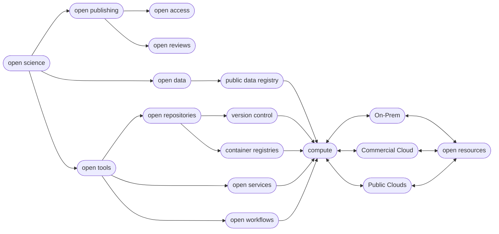
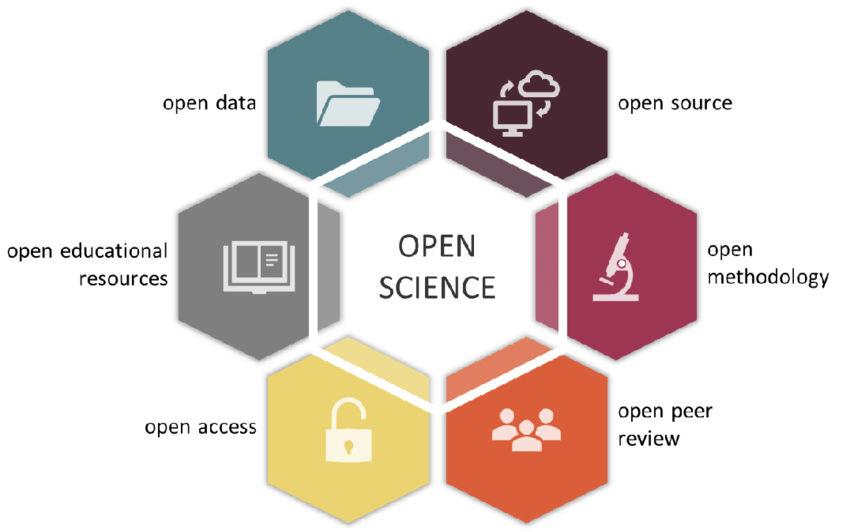

# Introduction to Open Science

!!! Success "Learning Objectives"

        After this lesson, you should be able to:
        
        * Explain what Open Science is
        * Explain the components of Open Science
        * Describe the behaviors of Open Science
        * Explain why Open Science matters in education, research, and society
        * Understand the advantages and the challenges to Open Science
        * Identify who the practitioners of Open Science are
        * Understand the underlying Ethos of Open Science

## What is Open Science?

If you ask a dozen researchers this question, you will probably get just as many answers.

This means that Open Science isn't necessarily a set of checkboxes you need to tick, but rather an holistic approach to doing science.

??? Quote "Definitions"

    **"Open Science is the movement to make scientific research (including publications, data, physical samples, and software) and its dissemination accessible to all levels of society, amateur or professional..." [(Wikipedia definition)](https://en.wikipedia.org/wiki/Open_science){target=_blank}**

    - [UNESCO's Recommendation on Open Science](https://unesdoc.unesco.org/ark:/48223/pf0000379949.locale=en){target=_blank}
    
    - [UNESCO Definition](https://www.unesco.org/en/natural-sciences/open-science){target=_blank}
    
    - Open and Collaborative Science Network's [Open Science Manifesto](https://ocsdnet.org/manifesto/open-science-manifesto/){target=_blank}

    ??? Example "Six Pillars :material-pillar: of Open Science"

        **:material-pillar: Open Access Publications**

        **:material-pillar: Open Data**

        **:material-pillar: Open Educational Resources**

        **:material-pillar: Open Methodology**
      
        **:material-pillar: Open Peer Review**

        **:material-pillar: Open Source Software**

        ??? Question "Wait, how many pillars :material-pillar: of Open Science Really Are There?"

            The number can be from [4 :material-pillar:](https://narratives.insidehighered.com/four-pillars-of-open-science/){target=_blank} to [8 :material-pillar:](https://www.ucl.ac.uk/library/research-support/open-science/8-pillars-open-science){target=_blank}

    
!!! Tip ":dark_sunglasses: Awesome Lists of Open Science"

    Awesome lists were started on GitHub by [Sindre Sorhus](https://sindresorhus.com/){target=_blank} and typically have a badge associated with them ](https://github.com/sindresorhus/awesome){target=_blank} 
    
    (There is even a [Searchable Index](https://awesome-indexed.mathew-davies.co.uk/){target=_blank} of Awesome Lists)

    We have created our own [Awesome Open Science List here](https://tyson-swetnam.github.io/awesome-open-science/) which may be valuable to you.

### Open Science Flow Mermaid Diagram

Figure: Hypothetical relationships of digital Open Science 

## Breakout Discussion

As you already know, being a scientist requires you to wear many hats, and trying to do Open Science is no different.

As we mentioned, Open Science is not a set of boxes you need to check off to be "Certified Open", but an intersecting set of philosophies and approaches, all of which occur on some type of spectrum. 

To get a feel for how Open Science can be multifaceted and different for each researcher, we will do a short breakout group session to discuss what Open Science means to you.

??? Question "What does Open Science mean to you?"

    ??? Example "Which of the :material-pillar: pillars of Open Science is nearest to your own heart?"

    ??? Example "Are any of the :material-pillar: pillars more important than the others?"

    ??? Example "Are there any :material-pillar" pillars not identified that you think should be considered?"

??? Question "What characteristics might a paper/project/lab require to qualify as *Open Science*"

??? Question "What are some limitations to you, your lab/group, or your domain?"

### Components of Open Science

One of the most fundamental, and certainly the most publicized component of Open Science is the accessibility of data. This makes sense- without
access to your data, nothing else about your science can be all that open. While we will devote an entire week of this course to data, opening up your data is only one piece of the puzzle.

 

*Gallagher et al 2020, Nature Eco Evo*

This figure demonstrates the multiple intersecting pieces of Open Science, which go beyond simply making data accessible. While we focus primarily on Open Data, Open Source, and Open Methodology in FOSS, it's worth considering how other parts of the scientific process might be opened up more broadly.

Another component which sort of covers all of the pictured components, or at least links a lot of them together, might be referred to as Open Process. In response to the Reproducibility Crisis, many researchers, particularly in fields like psychology, have begun to advocate for **preregistration** of studies. This involves writing out and publishing your entire research plan, from data collection to analysis and publication, for the sake of avoiding practices like p-hacking or HARKing. What preregistration also does is make the process of your work more open, including many of the small decisions and tweaks you make to a project that probably wouldn't make it into a manuscript. To learn more about preregistration, you can check out the , a project that provides a preregistration platform and other Open Science tools.

As mentioned above, it is worthwhile to think about Open Science not as a set of checkboxes, but rather a holistic approach to doing science. In that spirit, it can also be useful to think about Open Science as a spectrum, from less to more open. While you might not achieve some platonic ideal of openness for a variety of reasons, you can still make great progress in moving your science towards the Open end of the spectrum. In reality, a large scientific project probably consists of multiple spectra; you can move your data towards the open end of the spectrum while your software remains less open, and vice versa. All this is to say that doing Open Science is not a static set of goals you must achieve, it is a process that grows and changes with your science itself.

One of the biggest challenges of doing science is that you might have to wear many different hats: domain expert, lab manager, statistician, teacher, mentor, grant writer, manuscript author, public speaker... the list goes on. Doing Open Science is no different, but the list of skills may be even greater, since the goal is now to openly communicate each step of the process to a broader audience. This also makes teaching Open Science quite challenging- we will cover topics ranging from "soft skills" like project management and internal communications to more technical skills like software management and containers. We could probably teach this whole workshop on each single topic, but we clearly don't have the time to do that. Instead, we will focus on a higher-level look at the landscape of Open Science and introduce you to a wide variety of skills and concepts with the idea that you can go on to find ways to implement them in your own work.

---

## *WHY* do Open Science?

There are many reasons to do Open Science, and presumably one or more of them brought you to this workshop. Whether you feel an ethical obligation, want to improve the quality of your work, or want to look better to funding agencies, many of the same approaches to Open Science apply.

A paper from posits that there are 5 main schools of thought in Open Science, which represent 5 underlying motivations:

1.  **Democratic school**: primarily concerned with making scholarly work freely available to everyone

2.  **Pragmatic school**: primarily concerned with improving the quality of scholarly work by fostering collaboration and improving critiques

3.  **Infrastructure school**: primarily focused on the platforms, tools, and services necessary to conduct efficient research, collaboration, and communication

4.  **Public school**: primarily concerned with societal impact of scholarly work, focusing on engagement with broader public via citizen science, understandable scientific communication, and less formal communication

5.  **Measurement school**: primarily concerned with the existing focus on journal publications as a means of measuring scholarly output, and focused on developing alternative measurements of scientific impact

 

*Fecher and Friesike, 2014*

While many researchers may be motivated by one or more of these aspects, we will not necessarily focus on any of them in particular. If anything, FOSS may be slightly more in the Infrastructure school, because we aim to give you the tools to do Open Science based on your own underlying motivations.

Let's break out into groups again to discuss some of our motivations for doing Open Science.

??? Question "What motivates you to do Open Science?"

??? Question "Do you feel that you fall into a particular "school"? If so, which one, and why?"

??? Question "Are there any motivating factors for doing Open Science that don't fit into this framework?"

---

