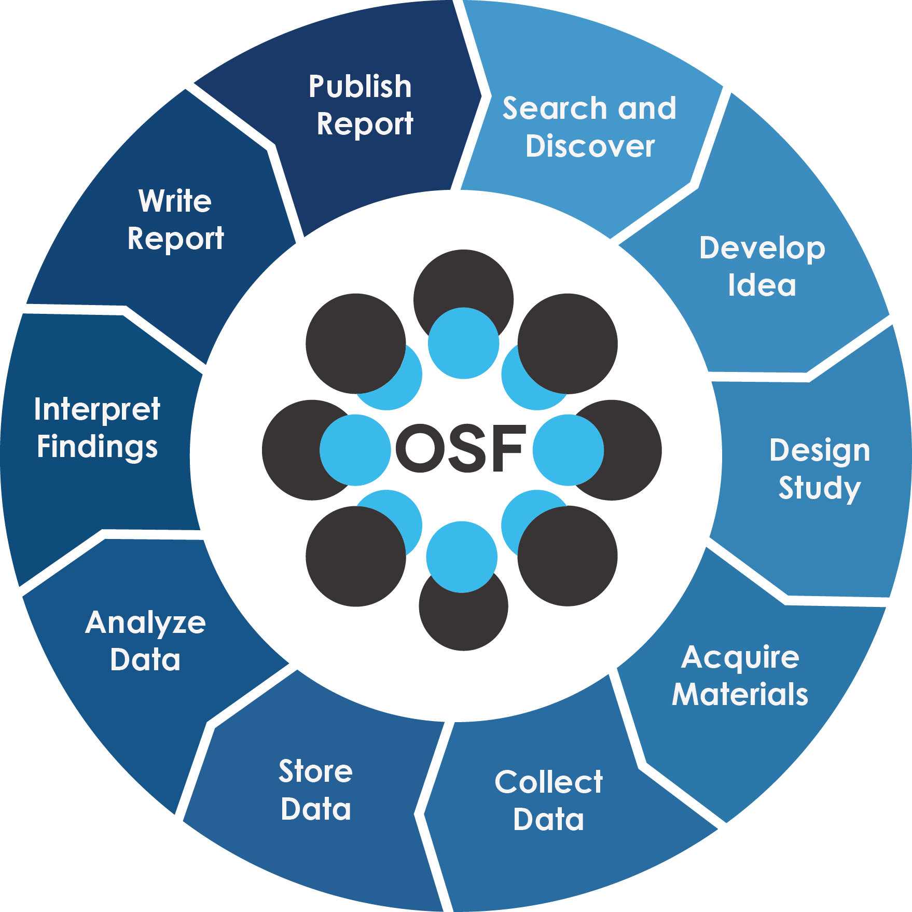
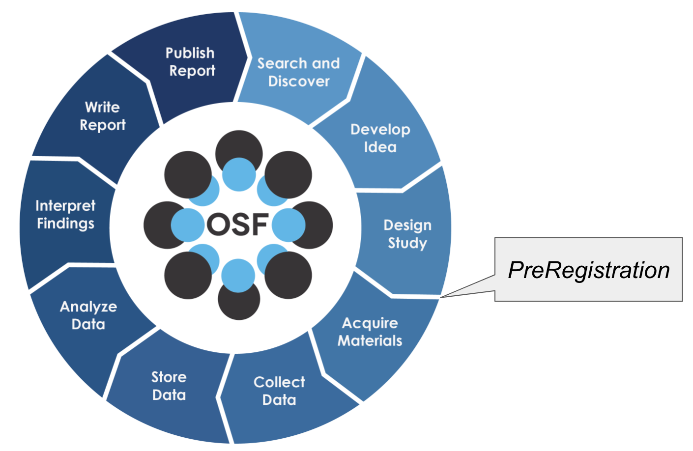
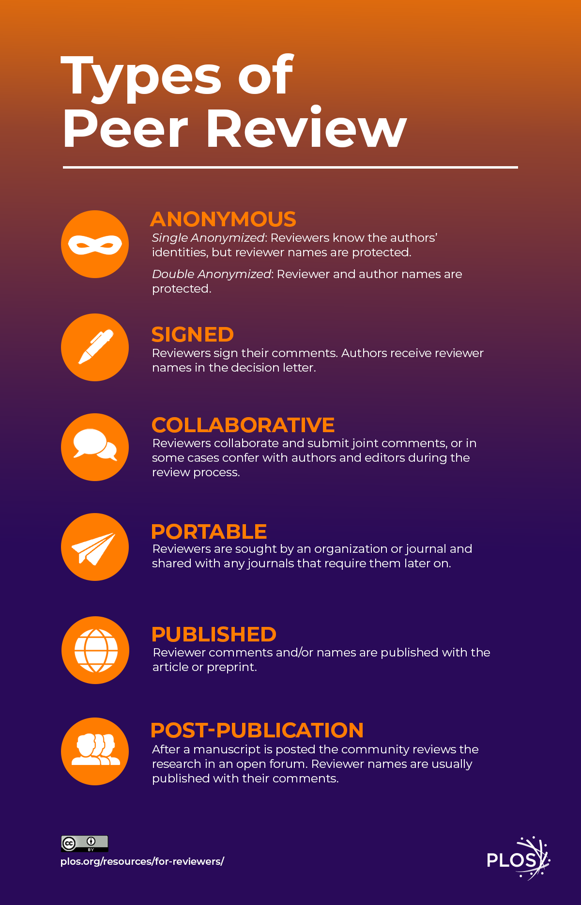
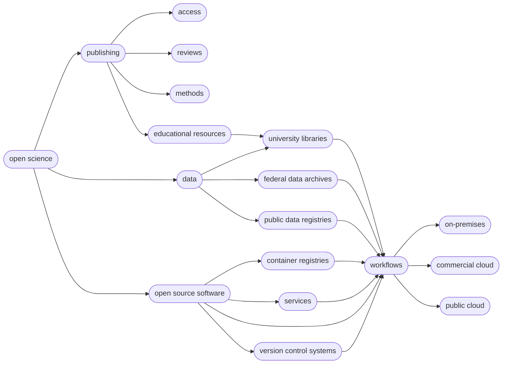

# Introduction to Open Science

!!! Success "Learning Objectives"

    After this lesson, you should be able to:
        
    * Explain what Open Science is
    * Explain the components of Open Science
    * Describe the behaviors of Open Science
    * Explain why Open Science matters in education, research, and society
    * Understand the advantages and the challenges to Open Science
    * Identify who the practitioners of Open Science are
    * Understand the underlying Ethos of Open Science

 
 

## What is Open Science?

 

_"Open Science is transparent and accessible knowledge that is shared and developed through collaborative networks"_

[-Vincente-Saez & Martinez-Fuentes 2018](https://doi.org/10.1016/j.jbusres.2017.12.043)

 
 
 
 
 

_"Open Science is a collaborative and transparent approach to scientific research that emphasizes the accessibility, sharing, and reproducibility of data, methodologies, and findings to foster innovation and inclusivity"_

-ChatGPT

 
 
 
 
 

_"A series of reforms that interrogate every step in the research life cycle to make it more efficient, powerful and accountable in our emerging digital society"._

-Jeffrey Gillan

<figure markdown>
  <a target="blank" rel="open science">{ width="400" } </a>
    <figcaption> The Research Life Cycle from [Open Science Framework](https://osf.io/)</figcaption>
</figure>
 
 
 
 
!!! Quote "Other Definitions"

    "Open Science is defined as an inclusive construct that combines various movements and practices aiming to make multilingual scientific knowledge openly  available,  accessible  and  reusable  for  everyone,  to  increase  scientific  collaborations  and  sharing of information for the benefits of science and society, and to open the processes of scientific knowledge creation, evaluation and communication to societal actors beyond the traditional scientific community." - [UNESCO Definition](https://www.unesco.org/en/natural-sciences/open-science){target=_blank}

    - [UNESCO's Recommendation on Open Science](https://unesdoc.unesco.org/ark:/48223/pf0000379949.locale=en){target=_blank}
    
    "Open Science is the movement to make scientific research (including publications, data, physical samples, and software) and its dissemination accessible to all levels of society, amateur or professional..." [ :material-wikipedia: Wikipedia definition](https://en.wikipedia.org/wiki/Open_science){target=_blank}
 

## Foundational Open Science Skills

_1. Building a culture of scientists eager to share research materials - such as data, code, methods, documentation, and early results - with colleagues and society at large, in addition to traditional publications_ 

 
 

_2. Mastery of digital tools to create reproducible science that others can build upon_

 
 

_3. Understanding the push towards increased transparency and accountability for those practicing science (ie., compliance)_

 
 
 
 
 

<figure markdown>
  <a href="" target="blank" rel="open science">{ width="500" } </a>
    <figcaption> Open Science Word Cloud by [Pownall et al. 2023](http://dx.doi.org/10.31234/osf.io/vypkb)</figcaption>
</figure>

 
 
 
 
 

<iframe width="526" height="340" src="https://www.youtube.com/embed/8fGRN5fa-Ks" title="What is &#39;open science&#39;? | The Royal Society" frameborder="0" allow="accelerometer; autoplay; clipboard-write; encrypted-media; gyroscope; picture-in-picture; web-share" referrerpolicy="strict-origin-when-cross-origin" allowfullscreen></iframe>
_What is Open Science | The Royal Society_

 
 
 
 
 

## 2023: the Year of Open Science

The White House, joined by 10 federal agencies, and a coalition of more than 85 universities, declared 2023 the [Year of Open Science](https://nasa.github.io/Transform-to-Open-Science/year-of-open-science/){target=_blank}. As the year came to a close, the governement aimed to create a spotlight through [The White House Office of Science & Technology Policy Open Science Recognition Challenge](https://www.challenge.gov/?challenge=ostp-year-of-open-science-recognition-challenge&tab=overview), recognizing open science stories that addressed current societial challenges (winners to be annouced).

<figure markdown>
  <a href="https://nasa.github.io/Transform-to-Open-Science/year-of-open-science/" target="blank" rel="open science">{ width="500" } </a>
    <figcaption> The year of Open Science</figcaption>
</figure>

 
 
 
---
 
 
 

## **:material-pillar: 6 Pillars of Open Science**

**:material-pillar: Open Access Publications**

**:material-pillar: Open Data**

**:material-pillar: Open Educational Resources**

**:material-pillar: Open Methodology**
      
**:material-pillar: Open Peer Review**

**:material-pillar: Open Source Software**

??? Question "Wait, how many pillars :material-pillar: of Open Science Are There Really?"

    The number can be from [4 :material-pillar:](https://narratives.insidehighered.com/four-pillars-of-open-science/){target=_blank} to [8 :material-pillar:](https://www.ucl.ac.uk/library/research-support/open-science/8-pillars-open-science){target=_blank}

 
 
 
 
 

## **:material-pillar: Open Access Publications**

[{width=210}](https://en.wikipedia.org/wiki/Open_access){target=_blank}

!!! Quote "Definition"

    "Open access is a publishing model for scholarly communication that makes research information available to readers at no cost, as opposed to the traditional subscription model in which readers have access to scholarly information by paying a subscription (usually via libraries)." -- [OpenAccess.nl](https://www.openaccess.nl/en/what-is-open-access){target=_blank}

 
 
 

### Types of Publishing Business Models:

1. Subscription model - the author pays a smaller fee (or no fee) for the article to be published. The publisher then sells subscription access to the article (usually to institutes of higher education).

2. Open Access model - The author pays a larger fee to make the article freely available to anyone through a Creative Commons license. 

    * Open Access publishing in Nature costs $12,290!
    * Open Access publising in PlosOne costs $2,290

 
 
 

!!! Example "Open Access Journal Examples"

    Major publishers have provided access points for publishing your work 

    [AAAS](https://www.science.org/content/page/open-access-aaas){target=_blank}

    [Nature](https://www.nature.com/nature-portfolio/open-access){target=_blank}

    [American Geophysical Union](https://www.agu.org/Publish-with-AGU/Publish/Open-Access){target=_blank}

    [Commonwealth Scientific and Industrial Research Organisation (CSIRO)](https://acsopenscience.org/australia-csiro/){target=_blank}

    [Open Research Europe](https://open-research-europe.ec.europa.eu/){target=_blank}
    
    [PLOS](https://plos.org/){target=_blank}
    
    [MDPI](https://www.mdpi.com/){target=_blank}
    
    [Ecosphere](https://esajournals.onlinelibrary.wiley.com/journal/21508925){target=_blank}

 
 

### Research Article Versions 

1. Preprint - In academic publishing, a preprint is a version of scholary paper that precedes formal peer-review and publication in a scientific journal. The preprint may be available, often as a non-typeset version available for free online. 

    ??? Example "Pre-print Services"

        [ASAPbio Pre-Print Server List](https://asapbio.org/preprint-servers){target=_blank} - ASAPbio is a scientist-driven non-profit promoting transparency and innovation comprehensive list of pre-print servers inthe field of life science communication.

        [ESSOar](https://www.essoar.org/){target=_blank} - Earth and Space Science Open Archive hosted by the American Geophysical Union.

        [Peer Community In (PCI)](https://peercommunityin.org/) a free recommendation process of scientific preprints based on peer reviews

        [OSF.io Preprints](https://osf.io/preprints/){target=_blank} are partnered with numerous projects under the "-rXivs"

        ??? Tip "The rXivs"

            [AfricArXiv](https://osf.io/preprints/africarxiv/){target=_blank}

            [AgrirXiv](https://cabidigitallibrary.org/journal/agrirxiv){target=_blank}

            [Arabixiv](https://arabixiv.org/discover){target=_blank}

            [arXiv](https://arxiv.org/){target=_blank} - is a free distribution service and an open-access archive for 2,086,431 scholarly articles in the fields of physics, mathematics, computer science, quantitative biology, quantitative finance, statistics, electrical engineering and systems science, and economics.

            [BioHackrXiv](https://biohackrxiv.org/){target=_blank}

            [BioRxiv](https://www.biorxiv.org/){target=_blank} -  is an open access preprint repository for the biological sciences.

            [BodorXiv](https://bodoarxiv.wordpress.com/){target=_blank}

            [EarthArXiv](https://eartharxiv.org/){target=_blank} - is an open access preprint repository for the Earth sciences.

            [EcsArXiv](https://ecsarxiv.org/){target=_blank} - a free preprint service for electrochemistry and solid state science and technology

            [EdArXiv](https://edarxiv.org/){target=_blank} - for the education research community

            [EngrXiv](https://engrxiv.org/){target=_blank} for the engineering community

            [EvoEcoRxiv](https://www.ecoevorxiv.com/){target=_blank} - is an open acccess preprint repository for Evolutionary and Ecological sciences.

            [MediArXiv](https://mediarxiv.com/){target=_blank} for Media, Film, & Communication Studies

            [MedRxiv](https://www.medrxiv.org/){target=_blank} - is an open access preprint repository for Medical sciences.

            [PaleorXiv](https://paleorxiv.org/){target=_blank} - is an open access preprint repository for Paleo Sciences

            [PsyrXiv](https://psyarxiv.com/){target=_blank} - is an open access preprint repository for Psychological sciences.

            [SocArXiv](https://socopen.org/){target=_blank} - is an open access preprint repository for Social sciences.

            [SportrXiv](https://sportrxiv.org/){target=_blank} - is an open access preprint for Sports sciences.

            [ThesisCommons](https://thesiscommons.org/) - open Theses

2. Author's accepted manuscript (AAM) - includes changes that came about during peer-review process. It is a non-typeset or formatted article. This often had an embargo period of 12-24 months

3. Published version of record (VOR) - includes stylistic edits, online & print formatting. This is the version that publishers claim ownership of with copyrights or exclusive licensing. 

 
 

  

### New Open Access Mandates in US

The White House Office of Science and Technology (OSTP) has recently released a policy document known as the [Nelson Memo](https://www.whitehouse.gov/ostp/news-updates/2022/08/25/ostp-issues-guidance-to-make-federally-funded-research-freely-available-without-delay/) stating that tax-payer funded research must by open access by 2026 with no embargo period. 

Authors can comply with the memo by either:

1. Publishing Open Access (this usually requires higher fees)

2. Distributing the Author's Accepted Manuscript (AAM) 

Read [NSF's open access plan](NSF’s Public Access Plan 2.0 is document NSF 23-104) in reponse to the Nelson Memo

Read [USDA's open access plan](https://www.nal.usda.gov/sites/default/files/page-files/USDA_Public_Access_Implementation_Plan_8_10_2023_0.pdf) in reponse to the Nelson Memo

 
 
 
 

### Additional Info

University of Arizona Libraries information on [Open Access publishing](https://lib.arizona.edu/research/open-access) including agreements with several journals to reduce or waive publishing fees. 

https://www.coalition-s.org/

   

 
 
 
---
 
 

## **:material-pillar: Open Data**

 

!!! Quote "Definitions"

    “Open data and content can be freely used, modified, and shared by anyone for any purpose” - [The Open Definition](https://opendefinition.org/){target=_blank}

    "Open data is data that can be freely used, re-used and redistributed by anyone - subject only, at most, to the requirement to attribute and sharealike." - [Open Data Handbook](https://opendatahandbook.org/guide/en/what-is-open-data/){target=_blank}

    [:material-wikipedia: Wikipedia definition](https://en.wikipedia.org/wiki/Open_data){target=_blank}

 
 
 
   
Data are the foundation for any scientific endeavor. A lot of thought needs to go into how to best collect, store, analyze, curate, share, and archive data.

<figure markdown>
  <a href="https://en.wikipedia.org/wiki/DIKW_pyramid" target="blank" rel="open science">{ width="400" } </a>
    <figcaption> DIKW Pyramid</figcaption>
</figure>

 
 

### FAIR Principles

In 2016, the [FAIR Guiding Principles](https://www.nature.com/articles/sdata201618) for scientific data management and stewardship were published in _Scientific Data_. 

_**Findable:**_
Making data discoverable by the wider academic community and the public

_**Accessible:**_
Using unique identifiers, metadata and a clear use of language and access protocols

_**Interoperable:**_
Applying standards to encode and exchange data and metadata

_**Reusable:**_
Enabling the repurposing of researach outputs to maximize their research potential

 
 

!!! Tip "Reasons to Make your Data Open"

    * Unnecessary duplication e.g. re-collecting or re-working data, can be avoided. Duplication of research is costly for society, and places unnecessary burden on heavily researched people and populations.  

    * The data underlying publications are maintained and accessible, allowing for validation of results.

    * Data openness leads to more collaboration and advances research and innovation.

    * Your research is more visible and has greater impact. Publications which allow access to the underlying data get more citations. Greater visibility also allows for better validation and scrutiny of findings.

    * Other researchers can cite your data, which will drive up your citation number and increase your influence in your field of research.

    * Storing your data in a public repository also provides you with secure and ongoing storage that may otherwise not be available to you.

            - Borrowed From [Foster Open Science](https://www.fosteropenscience.eu/)

 
 
 
 

### As Open as Possible, as Closed as Necessary

There are many circumstances where open data could be harmful:

* Data on human health

* Location of endangered species or archaeological sites

* Data that individuals or groups do not want to be public

    ??? Tip "CARE Principles"

        The [CARE Principles](https://www.gida-global.org/care) for Indigenous Data Governance were drafted at the International Data Week and Research Data Alliance Plenary co-hosted event "Indigenous Data Sovereignty Principles for the Governance of Indigenous Data Workshop," 8 November 2018, Gaborone, Botswana.

         *Collective Benefit*

         -   C1. For inclusive development and innovation
         -   C2. For improved governance and citizen engagement
         -   C3. For equitable outcomes

         *Authority to Control*

         -   A1. Recognizing rights and interests
         -   A2. Data for governance
         -   A3. Governance of data

         *Responsibility*

         -   R1. For positive relationships
         -   R2. For expanding capability and capacity
         -   R3. For Indigenous languages and worldviews

         *Ethics*

         -   E1. For minimizing harm and maximizing benefit
         -   E2. For justice
         -   E3. For future use

* Data for making [lethal weapons](https://www.theverge.com/2022/3/17/22983197/ai-new-possible-chemical-weapons-generative-models-vx)

 
 

!!! Tip "Open vs. FAIR"

    FAIR does not demand that data be open: See one definition of open: http://opendefinition.org/
    
    Open data does not necessarily mean it is FAIR

 
 
 
 
---

     
 
 

## **:material-pillar: Open Educational Resources**

[{width=240}](https://www.unesco.org/en/communication-information/open-solutions/open-educational-resources)

!!! Quote "Definitions"

    "Open Educational Resources (OER) are learning, teaching and research materials in any format and medium that reside in the public domain or are under copyright that have been released under an open license, that permit no-cost access, re-use, re-purpose, adaptation and redistribution by others." - [UNESCO](https://www.unesco.org/en/communication-information/open-solutions/open-educational-resources){target=_blank}

    [:material-wikipedia: Wikipedia definition](https://en.wikipedia.org/wiki/Open_educational_resources){target=_blank}

??? Example "Digital Literacy Organizations"

    [The Carpentries](https://carpentries.org/){target=_blank} - teaches foundational coding and data science skills to researchers worldwide  

    [EdX](https://www.edx.org/){target=_blank} - Massively Open Online Courses (not all open) hosted through University of California Berkeley

    [EveryoneOn](https://www.everyoneon.org/ ){target=_blank} - mission is to unlock opportunity by connecting families in underserved communities to affordable internet service and computers, and delivering digital skills trainings 

    [ConnectHomeUSA](https://connecthomeusa.org/){target=_blank} - is a movement to bridge the digital divide for HUD-assisted housing residents in the United States under the leadership of national nonprofit EveryoneOn

    [Global Digital Literacy Council](https://www.gdlcouncil.org/){target=_blank} -  has dedicated more than 15 years of hard work to the creation and maintenance of worldwide standards in digital literacy

    [IndigiData](https://indigidata.nativebio.org/){target=_blank} - training and engaging tribal undergraduate and graduate students in informatics

    [National Digital Equity Center](https://digitalequitycenter.org/about-us/){target=_blank} a 501c3 non-profit, is a nationally recognized organization with a mission to close the digital divide across the United States

    [National Digital Inclusion Allaince](https://www.digitalinclusion.org/){target=_blank} - advances digital equity by supporting community programs and equipping policymakers to act

    [Net Literacy](https://www.netliteracy.org/){target=_blank}

    [Open Educational Resources Commons](https://www.oercommons.org/){target=_blank}

    [Project Pythia](https://projectpythia.org/){target=_blank} is the education working group for Pangeo and is an educational resource for the entire geoscience community

    [Research Bazaar](https://resbaz.github.io/resbaz2021/){target=_blank} - is a worldwide festival promoting the digital literacy emerging at the centre of modern research

    [TechBoomers](https://techboomers.com/){target=_blank} - is an education and discovery website that provides free tutorials of popular websites and Internet-based services in a manner that is accessible to older adults and other digital technology newcomers

??? Example "Educational Materials"

    [Teach Together](https://teachtogether.tech/en/index.html#){target=_blank} by Greg Wilson

    [DigitalLearn](https://www.digitallearn.org/){target=_blank}

 
 
 
 
---

     
 
 

## **:material-pillar: Open Methodology**

 

!!! Quote "Definitions"

    "An open methodology is simply one which has been described in sufficient detail to allow other researchers to repeat the work and apply it elsewhere." - [Watson (2015)](https://doi.org/10.1186/s13059-015-0669-2){target=_blank}

    "Open Methodology refers to opening up methods that are used by researchers to achieve scientific results and making them publicly available." - [Open Science Network Austria](https://www.oana.at/en/about-open-science){target=_blank}

 
 

### Sharing Research Computer Code

The use of version control systems like [GitHub](https://github.com/search?q=open+science){target=_blank} and [GitLab](https://gitlab.com/explore/projects/topics/Open%20Science){target=_blank} present one of the foremost platforms for sharing open methods for digital research.

 
 
 
 

??? Example "Platforms for Publishing Protocols & Bench Techniques"

    [BioProtocol](https://bio-protocol.org/Default.aspx){target=_blank}

    [Current Protocols](https://currentprotocols.onlinelibrary.wiley.com/){target=_blank}

    [Gold Biotechnology Protocol list](https://www.goldbio.com/search?q=&type=documentation&documentation_type=protocol){target=_blank}

    [JoVE](https://www.jove.com/){target=_blank} - Journal of Visualized Experiments

    [Nature Protocols](https://www.nature.com/nprot/){target=_blank}

    [OpenWetWare](https://openwetware.org/wiki/Main_Page){target=_blank}

    [Protocol Exchange](https://protocolexchange.researchsquare.com/){target=_blank}

    [Protocols Online](http://www.protocol-online.org/prot/){target=_blank}

    [:material-microscope: Protocols](https://www.protocols.io/){target=_blank}

    [SciGene](http://scigine.com/blog/){target=_blank}

    [Springer Nature Experiments](https://experiments.springernature.com/){target=_blank}
      

 
 

### Preregistration

In response to the Reproducibility Crisis, many researchers, particularly in fields like psychology, have begun to advocate for **preregistration** of studies. 

This involves writing out and publishing your entire research plan, from data collection to analysis and publication, for the sake of avoiding practices like [p-hacking](https://en.wikipedia.org/wiki/Data_dredging){target=_blank} or [HARKing](https://en.wikipedia.org/wiki/HARKing){target=_blank}. 

What preregistration also does is make the process of your work more open, including many of the small decisions and tweaks you make to a project that probably wouldn't make it into a manuscript. 

 You can also read this publication by [Nosek et al. 2018](https://www.pnas.org/doi/10.1073/pnas.1708274114){target=_blank}

Open Science Framework Preregistration https://www.cos.io/initiatives/prereg

 
 
 

<figure markdown>
  <a target="blank" rel="open science">{ width="500" } </a>
    <figcaption> PreRegistration in the Research Life Cycle</figcaption>
</figure>
 
---

     
  
  

## **:material-pillar: Open Peer Review**

  
  

!!! Quote "Definitions"

    Open peer review is an umbrella term for a number of overlapping ways that peer review models can be adapted in line with the aims of Open Science, including making reviewer and author identities open, publishing review reports and enabling greater participation in the peer review process.  
    
    [-Ross-Hellauer et al. (2017)](https://doi.org/10.12688%2Ff1000research.11369.2)

     

    [:material-wikipedia: Wikipedia's definition](https://en.wikipedia.org/wiki/Open_peer_review)

 
 
 

### In a Traditional Closed Peer-review system, a submitted manuscript is:

- Read by an associate editor at the journal who decides whether to reject the paper or send it out for review
- Reviewed by 2 or 3 researchers in the field who analyze the soundness of the research and provide recommendations for acceptance or rejection
- Evaluated by the editor, who makes a final decision based on the reviews and communicates to the author whether the paper is accepted, rejected, or requires revision and resubmission.
- Throughout and after the process, the author remains unaware of the reviewers' identities, while the reviewers know the identity of the authors. 
- All communications between authors, reviewers and editors remains private 

 
 

### Complaints with the Traditional Closed Peer-Review System

* Unreliable and Inconsistent

* Delays and Expense

* Lack of Accountability and Risks of Subversion

* Social and Publication Biases

* Lack of Incentives

    [_Ross-Hallauer 2017_](https://f1000research.com/articles/6-588/v2)

 
 
 
 

### Open Peer-Review Ideas

<figure markdown>
  <a target="blank" rel="open science">{ width="400" } </a>
    <figcaption> Open Peer Review Options at [PLOS](https://plos.org/resource/open-peer-review/)</figcaption>
</figure>

 
 
 

[Defenders of the Traditional Peer-Review System](https://doi.org/10.1038/6295)

 
 
 

!!! Tips "Example Open Peer-Review Systems"

    [F1000Research](https://f1000research.com/){target=_blank} An open research publishing platform that offers open peer review and rapid publication

 

!!! Tips "Platforms for Reviewing Preprints"
    

    [PREreview](https://prereview.org/){target=_blank} 

    [Sciety](https://sciety.org/){target=_blank} 

    [PubPeer](https://pubpeer.com/){target=_blank} 

    [ASAPbio](https://asapbio.org/){target=_blank} 

    

 
 
 
 
---

     
 
 

## **:material-pillar: Open Source Software**

[{width=240}](https://opensource.org/){target=_blank}

!!! Quote "Definitions"

    "Open source software is code that is designed to be publicly accessible—anyone can see, modify, and distribute the code as they see fit. Open source software is developed in a decentralized and collaborative way, relying on peer review and community production." - [:material-redhat: Red Hat](https://www.redhat.com/en/topics/open-source/what-is-open-source){target=_blank}

    [:material-open-source-initiative: Open Source Initiative definition](https://opensource.org/osd){target=_blank}

    [:material-wikipedia: Wikipedia definition](https://en.wikipedia.org/wiki/Open-source_software){target=_blank}

[Awesome list](https://tyson-swetnam.github.io/awesome-open-science/software/){target=_blank}

 
 
 
 
---

     
 
 

## Breakout Discussion 1

As you already know, being a scientist requires you to wear many hats, and trying to do Open Science is no different.

<figure markdown>
  <a href="https://doi.org/10.7554/eLife.81075" target="blank" rel="venn">{ width="700" } </a>
    <figcaption> [Bernery et al. (2022)](https://doi.org/10.7554/eLife.81075){target=_blank} Figure 2: The positive aspects of doing a PhD. </figcaption>
</figure>

To get a feel for how Open Science can be multifaceted and different for each researcher, we will do a short breakout group session to discuss what Open Science means to you.

??? Question "What does Open Science mean to you?"

    ??? Example "Which of the :material-pillar: pillars of Open Science is nearest to your own heart?"

        **:material-pillar: Open Access Publications**

        **:material-pillar: Open Data**

        **:material-pillar: Open Educational Resources**

        **:material-pillar: Open Methodology**
      
        **:material-pillar: Open Peer Review**

        **:material-pillar: Open Source Software**

    ??? Example "Are any of the :material-pillar: pillars more important than the others?"

    ??? Example "Are there any :material-pillar: pillars not identified that you think should be considered?"

??? Question "What characteristics might a paper, project, lab group require to qualify as doing *Open Science*"

??? Question "What are some limitations to you, your lab group, or your domain?"

---

## *WHY* do Open Science?

There are many reasons to do Open Science, and presumably one or more of them brought you to this workshop. 

Whether you feel an ethical obligation, want to improve the quality of your work, or want to look better to funding agencies, many of the same approaches to Open Science apply.

A paper from [Bartling & Friesike (2014)](https://doi.org/10.1007/978-3-319-00026-8){target=_blank} posits that there are 5 main schools of thought in Open Science, which represent 5 underlying motivations:

1.  **Democratic school**: primarily concerned with making scholarly work freely available to everyone

2.  **Pragmatic school**: primarily concerned with improving the quality of scholarly work by fostering collaboration and improving critiques

3.  **Infrastructure school**: primarily focused on the platforms, tools, and services necessary to conduct efficient research, collaboration, and communication

4.  **Public school**: primarily concerned with societal impact of scholarly work, focusing on engagement with broader public via citizen science, understandable scientific communication, and less formal communication

5.  **Measurement school**: primarily concerned with the existing focus on journal publications as a means of measuring scholarly output, and focused on developing alternative measurements of scientific impact

<figure markdown>
  <a href="https://library.oapen.org/bitstream/handle/20.500.12657/28008/1001989.pdf" target="blank" rel="fecher_friesike">{ width="700" } </a>
    <figcaption> In [Bartling & Friesike (2014)](https://doi.org/10.1007/978-3-319-00026-8){target=_blank} Open Science: One Term, Five Schools of Thought </figcaption>
</figure>

While many researchers may be motivated by one or more of these aspects, we will not necessarily focus on any of them in particular. If anything, FOSS may be slightly more in the Infrastructure school, because we aim to give you the tools to do Open Science based on your own underlying motivations.

---

## Breakout Discussion 2

Let's break out into groups again to discuss some of our motivations for doing Open Science.

??? Question "What motivates you to do Open Science?"

??? Question "Do you feel that you fall into a particular "school"? If so, which one, and why?"

??? Question "Are there any motivating factors for doing Open Science that don't fit into this framework?"

---

## Ethos of Open Science

Doing Open Science requires us to understand the ethics of why working with data which do not belong to us is privileged.

We must also anticipate how these could be re-used [in ways contrary to the interests of humanity](https://www.theverge.com/2022/3/17/22983197/ai-new-possible-chemical-weapons-generative-models-vx){target=_blank}. 

Ensure the use of [Institutional Review Boards (IRB)](https://www.fda.gov/about-fda/center-drug-evaluation-and-research-cder/institutional-review-boards-irbs-and-protection-human-subjects-clinical-trials){target=_blank} or your local ethical committee. 
 
Areas to consider: 

{target=_blank} 

Source: [UK Statistics Authority](https://uksa.statisticsauthority.gov.uk/the-authority-board/committees/national-statisticians-advisory-committees-and-panels/national-statisticians-data-ethics-advisory-committee/ethics-self-assessment-tool/){target=_blank} 

* Geolocation (survey, land ownership, parcel data), see [UK Statistics Authority Ethical Considerations](https://uksa.statisticsauthority.gov.uk/publication/ethical-considerations-in-the-use-of-geospatial-data-for-research-and-statistics/pages/1/){target=_blank} 
* Personal identification information  [US Personal Identifiable Information (PII)](https://www.dol.gov/general/ppii){target=_blank}, [General Data Protection Regulation (GDPR)](https://gdpr.eu/what-is-gdpr){target=_blank}
* Health information [US HIPAA](https://www.hhs.gov/hipaa/index.html){target=_blank} , EU GDPR
* Protected and Endangered Species ([US Endangered Species Act](https://www.epa.gov/laws-regulations/summary-endangered-species-act){target=_blank})
* Indigenous data sovereignty: [CARE Principles for Indigenous Data Governance](http://doi.org/10.5334/dsj-2020-043){target=_blank} , [Global Indigenous Data Alliance (GIDA)](https://www.gida-global.org/care){target=_blank}, [First Nations OCAP® (Ownership Control Access and Possession)](https://fnigc.ca/ocap-training/){target=_blank}, [Circumpolar Inuit Protocols for Equitable and Ethical Engagement](https://www.arcus.org/arctic-info/archive/33236){target=_blank}   
* Artificial intelligence/machine learning [Assessment List Trustworthy AI (ALTAI)](https://futurium.ec.europa.eu/en/european-ai-alliance/pages/welcome-altai-portal){target=_blank} from the European AI Alliance

- [:material-wikipedia: "Nothing about us, without us"](https://en.wikipedia.org/wiki/Nothing_About_Us_Without_Us){target=_blank}

- [Funnel et al. (2019)](http://dx.doi.org/10.1017/S0714980819000291){target=_blank}

For more information (training):

[January in Tucson](https://igp.arizona.edu/jit){target=_blank} - intensive education session brings together distinguished faculty in the field of Indigenous governance and Indigenous rights, and gives them the opportunity to teach and hold discussions with Indigenous leaders, practitioners, and community members, and anyone interested in Indigenous affairs.

Ethics and Data Access (General Information with BioMedical and Life Sciences Data) includes [a legal and ethical checklist lesson for researchers](https://ilias.fraunhofer.de/goto.php?target=fold_15177&client_id=fraunhofer){target=_blank} around "FAIR Plus".

## Recommended Open Science Communities

[{width=150}](https://the-turing-way.netlify.app/welcome.html)
[{width=150}](https://github.com/nasa/Transform-to-Open-Science)
[{width=300}](https://www.fosteropenscience.eu/)

[{width=200}](https://www.cos.io/)

[:material-school: Open Scholarship Grassroots Community Networks](https://docs.google.com/spreadsheets/d/1LNF5_bOkRV-RLIF4HYmu-gOemIa4IdfXEer89fM-Vy8/edit#gid=847887324){target=_blank}

??? Info ":fontawesome-solid-earth-europe: International Open Science Networks"

    [Center for Scientific Collaboration and Community Engagement (CSCCE)](https://www.cscce.org/){target=_blank}

    [Center for Open Science (COS)](https://www.cos.io/){target=_blank}

    [Eclipse Science Working Group](https://science.eclipse.org/){target=_blank}

    [eLife](https://elifesciences.org/){target=_blank}

    [NumFocus](https://numfocus.org/){target=_blank}

    [Open Access Working Group](https://sparcopen.org/people/open-access-working-group/){target=_blank}

    [Open Research Funders Group](https://www.orfg.org/)

    [Open Science Foundation](https://osf.io/){target=_blank}

    [Open Science Network](https://www.opensciencenetwork.org/){target=_blank}

    [pyOpenSci](https://www.pyopensci.org/){target=_blank}

    [R OpenSci](https://ropensci.org/){target=_blank}

    [Research Data Alliance (RDA)](https://www.rd-alliance.org/){target=_blank}

    [The Turing Way](https://the-turing-way.netlify.app/welcome){target=_blank}

    [UNESCO Global Open Science Partnership](https://en.unesco.org/science-sustainable-future/open-science/partnership){target=_blank}

    [World Wide Web Consortium (W3C)](https://www.w3.org/){target=_blank}

??? Info ":fontawesome-solid-earth-americas: US-based Open Science Networks"

    [CI Compass](https://ci-compass.org/){target=_blank} - provides expertise and active support to cyberinfrastructure practitioners at USA NSF Major Facilities in order to accelerate the data lifecycle and ensure the integrity and effectiveness of the cyberinfrastructure upon which research and discovery depend.

    [Earth Science Information Partners (ESIP) Federation](https://www.esipfed.org/){target=_blank} -  is a 501(c)(3) nonprofit supported by NASA, NOAA, USGS and 130+ member organizations.

    [Internet2](https://internet2.edu/){target=_blank} - is a community providing cloud solutions, research support, and services tailored for Research and Education. 

    [Minority Serving Cyberinfrastructure Consortium (MS-CC)](https://www.ms-cc.org/){target=_blank} envisions a transformational partnership to promote advanced cyberinfrastructure (CI) capabilities on the campuses of Historically Black Colleges and Universities (HBCUs), Hispanic-Serving Institutions (HSIs), Tribal Colleges and Universities (TCUs), and other Minority Serving Institutions (MSIs). 

    [NASA Transform to Open Science (TOPS)](https://github.com/nasa/Transform-to-Open-Science){target=_blank} - coordinates efforts designed to rapidly transform agencies, organizations, and communities for Earth Science

    [OpenScapes](https://www.openscapes.org/){target=_blank} - is an approach for doing better science for future us

    [The Quilt](https://www.thequilt.net/){target=_blank} - non-profit regional research and education networks collaborate to develop, deploy and operate advanced cyberinfrastructure that enables innovation in research and education.

??? Info ":fontawesome-solid-earth-oceania: Oceania Open Science Networks"

    [New Zealand Open Research Network](https://nzorn.netlify.app/) - New Zealand Open Research Network (NZORN) is a collection of researchers and research-associated workers in New Zealand.

    [Australia & New Zealand Open Research Network](https://www.anzopenresearch.org/) - ANZORN is a network of local networks distributed without Australia and New Zealand.

---

## Self Assessment

??? Question "True or False: All research papers published in the top journals, like Science and Nature, are always Open Access?"

    ??? Success "Answer"

        False

        Major Research journals like [Science](https://www.science.org/content/page/open-access-aaas){target=_blank} and [Nature](https://www.nature.com/nature-portfolio/open-access){target=_blank} have an "Open Access" option when a manuscript is accepted, but they charge an extra fee to the authors to make those papers Open Access.

        These [high page costs](https://www.science.org/content/article/9500-nature-journals-will-now-make-your-paper-free-read){target=_blank} are exclusionary to the majority of global scientists who cannot afford to front these costs out of pocket.

        This will soon change, at least in the United States. The [Executive Branch of the federal government recently mandated](https://www.nature.com/articles/d41586-022-02351-1){target=_blank} that future federally funded research be made Open Access after 2026.

??? Question "True or False: an article states all of the research data used in the experiments "are available upon request from the corresponding author(s)," meaning the data are "Open""

    ??? Success "Answer"

        False

        In order for research to be open, the data need to be freely available from a digital repository, like [Data Dryad](https://datadryad.org){target=_blank}, [Zenodo.org](https://zenodo.org){target=_blank}, or [CyVerse](https://cyverse.org/data-commons){target=_blank}.

        Data that are 'available upon request' do not meet the FAIR data principles. 

??? Question "True or False: Online Universities and Data Science Boot Camps like UArizona Online, Coursera, Udemy, etc. promote digital literacy and are Open Educational Resources?"

    ??? Success "Answer"

        False

        These examples are for-profit programs which teach data science and computer programming online. Some may be official through public or private universities and offer credits toward a degree or a certificate. Some of these programs are [known to be predatory](https://www.highereddive.com/news/court-fines-ashford-university-and-zovio-224m-for-misleading-students/620058/){target=_blank}.

        The organizations we have [listed above](#material-pillar-open-educational-resources) are Open Educational Resources - they are free and available to anyone who wants to work with them asynchronously, virtually, or in person.

??? Question "Using a version control system to host the analysis code and computational notebooks, and including these in your Methods section or Supplementary Materials, is an example of an Open Methodology?"

    ??? Success "Answer"

        Yes!

        Using a VCS like GitHub or GitLab is a great step towards making your research more reproducible. 

        Ways to improve your open methology can include documentation of your physical bench work, and even video recordings and step-by-step guides for every part of your project.

??? Question "You are asked to review a paper for an important journal in your field. The editor asks if you're willing to release your identity to the authors, thereby "signing" your review. Is this an example of "Open Peer Review"?"

    ??? Success "Answer"

        No

        Just because you've given your name to the author(s) of the manuscript, this does not make your review open.

        If the journal later publishes your review alongside the final manuscript, than you will have participated in an Open Review. 

??? Question "You read a paper where the author(s) wrote their own code and licensed as "Open Source" software for a specific set of scientific tasks which you want to replicate. When you visit their personal website, you find the GitHub repository does not exist (because its now private). You contact the authors asking for access, but they refuse to share it 'due to competing researchers who are seeking to steal their intellectual property". Is the software open source?"

    ??? Success "Answer"

        No

        Just because an author states they have given their software a permissive software license, does not make the software open source. 

        Always make certain there is a [LICENSE](https://choosealicense.com/licenses/){target=_blank} associated with any software you find on the internet. 

        In order for the software to be open, it must follow the [Open Source Initiative definition](https://opensource.org/osd){target=_blank}

??? Tip "Foster Open Science Diagram"
        
    {target=_blank} 

        Graphic by [Foster Open Science](https://www.fosteropenscience.eu/){target=_blank}

Mermaid Diagram: Conceptual relationships of Open Science and cyberinfrastructure

??? Tip ":dark_sunglasses: Awesome Lists of Open Science"

    Awesome lists were started on GitHub by [Sindre Sorhus](https://sindresorhus.com/){target=_blank} and typically have a badge associated with them ](https://github.com/sindresorhus/awesome){target=_blank} 
    
    (There is even a [Searchable Index](https://awesomelists.top/#/){target=_blank} of Awesome Lists)

    We have created our own [Awesome Open Science List here](https://tyson-swetnam.github.io/awesome-open-science/){target=_blank} which may be valuable to you.