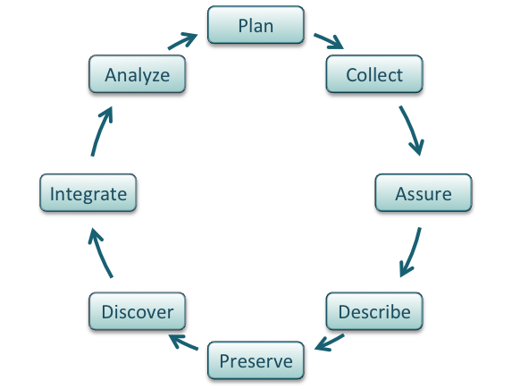

# Managing Data

!!! Success "Learning Objectives"

    After this lesson, you should be able to:

    * Recognize data as the foundation of open science and be able to describe the "life cycle of data"
    * Use self-assessments to evaluate your current data management practices
    * Cite tools and resources to improve your data management practices
    * Know the biggest challenge to effective data management

??? Question "How would you answer?"
    - If you give your data to a colleague who has not been involved with your project, would they be able to make sense of it? Would they be able to use it properly?
    - If you come back to your own data in five years, will you be able to make sense of it? Will you be able to use it properly?
    - When you are ready to publish a paper, is it easy to find all the correct versions of all the data you used and present them in a comprehensible manner?

## Why should you care about data management?

!!! Danger "The biggest challenge to data management is <u> making it an afterthought. </u>"

Poor data management doesn't have an upfront cost. **You can do substantial work before realizing you are in trouble.**

**The solution?** Make data management the first thing you consider when starting a research project.

Well-managed Data Sets:

-   Can make life much easier for you and your collaborators
-   Benefit the scientific research community by allowing others to reuse your data
-   Are becoming required by most funders and many journals, which are requesting a submission of a Data Management Plan (DMP) with the initial submission of your proposal.

!!! info "The NSF is stepping in, getting stricter about data"
    -   Recent [Dear Colleague letter](https://www.nsf.gov/pubs/2019/nsf19069/nsf19069.jsp)from NSF's points out that:
        - Open science promotes broader access to research data, enhancing public benefits and replicability.
        - NSF requires (DMPs) in proposals, encouraging use of persistent IDs and machine-readable DMPs.
    -   NSF [proposal preparation guidelines](https://new.nsf.gov/policies/pappg/23-1/ch-2-proposal-preparation#2D2i-ii) now require at least the following:
        - Proposals must include a 2-page DMP outlining data types, formats, sharing, and archiving.
        - The DMP must address privacy, intellectual property, and reuse policies, and collaborative projects should submit one unified DMP.
        - A DMP stating no detailed plan is needed is allowed with justification, and the DMP will be reviewed as part of the proposal's merit.

---

## What Classifies as Data?

Different types of data require different management practices. Here are some examples of what we can call Data (Adapted from DMPTool [Data management general guidance](https://dmptool.org/general_guidance#types-of-data)).

**Data Types**:

- **Text**: field or laboratory notes, survey responses
- **Numeric**: tables, counts, measurements
- **Audiovisual**: images, sound recordings, video
- **Models, computer code**
- **Discipline-specific**: FASTA in biology, FITS in astronomy, CIF in chemistry
- **Instrument-specific**: equipment outputs

**Data Sources**:

*Observational*

- Captured in real-time, typically outside the lab
- Usually irreplaceable and therefore the most important to safeguard
- Examples: Sensor readings, telemetry, survey results, images

*Experimental*

- Typically generated in the lab or under controlled conditions
- Often reproducible, but can be expensive or time-consuming
- Examples: gene sequences, chromatograms, magnetic field readings

*Simulation*

- Machine generated from test models
- Likely to be reproducible if the model and inputs are preserved
- Examples: climate models, economic models

*Derived / Compiled*

- Generated from existing datasets
- Reproducible, but can be very expensive and time-consuming
- Examples: text and data mining, compiled database, 3D models

## Data Self-assessment

!!! Question "Activity"
    In small groups, discuss the following questions.
        
    1. What are the two or three data types that you most frequently work with?
            -   Think about the sources (observational, experimental, simulated, compiled/derived)
            -   Also consider the formats (tabular, sequence, database, image, etc.)    
    2.  What is the scale of your data?

        ??? Tip "Tip: think of the [Three V's](https://www.bigdataframework.org/four-vs-of-big-data/)"
            -   Volume: Size of the data (MBs, GBs, TBs); can also include how many files (e.g dozens of big files, or millions of small ones)
            -   Velocity: How quickly are these data produced and analyzed? A lot coming in a single batch infrequently, or, a constant small amount of data that must be rapidly analyzed?
            -   Variety: How many different data types (raw files? databases?)
            A fourth V (Veracity) captures the need to make decisions about data processing (i.e., separating low- and high-quality data)

    3.  What is your strategy for storing and backing up your data?    
    4.  What is your strategy for verifying the integrity of your data? (i.e. verifying that your data has not be altered)  
    5.  What is your strategy for searching your data?  
    6.  What is your strategy for sharing (and getting credit for) your data? (i.e. How will do you share with your community/clients? How is that sharing documented? How do you evaluate the impact of data shared? )

---

## The Data Life Cycle 

**Data management** is the set of practices that allow researchers to effectively and efficiently handle data throughout the data life cycle. Although typically shown as a circle (below) the actually life cycle of any data item may follow a different path, with branches and internal loops. Being aware of your data's future helps you plan how to best manage them.

<figure markdown="span">
  
  <figcaption markdown="span"> The Data Life Cycle, from [Strasser *et al*](https://dataoneorg.github.io/Education/bestpractices/). </figcaption>
</figure>

??? Info "Breaking down the Data Life Cycle Graph"

    **Plan**

    - Describe the data that will be compiled, and how the data will be managed and made accessible throughout its lifetime
    - A good plan considers each of the stages below

    **Collect**

    - Have a plan for data organization in place before collecting data
    - Collect and store observation metadata at the same time you collect the metadata
    - Take advantage of machine generated metadata

    **Assure**

    - Record any conditions during collection that might affect the quality of the data
    - Distinguish estimated values from measured values
    - Double check any data entered by hand
    - Perform statistical and graphical summaries (e.g., max/min, average, range) to check for questionable or impossible values.
    - Mark data quality, outliers, missing values, etc.

    **Describe**

    - Comprehensive data documentation (i.e. **metadata**) is the key to future understanding of data. Without a thorough description of the context of the data, the context in which they were collected, the measurements that were made, and the quality of the data, it is unlikely that the data can be easily discovered, understood, or effectively used.
    - Thoroughly describe the dataset (e.g., name of dataset, list of files, date(s) created or modified, related datasets) including the people and organizations involved in data collection (e.g., authors, affiliations, sponsor). Also include:
        - An [ORCID](https://orcid.org/) (obtain one if you don't have one).
        - The scientific context (reason for collecting the data, how they were collected, equipment and software used to generate the data, conditions during data collection, spatial and temporal resolution)
        - The data themselves
        - How each measurement was produced
        - Units
        - Format
        - Quality assurance activities
        - Precision, accuracy, and uncertainty

    Some metadata standards you may want to consider:

    - [DataCite](https://schema.datacite.org/) for publishing data
    - [Dublin Core](http://www.dublincore.org/specifications/dublin-core/dcmi-terms/) for sharing data on the web
    - [MIxS](https://press3.mcs.anl.gov/gensc/mixs/) Minimum Information for any (x) sequence
    - [OGC standards](https://www.opengeospatial.org/docs/is) for geospatial data

    ??? tip "Ontologies provide standardization for metadata values"

        Example of ontologies:
            
        - [Environment Ontology](http://environmentontology.org/) terms for the MIxS standards
        - [Plant Ontology](http://planteome.org/) for plant tissue types or development stages
        - [FAIRSharing.org](https://fairsharing.org/) lists standards and ontologies for life sciences.

    **Preserve**

    In general, data must be preserved in an appropriate long-term archive (i.e. data center). Here are some examples:

    - Sequence data should go to a national repository, frequently [NCBI](https://www.ncbi.nlm.nih.gov/)
    - Identify data with value - it may not be necessary to preserve all data from a project
    - The CyVerse [Data Commons](http://datacommons.cyverse.org/) provides a place to publish and preserve data that was generated on or can be used in CyVerse, where no other repository exists.
    - See lists of repositories at [FAIRSharing.org](https://fairsharing.org/)
    - See lists of repositories at [Data Dryad](https://datadryad.org/stash)
    - Github repos can get DOIs through [Zenodo](https://guides.github.com/activities/citable-code/)
    - Be aware of licensing and other intellectual property issues
        - Repositories will require some kind of license, often the least restrictive (see for example [Creative Commons](https://creativecommons.org/))
        - Repositories are unlikely to enforce reuse restrictions, even if you apply them.

    **Discover**

    - Good metadata allows you to discover your own data!
    - Databases, repositories, and search indices provide ways to discover relevant data for reuse 
        - [Google dataset search](https://toolbox.google.com/datasetsearch)
        - [DataOne](https://www.dataone.org/)
        - [FAIRSharing.org](https://fairsharing.org/)

    **Integrate**

    - Data integration is a lot of work
    - Standards and ontologies are key to future data integration
    - Know the data before you integrate them
    - Don't trust that two columns with the same header are the same data
    - Properly cite the data you reuse!
    - Use DOIs ([Digital Object Identifiers](https://en.wikipedia.org/wiki/Digital_object_identifier)) wherever possible

    **Analyze**

    - Follow open science principles for reproducible analyses (CyVerse, RStudio, notebooks, IDEs)
    - State your hypotheses and analysis workflow before collecting data. Tools like [Open Science Framework](https://osf.io/) (OSF) allow you to make this public.
    - Record all software, parameters, inputs, etc.

??? Note "References and Resources"

    - [DataOne best practices](https://dataoneorg.github.io/Education/bestpractices/)
    - [Center for Open Science](https://cos.io/)

---

## Data Principles

<figure markdown="span">
  {width="450"}
  <figcaption markdown="span"> FAIR data, [NIH](https://www.nlm.nih.gov/oet/ed/cde/tutorial/02-200.html). </figcaption>
</figure>

<figure markdown="span">
  {width="350"}
  <figcaption markdown="span"> CARE data, [University of Arizona](https://swehsc.pharmacy.arizona.edu/news/using-care-principles-preserve-indigenous-data-sovereignty). </figcaption>
</figure>

!!! Success "Learning Objectives"
    - Recall the meaning of FAIR
    - Understand why FAIR is a collection of principles (rather than rules)
    - Understand CARE

### FAIR Principles

In 2016, the [**FAIR Guiding Principles**](https://www.nature.com/articles/sdata201618) for scientific data management and stewardship were published in Scientific Data.

 <b><u>Read it.</u></b>

!!! Tip "Why Principles?"

    FAIR is a collection of principles. Ultimately, different communities within different scientific disciplines must work to interpret and implement these principles. Because technologies change quickly, focusing on the desired end result allows FAIR to be applied to a variety of situations now and in the foreseeable future.

**Findable**

- F1. (meta)data are assigned a globally unique and persistent identifier
- F2. data are described with rich metadata (defined by R1 below)
- F3. metadata clearly and explicitly include the identifier of the data it describes
- F4. (meta)data are registered or indexed in a searchable resource

**Accessible**

- A1. (meta)data are retrievable by their identifier using a standardized communications protocol
- A1.1 the protocol is open, free, and universally implementable
- A1.2 the protocol allows for an authentication and authorization procedure, where necessary
- A2. metadata are accessible, even when the data are no longer available

**Interoperable**

- I1. (meta)data use a formal, accessible, shared, and broadly applicable language for knowledge representation.
- I2. (meta)data use vocabularies that follow FAIR principles
- I3. (meta)data include qualified references to other (meta)data

**Reusable**

- R1. meta(data) are richly described with a plurality of accurate and relevant attributes
- R1.1. (meta)data are released with a clear and accessible data usage license
- R1.2. (meta)data are associated with detailed provenance
- R1.3. (meta)data meet domain-relevant community standard

!!! Tip "Open vs. Public vs. FAIR"

    Open: <u>“Open data and content can be freely used, modified, and shared by anyone for any purpose”</u>.

    FAIR does **NOT** demand that data be open: See one definition of open:
    http://opendefinition.org/.

### CARE Principles

 

 <i>Nihil de nobis, sine nobis.</i>

<a href="https://pubmed.ncbi.nlm.nih.gov/31746723/"><b><u>Nothing about us without us.</u></b></a>

 

!!! question "Who owns the açaí?"

The [CARE Principles](https://www.gida-global.org/care) for Indigenous Data Governance were drafted at the International Data Week and Research Data Alliance Plenary co-hosted event "Indigenous Data Sovereignty Principles for the Governance of Indigenous Data Workshop," 8 November 2018, Gaborone, Botswana.

**Collective Benefit**

- C1. For inclusive development and innovation
- C2. For improved governance and citizen engagement
- C3. For equitable outcomes

**Authority to Control**

- A1. Recognizing rights and interests
- A2. Data for governance
- A3. Governance of data

**Responsibility**

- R1. For positive relationships
- R2. For expanding capability and capacity
- R3. For Indigenous languages and worldviews

**Ethics**

- E1. For minimizing harm and maximizing benefit
- E2. For justice
- E3. For future use

!!! Tip "Connecting FOSS and CARE: [Lydia Jennings](https://nativesoilnerd.com/)"

    Dr. Lydia Jennings was a Data Science Fellow at the University of Arizona, who attended FOSS in  Fall of 2022.      
    Lydia graduated from the University of Arizona's Department of Evironemtal Sciences, and has published a paper on the application of the CARE principles to ecology and biodiversity research.
    Go Lydia!
    [Appying the 'CARE Principles for Indigenous Data Governance' to ecology and biodiversity](https://www.nature.com/articles/s41559-023-02161-2), *Nature Ecology & Evolution*, 2023. 

### How to get to FAIR?

This is a question that only you can answer, that is because it depends on (among other things)

1.  Your scientific discipline: Your datatypes and existing standards for what constitutes acceptable data management will vary.
2.  The extent to which your scientific community has implemented FAIR: Some disciplines have significant guidelines on FAIR, while others have not addressed the subject in any concerted way.
3.  Your level of technical skills: Some approaches to implementing FAIR may require technical skills you may not yet feel comfortable with.

While a lot is up to you, the first step is to evaluate how FAIR you think your data are:

??? Question "Assessing the FAIRness of you data"
    Thinking about a dataset you work with, complete the ARDC [FAIR assessment](https://ardc.edu.au/resource/fair-data-self-assessment-tool/) in your own time.

??? Note "Resources"

    - [The FAIR Guiding Principles for scientific data management and stewardship](https://www.nature.com/articles/sdata201618)
    - [Wilkinson et al. (2016)](https://doi.org/10.1038/sdata.2016.18) established the guidelines to improve the Findability, Accessibility, Interoperability, and Reuse (FAIR) of digital assets for research. 
    - [Go-FAIR website](https://www.go-fair.org/fair-principles/)
    - [Carroll *et al.* (2020)](http://doi.org/10.5334/dsj-2020-043) established the CARE Principles for Indigenous Data Governance. [full document :fontawesome-solid-file-pdf:](https://static1.squarespace.com/static/5d3799de845604000199cd24/t/5da9f4479ecab221ce848fb2/1571419335217/CARE+Principles_One+Pagers+FINAL_Oct_17_2019.pdf)
    - [Indigenous Data Sovereignty Networks](https://indigenousdatalab.org/networks/)

---

## Data Management Plans

<i>"Those who fail to plan, plan to fail."</i>

!!! Success "Learning Objectives"
    - Describe the purpose of a data management plan
    - Describe the important elements of a data management plan

!!! Quote "What is a DMP?"
    
    "A data management plan or DMP is a formal document that outlines how data are to be handled both during a research project, and after the project is completed. The goal of a data management plan is to consider the many aspects of data management, metadata generation, data preservation, and analysis before the project begins; this may lead to data being well-managed in the present, and prepared for preservation in the future."
    
    Source: [Wikipedia](https://en.wikipedia.org/wiki/Data_management_plan).

Here are some [Example DMPs](https://dmptool.org/public_plans) made public from the DMPtool website. You can use these as example for creating your own DMP.

**Why bother with a DMP?**

??? Question "How would you answer?"
    Do you have a data management plan? If so, how do you use it?

Returning to the assertion that data (and its value) is at the foundation of your science, working without a data management plan should be considered scientific misconduct.

Those are strong words. And while we might have an intuition of the boundaries of research ethics - data mismanagement seems more like an annoyance than misconduct. However, if your mismanagement leads to error in your research data, or the inability to make publicly-funded research open to the public, these are serious consequences. Increasingly, funders realize this.

<figure markdown="span">
  {width="450"}
  <figcaption markdown="span"> "Europe 1916", by cartoonist Boardman Robinson, depicting the [carrot and stick metaphor](https://en.wikipedia.org/wiki/Carrot_and_stick). </figcaption>
</figure>

**Stick:**

- [You have to make one](https://www.nsf.gov/pubs/2019/nsf19069/nsf19069.jsp).
- Reviewers definitely look at them, but they may not be enforced.

**Carrot:**

- Make your life easier.
- Planning for you project makes it run more smoothly.
- Avoid surprise costs.

 
 

!!! Tip "DMPTools: making your (data) life a little easier"

    Here are a couple of tools you can utilize in order to create a Data Management Plan:

    - [Data Stewardship Wizard](https://ds-wizard.org/).
    - [DMPTool](https://dmptool.org/).

---

## Licenses

By default, when you make creative work, that work is under exclusive copyright. This means that you have the right to decide how your work is used, and that others must ask your permission to use your work.

If you want your work to be Open and used by others, you need to specify how others can use your work. This is done by *licensing* your work.

!!! Tip "License Examples"
    
    - [MIT License](https://choosealicense.com/licenses/mit/)
    - [GNU General Public License v3.0](https://choosealicense.com/licenses/gpl-3.0/)
    - FOSS material has been licensed using the [Creative Commons Attribution 4.0 International License](https://creativecommons.org/licenses/by/4.0/)

### License Options from UArizona Library

<figure markdown>
  <a href="https://data.library.arizona.edu/supported-platforms/redata" target="blank" rel="open science">{ width="600" } </a>
    <figcaption> License options for University of [Arizona Research Data Repository (ReDATA)](https://data.library.arizona.edu/supported-platforms/redata).  </figcaption>
</figure>

 

**Additional Info**

- General guidance on how to choose a license https://choosealicense.com/
- More good guidance on how to choose a license https://opensource.guide/legal/
- Licensing options for your [Github Repository](https://docs.github.com/en/repositories/managing-your-repositorys-settings-and-features/customizing-your-repository/licensing-a-repository#choosing-the-right-license){target=_blank}

??? Note "References and Resources"

    - [NSF Guidelines on DMPs](https://www.nsf.gov/bio/biodmp.jsp)
    - https://dmptool.org/general_guidance
    - https://dmptool.org/public_templates
    - Professional and scholarly societies, e.g., theEcological Society of America http://www.esa.org/esa/science/data-sharing/resources-and-tools/
    - DataOne - https://dataoneorg.github.io/Education/bestpractices/
    - Data Carpentry - http://datacarpentry.org/
    - The US Geological Survey https://www.usgs.gov/data-management
    - Repository registry (and search) service: http://www.re3data.org/
    - Your university library

----

## Self Assessment

??? Question "What is a Data Management Plan?"

    **Important**: A data management plan (DMP) is now required aspect of publicly funded research.

    DMPs are short, formal, documents outlining what types of data will be used, and what will be done with the data both during and after a research project concludes.

??? Question "True or False: When science project funding ends, the data should end with it"

    !!! Success "False"

        Data live on after a project ends.

        Ensuring that data have a full lifecycle where they can be (re)hosted and made available after a project ends is critical to open science and reproducible research

    !!! Danger "Maybe"

        Sometimes destroying data is part of the life cycle of data - this may be required if data are sensitive and could be used unethically in the future, beyond the control of the original investigator team. 

??? Question "True or False: FAIR and CARE data principles are the same"

    !!! Success "False"

        The CARE principles were created in order to help guide and answer when and how applying FAIR data principles to soverign indigenous-controlled data should be done and when it should not. 

