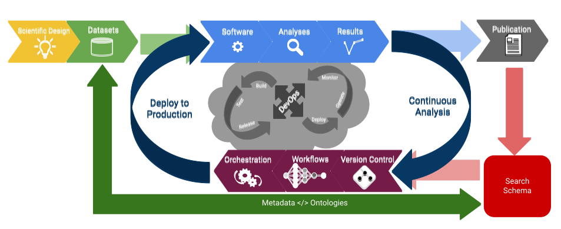

# Introduction to Project Management

!!! Success "Learning Objectives"
        
        After this lesson, you should be able to:

        *  Discuss different levels of project management
        *  Describe tools and approaches to managing collaborative projects
        *  Describe best practices for computational project organization
        *  Understand benefits of establishing project management practices from the start of a project until after it ends

"**Project Management**" by itself may sound a bit vague and broad. 

??? Quote "Definition"

    "Project management is the use of specific knowledge, skills, tools and techniques to deliver something of value to people. The development of software for an improved business process, the construction of a building, the relief effort after a natural disaster, the expansion of sales into a new geographic market—these are all examples of projects." - [Project Management Institute](https://www.pmi.org/about/learn-about-pmi/what-is-project-management){target=_blank} 

    [:material-wikipedia: Wikipedia definition](https://en.wikipedia.org/wiki/Project_management){target=_blank}

Here we use the term in two different contexts.

First, we'll go over the project management of scientific labs, groups, and projects, talking about things like governance, how to develop operations manuals, laying out roles and responsibilities, planning steps and the workflows which connect them. 

Next, we'll go over project management as "[research objects](https://en.wikipedia.org/wiki/Research_Object){target=_blank}": making sure your data, code, and documents are well-organized. These are crucial for future topics like version control and reproducibility.

## What is Project Management?

This type of overall project management may be required for some grants, and while it may be tempting to put in the minimal effort on one of the many pieces of paperwork you're required to complete, this type of overall project planning can be very useful. 

The Turing Way offer a [lesson on Project Design](https://the-turing-way.netlify.app/project-design/project-design.html){target=_blank} related to effective project planning and management.

### Project Governance 

??? Quote "Definitions"

    Project Governance is the set of rules, procedures and policies that determine how projects are managed and overseen.

    "The set of policies, regulations, functions, processes, and procedures and responsibilities that define the establishment, management and control of projects, programmes or portfolios." - [APM (2012)](https://www.academia.edu/44132624/APM_BODY_OF_KNOWLEDGE){target=_blank}, [open.edu](https://www.open.edu/openlearn/mod/oucontent/view.php?id=27294&printable=1){target=_blank}

    [:material-wikipedia: Wikipedia Definition](https://en.wikipedia.org/wiki/Project_governance){target=_blank}

No matter how small, i.e., even single person-run projects, a good Project Governance structure can help keep work on track and headed toward a timely finish.

Establishing a project governance document at the onset of a project is a good way of setting boundaries, roles and responsibilities, pre-registration about what deliverables are expected, and what the consequences will be for breaking trust.

??? Tip "Example Governance Documents"

    [Munoz-Torres et al. 2020](https://zenodo.org/record/3839120#.YyUJA-zMLzd){target=_blank}

### Research Collaborations

[Sahneh & Balk et al. (2020)](https://doi.org/10.1371/journal.pcbi.1008879){target=_blank} Ten simple rules to cultivate transdisciplinary collaboration in data science, discuss the interactions amongst teams of diverse researchers.

<figure markdown>
  <a href="https://doi.org/10.1371/journal.pcbi.1008879" target="blank" rel="10 simple rules">{ width="600" } </a>
    <figcaption> [Sahneh & Balk et al. (2020)](https://doi.org/10.1371/journal.pcbi.1008879){target=_blank} Fig 1. How the rules work together and intersect. There are multiple components in collaborations: person–person interactions, person–technology interactions, person–data interactions, and data–technology interactions. Synergy between these components results in a successful collaboration. </figcaption>
</figure>


### Breakout Discussion

Now we will do a breakout discussion section to talk about overall project management.

??? Question "What are some project management strategies that you have found to work well?"

??? Question "What is an example of a poorly managed project you were involved in? What contributed to this feeling?"

??? Question "Why do you think effective project management is important to Open Science?"

??? Question "What are some limitations to you, your lab/group, or your domain?"

---

### Team Roles and Responsibilities

It can be easy for certain tasks to slip through the cracks. Established roles and responsibilities of teams can help ensure nobody gets saddled with too much work, and reduces chances of disputes among collaborators.

??? Tip "Project Management Professional (PMP)®"

    A [Project Management Professional (PMP)®](https://www.pmi.org/certifications/project-management-pmp){target=_blank} certification has been embraced globally as adding value to your professional resume. 

    Academia has also embraced PMP certification as part of continuing education for academic staff and faculty.

    [University of Arizona PMP prep](https://ce.arizona.edu/classes/fundamentals-project-management-pmp-exam-prep){target=_blank}


??? Example "Team roles and titles"

    Again, The Turing Way provide an excellent set of examples of [infrastructure job titles and roles](https://the-turing-way.netlify.app/collaboration/research-infrastructure-roles.html){target=_blank} on software driven projects:

    **Community Manager** - "responsibilities include establishing engagement, organising community spaces and events, supporting people through inclusive practices, developing and maintaining resources, growing and evaluating use cases and collaborating with people involved in research and scientific communities." ([1](https://the-turing-way.netlify.app/collaboration/research-infrastructure-roles/community-manager.html#community-managers-overview){target=_blank}, [2](https://www.turing.ac.uk/research/research-programmes/tools-practices-and-systems/community-management-and-open-research){target=_blank})

    <figure markdown>
        <a href="https://the-turing-way.netlify.app/collaboration/research-infrastructure-roles/community-manager.html" target="blank" rel="community manager">{ width="400" } </a>
        <figcaption>This image was created by [Scriberia](https://www.scriberia.com/){target=_blank} for The Turing Way community and is used under a CC-BY 4.0 licence.</figcaption>
    </figure>

    **[Data Science Educator](https://datascienceineducation.com/c03.html){target=_blank}** - "... data science in education refers to the application of data science methods, while other times it refers to data science as a context for teaching and learning" [Rosenberg et al. (2020)](https://www.taylorfrancis.com/chapters/edit/10.4324/9780429260919-7/making-data-science-count-education-joshua-rosenberg-michael-lawson-daniel-anderson-ryan-seth-jones-teomara-rutherford){target=_blank}, [Estrellado et al.](https://datascienceineducation.com/c03.html){target=_blank}

    **[Data Scientist](https://en.wikipedia.org/wiki/Data_science){target=_blank}** - a professional who uses analytical, statistical, and programming skills to collect, analyze, and describe data.

    **[Data Steward](https://the-turing-way.netlify.app/collaboration/research-infrastructure-roles/data-steward.html?highlight=data%20steward){target=_blank}** - "... responsible for ensuring the quality and fitness for purpose of the organization's data assets, including the metadata for those data assets." - [Wikipedia]()

    **[Developer Advocate](){target=_blank}** - sometimes called [platform evangelism](https://en.wikipedia.org/wiki/Platform_evangelism), advocates represent the voice of the user (in the case of open science, the scientists) internally to the project team or company, and the voice of the project or company externally to the public.

    **[DevOps Engineer](https://en.wikipedia.org/wiki/DevOps){target=_blank}** - a combinination of software development "Dev" and IT operations "Ops", responsibilities focus on "[continuous delivery](https://en.wikipedia.org/wiki/Continuous_delivery){target=_blank}" and [agile software development](https://en.wikipedia.org/wiki/Agile_software_development){target=_blank}

    **[Research Application Manager (RAM)](https://the-turing-way.netlify.app/collaboration/research-infrastructure-roles/ram.html){target=_blank}** - in some ways a combination of Community Manager and Developer Advocate,

    <figure markdown>
        <a href="https://the-turing-way.netlify.app/collaboration/research-infrastructure-roles/ram.html" target="blank" rel="ram">{ width="600" } </a>
        <figcaption>Fig. 94 Research Application Managers work with the research team to embed outputs into user organisations. The Turing Way Community, & Scriberia. (2020, November). Illustrations from the Turing Way book dashes. Zenodo. http://doi.org/10.5281/zenodo.4323154</figcaption>
    </figure>

    **[Research Software Engineer](https://us-rse.org/about/what-is-an-rse/){target=_blank}** - those who regularly use expertise in programming to advance research - [US Research Software Engineer (US-RSE) Association](https://us-rse.org/){target=_blank}

#### Open Source Research Software Maintainer

Becoming an open source software maintainer is not to be taken likely.

<figure markdown>
  <a href="https://m.xkcd.com/2347/" target="blank" rel="xkcd">{ width="400" } </a>
    <figcaption> Image Credit: [XKCD Dependency](https://m.xkcd.com/2347/){target=_blank} </figcaption>
</figure>

When you create a new software, library, or package, you are becoming its parent and guardian. 

---

## What are Research Objects?

??? Quote "Definition"

    "A workflow-centric research object bundles a workflow, the provenance of the results obtained by its enactment, other digital objects that are relevant for the experiment (papers, datasets, etc.), and annotations that semantically describe all these objects." - [Corcho et al. 2012](https://oa.upm.es/20401/){target=_blank}

    "... semantically rich aggregations of resources, that can possess some scientific intent or support some research objective." - [Bechhofer et al. 2010](https://doi.org/10.1038/npre.2010.4626.1){target=_blank}

    [:material-wikipedia: Wikipedia definition](https://en.wikipedia.org/wiki/Research_Object){target=_blank}

When we talk about project management in this section, we mean the way you organize data, code, images, documents, and documentation within a project. One way to think about this is in the context of "[research objects](https://en.wikipedia.org/wiki/Research_Object){target=_blank}" which condense into a single end point (think: a URL like a digital object identifier (DOI)) where others can come to reproduce your research. 

<figure markdown>
  <a href="" target="blank" rel="ro">{ width="800" } </a>
    <figcaption> A conceptual workflow for developing research objects with cyberinfrastructure</figcaption>
</figure>


??? List "Research Object Services"

    [ResearchObject](https://www.researchobject.org/){target=_blank}

    [ROHub](https://reliance.rohub.org/){target=_blank} - [Garcia-Silva et al. 2019](https://doi.org/10.1016/j.future.2019.03.046){target=_blank}

 
If you've ever had to navigate someone else's computer or a GitHub repository, you probably know that a poorly organized project can greatly reduce its accessibility. On the other hand, a well-organized project can:

-   make your work more accessible to others
-   help collaborators effectively contribute to your project
-   ease the growing pains of a rapidly scaling project
-   make life much easier for your future self

It can be easy to overlook sound project management, opting for a "just get it done ASAP" approach to your work, but this almost always costs you more time in the end. The best time to introduce good project management is at the start of a project, and the second best time is right now. 

<figure markdown>
  <a href="" target="blank" rel="ro">{ width="600" } </a>
    <figcaption> An hour spent reorganizing a project today may save you days of headaches later on.</figcaption>
</figure>

There is no single "right way" to organize and manage a project, and your specific needs may vary, but we will introduce a basic framework that can get you headed in the right direction. It will also help us introduce more advanced topics later on, as many of the skills and approaches we teach will be far more effective if the basic project organization is sound.

??? Info "Development Methology"

    <figure markdown>
        <a href="https://upload.wikimedia.org/wikipedia/commons/d/da/Waterfallvsagile.jpg" target="blank" rel="agile">{ width="400" } </a>
        <figcaption> the "leaps of faith" required in Agile vs Waterfall. Image Credit: Wikimedia Commons CC BY 4.0 </figcaption>
    </figure>

    In software development, there are two common methologies which have similar applications to a research project.

    [:material-wikipedia: Agile](https://en.wikipedia.org/wiki/Agile_software_development)
    
    - [Scrum](https://www.atlassian.com/agile/scrum) - is one technique within Agile

    - [Kanban](https://www.atlassian.com/agile/kanban) - is one technique within Agile
    
    [:material-wikipedia: Waterfall](https://en.wikipedia.org/wiki/Waterfall_model)

    <figure markdown>
        <a href="https://upload.wikimedia.org/wikipedia/commons/4/49/Waterfall_vs_agile-1.png" target="blank" rel="agile">{ width="800" } </a>
        <figcaption> the effort distribtion of Agile vs Waterfall. Image Credit: Wikimedia Commons CC BY 4.0 </figcaption>
    </figure>


    [LucidChart Blog: Agile vs Waterfall vs Kanban vs Scrum ](https://www.lucidchart.com/blog/agile-vs-waterfall-vs-kanban-vs-scrum) 

    [Ontology of Value: Agile vs Waterfall vs Kanban vs Scrum](https://ontologyofvalue.com/project-management-key-concepts-agile-kanban-scrum-waterfall/)


### Hands on

For the duration of the workshop, we will be working with a basic example project pipeline, going from raw data to a simple report. While this example project is vastly simplified from a real research project, the basic steps are still found in most projects. The skills you learn to improve this example project will translate to larger and more complex research projects.

Your project will almost certainly differ from this general workflow in some way, but many of the basic steps will be similar: you collect some data, manipulate it, analyze it, make some outputs, and produce some reports. 

There may be many additional steps and sub-steps for each of these processes, but the key thing is how they relate to each other and how you manage the relationships and organization of various files.

### Data Organization

- Example data project organization from [UArizona Libraries](https://data.library.arizona.edu/data-management/best-practices/data-project-organization)
- [CookieCutter Templates](https://github.com/topics/cookiecutter)

Example project structure:

``` 
.
├── AUTHORS.md
├── LICENSE
├── README.md
├── bin                <- Your compiled model code can be stored here (not tracked by git)
├── config             <- Configuration files, e.g., for doxygen or for your model if needed
├── data
│   ├── external       <- Data from third party sources.
│   ├── interim        <- Intermediate data that has been transformed.
│   ├── processed      <- The final, canonical data sets for modeling.
│   └── raw            <- The original, immutable data dump.
├── docs               <- Documentation, e.g., doxygen or scientific papers (not tracked by git)
├── notebooks          <- Ipython or R notebooks
├── reports            <- For a manuscript source, e.g., LaTeX, Markdown, etc., or any project reports
│   └── figures        <- Figures for the manuscript or reports
└── src                <- Source code for this project
    ├── data           <- scripts and programs to process data
    ├── external       <- Any external source code, e.g., pull other git projects, or external libraries
    ├── models         <- Source code for your own model
    ├── tools          <- Any helper scripts go here
    └── visualization  <- Scripts for visualisation of your results, e.g., matplotlib, ggplot2 related.

```

??? Tip "Best Practices"

    1. Projects should be self-contained
        -   this is probably the most important concept
        -   strictly necessary for version control
        -   use relative paths

    2. Use structure to organize files

    3. Don't underestimate complexity

    4. Keep raw data raw

    5. Treat generated output as disposable

    6. Avoid manual (point-and-click) steps as much as possible
        -   if necessary, record in detail
        -   should also be recorded in prior and subsequent steps

    7.  Avoid spaces in file and folder names
        - consider `snake_case` `camelCase` `PascalCase` `kebab-case` instead

    8.  Describe structure in README

    9.  The best time to organize is at the start, the 2nd best is right now

    10. Reorganize if necessary, but don't overdo it

    11. Using same basic structure can help you navigate new/old projects

??? Tip "Productivity Software"

    [:material-shield-key: CryptPad](https://cryptpad.fr/){target=_blank} - online rich text pad. 

    [:material-pencil: Draw.io](https://about.draw.io/){target=_blank} - drawings and diagrams in browser.

    [:material-file-excel: Excel](https://www.microsoft.com/en-us/microsoft-365/excel){target=_blank} - love it or hate it, many people still work in it or with `.xlsx` format files. 

    [:material-google-drive: Google Docs](https://www.google.com/docs/about/){target=_blank} - is an online word processor included as part of the free, web-based Google Docs Editors suite offered by Google.

    [:octicons-markdown-16: HackMD](https://hackmd.io){target=_blank} - online markdown editor.

    [:octicons-markdown-16: JupyterBook](https://jupyterbook.org/en/stable/intro.html){target=_blank} - create documentation using Jupyter Notebooks and Markdown

    [:octicons-markdown-16: MkDocs](https://www.mkdocs.org/){target=_blank} - is a fast, simple and downright gorgeous static site generator that's geared towards building project documentation.

    [:material-feather: LaTeX](https://www.latex-project.org/){target=_blank} -  is a high-quality typesetting system

    [:material-leaf: Overleaf](https://www.overleaf.com/){target=_blank} - LaTeX online document sharing platform.

    [:octicons-markdown-16: ReadTheDocs](https://readthedocs.com/){target=_blank} - documentation using a variety of Markup langages

    [Software Heritage](https://www.softwareheritage.org/){target=_blank} - preserves software source code for present and future generations.

??? Tip ":octicons-project-24: Project Management Software"

    [OSF.io]()
        
    - Examples
    
    [:material-atlassian: Atlassian](https://www.atlassian.com/){target=_blank}

    - [:fontawesome-brands-confluence: Confluence](https://www.atlassian.com/software/confluence){target=_blank}

    - [:material-jira: Jira](https://www.atlassian.com/software/jira){target=_blank}

    - [:material-trello: Trello](https://trello.com/en){target=_blank}

    [:material-github: GitHub Issues](https://github.com/features/issues){target=_blank}

    [Open Project](https://www.openproject.org/){target=_blank}

    [:octicons-git-merge-24: ZenHub](https://www.zenhub.com/){target=_blank}

??? Info "Key Concepts for Research Objects"


    ??? Info "Project Critique Activity"

        For this activity, the instructor will walk you through an example of a simple project workflow on their computer. 

        Take notes on anything you notice that might be a hindrance to the openness or reproducibility of the project.
        
        We will then start breakout sessions for 5-10 minutes for group discussions on any issues you noticed and how you might improve on them.

??? Info "Create a working directory"

    You might find a nice basic structure that works as a good starting place for many of your projects, or smaller components of big projects.

    Instead of having to repeat the process of making that directory structure, which could be tedious and introduce mistakes, you could write some code to do it for you. 

    The following is a `bash` script that takes one argument, the name of the new project (with no spaces), and creates that project with a premade directory structure for you to put files into.

    ``` {bash}

    #!/usr/bin/env bash

    # Run this script with the name of the new project as 
    # an argument, like so: `bash make_project.sh my_project`
    # It will generate a project with the following structure:

    #.
    #|-- README.md
    #|-- data
    #|   |-- cleaned
    #|   `-- raw
    #|-- images
    #|-- reports
    #`-- scripts

    mkdir "$1"

    cd "$1" || exit

    echo "# $1" >> README.md

    mkdir data

    mkdir data/raw

    mkdir data/cleaned

    mkdir scripts

    mkdir images

    mkdir reports
    ```

    This approach to automating repetitive tasks is something we'll dig into even deeper in later lessons.

### Other Resources

There are many other resources on more specific elements of project
management. We'll link to some of them here.

-   Using R Projects with RStudio: https://support.rstudio.com/hc/en-us/articles/200526207-Using-Projects
-   Using the R package `here`: <https://github.com/jennybc/here_here> and <https://here.r-lib.org/>
-   An even more compartmentalized approach to project management: <https://hrdag.org/2016/06/14/the-task-is-a-quantum-of-workflow/>

## Self Assessment

??? Question "What are things that we do with data under the auspices of "Data Management"?"

    ??? Success "Answers"

        -   Data collection
        -   Data entry
        -   Data validation
        -   Data preservation
        -   Metadata

??? Question "What are common steps to cleaning data?"

    ??? Success "Answers"

        -   Validation
        -   Exploratory analysis/sleuthing
        -   Naming
        -   Structuring
        -   Consistency

??? Question "Research Objects must include all components of research: governance document, manuals, documentation, research papers, analysis code, data, software containers"

    ??? Failure "Answers"

        While a Research Object (RO) *may* include the entire kitchen sink from a research project, it does NOT always contain all of these things.

        Fundamentally, a RO should contain enough information and detail to reproduce a scientific study from its linked or self-contained parts. 

        Components like large datasets may not be a part of the RO, but the code or analysis scripts should have the ability to connect to or stream those data.

