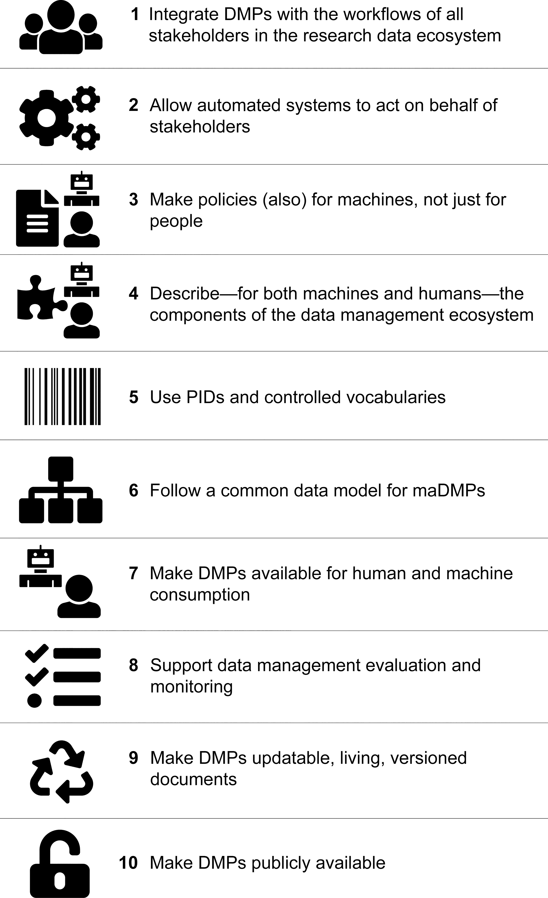

# Managing Data

!!! Success "Learning Objectives"

    After this lesson, you should be able to:

    * Recognize data as the foundation of open science and be able to describe the "life cycle of data"
    * Use self-assessments to evaluate your current data management practices
    * Cite tools and resources to improve your data management practices
    * Know the biggest challenge to effective data management

### Why should you care about data management?

Most scientific work centers on generating new data or working with
existing data, which means researchers spend a lot of time dealing with
it. Ensuring that data are effectively organized, shared, and preserved
is critical to making your science impactful, efficient, and open.

!!! Question "How would you answer?"
        - If you give your data to a colleague who has not been involved with your project, would they be able to make sense of it? Would they be able to use it properly?
        - If you come back to your own data in five years, will you be able to make sense of it? Will you be able to use it properly?
        - When you are ready to publish a paper, is it easy to find all the correct versions of all the data you used and present them in a comprehensible manner?

Data management skills produce self-describing datasets that:

-   Make life much easier for you and your collaborators
-   Benefit the scientific research community by allowing others to reuse your data
-   Are required by most funders and many journals
-   Recent [Dear Colleague letter](https://www.nsf.gov/pubs/2019/nsf19069/nsf19069.jsp) from NSF
-   NSF [proposal preparation guidelines](https://www.nsf.gov/pubs/policydocs/pappg19_1/pappg_11.jsp#XID4)

---

### Data Self-assessment

**Part I: Basic questions**

Here are some questions about how you manage and work with data. We will
complete some more formal assessments later, but for now let's see
where you are.

!!! Question "Activity"
        In small groups, discuss the following questions. You will be provided with a space for documenting our shared answers.
        1. What are the two or three data types that you most frequently work with?
            -   Think about the sources (observational, experimental, simulated, compiled/derived)
            -   Also consider the formats (tabular, sequence, database, image, etc.)
        2.  What is the scale of your data?

        ??? Tip
            We often talk about the scale of data using the ["Three V's"](https://www.bigdataframework.org/four-vs-of-big-data/):
            -   Volume: Size of the data (MBs, GBs, TBs); can also include how many files (e.g dozens of big files, or millions of small ones)
            -   Velocity: How quickly are these data produced and analyzed? A lot coming in a single batch infrequently, or, a constant small amount of data that must be rapidly analyzed?
             -   Variety: How many different data types (raw files? databases?)
             A fourth V (Veracity) captures the need to make decisions about data processing (i.e., separating low- and high-quality data)
             
        3.  What is your strategy for storing and backing up your data?
        4.  What is your strategy for verifying the integrity of your data? (i.e. verifying that your data has not be altered)
        5.  What is your strategy for searching your data?
        6.  What is your strategy for sharing (and getting credit for) your data? (i.e. How will do you share with your community/clients? How is that sharing documented? How do you evaluate the impact of data shared? )

---

## Data Management Basics

Let's learn a little more about data so that we can evaluate your
self-assessment responses.

### Data Types

Different types of data require different management practices. What are
some data types and sources you might use in your work? (Adapted from
DMP Tool [Data management general guidance](https://dmptool.org/general_guidance#types-of-data))

**Data Types**

-   Text: field or laboratory notes, survey responses
-   Numeric: tables, counts, measurements
-   Audiovisual: images, sound recordings, video
-   Models, computer code
-   Discipline-specific: FASTA in biology, FITS in astronomy, CIF in chemistry
-   Instrument-specific: equipment outputs

**Data Sources**

*Observational*

-   Captured in real-time, typically outside the lab
-   Usually irreplaceable and therefore the most important to safeguard
-   Examples: Sensor readings, telemetry, survey results, images

*Experimental*

-   Typically generated in the lab or under controlled conditions
-   Often reproducible, but can be expensive or time-consuming
-   Examples: gene sequences, chromatograms, magnetic field readings

*Simulation*

-   Machine generated from test models
-   Likely to be reproducible if the model and inputs are preserved
-   Examples: climate models, economic models

*Derived / Compiled*

-   Generated from existing datasets
-   Reproducible, but can be very expensive and time-consuming
-   Examples: text and data mining, compiled database, 3D models

---

!!! Tip
        **The Data Life Cycle**

        *Data management* is the set of practices that allow researchers to
        effectively and efficiently handle data throughout the data life
        cycle. Although typically shown as a circle (below) the actually
        life cycle of any data item may follow a different path, with
        branches and internal loops. Being aware of your data's future
        helps you plan how to best manage them.

        

        Image from [Strasser *et al*](https://www.dataone.org/sites/all/documents/DataONE_BP_Primer_020212.pdf).

### Best practices for the data life cycle

**The most important thing to remember about data management is that you
are not alone.** There are data management experts within your
discipline, many of them not farther away than your university library
system. In addition, there are many organizations (including many cited
below) which work to solve.

!!! Warning
        **The biggest challenge to effective data management**

        The biggest challenge to data management making it an afterthought.

        Unfortunately, poor data management doesn't have a high upfront cost.
        You can do substantial work before realizing you are in trouble. Like
        a swimmer in rip current, by the time you realize you are in trouble,
        you may already be close to drowning.

        The solution? Make data management the first thing you consider when
        starting a research project. It also needs to be a policy you
        institute right away for your research group.

Here are some excellent steps to consider. The summary below is adapted
from the excellent [DataONE best practices primer](https://old.dataone.org/sites/all/documents/DataONE_BP_Primer_020212.pdf).

**Plan**

-   Describe the data that will be compiled, and how the data will be managed and made accessible throughout its lifetime
-   A good plan considers each of the stages below

**Collect**

-   Have a plan for data organization in place before collecting data
-   Collect and store observation metadata at the same time you collect the metadata
-   Take advantage of machine generated metadata

**Assure**

-   Record any conditions during collection that might affect the quality of the data
-   Distinguish estimated values from measured values
-   Double check any data entered by hand
-   Perform statistical and graphical summaries (e.g., max/min, average, range) to check for questionable or impossible values.
-   Mark data quality, outliers, missing values, etc.

**Describe:**

-   Comprehensive data documentation (i.e. metadata) is the key to
    future understanding of data. Without a thorough description of
    the context of the data, the context in which they were collected,
    the measurements that were made, and the quality of the data, it
    is unlikely that the data can be easily discovered, understood, or
    effectively used.

-   Organize your data for publication. Before you can describe your
    data, you must decide how to organize them. This should be planned
    before hand, so that data organization is a minimal task at the
    time of publication.

-   Thoroughly describe the dataset (e.g., name of dataset, list of
    files, date(s) created or modified, related datasets) including
    the people and organizations involved in data collection (e.g.,
    authors, affiliations, sponsor). Also include:
    -   An [ORCID](https://orcid.org/) (obtain one if you don't have one).
    -   The scientific context (reason for collecting the data, how they were collected, equipment and software used to generate the data, conditions during data collection, spatial and temporal resolution)
    -   The data themselves
    -   How each measurement was produced
    -   Units
    -   Format
    -   Quality assurance activities
    -   Precision, accuracy, and uncertainty

Metadata standards and ontologies are invaluable for supporting data
reuse. Metadata standards tell you:

-   Which metadata attributes to include
-   How to format your metadata
-   What values are allowable for different attributes

Some metadata standards you may want to consider:

-   [DataCite](https://schema.datacite.org/) for publishing data
-   [Dublin Core](http://www.dublincore.org/specifications/dublin-core/dcmi-terms/) for sharing data on the web
-   [MIxS](https://press3.mcs.anl.gov/gensc/mixs/) Minimum Information for any (x) sequence
-   [OGC standards](https://www.opengeospatial.org/docs/is) for geospatial data

Ontologies provide standardization for metadata values:

-   Example: [Environment Ontology](http://environmentontology.org/) terms for the MIxS standards
-   Example: [Plant Ontology](http://planteome.org/) for plant tissue types or development stages
-   [FAIRSharing.org](https://fairsharing.org/) lists standards and ontologies for life sciences.

The CyVerse Data Commons supports good data description through:

-   Metadata templates
-   Bulk metadata upload
-   Automatic collection of analysis parameters, inputs, and outputs in the DE.

**Preserve**

In general, data must be preserved in an appropriate long-term archive
(i.e. data center). Here are some examples:

-   Sequence data should go to a national repository, frequently [NCBI](https://www.ncbi.nlm.nih.gov/)
-   Identify data with value - it may not be necessary to preserve all data from a project
-   The CyVerse [Data Commons](http://datacommons.cyverse.org/) provides a place to publish and preserve data that was generated on or can be used in CyVerse, where no other repository exists.
-   See lists of repositories at [FAIRSharing.org](https://fairsharing.org/)
-   See lists of repositories at [Data Dryad](https://datadryad.org/stash)
-   Github repos can get DOIs through [Zenodo](https://guides.github.com/activities/citable-code/)
-   Be aware of licensing and other intellectual property issues
    -   Repositories will require some kind of license, often the
        least restrictive (see for example [Creative Commons](https://creativecommons.org/))
    -   Repositories are unlikely to enforce reuse restrictions, even
        if you apply them.

**Discover**

-   Good metadata allows you to discover your own data!
-   Databases, repositories, and search indices provide ways to
    discover relevant data for reuse 
    - [Google dataset search](https://toolbox.google.com/datasetsearch)
    - [DataOne](https://www.dataone.org/)
    - [FAIRSharing.org](https://fairsharing.org/)

**Integrate**

-   Data integration is a lot of work
-   Standards and ontologies are key to future data integration
-   Know the data before you integrate them
-   Don't trust that two columns with the same header are the same data
-   Properly cite the data you reuse!
-   Use DOIs ([Digital Object Identifiers](https://en.wikipedia.org/wiki/Digital_object_identifier)) wherever possible

**Analyze**

-   Follow open science principles for reproducible analyses (CyVerse,
    RStudio, notebooks, IDEs)
-   State your hypotheses and analysis workflow before collecting
    data. Tools like [Open Science Framework](https://osf.io/) (OSF) allow you to make this public.
-   Record all software, parameters, inputs, etc.

---

### References and Resources

[DataOne best practices](https://dataoneorg.github.io/Education/bestpractices/)

[Center for Open Science](https://cos.io/)

---

## FAIR Data

!!! Info "Learning Objectives"
        -   Recall the meaning of FAIR
        -   Understand why FAIR is a collection of principles (rather than rules)
        -   Use self-assessments to evaluate the FAIRness of your data

### FAIR Principles

In 2016, the [FAIR Guiding Principles](https://www.nature.com/articles/sdata201618) for scientific data management and stewardship were
published in Scientific Data. Read it.

**Findable**

-   F1. (meta)data are assigned a globally unique and persistent identifier
-   F2. data are described with rich metadata (defined by R1 below)
-   F3. metadata clearly and explicitly include the identifier of the data it describes
-   F4. (meta)data are registered or indexed in a searchable resource

**Accessible**

-   A1. (meta)data are retrievable by their identifier using a
    standardized communications protocol
-   A1.1 the protocol is open, free, and universally implementable
-   A1.2 the protocol allows for an authentication and authorization
    procedure, where necessary
-   A2. metadata are accessible, even when the data are no longer
    available

**Interoperable**

-   I1. (meta)data use a formal, accessible, shared, and broadly
    applicable language for knowledge representation.
-   I2. (meta)data use vocabularies that follow FAIR principles
-   I3. (meta)data include qualified references to other (meta)data

**Reusable**

-   R1. meta(data) are richly described with a plurality of accurate
    and relevant attributes
-   R1.1. (meta)data are released with a clear and accessible data
    usage license
-   R1.2. (meta)data are associated with detailed provenance
-   R1.3. (meta)data meet domain-relevant community standard

!!! Tip
        Open vs. Public vs. FAIR:

        FAIR does not demand that data be open: See one definition of open:
        http://opendefinition.org/

!!! Tip
        **Why Principles?**

        FAIR is a collection of principles. Ultimately, different
        communities within different scientific disciplines must work to
        interpret and implement these principles. Because technologies
        change quickly, focusing on the desired end result allows FAIR to be
        applied to a variety of situations now and in the foreseeable
        future.

### CARE Principles

The [CARE Principles](https://www.gida-global.org/care) for Indigenous Data Governance were drafted at the International Data Week and Research Data Alliance Plenary co-hosted event "Indigenous Data Sovereignty Principles for the Governance of Indigenous Data Workshop," 8 November 2018, Gaborone, Botswana.

**Collective Benefit**

-   C1. For inclusive development and innovation
-   C2. For improved governance and citizen engagement
-   C3. For equitable outcomes

**Authority to Control**

-   A1. Recognizing rights and interests
-   A2. Data for governance
-   A3. Governance of data

**Responsibility**

-   R1. For positive relationships
-   R2. For expanding capability and capacity
-   R3. For Indigenous languages and worldviews

**Ethics**

-   E1. For minimizing harm and maximizing benefit
-   E2. For justice
-   E3. For future use

### FAIR - TLC

**Traceable, Licensed, and Connected**

-   The need for metrics: https://zenodo.org/record/203295#.XkrzTxNKjzI

### How to get to FAIR?

This is a question that only you can answer, that is because it depends
on (among other things)

1.  Your scientific discipline: Your datatypes and existing standards
    for what constitutes acceptable data management will vary.
2.  The extent to which your scientific community has implemented
    FAIR: Some disciplines have significant guidelines on FAIR, while
    others have not addressed the subject in any concerted way.
3.  Your level of technical skills: Some approaches to implementing
    FAIR may require technical skills you may not yet feel comfortable
    with.

While a lot is up to you, the first step is to evaluate how FAIR you
think your data are:

!!! Question "Exercise"
        Thinking about a dataset you work with, complete the ARDC [FAIR assessment](https://ardc.edu.au/resource/fair-data-self-assessment-tool/).

---

### References and Resources

<https://www.nature.com/articles/sdata201618>

---

## Data Management Plans

!!! Info "Learning Objectives"
        -   Describe the purpose of a data management plan
        -   Describe the important elements of a data management plan
        -   Use a self-assessment to design a data management plan

"A data management plan or DMP is a formal document that outlines how
data are to be handled both during a research project, and after the
project is completed. [1] The goal of a data management plan is to
consider the many aspects of data management, metadata generation, data
preservation, and analysis before the project begins; this may lead to
data being well-managed in the present, and prepared for preservation in
the future."

(Source: https://en.wikipedia.org/wiki/Data_management_plan)

[Example DMP](https://github.com/CyVerse-learning-materials/foss/blob/main/slides/DMPFuTRES_v2.docx)

---

**Why bother with a DMP?**

!!! Question "How would you answer?"
        Do you have a data management plan? If so, how do you use it?

*"Those who fail to plan, plan to fail"*

Returning to the assertion that data (and its value) is at the
foundation of your science, working without a data management plan
should be considered scientific misconduct.

Those are strong words. And while we might have an intuition of the
boundaries of research ethics - data mismanagement seems more like an
annoyance than misconduct. However, if your mismanagement leads to error
in your research data, or the inability to make publicly-funded research
open to the public, these are serious consequences. Increasingly,
funders realize this.

**Stick:**

-   [You have to make one](https://www.nsf.gov/pubs/2019/nsf19069/nsf19069.jsp)
-   Reviewers definitely look at them, but they may not be enforced.

**Carrot:**

-   Make your life easier
-   Planning for you project makes it run more smoothly
-   Avoid surprise costs

### Elements of a good DMP

-   Information about data & data format(s)
    -   data types
    -   data sources
    -   analysis methods
    -   formats
    -   QA/QC
    -   version control
    -   **data life cycle**

-   Metadata content and format(s)
    -   format
    -   standards

-   Policies for access, sharing, and re-use
    -   funder obligations
    -   ethical and privacy issues (data justice)
    -   intellectual property, copyright, citation
    -   timeline for releases

-   Long-term storage, data management, and preservation
    -   which data to preserve
    -   which archive/repository

-   Budget([PAPPG](https://www.nsf.gov/pubs/policydocs/pappg19_1/pappg_2.jsp#IIC2gvib))
    -   each of the above elements cost time/money
    -   Personnel time for data preparation, management,
        documentation, and preservation (including time)
    -   Hardware and/or software for data management, back up,
        security, documentation, and preservation (including time)
    -   Publication/archiving costs (including time)

Not only what, but *who* (roles).

Extra challenges for collaborative projects.

### Machine actionable DMPs

-   DMPs describe research methods that will evolve over the course of a project
-   to be a useful tool for researchers and others, the content must
    be updated to capture the methods that are employed and the data
    that are produced

(Source: https://doi.org/10.1371/journal.pcbi.1006750.g002)

### Tools for DMPs

!!! Question "Exercise"
        Thinking about a dataset you work with, complete the [Data Stewardship Wizzard](https://ds-wizard.org/).

---

### References and Resources

-   [NSF Guidelines on DMPs](https://www.nsf.gov/bio/biodmp.jsp)
-   https://dmptool.org/general_guidance
-   https://dmptool.org/public_templates
-   Professional and scholarly societies, e.g., theEcological Society of America http://www.esa.org/esa/science/data-sharing/resources-and-tools/
-   DataOne - https://dataoneorg.github.io/Education/bestpractices/
-   Data Carpentry - http://datacarpentry.org/
-   The US Geological Survey https://www.usgs.gov/data-management
-   Repository registry (and search) service: http://www.re3data.org/
-   Your university library

----

