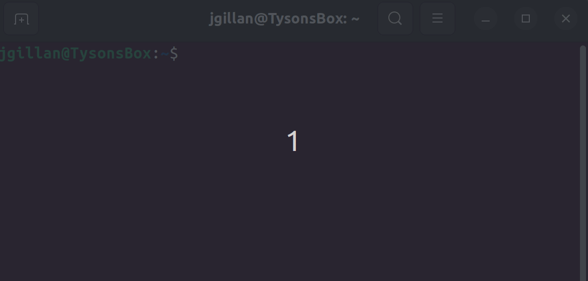
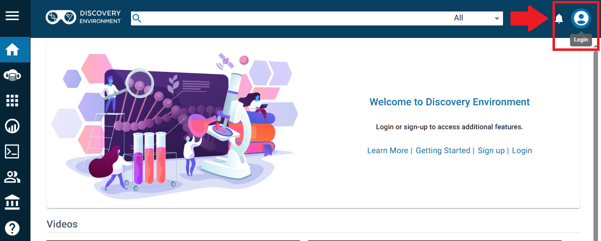
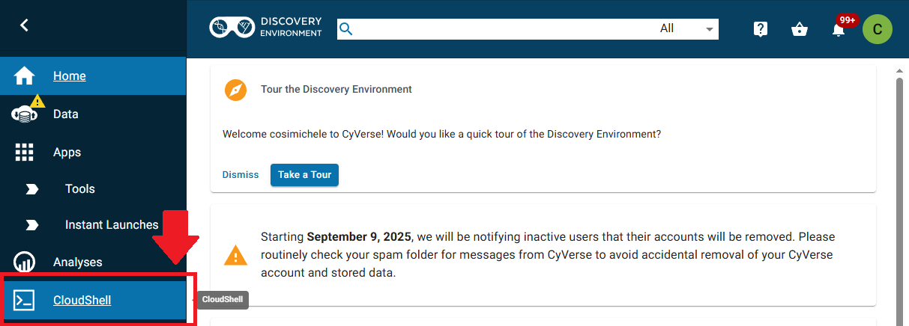
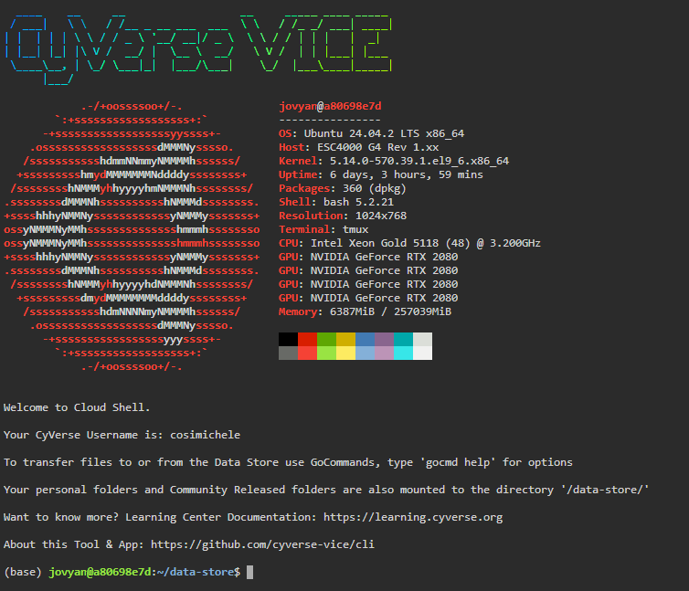
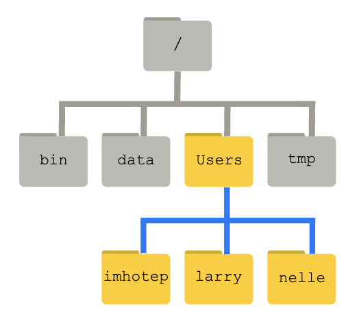

# How to Talk to Computers

## The Command Line Interface

When using a computer, it is typical to use a keyboard and mouse to navigate a cursor across the screen or simply tap on the screens of our smart phones or tablets. Both of these methods make use of the Graphical User Interface (GUI) and have become central to the way we interact with computers. GUIs make computers so easy to use! 

However, for a more direct and powerful way to instruct your computer, you should learn to use the **Command Line Interface (CLI)**. CLIs are found throughout all operating systems (Windows, MacOS, Linux) though they might have different commands and syntax. 

For this FOSS lesson on CLI, we will focus on the Unix CLI which is present in MacOS and all Linux operating systems. 

<br>
<br>

!!! Warning "**Attention** :material-microsoft-windows: Windows users"

    Much of what we are going to be teaching is based on open-source software which operates on cloud and is incompatible with Windows OS.

    Unix-based systems such as Linux [:material-ubuntu: Ubuntu](https://ubuntu.com/){target=_blank} and [:material-apple: MacOS X](https://www.apple.com/macos/){target=_blank}, as many scientific tools require a Unix Operating System (OS). 
    
    There are a number of software that allow :material-microsoft-windows: Windows users to execute Unix commands, however we recommend the use of [:simple-linux: Windows Subsystem for Linux (WSL) 2.0](https://docs.microsoft.com/en-us/windows/wsl/install){target=_blank}.

    ??? tip "Quickstart installation of Window's WSL"

        !!! warning "A system reboot is necessary"

        1. Open :material-powershell: PowerShell in Administrator mode (open :octicons-search-16: Search and look for PowerShell, right click and select "Run as Administrator")
        2. type `wsl --install`
        3. Restart your machine
        4. Open :octicons-search-16: Search and open :simple-linux: WSL; create a username and password, wait for it to finish setting up (should take a few minutes)
        5. You're now ready to use :simple-linux: Linux on your Windows Machine!

        ??? question "Where is the WSL Home folder?"
            
            The Home folders for Linux and Windows are different. The Windows path to the :simple-linux: WSL home folder is `\\wsl$\Ubuntu\home\<username>`.
            
            We suggest creating a bookmark in your Windows machine to allow quicker access to the :simple-linux: Linux partition (for quicker access to files).

            To quickly open the folder, open :simple-linux: WSL and execute `explorer.exe .`. This will open a folder in Windows at the Linux Home folder. 

<br>
<br>

---

<br>
<br>

## The Unix Shell

The CLI sees the computer stripped down to only a [Terminal](https://en.wikipedia.org/wiki/Terminal_emulator) from where one can run powerful commands executed through the [Shell](https://en.wikipedia.org/wiki/Shell_(computing)).

Though there are technical differences between them, the terms **Command Line Interface**, **Terminal**, **Shell**, and **BASH** will be used more or less interchangeably throughout the lesson. 

<figure markdown>
  <a target="blank" rel="cli">{width=500} </a>
    <figcaption> The Terminal shell</figcaption>
</figure>

<figure markdown="span">
    <iframe width="526" height="340" src="https://www.youtube.com/embed/fhv2dX0axeY" title="What do tutorials mean when they say my shell? Developer Fundamentals" frameborder="0" allow="accelerometer; autoplay; clipboard-write; encrypted-media; gyroscope; picture-in-picture; web-share" referrerpolicy="strict-origin-when-cross-origin" allowfullscreen></iframe>
    <vidcaption> <br>Quick video on the shell.</vidcaption> 
</figure>

## Accessing a Linux Shell on CyVerse

In addition to sharing code and documentation, Github is also a place to do direct computing. Using Github [Codespaces](https://github.com/features/codespaces) we can access a Linux virtual machine and do computing tasks directly from a Github repository. 

#### Steps to Launch the CLI on CyVerse

1. Navigate to the **CyVerse Discovery Environment**: https://de.cyverse.org/

    !!! Warning "You may need to first log in into the [User Portal](https://user.cyverse.org/) if this is your first time logging onto CyVerse."

    <figure markdown>
    <a>{width=600} </a>
    </figure>

2. On the left hand side, click the CloudShell button.

    <figure markdown>
    <a>{width=600} </a>
    </figure>

3. Your Terminal should be available within a few seconds.

    <figure markdown>
    <a>{width=600} </a>
    </figure>

## Introductory Shell Commands

The following tutorial material was taken from the [Carpentries' Shell Module](https://swcarpentry.github.io/shell-novice/). 

!!! info "Download Some Data from the Carpentries"
    To follow along with the tutorial, please download and unzip this data. [shell-lesson-data.zip](https://swcarpentry.github.io/shell-novice/data/shell-lesson-data.zip) 
        
    ??? Tip "The Command Line Way to Download and Unzip!"
        Execute the following commands:
        ```
        $ wget https://swcarpentry.github.io/shell-novice/data/shell-lesson-data.zip
        $ unzip shell-lesson-data.zip
        ``` 

### Navigation

<figure markdown>
  <a target="blank" rel="open science">{ width="300" } </a>
    <figcaption> Linux Directory Structure</figcaption>
</figure>

| Command | Explanation |
|---|---|
|`pwd`| print working directory |
|`ls`| list content of folder |
|`cd`| change directory |


By typing `pwd`, the current working directory is printed.

```
$ pwd

/home/jovyan/data-store
```

We can then use `ls` to see the contents of the current directory. 

```
$ ls  
shell-lesson-data/   shell-lesson-data.zip*
```

??? info "Command Flags"
    Each command has **flags**, or options that you can specify. which are summoned with a `-`, such as `<command> -<flag>`.
    ```
    $ ls -a -l -h
    ```

    - The above command calls for the `-a` (all), `-l` (long), `-h` (human readable) flags. This causes `ls` to output a list of *all* files (inculding hidden files/folders) with human readable file size (e.g., it will list 3MB instead of 3000000), permissions, creator, and date of creation.
    
    - If you do not know what flags are available, you can refer to the `man` command (or for many tools, use the `-h` (help) flag).


We can then move inside the folder of our choice doing `cd`. Doing `ls` following the opening of the folder of choice, will show the contents of the folder you just moved in. Feel free to explore the contents of the folders by using `cd` and `ls`.

```
$ cd shell-lesson-data
$ ls 

exercise-data/  north-pacific-gyre/

$ ls exercise-data/

animal-counts/  creatures/  numbers.txt*  proteins/  writing/
```
<br>
<br>

??? info "Tips for Directory Navigation"
    `.` refers to *current* directory

    `..` refers to *above* directory

    `/` is the directory separator

    `~` indicates the home directory

    For example:
    ```
    $ ls .            # lists files and folders in the current directory
    $ ls ..           # lists files and folders in the above directory
    $ ls ~            # lists files and folders in the home directory
    $ ls ~/Documents  # lists files and folders in Documents (a folder present in the home directory)
    ```

!!! Tip "Use the Tab key to autocomplete"
    You do not need to type the entire name of a folder or file. By using the tab key, the Shell will autocomplete the name of the files or folders. For example, typing the following

    ```
    $ ls exer
    ```

    and pressing the tab key, will result in autocompletion.

    ```
    $ ls exercise-data/
    ```

    You can then press tab twice, to print a list of the contents of the folder.

    ```
    $ ls exercise-data/
    animal-counts/ creatures/     numbers.txt    proteins/      writing/ 
    ```

### Working with Files and Directories

| Command | Explanation |
|---|---|
|`mkdir`| make a directory |
|`touch`| creat empty file |
|`nano` or `vim`| text editors |
|`mv`| move command |
|`cp`| copy command | 
|`rm`| remove command |

??? info "Help with Commands"
    For every command, typing `man` (manual) before the command, will open the manual for said command.
    ```
    $ man ls
    ```

    - The above command will result in opening the *manual* for the `ls` command. You can exit the man page by pressing `q`.

Return to `shell-lesson-data`, and create a directory with `mkdir <name of folder>`.

```
$ mkdir my_folder
$ ls

exercise-data/  my_folder/  north-pacific-gyre/
```

Notice the new `my_folder` directory.

!!! danger "Naming your files"
    It is strongly suggested that you avoid using spaces when naming your files. When using the Shell to communicate with your machine, a space can cause errors when loading or transferring files. Instead, use dashes (`-`), underscores (`_`), periods (`.`) and CamelCase when naming your files.
        
    Acceptable naming:
    ```
    $ mkdir my_personal_folder
    $ mkdir my_personal-folder
    $ mkdir MyPersonal.Folder
    ```
    <br>

    ??? Question "What will happen if you create a directory with spaces?"

        You will obtain as many folders as typed words!
        ```
        $ mkdir my folder
        $ ls -F
        exercise-data/  folder/  my/  north-pacific-gyre/
        ```
        Notice the two folders `my` and `folder`.

Create an empty file with `touch <name of file>`

```
$ touch new_file.txt
```

`touch` will create an **empty** file

Add text to the new file
```
nano new_file.txt 
```

Use `mv <name of file or folder you want to move> <name of destination folder>` to move your newly created file to the directory you created previously (you can then use `ls` to check if you successully moved the file).

```
$ ls
exercise-data/  new_file*  my_folder/  north-pacific-gyre/

$ mv new_file.txt my_folder/
$ ls 
exercise-data/  my_folder/  north-pacific-gyre/

$ ls my_folder/
new_file.txt*
```
`mv` can also be used to **rename** a file or folder with  `mv <name of file or folder you want to change> <new name>`.

```
$ cd my_folder/
$ mv new_file my_file
$ ls
my_file*
```

`cp` is the command to copy a file with the syntax `cp <name of file you want to copy> <name of copy file>`

```
$ cp my_file copy_my_file
$ ls
copy_my_file*  my_file*
```

!!! note "Copying folders"
    To copy folders and the content of these folders, you will have to use the `-r` flag (recursive) for `cp` in the following manner `cp -r <name of folder you want to copy> <name of copy folder>` (following example is from the `shell-lesson-data/` directory).
    ```
    $ cp -r my_folder/ copy_my_folder
    $ ls 
    copy_my_folder/  exercise-data/  my_folder/  north-pacific-gyre/
        
    $ ls my_folder/
    copy_my_file*  my_file*

    $ ls copy_my_folder/
    copy_my_file*  my_file*
    ```

To remove an unwanted file, use `rm <name of file to remove>`.

```
$ rm copy_my_file
$ ls 
my_file
```

!!! note "Removing folders"
    Save as the "Copying Folders" note, you have to use the `-r` flag to remove a folder `rm -r <name of folder you want to remove>` (following example is from the `shell-lesson-data/` directory).
    ```
    $ rm -r copy_my_folder/
    $ ls -F
    exercise-data/  my_folder/  north-pacific-gyre/
    ```

---

### Shell Script

Here we are going to show an example command line automation using a shell script. This is what makes the command line powerful!

!!! tip "Shell Script"

    A shell script is a file with the extension '.sh'. It is essentially a text file that lists out multiple shell commands. When the shell script is run, the computer will run all of the commands in sequence in an automated way.  

Navigate to the `shell-lesson-data` directory

```
$ cd shell-lesson-data
```

Create the shell script

```
$ nano script.sh
```
The text editor Nano will pop up and it will be empty.

<br>

!!! example "Script exercises"

    ??? example "word counting"

        ```bash
        #!/bin/bash

        # Find haiku.txt starting from current directory
        file_path=$(find . -name "haiku.txt" | head -n 1)

        # Navigate to its directory
        cd "$(dirname "$file_path")"

        # Print absolute path
        echo "haiku.txt found at: $(pwd)/haiku.txt"

        # Define keyword to search
        keyword="not"

        # Count how many times the keyword appears
        keyword_count=$(grep -o "$keyword" haiku.txt | wc -l)

        # Extract and append keyword context
        echo "" >> haiku.txt
        echo "---- Keyword Summary ----" >> haiku.txt
        echo "Keyword '$keyword' appears $keyword_count times" >> haiku.txt
        echo "Summary generated on: $(date)" >> haiku.txt
        echo "--------------------------" >> haiku.txt

        # Show updated file
        cat haiku.txt
        ```

    ??? example "Create a compressed backup with a timestamp"


        ```bash
        #use Bash shell to run the following commands
        #!/bin/bash

        ## Variables
        #the directory you want to back up (e.g., shell-lesson-data)
        SOURCE_DIR=$(find $PWD -type d -name "shell-lesson-data" 2>/dev/null)

        #location where the backup will be stored
        BACKUP_DIR="$PWD"

        #used to create a unique name for each backup based on the current date and time
        TIMESTAMP=$(date +"%Y-%m-%d_%H-%M-%S")

        # name of the compressed backup file
        ARCHIVE_NAME="backup_$TIMESTAMP.tar.gz"

        # Create backup directory if it doesn't exist
        mkdir -p "$BACKUP_DIR"

        # Create a compressed archive of the source directory
        tar -czf "$BACKUP_DIR/$ARCHIVE_NAME" -C "$SOURCE_DIR" .

        # Output the result
        echo "Backup of $SOURCE_DIR completed!"
        echo "Archive created at $BACKUP_DIR/$ARCHIVE_NAME"
        ```

Exit nano with `ctrl + x`


Modify permission to make the shell script executable
```
$ chmod +x script.sh
```

Run the shell script
```
$ ./script.sh
```

### More Carpentries Lessons on Linux Command line
- [Pipes and Filters](https://swcarpentry.github.io/shell-novice/04-pipefilter.html)
- [Loops](https://swcarpentry.github.io/shell-novice/05-loop.html)
- [Scripts](https://swcarpentry.github.io/shell-novice/06-script.html)
- [Finding Things](https://swcarpentry.github.io/shell-novice/07-find.html)

---