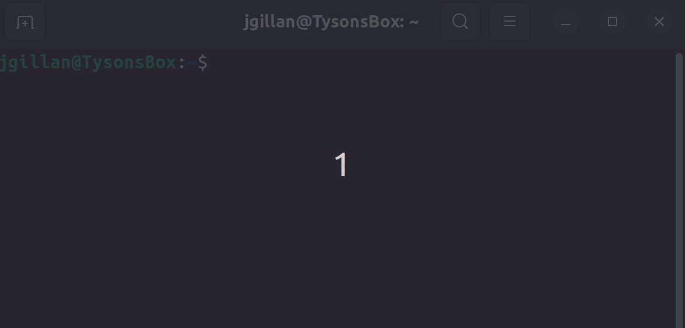
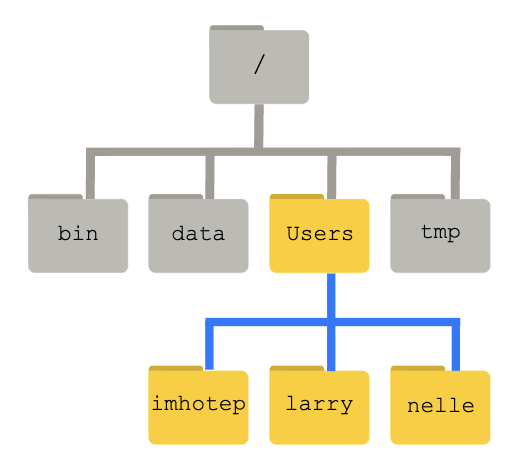

# How to Talk to Computers

## The Command Line Interface

When using a computer, it is typical to use a keyboard and mouse to navigate a cursor across the screen or simply tap on the screens of our smart phones or tablets. Both of these methods make use of the Graphical User Interface (GUI) and have become central to the way we interact with computers. GUIs make computers so easy to use! 

However, for a more direct and powerful way to instruct your computer, you should learn to use the **Command Line Interface (CLI)**. CLIs are found throughout all operating systems (Windows, MacOS, Linux) though they might have different commands and syntax. 

For this FOSS lesson on CLI, we will focus on the Unix CLI which is present in MacOS and all Linux operating systems. 

<br>
<br>

!!! Warning "**Attention** :material-microsoft-windows: Windows users"

    Much of what we are going to be teaching is based on open-source software which operates on cloud and is incompatible with Windows OS.

    Unix-based systems such as Linux [:material-ubuntu: Ubuntu](https://ubuntu.com/){target=_blank} and [:material-apple: MacOS X](https://www.apple.com/macos/){target=_blank}, as many scientific tools require a Unix Operating System (OS). 
    
    There are a number of software that allow :material-microsoft-windows: Windows users to execute Unix commands, however we recommend the use of [:simple-linux: Windows Subsystem for Linux (WSL) 2.0](https://docs.microsoft.com/en-us/windows/wsl/install){target=_blank}.

    ??? tip "Quickstart installation of Window's WSL"

        !!! warning "A system reboot is necessary"

        1. Open :material-powershell: PowerShell in Administrator mode (open :octicons-search-16: Search and look for PowerShell, right click and select "Run as Administrator")
        2. type `wsl --install`
        3. Restart your machine
        4. Open :octicons-search-16: Search and open :simple-linux: WSL; create a username and password, wait for it to finish setting up (should take a few minutes)
        5. You're now ready to use :simple-linux: Linux on your Windows Machine!

        ??? question "Where is the WSL Home folder?"
            
            The Home folders for Linux and Windows are different. The Windows path to the :simple-linux: WSL home folder is `\\wsl$\Ubuntu\home\<username>`.
            
            We suggest creating a bookmark in your Windows machine to allow quicker access to the :simple-linux: Linux partition (for quicker access to files).

            To quickly open the folder, open :simple-linux: WSL and execute `explorer.exe .`. This will open a folder in Windows at the Linux Home folder. 

<br>
<br>

---

<br>
<br>

## The Unix Shell

The CLI sees the computer stripped down to only a [Terminal](https://en.wikipedia.org/wiki/Terminal_emulator) from where one can run powerful commands executed through the [Shell](https://en.wikipedia.org/wiki/Shell_(computing)).


Though there are technical differences between them, the terms **Command Line Interface**, **Terminal**, **Shell**, and **BASH** will be used more or less interchangeably throughout the lesson. 

<figure markdown>
  <a target="blank" rel="cli">{width=500} </a>
    <figcaption> The Terminal shell</figcaption>
</figure>

<br>
<br>

<figure markdown="span">
    <iframe width="526" height="340" src="https://www.youtube.com/embed/fhv2dX0axeY" title="What do tutorials mean when they say my shell? Developer Fundamentals" frameborder="0" allow="accelerometer; autoplay; clipboard-write; encrypted-media; gyroscope; picture-in-picture; web-share" referrerpolicy="strict-origin-when-cross-origin" allowfullscreen></iframe>
    <vidcaption> <br>Quick video on the shell.</vidcaption> 
</figure>


<br>
<br>

## Introductory Shell Commands

The following tutorial material was taken from the [Carpentries' Shell Module](https://swcarpentry.github.io/shell-novice/). 

!!! info "Download Some Data from the Carpentries"
    To follow along with the tutorial, please download and unzip this data. [shell-lesson-data.zip](https://swcarpentry.github.io/shell-novice/data/shell-lesson-data.zip) 
        
    ??? Tip "The Command Line Way to Download and Unzip!"
        Execute the following commands:
        ```
        $ sudo apt install unzip
        $ wget https://swcarpentry.github.io/shell-novice/data/shell-lesson-data.zip
        $ unzip shell-lesson-data.zip
        ``` 

<br>
<br>


### Navigation

<figure markdown>
  <a target="blank" rel="open science">{ width="300" } </a>
    <figcaption> Linux Directory Structure</figcaption>
</figure>


| Command | Explanation |
|---|---|
|`pwd`| print working directory |
|`ls`| list content of folder |
|`cd`| change directory |


<br>

By typing `pwd`, the current working directory is printed.

```
$ pwd

/home/jgillan
```
<br>
<br>

We can then use `ls` to see the contents of the current directory. 

```
$ ls  
shell-lesson-data/   shell-lesson-data.zip*
```
<br>
<br>

??? info "Command Flags"
    Each command has **flags**, or options that you can specify. which are summoned with a `-`, such as `<command> -<flag>`.
    ```
    $ ls -a -l -h
    ```

    - The above command calls for the `-a` (all), `-l` (long), `-h` (human readable) flags. This causes `ls` to output a list of *all* files (inculding hidden files/folders) with human readable file size (e.g., it will list 3MB instead of 3000000), permissions, creator, and date of creation.
    
    - If you do not know what flags are available, you can refer to the `man` command (or for many tools, use the `-h` (help) flag).

<br>
<br>

We can then move inside the folder of our choice doing `cd`. Doing `ls` following the opening of the folder of choice, will show the contents of the folder you just moved in. Feel free to explore the contents of the folders by using `cd` and `ls`.

```
$ cd shell-lesson-data
$ ls 

exercise-data/  north-pacific-gyre/

$ ls exercise-data/

animal-counts/  creatures/  numbers.txt*  proteins/  writing/
```
<br>
<br>

??? info "Tips for Directory Navigation"
    `.` refers to *current* directory

    `..` refers to *above* directory

    `/` is the directory separator

    `~` indicates the home directory

    For example:
    ```
    $ ls .            # lists files and folders in the current directory
    $ ls ..           # lists files and folders in the above directory
    $ ls ~            # lists files and folders in the home directory
    $ ls ~/Documents  # lists files and folders in Documents (a folder present in the home directory)
    ```

<br>
<br>

!!! Tip "Use the Tab key to autocomplete"
    You do not need to type the entire name of a folder or file. By using the tab key, the Shell will autocomplete the name of the files or folders. For example, typing the following

    ```
    $ ls exer
    ```

    and pressing the tab key, will result in autocompletion.

    ```
    $ ls exercise-data/
    ```

    You can then press tab twice, to print a list of the contents of the folder.

    ```
    $ ls exercise-data/
    animal-counts/ creatures/     numbers.txt    proteins/      writing/ 
    ```
<br>


<br>


### Working with Files and Directories

| Command | Explanation |
|---|---|
|`mkdir`| make a directory |
|`touch`| creat empty file |
|`nano` or `vim`| text editors |
|`mv`| move command |
|`cp`| copy command | 
|`rm`| remove command |

??? info "Help with Commands"
    For every command, typing `man` (manual) before the command, will open the manual for said command.
    ```
    $ man ls
    ```

    - The above command will result in opening the *manual* for the `ls` command. You can exit the man page by pressing `q`.
<br>
<br>

Return to `shell-lesson-data`, and create a directory with `mkdir <name of folder>`.

```
$ mkdir my_folder
$ ls

exercise-data/  my_folder/  north-pacific-gyre/
```

Notice the new `my_folder` directory.

<br>
<br>

!!! danger "Naming your files"
    It is strongly suggested that you avoid using spaces when naming your files. When using the Shell to communicate with your machine, a space can cause errors when loading or transferring files. Instead, use dashes (`-`), underscores (`_`), periods (`.`) and CamelCase when naming your files.
        
    Acceptable naming:
    ```
    $ mkdir my_personal_folder
    $ mkdir my_personal-folder
    $ mkdir MyPersonal.Folder
    ```
    <br>

    ??? Question "What will happen if you create a directory with spaces?"

        You will obtain as many folders as typed words!
        ```
        $ mkdir my folder
        $ ls -F
        exercise-data/  folder/  my/  north-pacific-gyre/
        ```
        Notice the two folders `my` and `folder`.

<br>
<br>

Create an empty file with `touch <name of file>`

```
$ touch new_file.txt
```

`touch` will create an **empty** file

<br>

Add text to the new file
```
nano new_file.txt 
```

<br>
<br>

Use `mv <name of file or folder you want to move> <name of destination folder>` to move your newly created file to the directory you created previously (you can then use `ls` to check if you successully moved the file).

```
$ ls
exercise-data/  new_file*  my_folder/  north-pacific-gyre/

$ mv new_file.txt my_folder/
$ ls 
exercise-data/  my_folder/  north-pacific-gyre/

$ ls my_folder/
new_file.txt*
```
`mv` can also be used to **rename** a file or folder with  `mv <name of file or folder you want to change> <new name>`.

```
$ cd my_folder/
$ mv new_file my_file
$ ls
my_file*
```

<br>
<br>
<br>

`cp` is the command to copy a file with the syntax `cp <name of file you want to copy> <name of copy file>`

```
$ cp my_file copy_my_file
$ ls
copy_my_file*  my_file*
```

!!! note "Copying folders"
    To copy folders and the content of these folders, you will have to use the `-r` flag (recursive) for `cp` in the following manner `cp -r <name of folder you want to copy> <name of copy folder>` (following example is from the `shell-lesson-data/` directory).
    ```
    $ cp -r my_folder/ copy_my_folder
    $ ls 
    copy_my_folder/  exercise-data/  my_folder/  north-pacific-gyre/
        
    $ ls my_folder/
    copy_my_file*  my_file*

    $ ls copy_my_folder/
    copy_my_file*  my_file*
    ```

<br>
<br>
<br>

To remove an unwanted file, use `rm <name of file to remove>`.

```
$ rm copy_my_file
$ ls 
my_file
```

!!! note "Removing folders"
    Save as the "Copying Folders" note, you have to use the `-r` flag to remove a folder `rm -r <name of folder you want to remove>` (following example is from the `shell-lesson-data/` directory).
    ```
    $ rm -r copy_my_folder/
    $ ls -F
    exercise-data/  my_folder/  north-pacific-gyre/
    ```

<br>
<br>


### Shell Script

Here we are going to show an example command line automation using a shell script. This is what makes the command line powerful!

!!! tip "Shell Script"

    A shell script is a file with the extension '.sh'. It is essentially a text file that lists out multiple shell commands. When the shell script is run, the computer will run all of the commands in sequence in an automated way.  

<br>

Navigate to the `shell-lesson-data` directory

```
$ cd /home/jgillan/shell-lesson-data
```

<br>

Create the shell script

```
$ nano backup.sh
```
The text editor Nano will pop up and it will be empty.

<br>

Copy and paste the following commands into `backup.sh`

```
#use Bash shell to run the following commands
#!/bin/bash

## Variables
#the directory you want to back up (e.g., shell-lesson-data)
SOURCE_DIR=$(find / -type d -name "shell-lesson-data" 2>/dev/null) # Note: if you are working on your computer, this will look in every folder. Be careful with this line!

#location where the backup will be stored
BACKUP_DIR="$HOME/Backup"

#used to create a unique name for each backup based on the current date and time
TIMESTAMP=$(date +"%Y-%m-%d_%H-%M-%S")

# name of the compressed backup file
ARCHIVE_NAME="backup_$TIMESTAMP.tar.gz"


# Create backup directory if it doesn't exist
mkdir -p "$BACKUP_DIR"

# Create a compressed archive of the source directory
tar -czf "$BACKUP_DIR/$ARCHIVE_NAME" -C "$SOURCE_DIR" .

# Output the result
echo "Backup of $SOURCE_DIR completed!"
echo "Archive created at $BACKUP_DIR/$ARCHIVE_NAME"
```
<br>

Exit nano with `ctrl + x`

<br>

Modify permission to make the shell script executable
```
$ chmod +x backup.sh
```

<br>

Run the shell script
```
$ ./backup.sh
```

<br>
Go back to your home directory and look for the new backup directory
```
$ cd ~
$ cd ls
```

There should be a new directory called 'Backup' with a compressed file within it. 

<br>
<br>


### More Carpentries Lessons on Linux Command line
- [Pipes and Filters](https://swcarpentry.github.io/shell-novice/04-pipefilter.html)
- [Loops](https://swcarpentry.github.io/shell-novice/05-loop.html)
- [Scripts](https://swcarpentry.github.io/shell-novice/06-script.html)
- [Finding Things](https://swcarpentry.github.io/shell-novice/07-find.html)

<br>
<br>
<br>

---

<br>
<br>
<br>


## LLM Chatbots for Open Science

Large Language Model (LLM) chatbots have fundamentally changed how we humans are going to interact with computers going forward. They provide a natural language interface to instruct computers to do many tasks including:

- Read, write, and summarize text
- Analyze data
- Explain techical topics
- Search the web and retrieve information
- Generate, optimize, and explain many types of computer code 
- Understand and generate images

<br>

Current LLMs generally provide recommendation for how _you_ could do things. ie, they provide you code and text recommendations but don't actually execute anything. But these technologies are advancing quickly and new capabilities are developed and released constantly. Soon, [AI Agents](https://github.com/Significant-Gravitas/AutoGPT) could be everywhere executing on instructions in autonomous and semi-autonomous ways.

<br>

### Commercial Chatbots

<figure style="display: flex; justify-content: center;">
    <a href="https://openai.com/chatgpt"></a>
    <a href="https://gemini.google.com/"></a>
    <a href="https://www.anthropic.com/claude"></a>
    <a href="https://www.microsoft.com/en-us/bing?form=MA13FV"></a>
</figure>

<br>
<br>

- [:simple-openai: ChatGPT](https://openai.com/chatgpt)
- [:simple-google: Gemini](https://gemini.google.com/)
- [:simple-anthropic: Claude](https://www.anthropic.com/claude)
- [:octicons-copilot-16: Copilot](https://www.microsoft.com/en-us/bing?form=MA13FV)

<br>
<br>
<br>


### LLMs in 150 words (or less)

**How they're made**: LLMs work by training on vast amounts of text from the internet. They learn patterns, grammar, and context from this data. When you give them a prompt, they generate text based on what they've learned. Imagine a super-smart autocomplete for text, but it can also create entire paragraphs or articles.

**How they work**: LLMs don't understand like humans do. They predict what comes next in a sentence using math and probabilities. They don't have thoughts or feelings. They mimic human language but can make mistakes or write nonsense if not guided well.

**How you can use them**: They're incredibly versatile. You can use them for answering questions, writing essays, coding help, and more. ***But you must be cautious because they can generate biased or false information if not used responsibly***. 

In a nutshell, LLMs are like super-powered text generators trained on the internet's vast knowledge.

<br>
<br>

!!! Warning ":warning::warning: **VERIFY EVERTHING CHATBOTS TELL YOU!** :warning::warning:"

<br>
<br>
<br>

### :simple-openai: Prompt Writing

LLM Chatbots are meant to be conversational. In general, you are asking the Chatbot questions (known as **Prompts**) and the Chatbot will respond with answers. 

It is a bit of an artform to get the Chatbot to provide answers with the specificity and format that you want. An entire field of study has sprung up, called **Prompt Engineering**, which seeks to find the magic words that will elicit the best (and technically correct) responses from the Chatbot. 

<br>
<br>

#### **Prompt Priming** 

Provide lots of organized details to help the Chatbot understand the question and what it's task is. This could include adding a backstory or context for why you are asking the question. Be very specific in terms of what you want from the Chatbot and how you want it. 

Zero-shot unconditioned prompts are likely to return the least specific responses. Responses are more likely to be useful when multiple specific output types are defined.

| Types of Priming | Example |
|------------------|---------|
| Zero (Shot) | "Write five examples of assessments for watershed health." |
| Single | "Write five examples of assessments for watershed health. Here is one example: Geomorphology" |
| Multiple | "Write five examples of assessments for watershed health related to geomorphology, water quality, and species diversity." |

<br>
<br>

#### **Linked Prompts**

Responses to prompts may not return the exact details or information that you are after the first time. Follow-up by rephrasing your prompts more carefully and continuing with iterative prompting can build upon your priors.

"Chain prompting" or "Linked Prompting" brings multiple prompts together.

| Linked Prompting | Examples |
|------------------|----------|
| Step 1: Priming | "I want you to act as an eminent hydrologist from CUASHI. Provide me with a list of the ten most important topics in hydrology over the last decade focused around research in the global south, working with indigenous communities, and traditional ecological knowledge systems." |
| Step 2: Summarizing | "Based on the list you just created, summarize the most pressing financial challenges faced by indigenous communities in the Global South, versus indigenous communities in North America, in less than 50 words." |
| Step 3: Try again with a web search | "Based on the results of web access, can you confirm the validity of the ten important topics and provide at least one reference to each." |

!!! tip "Encouraging the Chatbot to do Better"
    Chatbot responses can be missing information or just plain wrong. When this occurs, you can point out the mistake and ask the Chatbot to provide a more complete or better answer. Don't settle for poor responses!

<br>
<br>

#### Role Playing

Some people find that asking the Chatbot to adopt a persona will lead to better responses. 

"I want you to act as ..." will establish what type of conversation you are planning to have. 

| Types of Roles |
|---|
| Project Manager  | 
| Copywriter / Editor  | 
| Paper Reviewer | 
| Teacher / Mentor / Advisor |
| Student / Learner / Participant |
| Software Engineer  |
| DevOps Engineer  |
| Linux Terminal  |
| Python Interpreter |
| Web Browser |

<br>
<br>
<br>

### Prompting Chatbots for FOSS

<br>

#### Provide a general outline for a data management plan

```
I am writing a grant proposal to the National Science Foundation. 
Could you please provide me a basic template for a data management plan (DMP) and 
please provide url links to resources that can help me with NSF DMP requirements.
```
<br>
<br>


#### Provide a step-by-step recipe to create and serve an mkdocs website in Github

```
I would like to create a personal website using the MKdocs style 
and host it on Github pages.

Could you please write me a step-by-step guide starting 
with importing an existing github repository that has the mkdocs material.
```
<br>
<br>

#### Write shell commands and shell scripts

```
I would like to create a linux shell script to automate the backup of my working directory. 
Could you please suggest a shell script that will copy my working directory 
in a different directory and compress the file into an archive. 
Please name the file based on the current time and date. 
```

<br>
<br>

#### Write git commands

```
Could you please provide me a step-by-step workflow for using git with github? 
I found a repository that I want to build on in Github. 
I would like to work on the material on my local machine and then save it back up to github. 
I would like to workflow to be for the linux command line. 
```

<br>
<br>

#### Write download and conda commands
```
I am writing a lot of scripts using python. I have heard that environment managers such as conda may be useful to me. 
I don't know anything about conda, so can you explain some things?
1. Give me a high level overview of what environment managers are and what conda is specifically.
2. Please create a step-by-step guide for downloading conda on my machine, and how to use conda to create custom environments. 
3. Please explain and give my steps to share my environment with colleagues.
```
<br>
<br>

#### Write docker run commands

```
I would like to run a docker container that consists of a jupyter notebook. 
Can you please suggest a docker run command that launches the jupyter notebook
and mounts a volume of data in it. 
```

<br>
<br>

#### Write docker files

```
I would like to create a docker image that consists of R studio and 
some customized Rcode. Can you tell me the steps to 1. make a dockerfile and 
build the docker image; and 2. Upload the docker image to docker hub.
```


<br>
<br>
<br>
<br>

??? Tip "ChatGPT :simple-awesomelists: Awesome Lists"

    There is an ever changing meta-list of :simple-awesomelists: Awesome lists curated around ChatGPT plugins and extensions.

    [:simple-github: search: `chatgpt+awesome`](https://github.com/search?q=awesome-chatgpt+&type=repositories&s=stars&o=desc)

    Check out lists around:

    [:simple-awesomelists: ChatGPT Prompts](https://github.com/f/awesome-chatgpt-prompts)

    [:simple-awesomelists: ChatGPT Data Science Prompts](https://github.com/travistangvh/ChatGPT-Data-Science-Prompts)
   
    [:simple-awesomelists: API plugins, extensions, & applications](https://github.com/humanloop/awesome-chatgpt)


