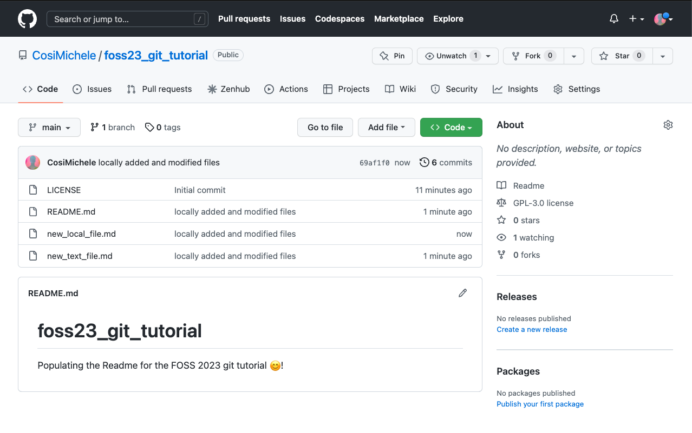
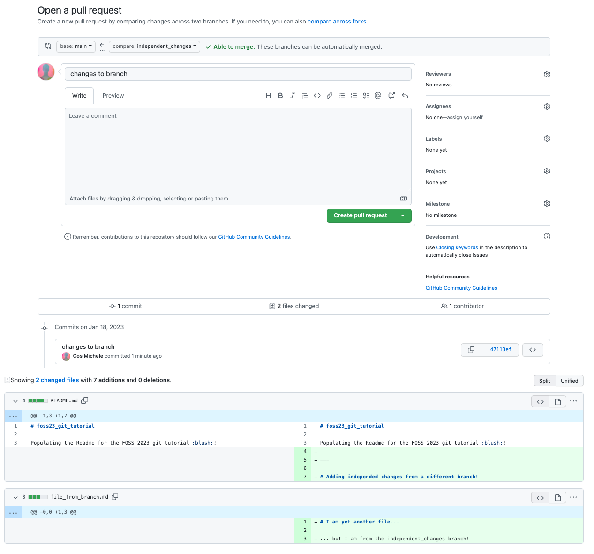

# Version Control


!!! Success "Learning Objectives"
        
    After this lesson, you should be able to:

    *  Understand the basics of `git` as a resource for reproducible programming
    *  Describe tools and approaches to creating your `git` Repositories
    *  Describe best practices for maintaining GitHub Organizations and Repositories
    *  Maintain own GitHub user profile and repositories

Version control refers to keeping track of the version of a file, set of
files, or a whole project.

Some version control tools:

-   :material-microsoft-office: Microsoft Office's [*Track Changes*](https://support.microsoft.com/en-au/office/track-changes-in-word-197ba630-0f5f-4a8e-9a77-3712475e806a) functionality
-   :simple-apple: Apple's [*Time Machine*](https://support.apple.com/en-us/HT201250)
-   :simple-googledocs: Google Docs' [*Version History*](https://support.google.com/docs/answer/190843?hl=en&co=GENIE.Platform%3DDesktop)
-   :simple-git: [Git](https://git-scm.com/)

Version control is as much a philosophy as a set of tools; you don't
need to master Git to utilize version control (though it is certainly a
worthwhile tool for many researchers).


<figure markdown>
  <a href="https://swcarpentry.github.io/git-novice/01-basics.html" target="blank" rel="git_def"> </a>
    <figcaption> We have all been here, taken by the [Software Carpentry Version Control lesson](https://swcarpentry.github.io/git-novice/01-basics.html). </figcaption>
</figure>

---

## :simple-git: Git vs. :simple-github: GitHub

**Git** is a command-line program for version control of repositories.
It keeps track of changes you make to files in your repository and
stores those changes in a *.git* folder in that repository.
These changes happen whenever you make a **commit**. Git stores the
history of these commits in a "tree", so you can go back to any
previous commit. By keeping track of the **differences** between
commits, Git can be much more efficient than storing an entire copy of
each version in a document's history.

You could utilize Git completely on its own, on your local computer, and
get a lot of benefits. You will have a history of the changes you made
to a project, allowing you to go back to any old version of your work.
However, where Git really shines is in *collaborative* work. In order to
effectively collaborate with others on a project, you need two basic
features: a way to allow people to work in parallel, and a way to host
repositories somewhere where everyone can access them. The first feature
is **branching**, which is part of Git, and the hosting part can be
taken care of by platforms like GitHub, GitLab, or Bitbucket. We will
focus on GitHub.

GitHub is a site that can remotely host your Git repositories. By
putting your repository onto GitHub, you get a backup of the repository,
a way to collaborate with others, and a lot of other features.

<figure markdown>
  <a href="https://devmountain.com/blog/git-vs-github-whats-the-difference/" target="blank" rel="git_v_github"> </a>
    <figcaption> Git vs GitHub, simplified </figcaption>
</figure>

### Definitions

!!! Info "Git-related Definitions"
        
    **Platforms**:
    
    - **Git**: tool for version control.
    - **GitHub**: hosted server that is also interactive.

    **Locations and directions**:

    - **repo**: short for repository
    - **local**: on your personal computer.
    - **remote**: somewhere other than your computer. GitHub can host remote
    repositories.
    - **upstream**: primary or main branch of original repository.
    - **downstream**: branch or fork of repository.

    **Actions**:
    
    - **clone**: copy of a repository that lives locally on your computer.
    Pushing changes will affect the repository online.
    - **pull**: getting latest changes to the repository on your local
    computer.
        - the **fetch** command does the same, however one needs to also **merge** the changes, whilst with pull, the merge action is automatic.
    - **branch**: a history of changes to a repository. You can have parallel
    branches with separate histories, allowing you to keep a "main"
    version and development versions.
    - **fork**: copy of someone else's repository stored locally on your
    account. From forks, you can make pull requests to the main branch.
    - **commit**: finalize a change.
    - **push**: add changes back to the remote repository.
    - **merge**: takes changes from a branch or fork and applies them to the
    main.

    !!! tip "These are also commands when paird with `git`!"
        Using the following synthax `git <command>` one can trigger an action. An example is `git pull`, which will pull all of the latest changes in the remote repository.

    **Funtional**: 
    
    - **pull request**: proposed changes to/within a repository.

    - **issue**: suggestions or tasks needed for the repository. Allows you to
    track decisions, bugs with the repository, etc.

<figure markdown>
  <a href="https://www.c-sharpcorner.com/article/git-and-github-version-control-local-and-remote-repository/" target="blank" rel="git_def"> </a>
    <figcaption> Visualizing the commands through a workflow example <br> (graphic's correction: ~~marged~~ merged) </figcaption>
</figure>

---

## Practical Git Techniques

<figure markdown>
  <a href="https://resources.pcb.cadence.com/blog/what-is-a-version-control-system" target="blank" rel="vc_path"> </a>
    <figcaption> The version control path sofware takes before release </figcaption>
</figure>

!!! info "The basic Git life cycle"

    When using Git for your version control, the usual life cycle is the following:

    | Action| Explanation |
    |---|---|
    | 1. `git clone <repository>` | Clones the target repository to your machine |
    | 2. `git status` | Checks whether there are changes in the remote, original repository |
    | 3. `git pull`| Pulls any change to your local repository |
    | 4. `git add <changes>` | Adds to a future commit any change |
    | 5. `git commit -m "<message>"` | Creates the commit and adds a descriptive message |
    | 6. `git push` | Pushes the changes commited from local to the remote repository |

    If there are no branches or external pull requests, the *basic* Git life cycle is summarizable like this:

    ```mermaid
    graph LR
    A[1. git clone] --> B[2. git status] -->C([differences from origin?]):::colorclass;
    C-->|yes| D[3. git pull]--> E;
    C-->|no| E[4. git add];
    E-->F[5. git commit] -->G[6. git push];
    G-->B;
    classDef colorclass fill:#f96
    ```

After learning the basics of using Git, which you can learn with the
[Software Carpentry Git Lesson](https://swcarpentry.github.io/git-novice/), there are some next
things that can be useful to learn. Here are a couple topics that are
worth digging into more:

- **:octicons-log-24: Using the Git log**
    -   You can access using **git log**
    -   Will show you your commit history
    -   Useful for figuring out where you need to roll back to

- **:material-keyboard-tab-reverse: Reverting**
    -   There are a lot of different ways to "undo" something in Git
    -   Some are safer, some are a bit riskier
    -   Depends on what stage of the commit process you're in
    - **Here are some useful resources**:
        - [*10 Common Git Problems and How to Fix Them*](https://www.codementor.io/@citizen428/git-tutorial-10-common-git-problems-and-how-to-fix-them-aajv0katd)
        - [*"So you have a mess on your hands..."*](http://justinhileman.info/article/git-pretty/git-pretty.png)
        - [*How to undo almost anything*](https://github.blog/2015-06-08-how-to-undo-almost-anything-with-git/)

- **:octicons-git-branch-24: Branching**
    - This is important to learn if you're going to be doing any sort of collaboration
    - Here is a fantastic resource for learning how git branching really works: https://learngitbranching.js.org/
    - **you will probably have to deal with *merge conflicts* at some point**
        -   Merge conflicts happen when two branches are being merged, but they have *different* changes to the same part of a file
        -   Perhaps you are working on a feature branch, and you change line 61 in *file.R*, but someone else made a change to the main branch at line 61 in *file.R*. When you try to merge the feature and main branches, Git won't know which changes to line 61 in *file.R* are correct, and you will need to manually decide.
        -   Here are some good resources:
            - [Resolving merge conflics](https://docs.github.com/en/github/collaborating-with-pull-requests/addressing-merge-conflicts/)resolving-a-merge-conflict-using-the-command-line
            - [git - ours & theirs, a CLI resource to help with conflicts](https://nitaym.github.io/ourstheirs/)

- **:simple-gitignoredotio: .gitignore**
    -   You often want Git to completely ignore certain files
    -   Generated files (like HTML files from Markdown docs)
    -   IDE-specific files like in *.RStudio* or *.vscode* folders
    -  **really big files, like data or images**
        -   If you accidentally commit a really big file, GitHub might not let you push that commit
        -   If you have a huge file in Git, your repository size can get way too big
        -   This is a pain to solve, so use the *.gitignore* file ahead of time, but if you need to fix this, here is a great resource: 
        - [Removing Large Files From git Using BFG and a Local Repository](https://necromuralist.github.io/posts/removing-large-files-from-git-using-bfg-and-a-local-repository/)

--- 

## Git, GitHub and Data

Git and data don't always go hand in hand. GitHub allows commited files to be uploaded only if the file is of 100MB or less (with a warning being issued for files between 50MB and 100MB). Additionally, [GitHub recommends to keep repositories below the 1GB threshold](https://docs.github.com/en/repositories/working-with-files/managing-large-files/about-large-files-on-github#repository-size-limits), as this also allows for quicker cloning and sharing of the repository. If a large file has been uploaded by mistake and you wish to remove it, [you can follow these instrutctions](https://docs.github.com/en/repositories/working-with-files/managing-large-files/about-large-files-on-github#removing-files-from-a-repositorys-history).

If you *do* have to work with large files and Git, here are some questions to ask yourself:

- Is this data shareable?
- Are there alternative file hosting platforms I can use?
- How will this data impact the sharability of this repository?
- Am I using a .gitignore?

GitHub now offers the [**Git Large File Storage (:simple-gitlfs: Git LFS)**](https://git-lfs.com/): the system works by storing references to the file in your repository, but not the file itself -- it creates a *pointer* file within the repo, and stores the file elsewhere. If you were to clone the repository, the pointer file will act as a map to show you how to obtain the original file.

Git LFS data upload limits are based on your GitHub subscription: 

- 2 GB for GitHub free and GitHub Pro
- 4 GB for GitHub Team
- 5 GB for GitHub Enterprise Cloud

<figure markdown>
  <a href="https://git-lfs.com/" target="blank" rel="gitlfs"> </a>
    <figcaption> A depiction of how the Git LFS pointer-repository relationship works. </figcaption>
</figure>

---

## Useful GitHub Features

At its core, GitHub is just a place to host your Git repositories.
However, it offers a lot of functionality that has less to do with Git,
and more to do with [**Project Management**](02_project_management.md). We will
walk through a few of these useful features.

- [**:octicons-issue-opened-16: Issues**](https://docs.github.com/en/issues)
    -   Issues let you plan out changes and suggestions to a repo
    -   Closing/reopening
    -   Labels
    -   Assigning
    -   Templates
    -   Numbering/mentioning

- [**:material-source-pull: Pull Requests**](https://docs.github.com/en/github/collaborating-with-pull-requests/proposing-changes-to-your-work-with-pull-requests/about-pull-requests)
    -   Pull requests are a way to request merging code from one branch to another
    -   typical workflow is for someone to fork a repo, then make a PR from that repo to another
    -   Reviews
    -   Commenting
    -   Merging
    -   Closing issues

- [**:octicons-organization-16: Organizations**](https://docs.github.com/en/organizations)
    -   You can use Organizations to organize sets of repositories
    -   Roles
    -   Teams
    -   GitHub documentation:
        
- **Other neat things**
    -   Permissions/collaborators
    -   GitHub Classroom
    -   Gists
    -   CSV and map rendering
    -   Code editor

---

## Beyond Git and GitHub

There are other platforms that address Version Control and have similar functionalities to GitHub:

- **[:material-gitlab: GitLab](https://gitlab.com/)**: An alternative to GitHub, GitLab offers both a cloud-hosted platform and a self-hosted option ([GitLab CE/EE](https://about.gitlab.com/install/ce-or-ee/)). It provides a comprehensive DevOps platform with built-in CI/CD, container registry, and more.

- **[:simple-bitbucket: Bitbucket](https://bitbucket.org/product/)**: Atlassian's Bitbucket is a Git repository hosting service that also supports Mercurial repositories. It offers integration with Jira, Confluence, and other Atlassian products.

- **[:simple-sourceforge: SourceForge](https://sourceforge.net/)**: A platform that provides Git and Subversion hosting, as well as tools for project management, issue tracking, and collaboration.

- **[:fontawesome-brands-aws: AWS CodeCommit](https://aws.amazon.com/codecommit/)**: Part of Amazon Web Services (AWS), CodeCommit is a managed Git service that integrates seamlessly with other AWS services.

- **[:simple-azuredevops: Azure DevOps Services (formerly VSTS)](https://azure.microsoft.com/en-us/products/devops))**: Microsoft's Azure DevOps Services offers Git repository hosting along with a wide range of DevOps tools for planning, developing, testing, and deploying software.

- **[:simple-mercurial: Mercurial](https://www.mercurial-scm.org/)**: Like Git, Mercurial is a distributed version control system, but with a different branching and merging model. It's an alternative to Git for version control.

---

## Self Assessment

??? Question "True or False: Using `Git` requires a GitHub account"

    !!! Failure "False"

        `Git` is open source software.

        GitHub is a privately owned (Microsoft) company

        Other platforms like [GitLab](https://gitlab.com){target=_blank}, [GitBucket](https://gitbucket.github.io/){target=_blank}, and [GNU Savannah](https://savannah.gnu.org/){target=_blank} all offer `Git` as a version control system service.

??? Question "True or False: Using `Git` is easy"

    !!! Failure "False"

        Using `Git` can be frustrating to even the most experienced users

??? Question "When you find a new repository on GitHub that you think can help your research, what are the first things you should do?"

    !!! Success "Look at the README.md"

        Most GitHub repositories have a README.md file which explains what you're looking at.

    !!! Success "Look at the LICENSE"

        Not all repositories are licensed the same way - be sure to check the LICENSE file to see whether the software is open source, or if it has specific requirements for reuse. 


#### Adding Code to Github Locally

Adding code locally is a more complex than adding code through the web page, but it allows for better control on what files you commit.

- To add or modify code locally, you need to **clone** the repository on your computer. This requries that you have `git` installed on your machine; If you do not have `git` installed, use the following commands:
```
$ sudo apt-get install -y git-all
```
- You can then clone the repository by clicking on the **Code** button, and copying the link shown
- 
- On your machine, open a terminal window and type the following command:
```
$ git clone <repository address>     # Replace <repository address> with the link you copied such as below

$ git clone https://github.com/CosiMichele/3_git_tutorial.git
Cloning into 'foss23_git_tutorial'...
remote: Enumerating objects: 13, done.
remote: Counting objects: 100% (13/13), done.
remote: Compressing objects: 100% (12/12), done.
remote: Total 13 (delta 5), reused 0 (delta 0), pack-reused 0
Unpacking objects: 100% (13/13), 14.47 KiB | 90.00 KiB/s, done.
```
- Your code is now available to you on your machine, and you can add and modify files as needed.

You have modified your code locally, however you still have to push it to the repository. Prior to doing so there are a couple of steps you should do:

- `git status`: it checkes on the status of the repository (files that have been modified, deleted, added - from either local or in the online repository)
- `git pull`: it checks and "pulls" changes from the online repository to your local repository. It ensures that you are always updated on the repository files *and* it can save a lot of time in case there are clashing commits from different users.

To do so:

- **Add** all fiels you have modified and want to commit:
```
$ git add .    # Recall that "." (period) stands for all files in a folder 
```
- **Commit** the changes. When committing changes, you have to add a message (in quotation marks) with the `-m` flag. This message is a concise and descriptive few words about what you did:
```
$ git commit -m "locally added and modified files"
[main 05f0ef6] locally added and modified files
 2 files changed, 11 insertions(+), 1 deletion(-)
 create mode 100644 file_from_local.md
```
- push your changes with **push**:
```
$ git push
Enumerating objects: 6, done.
Counting objects: 100% (6/6), done.
Delta compression using up to 12 threads
Compressing objects: 100% (4/4), done.
Writing objects: 100% (4/4), 585 bytes | 32.00 KiB/s, done.
Total 4 (delta 0), reused 0 (delta 0)
To https://github.com/CosiMichele/foss22_git_tutorial.git
   b649de3..05f0ef6  main -> main
```

!!! Warning "First time Pushing a commit?"
		GitHub is not going to blindly allow you to push changes to the repo, but it will be asking for you to log in.

		- When asked for the user name:
			- Add the username that you use to login into GitHub
		- When it asks you for the password:
			- **DO NOT PUT YOUR PASSWORD**, you will require a **token** instead
			- Generate the token by 
				- On GitHub, click on your avatar (top right, and navigate to **Settings**)
				- Scroll down to the bottom of the left hand menu, select **Developer settings**, and then **Personal access tokens**
				- Now click on **Generate new token** (Enter password if requested)
				- Choose the lenght of time for which this token is valid for, a note (for example, a reminder of what computer you're using this token on), and all the functionalities attached to it (as this is your private repository, you can select all the functionalities). Scroll to the bottom of the page and click **Generate token**
				- Once created, the token is going to appear: **copy the token and paste it in the password field in your terminal instead of your password**.

You can now see the changes you made locally on the GitHub repository page.



#### Branching

Branching allows you to develop your code whilst in a contained environment separate from your **main** environment. You can view the list and number of branches on the top of your repository.


!!! Info "Why working on branches?"
		Branches allow you to add/remove/change exisiting code independently from your main branch. This code can include alphas, betas and different versions of your code. Branches can be used to develop documentation or include different functionalitiets focused on Operating Systems and/or clusters and job schedulers. If needed, you can add these codes to your main branch later using [**pull requests**](00_basics.md#pull-requests).

To create a new branch select the :octicons-git-branch-16: branch icon (listing the number of branches). This will open the branch page, which will list all of the branches in this repository.


Select **New Branch** on the top right. Give the new branch a name of your choice, select the source of code (in this case the only source of code can be the main branch) and select **Create branch**.


You can now see the updated list of all your branches.


You can now use this new branch to create changes you are not yet ready to put in your main branch.

!!! warning "Want to delete a branch?"
		You can delete a branch from the branch web page by clicking on the :octicons-trash-16: trash can icon. **Beware!** All the changes you've made on that branch will be deleted!

!!! info "Working on your machine?"
		Once you create a branch online, you can change to the desired branch on your machine with `git switch <branch>`. Don't forget to push your changes first!
		
		!!! tip "Pull and Tab"
				- Don't forget to perform a `git pull`!
				- Don't know your branches? Tab! When typing `git switch`, press tab to see the options of all the branches you've created.

#### Pull Requests

Pull requests (PR) are proposed changes you can make on a repository. In this specific case, pull requests can be used to merge changes from a branch to another. Pull requests can also come from **forks** of your repository that another user or collaborator has made. 

Assuming you have made changes in your branch (added a file, for example), a pop up will notify you that a branch has pushed some changes. In case you want to merge the branch and the main repository, you can review and merge by clicking the **Compare & pull request** button. However, you may want to wait until more changes are made.


Once you are ready to merge the changes onto your main branch, click on the :octicons-git-branch-16: branch icon, and select **New pull request** from the branch you have just made changes. This will open a new page which will list all the changes made showing all files that have been modified, added, or deleted. When you're done reviewing your changes, click **Create pull request**.



!!! info "Pay attention to the information on the PR page!"
		The PR page will not only show you what changes you've made, but also where the changes are coming from (which branch), as well as reviewers, assigneers, labels and other information necessary when working on a big project. It will also show whether the changes are **Able** to be merged (:material-check:) or not (:octicons-x-16:)! 

Upon createing the pull request, a new page will open which will test whether the changes can be merged automatically. Changes that are not able to be merged usually clash with other changes other collaborators have made - this will require your revision prior to merging the PR! After revision, select **Merge pull request** and **Confirm merge**.


Your main repository should now have the files created in your other branch and merged through the PR!

