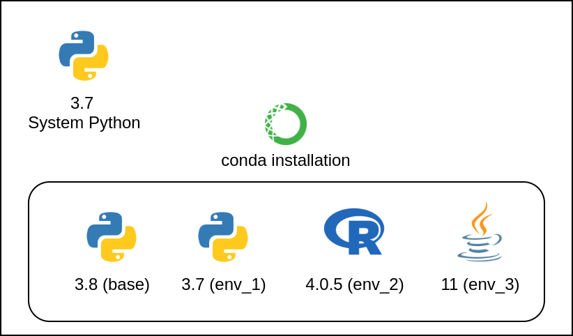
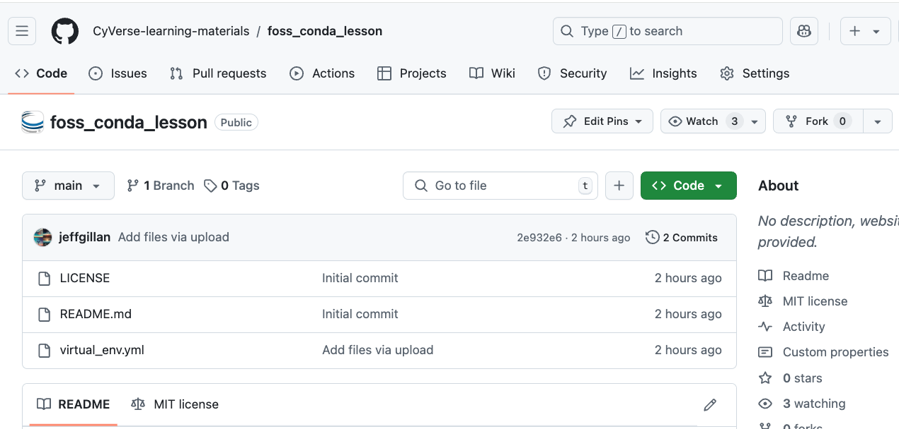
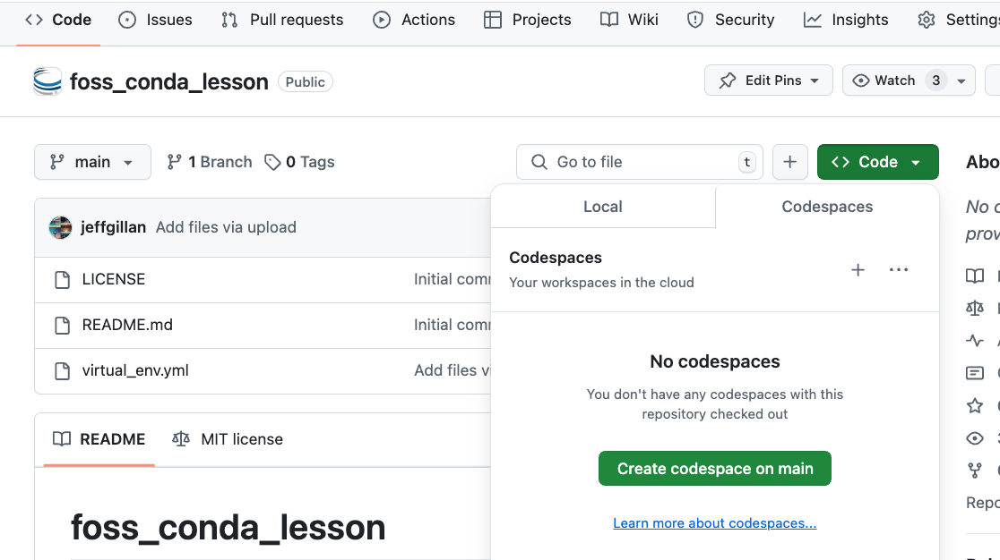
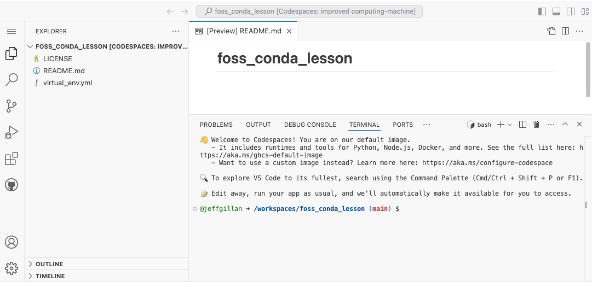

# Reproducibility I: Software Environments

!!! Success "Learning Objectives"
        
    After this lesson, you should be able to:

    *  Understand the value of reproducible computing 
    *  Know the challenges of reproducible computing
    *  Define a computing environment 
    *  Share a software environment with a colleague
    *  Set up a software project with an environment


<br>
<br>
<br>


## Reproducible Scientific Computing

<br>

!!! Quote "Defining Reproducibility"

    "Reproducing the result of a computation means running the same software on the same input data and obtaining the same results." Rougier et al. 2016

    "Getting someone else's code to run on my computer" - Anonymous


<br>
<br>
<br>
<br>

### Interactive (ie, point-and-click) Computing

<figure markdown>
  <a target="blank" rel="open science">{ width="150" } </a>
    <figcaption></figcaption>
</figure>

!!! quote "Definition" 

    Manually navigating a mouse across a graphical user interface (GUI) and running commands by selecting from menu options.

#### Advantages 

- Intuitive and easy to navigate a GUI and click buttons

#### Limitations

- It can be slow to sequence through hundreds of clicks to accomplish an analysis. 
- Less reproducible - Cumbersome to write and follow a click-by-click tutorial 

<br>
<br>
<br>
<br>

### Scripted Computing

<figure markdown>
  <a target="blank" rel="open science">{ width="400" } </a>
    <figcaption></figcaption>
</figure>


!!! quote "Definition"  

    Removing the GUI and instead instructing the computer to run a series of custom commands using a scripting/coding language. 

    We are **automating** what used to take many manual clicks. 

    We can write scripts to install software, clean data, run analyses, and generate figures.

<br>

#### Advantages 

- Much faster to run through commands
- The script runs identically every time, reducing the human element 
- Easy for someone else to quickly reproduce the exact analysis and result
- Enables analysis tasks to scale up 

<br>

#### Challenges

- Requires deeper computer knowledge
- More upfront effort to produce the script

<br>
<br>

!!! question "Discussion Question"
	**What are some tasks you have automated or want to automate?**

	- Have you ever successfully automated a task?
	- Found a way to make something scale or take less time? 
	- What was the task, and how did you do it? 
	- Are there any things you wish you could automate?
	- What are some barriers to automating them?

<br>
<br>


## Scripting Languages

The most common open-source scripting languages (for science) are Python, R, and shell (Bash). 

<figure style="display: flex; justify-content: center;">
    <a href="https://www.python.org/"></a>
    <a href="https://www.r-project.org/"></a>&nbsp;&nbsp;&nbsp;&nbsp
    <a href=""></a>
</figure>

If you recall from [lesson 4 _How to Talk to Computers_](/04_talk_to_computer/#shell-script), we ran a shell script to back up and compress files. The following admonitions show the original shell script as well as the same instructions in Python and R. Scripting languages are simply different ways to instruct a computer. 

??? Tip "Shell Script"

    ```
    #use Bash shell to run the following commands
    #!/bin/bash

    ## Variables
    #the directory you want to back up (e.g., shell-lesson-data)
    SOURCE_DIR=$(find / -type d -name "shell-lesson-data" 2>/dev/null) # Note: if you are working on your computer, this will look in every folder. Be careful with this line!

    #location where the backup will be stored
    BACKUP_DIR="$HOME/Backup"

    #used to create a unique name for each backup based on the current date and time
    TIMESTAMP=$(date +"%Y-%m-%d_%H-%M-%S")

    # name of the compressed backup file
    ARCHIVE_NAME="backup_$TIMESTAMP.tar.gz"


    # Create backup directory if it doesn't exist
    mkdir -p "$BACKUP_DIR"

    # Create a compressed archive of the source directory
    tar -czf "$BACKUP_DIR/$ARCHIVE_NAME" -C "$SOURCE_DIR" .

    # Output the result
    echo "Backup of $SOURCE_DIR completed!"
    echo "Archive created at $BACKUP_DIR/$ARCHIVE_NAME"
    ```

??? Tip "Python"

    ```
    import os
    import subprocess
    import shutil
    from datetime import datetime

    # Variables
    # Find the source directory (e.g., shell-lesson-data)
    def find_source_dir():
        try:
            # Run the 'find' command to locate the directory
            result = subprocess.run(['find', '/', '-type', 'd', '-name', 'shell-lesson-data'], 
                                    stdout=subprocess.PIPE, stderr=subprocess.DEVNULL, text=True)
            source_dir = result.stdout.strip()
            return source_dir
        except Exception as e:
            print(f"Error finding directory: {e}")
            return None

    # Set the backup directory to a folder called Backup in the home directory
    backup_dir = os.path.join(os.path.expanduser("~"), "Backup")

    # Create a unique timestamp for the backup
    timestamp = datetime.now().strftime("%Y-%m-%d_%H-%M-%S")

    # Create the archive name with the timestamp
    archive_name = f"backup_{timestamp}.tar.gz"

    # Ensure backup directory exists
    os.makedirs(backup_dir, exist_ok=True)

    # Find source directory
    source_dir = find_source_dir()

    if source_dir:
        # Create the compressed archive using tar
        archive_path = os.path.join(backup_dir, archive_name)
        try:
            subprocess.run(['tar', '-czf', archive_path, '-C', source_dir, '.'], check=True)
            print(f"Backup of {source_dir} completed!")
            print(f"Archive created at {archive_path}")
        except subprocess.CalledProcessError as e:
            print(f"Error creating archive: {e}")
    else:
        print("Source directory not found!")
    ```


??? Tip "R"

    ```
    # Load necessary libraries
    library(lubridate)

    # Variables
    # Function to find the source directory (e.g., shell-lesson-data)
    find_source_dir <- function() {
    result <- system("find / -type d -name 'shell-lesson-data' 2>/dev/null", intern = TRUE)
    if (length(result) > 0) {
        return(result[1])  # Return the first match, if any
    } else {
        return(NULL)
    }
    }

    # Backup directory
    backup_dir <- file.path(Sys.getenv("HOME"), "Backup")

    # Create a unique timestamp for the backup
    timestamp <- format(now(), "%Y-%m-%d_%H-%M-%S")

    # Name of the compressed archive
    archive_name <- paste0("backup_", timestamp, ".tar.gz")

    # Ensure backup directory exists
    if (!dir.exists(backup_dir)) {
    dir.create(backup_dir, recursive = TRUE)
    }

    # Find the source directory
    source_dir <- find_source_dir()

    if (!is.null(source_dir)) {
    # Create the compressed archive using tar
    archive_path <- file.path(backup_dir, archive_name)
    tar_command <- paste("tar -czf", shQuote(archive_path), "-C", shQuote(source_dir), ".")
    
    # Run the tar command
    system(tar_command)
    
    cat("Backup of", source_dir, "completed!\n")
    cat("Archive created at", archive_path, "\n")
    } else {
    cat("Source directory not found!\n")
    }
    ```


Each language consist of base software (Python Standard Library or R Base Package) and MANY additional packages that can be downloaded and installed for increased capabilities. 

<br>
<br>
<br>

## Computing Environment

A computing environment is the combination of hardware, software, and network resources that provide the infrastructure for computing operations and user interactions. 

- **Hardware**: CPUs, GPUs, RAM
- **Operating system & version**: many flavors of Linux, MacOS, Windows
- **Software versions:** R, Python, etc.
- **Package versions:** specific R or Python packages, which often depend on other packages

<figure markdown>
  <a target="blank" rel="open science">{ width="400" } </a>
    <figcaption>Python Package Dependency</figcaption>
</figure>

<br>
<br>


!!! Warning "**!!Very Important!!**" 

    #### The scripts you create:

    * Were designed to work in _your_ specific computing environment 
    * May not work on someone else's computer because their computing environment is different
    * May not work on your computer in the future, because your computing enviroment will probably change (eg., updated software versions)

<br>

### Software Dependency Hell

Sometimes, it can be _nearly impossible_ to get your computing environment correct enough to run someone else's code. 

This can be caused by incorrect software versions of the packages you are using or their dependencies.

<span style="font-size:1.3em;">_Don't Dispair! There are solutions to avoid software dependency hell and ensure reproducibility from one computer to another_</span>


<br>
<br>


## Software Installation


When you download and install software onto your computer, it will typically install it in a set of specific directories that we call the **System Path**.

### System Path

In the context of computing, the **system path**, often referred to simply as **PATH**, is the set of directories in which the operating system looks for executable files when a command is issued. 

When you go to launch an application by clicking on a desktop icon or with a CLI command, the computer will search for the application within the PATH directories. If it finds the executable, it will launch. 

!!! Tip "Find the PATH on your computer"

    In Linux and Mac Terminal

    `echo $PATH`

    <br>

    In Windows Terminal

    `$env:PATH`

<br>
<br>

<figure markdown="span">
    <iframe width="553" height="280" src="https://www.youtube.com/embed/43zdpmEu4lE" title="What is the system path? // Developer Fundamentals" frameborder="0" allow="accelerometer; autoplay; clipboard-write; encrypted-media; gyroscope; picture-in-picture; web-share" referrerpolicy="strict-origin-when-cross-origin" allowfullscreen></iframe>
    <vidcaption> <br>Nice and Short Video Describing the PATH.</vidcaption> 
</figure>

<br>
<br>

!!! Warning "The PATH prefers one version of any given software."

<br>
<br>
<br>
<br>

## Environment Managers 

One solution to software dependency hell is to use an Environment Manager

An environment manager allows you to create software installation directories (similar to PATH) that are **isolated** from your computer's PATH. You can create unique environments and install specific software version to run specific scripts.

<br>

### :simple-anaconda: Conda - Open Source Environment Manager

[Conda](https://docs.conda.io/en/latest/) is a popular and open source environment manager tool that can be installed on any operating system (Windows, MacOS, Linux).

* Users can create environments that have their own set of packages, dependencies, and even their own version of Python.
* Projects can have their own specific requirements without interfering with each other
* It allows for consistent and reproducible results across different systems and setups

<figure markdown>
  <a target="blank" rel="open science">{ width="450" } </a>
    <figcaption>Conceptual Graphic 1</figcaption>
</figure>

<figure markdown>
  <a target="blank" rel="open science">{ width="400" } </a>
    <figcaption>Conceptual Graphic 2</figcaption>
</figure>


### :simple-r: [Renv](https://rstudio.github.io/renv/articles/renv.html)

* R package that allows you to create unique environments for an R project

<br>
<br>
<br>


## Sharing your Environment with Colleagues

Whether you are using Conda, Pip, or Renv, you should be able to share the specifications of your software environment so colleagues can reproduce the environment.

The general sharing workflow:

1. Output an _environment file_ that lists the software and versions of the environment

2. Share the file with colleagues through a platform like Github

3. Colleagues create an empty environment on their computer and populate it with the contents of the _environment file_


??? Tip ":simple-anaconda: Conda to Share Environment"

    ### :simple-anaconda: [Conda](https://docs.conda.io/en/latest/)

    1. Export your Conda Environment
    ```
    conda env export > my_conda_env.yml
    ```

    2. Share the .yml file through Github 


    3. Reproduce the Environment on a Different Computer
    ```
    conda env create --file environment.yml
    ```
    !!! Success "Conda exports your Pip environment as well"
        Exporting your environment using Conda (`conda env export > my_conda_env.yml`) will **ALSO** export your pip environment!

??? Tip ":simple-python: Pip to Share Environment"

    ### :simple-python: Python

    1. Export python libraries present in your environment
    ```
    pip3 freeze > requirements.txt 
    ```

    2. Share the `requirements.txt` on Github

    3. Reproduce the Environment on a Different Computer
    ```
    pip install -r requirements.txt
    ```

??? Tip ":simple-r: Renv to Share Environment"

    ### :simple-r: [Renv](https://rstudio.github.io/renv/articles/renv.html)

    1. Create an isolated environment
    ```
    renv::init()
    ```

    2. Export R packages to the renv.lock file
    ```
    renv:snapshot()
    ```

    3. Share the `renv.lock`, `.Rprofile`, `renv/settings.json` and `renv/activate.R` files to Github

    4. Reproduce the Environment on a Different Computer
    ```
    renv::restore()
    ```

<br>
<br>


## Package Managers

A software tool to find, download, and install software packages to PATH or virtual environment 


??? Tip ":simple-anaconda: Conda"

    ### :simple-anaconda: [Conda](https://docs.conda.io/en/latest/)
    **Software:** Python, R, Django, Celery, PostgreSQL, nginx, Node.js, Java programs, C and C++, Perl, and command line tools

    **Repository:** [Conda-Forge](https://conda-forge.org/). 


??? Tip ":simple-python: Pip"

    ### :simple-python: [Pip](https://pypi.org/project/pip/)

    **Software:** python 

    **Repository:** [PyPi](https://pypi.org/)

    **Note:** Pip can be used together with Conda environment manager. 


??? Tip ":simple-r: R"

    ### :simple-r: R
    With the R language, a package manager is built directly into the R Base Package. 
    ```
    install.packages('ggplot2')
    ```

    **Repository:**  [R Comprehensive R Archive Network (CRAN)](https://cran.r-project.org/)

---

<br>
<br>


## Reproducibility Tutorial Using Conda


### Set Up

!!! Note "OS of choice"

    To get everyone on the same page, we will do this exercise together using the Linux terminal in Github Codespaces. 
    
    However, if you'd like to use your own computer feel free to! If you're on Mac or Linux, open your terminal; If you're on Windows, please use the Windows Subsystem for Linux (WSL) so you can follow along. 

    ??? Tip "How to Scroll in Cyverse (Tmux) Cloud Shell"
        
        If you're using the Cyverse Cloud Shell, you can scroll up and down by pressing `Ctrl + b` and then `[` to enter scroll mode. You can then use the arrow keys to scroll up and down. Press `q` to exit scroll mode.

        !!! Note "The CLI in CyVerse is controlled with [Tmux](https://en.wikipedia.org/wiki/Tmux), a software that allows to "window" the CLI; Here is a [cheat sheet](https://tmuxcheatsheet.com/) that will teach you more Tmux tricks!"

<br/>

### Launch Github Codespaces

**1** Go to this [Github repository](https://github.com/cyverse-learning-materials/foss_conda_lesson) and Fork it (i.e., make a copy of it in your Github account).

<figure markdown>
  <a target="blank" rel="open science">{ width="550" } </a>
    <figcaption></figcaption>
</figure>

**2** Click on the green "Code" button and select "Create Codespaces on main"

<figure markdown>
  <a target="blank" rel="open science">{ width="550" } </a>
    <figcaption></figcaption>
</figure>

**3** After a few moments, you will be taken to a new browser window with a Linux terminal.

<figure markdown>
  <a target="blank" rel="open science">{ width="550" } </a>
    <figcaption></figcaption>
</figure>

<br/>

### Installing Conda

**If you are using Codespaces, Conda is already installed.**

When you download and install Conda it comes in two different flavors: 

[Miniconda](https://docs.anaconda.com/free/miniconda/) - lightweight (500 mb) program that includes _Conda_, the environment and package manager, as well as a recent version of the Standard Python Library. 

[Anaconda](https://anaconda.org/) - a larger (2.5GB) program that includes _Conda_ and many more python libraries pre-installed (in Conda base environment), as well as graphical user interface, acccess to jupyter notebooks, and support for easily integrating the R language.

<figure markdown>
  <a href="https://medium.com/hydroinformatics/getting-started-with-conda-environment-332182d1e937" target="blank" rel="conda"> </a>
    <figcaption> Conda, Miniconda, and Anaconda. <br> [Taken from *Getting Started with Conda, Medium*](https://medium.com/hydroinformatics/getting-started-with-conda-environment-332182d1e937). </figcaption>
</figure>


??? Tip "Installing Conda"

    
    For the appropriate installation package, visit https://docs.conda.io/en/latest/miniconda.html. :warning: Note: **If you are using the WSL, install the Linux version!!**
                
    ```
    # Download conda and add right permissions
    wget https://repo.anaconda.com/miniconda/Miniconda3-py39_4.12.0-Linux-x86_64.sh     # Modify this to match the OS you're using.
    chmod +x Miniconda3-py39_4.12.0-Linux-x86_64.sh

    # install conda silenty (-b) and update (-u) and initial conda run
    ./Miniconda3-py39_4.12.0-Linux-x86_64.sh -b -u
    ~/miniconda3/bin/conda init

    # Restart bash so that conda is activated
    source ~/.bashrc
    ```

    You'll be able to tell when conda is active when next `(base)` is present next to the to the shell prompt such as

    ```
    (base) user@machine
    ```

    Conda should now be installed and can be used to install other necessary packages! 

??? tip "Tip: slow Conda? Try Mamba."

    Conda is known to take time processing some software installation. A solution is to use [Mamba](https://github.com/mamba-org/mamba), a reimplementation of Conda in C++ for quicker queries and installations. Mamba is then invoked by using `mamba` instead of `conda` (whilst keeping options and the rest of the command synthax the same). 

    The quickest way to install mamba is with `conda install -c conda-forge mamba`, or follow the official installation documentation [here](https://mamba.readthedocs.io/en/latest/installation/mamba-installation.html). 

<br>
<br>
<br>

### Environment Management with Conda

When you start a Codespaces terminal, the prompt will look something like this: 

```
@jeffgillan ➜ /workspaces/foss_conda_lesson (main) $
```
<br>

Type the following command to see the current conda environment. 

```
conda info
```
<br>

Initialize conda by running the following commands. 

```
conda init
exec $SHELL
```
<br>

View the list of conda environments. There should only be one environment called `base`.
```
conda env list
```
<br>

View the software installed in the base directory. Notice the version of Python.
```
conda list
```
<br>
<br>

Create our own custom environment (type `y` when prompted).

```
conda create --name myenv
```

<br>
<br>

Activate your new environment with 

```
conda activate myenv
```
<br>
You will notice that the prompt changed to `(myenv)`

<br>

View the software that is installed in your new custom environment. It should be empty!

```
conda list
```


<br>
<br>
<br>

### Package management with Conda

Within your new custom environment (ie, myenv) download and install a specific version of python. This may take a few minutes to complete. 

```
conda install python=3.9
```

<br>

View the new software that has been installed. Notice the version of Python is now 3.9. while the base is 3.12
```
conda list
```

<br>
<br>

Install Salmon (genomics software) using Conda

```
conda install -c bioconda salmon 
```

<br>

!!! Info "Conda channels"

    Conda operates through **channels**, specififc repositories where packages are stored. Specific packages sometimes may appear in multiple channels, however it is always helpful to specify a channel with the `-c` flag.

<br>
<br>
<br>

### Share and Reproduce a Conda Environment

Export all of the software in your custom environment to a file

```
conda env export --no-builds > myenv.yml
```
<br>
Let's view the contents of the .yml file. It should contain all the software you installed in the environment. This `myenv.yml` file can be shared with a colleague so they can reproduce the same environment on their computer.  
```
nano myenv.yml
```
<br>


Reproduce someone else's environment with `mandelbrot.yml` environment file located in the repository.

```
conda env create --file mandelbrot.yml
```

<br>

Activate the environment to use the software installed in the environment. 

``` 
conda activate mandelbrot
```

<br>

Look at the software installed in the environment. 

```
conda list
```

<br>

Run a python script that generates a Mandelbrot set 

```
python3 mandelbrot.py
``` 


<br>


