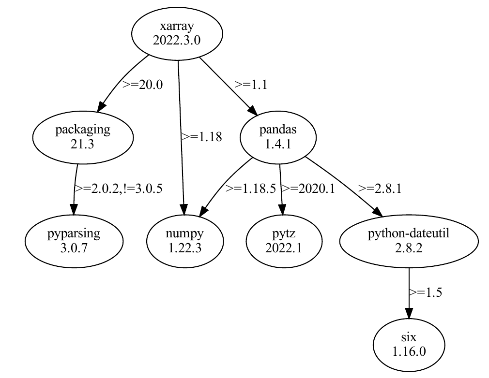
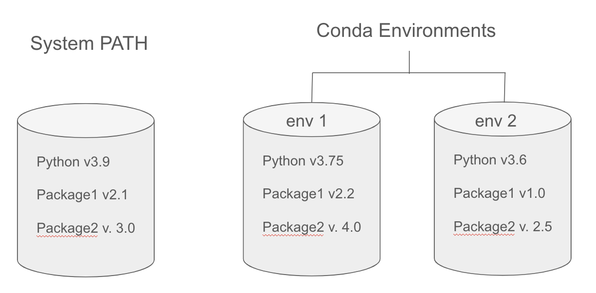

# Reproducibility I: Software Environments

!!! Success "Learning Objectives"
        
    After this lesson, you should be able to:

    *  Understand the value of reproducible computing 
    *  Know the challenges of reproducible computing
    *  Define a computing environment 
    *  Share a software environment with a colleague
    *  Set up a software project with an environment


<br>
<br>
<br>


## Reproducible Scientific Computing

<br>

!!! Quote "Defining Reproducibility"

    "Reproducing the result of a computation means running the same software on the same input data and obtaining the same results." Rougier et al. 2016

    "Getting someone else's code to run on my computer" - Anonymous


<br>
<br>
<br>

As the graphic below suggests, _Reproducibility_ is a spectrum of sharing behaviors. 

<figure markdown>
  <a target="blank" rel="open science">{ width="600" } </a>
    <figcaption> [Peng 2011](https://science.sciencemag.org/content/334/6060/1226)</figcaption>
</figure>


<br>
<br>
<br>


<br>

### Interactive (ie, point-and-click) Computing

<figure markdown>
  <a target="blank" rel="open science">{ width="150" } </a>
    <figcaption></figcaption>
</figure>

**Definition:** Manually navigating a mouse across a graphical user interface (GUI) and running commands by selecting from menu options. 


#### Advantages 

* Inuitive and easy to navigate a GUI and click buttons


#### Limitations

* It can be slow to sequence through hundreds of clicks to accomplish an analysis. 
* Less reproducible - Cumbersome to write and follow a click-by-click tutorial 

<br>
<br>
<br>
<br>

### Scripted Computing

<figure markdown>
  <a target="blank" rel="open science">{ width="400" } </a>
    <figcaption></figcaption>
</figure>


**Definition:** Removing the GUI and instead instructing the computer to run a series of custom commands using a scripting/coding language. 

We are **automating** what used to take many manual clicks. 


We can write scripts to install software, clean data, run analyses, and generate figures.

<br>

#### Advantages 
* Much faster to run through commands
* The script runs identically every time, reducing the human element 
* Easy for someone else to quickly reproduce the exact analysis and result
* Enables analysis tasks to scale up 

<br>

#### Challenges 
* Requires deeper computer knowledge
* More upfront effort to produce the script


<br>
<br>


!!! question "Discussion Question"
	**What are some tasks you have automated or want to automate?**

	- Have you ever successfully automated a task?
	- Found a way to make something scale or take less time? 
	- What was the task, and how did you do it? 
	- Are there any things you wish you could automate?
	- What are some barriers to automating them?


<br>
<br>
<br>
<br>


## Scripting Languages

The two most common open-source scripting languages (for science) are Python and R.

[{width=150}]()
[{width=150}]()

Both languages consist of base software (Python Standard Library or R Base Package) and MANY additional packages that can be downloaded and installed for increased capabilities. 


<br>
<br>
<br>
<br>

## Software Installation

When you download and install software onto your computer, it will typically install it in a set of specific directories that we call the **System Path**.

### System Path

In the context of computing, the **system path**, often referred to simply as **PATH**, is the set of directories in which the operating system looks for executable files when a command is issued. 

When you go to launch an application by clicking on a desktop icon or with a CLI command, the computer will search for the application within the PATH directories. If it finds the executable, it will launch. 

!!! Tip "Find the PATH on your computer"

    In Linux and Mac Terminal

    `echo $PATH`

    <br>

    In Windows Terminal

    `echo %PATH%`

<br>
<br>


Nice and Short Video Describing the PATH
<iframe width="553" height="280" src="https://www.youtube.com/embed/43zdpmEu4lE" title="What is the system path? // Developer Fundamentals" frameborder="0" allow="accelerometer; autoplay; clipboard-write; encrypted-media; gyroscope; picture-in-picture; web-share" referrerpolicy="strict-origin-when-cross-origin" allowfullscreen></iframe>


!!! Warning 

    The PATH prefers one version of any given software. 


<br>
<br>
<br>
<br>

## Computing Environment
A computing environment is the combination of hardware, software, and network resources that provide the infrastructure for computing operations and user interactions. 

- **Hardware**: CPUs, GPUs, RAM
- **Operating system & version**: many flavors of Linux, MacOS, Windows
- **Software versions:** R, Python, etc.
- **Package versions:** specific R or Python packages, which often depend on other packages

<figure markdown>
  <a target="blank" rel="open science">{ width="400" } </a>
    <figcaption>Python Package Dependency</figcaption>
</figure>

<br>
<br>

#### The scripts you create:

* Were designed to work in _your_ specific computing environment 
* May not work on your computer in the future, because your computing enviroment will probably change (eg., updated software versions)
* May not work on someone else's computer because their computing environment is different

<br>
<br>
<br>
<br>

### Software Dependency Hell


Sometimes, it can be _nearly impossible_ to get your computing environment correct enough to run someone else's code.

This can caused by incorrect software versions of the packages you are using or their dependencies.

Updating software installed in the **system path** - to make new code work - can break old code!


<br>
<br>
<br>

## Environment Managers 

One solution to software dependency hell is to use an Environment Manager

An environment manager allows you to create software installation directories (similar to PATH) that are **isolated** your computer's PATH. You can create unique environments and install specific software version to run specific scripts.

<br>

### :simple-anaconda: Conda - Open Source Environment Manager

[Conda](https://docs.conda.io/en/latest/) is a popular and open source environment manager tool that can be installed on any operating system (Windows, MacOS, Linux).

* Users can create environments that have their own set of packages, dependencies, and even their own version of Python.
* Projects can have their own specific requirements without interfering with each other
* It allows for consistent and reproducible results across different systems and setups

<figure markdown>
  <a target="blank" rel="open science">{ width="450" } </a>
    <figcaption></figcaption>
</figure>
<br>
<br>

### :simple-r: [Renv](https://rstudio.github.io/renv/articles/renv.html)

* R package that allows you to create unique environments for an R project

<br>
<br>
<br>

## Package Managers

A software tool to find, download, and install software packages to PATH or virtual environment 

### :simple-anaconda: [Conda](https://docs.conda.io/en/latest/)
**Software:** Python, R, Django, Celery, PostgreSQL, nginx, Node.js, Java programs, C and C++, Perl, and command line tools

**Repository:** [Conda-Forge](https://conda-forge.org/). 


<br>

### :simple-python: [Pip](https://pypi.org/project/pip/)

**Software:** python 

**Repository:** [PyPi](https://pypi.org/)

**Note:** Pip can be used together with Conda environment manager. 

<br>

### :simple-r: R
With the R language, a package manager is built directly into the R Base Package. 
```
install.packages('ggplot2')
```

**Repository:**  [R Comprehensive R Archive Network (CRAN)](https://cran.r-project.org/)
  


<br>
<br>

## Sharing your Environment with Colleagues

Whether you are using Conda, Pip, or Renv, you should be able to share the specifications of your software environment so colleagues can reproduce the environment.

The general sharing workflow:

1. Output an _environment file_ that lists the software and versions of the environment

2. Share the file with colleagues through a platform like Github

3. Colleagues create an empty environment on their computer and populate it with the contents of the _environment file_

<br>

### :simple-anaconda: [Conda](https://docs.conda.io/en/latest/)

1. Export your Conda Environment
   ```
   conda env export > my_conda_env.yml
   ```

2. Share the .yml file through Github 


3. Reproduce the Environment on a Different Computer
   ```
   conda env create --file environment.yml
   ```
!!! Success "Conda exports your Pip environment as well"
    Exporting your environment using Conda (`conda env export > my_conda_env.yml`) will **ALSO** export your pip environment!
<br>
<br>

### :simple-python: Python

1. Export python libraries present in your environment
   ```
   pip3 freeze > requirements.txt 
   ```

2. Share the `requirements.txt` on Github

3. Reproduce the Environment on a Different Computer
   ```
   pip install -r requirements.txt
   ```

!!! Note "Why `pip3`?"
    `pip3 freeze > requirements.txt` is used to export the pip environment such that it is readable for Python 3. If you want to export an environment for Python 2, you can use `pip freeze > requirements.txt`.
<br>
<br>

### :simple-r: [Renv](https://rstudio.github.io/renv/articles/renv.html)

1. Create an isolated environment
   ```
   renv::init()
   ```

2. Export R packages to the renv.lock file
   ```
   renv:snapshot()
   ```
3. Share the `renv.lock`, `.Rprofile`, `renv/settings.json` and `renv/activate.R` files to Github

4. Reproduce the Environment on a Different Computer
   ```
   renv::restore()
   ```


<br>
<br>


---

<br>
<br>
<br>
<br>
<br>
<br>

---

## Reproducibility Tutorial


<br>


### Installing Conda

When you download and install Conda it comes in two different flavors: 


[Miniconda](https://docs.anaconda.com/free/miniconda/) - lightweight (500 mb) program that includes _Conda_, the environment and package manager, as well as a recent version of the Standard Python Library. 

[Anaconda](https://anaconda.org/) - a larger (2.5GB) program that includes _Conda_ and many more python libraries pre-installed (in Conda base environment), as well as graphical user interface, acccess to jupyter notebooks, and support for easily integrating the R language.


<figure markdown>
  <a href="https://medium.com/hydroinformatics/getting-started-with-conda-environment-332182d1e937" target="blank" rel="conda"> </a>
    <figcaption> Conda, Miniconda, and Anaconda. <br> [Taken from *Getting Started with Conda, Medium*](https://medium.com/hydroinformatics/getting-started-with-conda-environment-332182d1e937). </figcaption>
</figure>


??? Tip "Installing Conda"

    
    For the appropriate installation package, visit https://docs.conda.io/en/latest/miniconda.html. :warning: Note: **If you are using the WSL, install the Linux version!!**
                
    ```
    # Download conda and add right permissions
    wget https://repo.anaconda.com/miniconda/Miniconda3-py39_4.12.0-Linux-x86_64.sh     # Modify this to match the OS you're using.
    chmod +x Miniconda3-py39_4.12.0-Linux-x86_64.sh

    # install conda silenty (-b) and update (-u) and initial conda run
    ./Miniconda3-py39_4.12.0-Linux-x86_64.sh -b -u
    ~/miniconda3/bin/conda init

    # Restart bash so that conda is activated
    source ~/.bashrc
    ```

    You'll be able to tell when conda is active when next `(base)` is present next to the to the shell prompt such as

    ```
    (base) user@machine
    ```

    Conda should now be installed and can be used to install other necessary packages! 

<br>

??? tip "Tip: slow Conda? Try Mamba."

    Conda is known to take time processing some software installation. A solution is to use [Mamba](https://github.com/mamba-org/mamba), a reimplementation of Conda in C++ for quicker queries and installations. Mamba is then invoked by using `mamba` instead of `conda` (whilst keeping options and the rest of the command synthax the same). 

    The quickest way to install mamba is with `conda install -c conda-forge mamba`, or follow the official installation documentation [here](https://mamba.readthedocs.io/en/latest/installation/mamba-installation.html). 

<br>
<br>
<br>
<br>
<br>


### Conda on Cyverse

!!! Note "OS of choice"

    This tutorial will be performed using the [CyVerse CLI (Command Line Interface)](https://de.cyverse.org/apps/de/5f2f1824-57b3-11ec-8180-008cfa5ae621) which is a Linux Command Line. This requires a [Cyverse account](https://user.cyverse.org/signup). 
    
    However, if you'd like to use your own computer feel free to! If you're on Mac or Linux, open your terminal; If you're on Windows, please use the Windows Subsystem for Linux (WSL) so you can follow along. 

    ??? Tip "How to Scroll in Cyverse(Tmux) Cloud Shell"
        
        If you're using the Cyverse Cloud Shell, you can scroll up and down by pressing `Ctrl + b` and then `[` to enter scroll mode. You can then use the arrow keys to scroll up and down. Press `q` to exit scroll mode.

<br>
<br>

### Environment Management with Conda

When you start a Cyverse Cloud shell, the prompt will look something like this: 

```
(base) jovyan@a12b272e0:/home/user/data-store$
```
<br>
Miniconda has already been pre-installed, and by default, you are started in a base Conda directory (base)

<br>


View the list of conda environments
```
conda env list
```
<br>

View the software installed in the base directory. Notice the version of Python.
```
conda list
```
<br>
<br>

Create our own custom environment (type `y` when prompted).

```
conda create --name myenv
```

<br>
<br>

Activate your new environment with 

```
conda activate myenv
```
<br>
You will notice that the prompt changed to `(myenv)`

<br>

View the software that is installed in your new custom environment. It should be empty!

```
conda list
```


<br>
<br>
<br>
<br>

### Package management with Conda

Within your new custom environment (ie, myenv) download and install a specific version of python. This may take a few minutes to complete. 

```
conda install python=3.9
```

<br>

View the new software that has been install 
```
conda list
```


<br>
<br>
<br>

Install Salmon and FastQC (genomics software) using Conda

```
conda install -c bioconda salmon fastqc
```

<br>

!!! Info "Conda channels"

    Conda operates through **channels**, specififc repositories where packages are stored. Specific packages sometimes may appear in multiple channels, however it is always helpful to specify a channel with the `-c` flag.

<br>
<br>
<br>

### Share and Reproduce a Conda Environment

Export all of the software in your custom environment to a file

```
conda env export > myenv.yml
```
<br>
Let's view the contents of the .yml file
```
nano myenv.yml
```
<br>


Now we are going to pretend that we are reproducing a conda environment from a .yml file shared by a collegue.
<br>

Change the `name` of the environement within the .yml file from `myenv` to `myenv2`


<br>
Create a new environment and populate it with the .yml environment file

```
conda env create --file myenv2.yml
```


<br>
<br>
<br>
<br>

### Package management with Pip

Pip works similarly to Conda, as Pip is the package management supported by the Python Software foundation. If you use Python for your work it is likely you have installed packages using Pip.

We only have to install a single package required for this tutorial, MultiQC. To install MultiQC using Pip, do:

```
pip install multiqc
```

Similar to Conda, you can export your pip environment by doing

```
pip3 freeze > requirements.txt
```
<br>

!!! Note "Why `pip3`?"
    `pip3 freeze > requirements.txt` is used to export the pip environment such that it is readable for Python 3. If you want to export an environment for Python 2, you can use `pip freeze > requirements.txt`.
<br>
<br>
<br>
<br>

