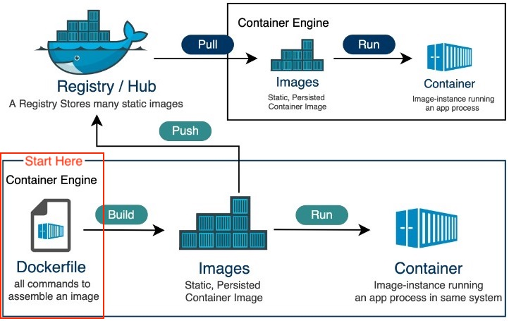
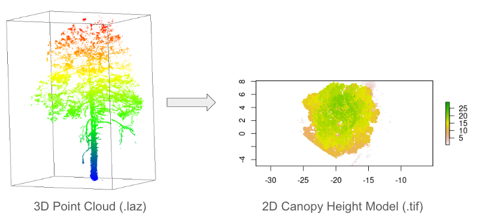
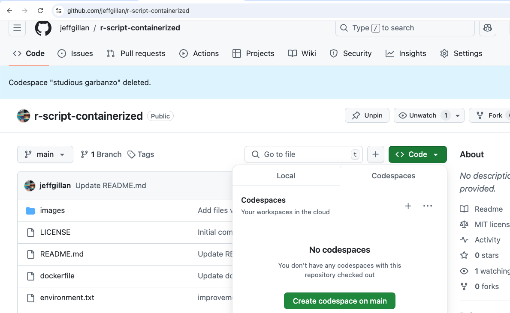
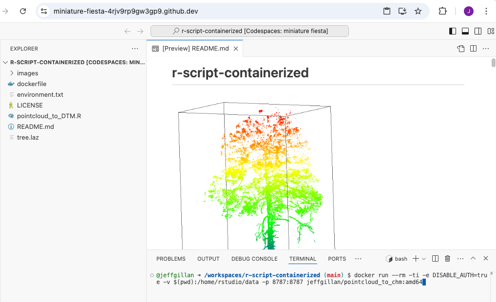
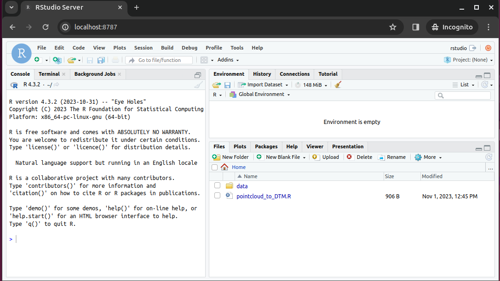
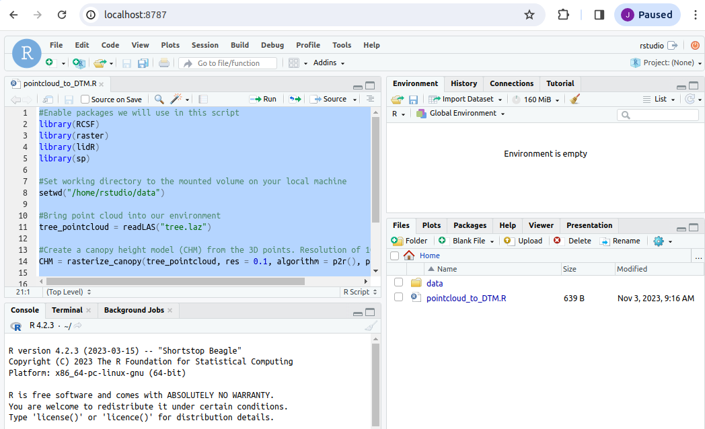
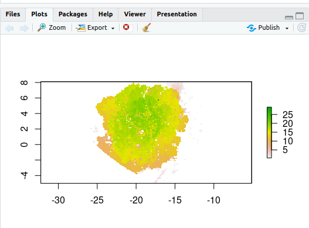
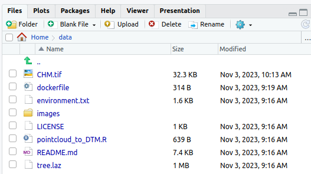

# Reproducibility III: Building Docker Containers

!!! Success "Learning Objectives"

    After this lesson, you should be able to:

    - Explain what containers are used for in reproducible research contexts
    - Search for and run a Docker container locally or on a remote system
    - Understand how version control and data can be used inside a container
    - Understand the Dockerfile structure and fields 
    - Build, execute and push your own Docker image

## Reproducible Computer Code

Sharing your scientific analysis code with your colleagues is an essential pillar of Open Science that will help push your field forward. 

There are, however, technical challenges that may prevent your colleagues from effectively running your code on their computers. In the previous lesson [Reproducibility II](06_soft_env.md) we described how [computing environments](06_reproducibility_I.md/#computing-environment) can lead the way of reproducibility by creating a "recipe" for replicating a computing environment.

There is another method to overcoming the replicability obstacle. Instead of recreating a computing environment, **why not package up the code _and_ all of the software and send it to your colleague?**

## What *are* containers?

A [container](https://www.docker.com/resources/what-container/) is a standard unit of software that packages up code and all its dependencies so the application runs quickly and reliably from one computing environment to another 

- Container images are a lightweight, standalone, executable package of software that includes everything needed to run an application: code, runtime, system tools, system libraries and settings
- Each of these elements are specifically versioned and do not change
- The recipient does not need to *install* the software in the traditional sense

<br>

A useful analogy is to think of software containers as shipping containers. It allows us move cargo (software) around the world in standard way. The shipping container can be offloading and executed anywhere, as long the destination has a shipping port (i.e., Docker) 

<figure markdown>
  <a href="" target="blank" rel="open science">{ width="500" } </a>
    <figcaption> Software Shipping Containers </figcaption>
</figure>

<br/>

Containers are similar to virtual machines (VMs), but are smaller and easier to share. A big distinction between Containers and VMs is what is within each environment: VMs require the OS to be present within the image, whilst containers rely on the host OS and the container engine (e.g., Docker Engine). 

<figure markdown>
  <a href="https://cloudblogs.microsoft.com/opensource/2019/07/15/how-to-get-started-containers-docker-kubernetes/" target="blank" rel="containerexp"> </a>
    <figcaption> Difference between Virtual Machines and Containers. Containers are a lot more portable as these do not require an OS to be bundled with the software. Figure source: [Microsoft Cloudblogs](https://cloudblogs.microsoft.com/opensource/2019/07/15/how-to-get-started-containers-docker-kubernetes/). </figcaption>
</figure>

<br>

## Containers for Reproducible Science
Software containers, such as those managed by Docker or Singularity, are incredibly useful for reproducible science for several reasons:

#### Environment Consistency: 
Containers encapsulate the software environment, ensuring that the same versions of software, libraries, and dependencies are used every time, reducing the "it works on my machine" problem.

- **Ease of Sharing**:
    - Containers can be easily shared with other researchers, allowing them to replicate the exact software environment used in a study.
- **Platform Independence**:
    - Containers can run on different operating systems and cloud platforms, allowing for consistency across different hardware and infrastructure.
- **Version Control**:
    - Containers can be versioned, making it easy to keep track of changes in the software environment over time.
- **Scalability**:
    - Containers can be easily scaled and deployed on cloud infrastructure, allowing for reproducible science at scale.
- **Isolation**:
    - Containers isolate the software environment from the host system, reducing the risk of conflicts with other software and ensuring a clean and controlled environment.

<br>
<br>

The most common container software is [:material-docker: Docker](https://www.docker.com/){target=_blank}, which is a platform for developers and sysadmins to develop, deploy, and run applications with containers. [Apptainer](https://apptainer.org/docs/user/main/) (formerly, Singularity), is another popular container engine, which allows you to deploy containers on HPC clusters.

[DockerHub](https://hub.docker.com/) is the world's largest respository of container images. Think of it as the 'Github' of container images. It facilitates collaboration amongst developers and allows you to share your container images with the world. Dockerhub allows users to maintain different versions of container images.

!!! Warning "While Docker allows you to quickly run software from other people, it may not work across every platform. <br> <br> There are different CPU architectures (`arm`, `amd64`, `x64`, `x86`) deployed across cloud, computer workstations, laptops, and cellular phones. Docker containers and their software can be cross-compiled across architectures, but this must be done by the creators."

<br>
<br>

## Introduction to :material-docker: Docker 

<figure markdown>
  <a href="https://hub.docker.com" target="blank" rel="docker"> </a>
</figure>

There are no specific skills needed for this tutorial beyond elementary command line ability and using a text editor. 

We are going to be using [:material-github: GitHub CodeSpaces](https://github.com/features/codespaces){target=_blank} for the hands on portion of the workshop, which features [:material-microsoft-visual-studio-code: VS Code](https://code.visualstudio.com/){target=_blank} as a fully enabled development environment with Docker already installed. 


Our instructions on starting a new CodeSpace are [here](https://cc.cyverse.org/cloud/codespaces/){target=_blank}. 

??? Info "Installing Docker on your personal computer"

    We are going to be using virtual machines on the cloud for this course, and we will explain why this is a good thing, but there may be a time when you want to run Docker on your own computer.

    Installing Docker takes a little time but it is reasonably straight forward and it is a one-time setup.

    Installation instructions from Docker Official Docs for common OS and chip architectures:

	- [:fontawesome-brands-apple: Mac OS X](https://docs.docker.com/docker-for-mac/){target=_blank}
	- [:fontawesome-brands-windows: Windows](https://docs.docker.com/docker-for-windows){target=_blank}
	- [:fontawesome-brands-ubuntu: Ubuntu Linux](https://docs.docker.com/install/linux/docker-ce/ubuntu/){target=_blank}


## General Workflow

<figure markdown>
  
    <figcaption> The container's life cycle. Figure source: [Tutorialspoint](https://www.tutorialspoint.com/docker/index.htm). </figcaption>
</figure>

### Images vs Containers

|| Image | Container |
|:---:|---|---|
| **What** | A snapshot of an application <br> containing code, libraries, dependencides <br> and files needed for the application to run | A runtime instance of the Docker image |
| **When** | Created through a Dockerfile | Runtime executed after Image is created |
| **Why** | Reproducibility and consistency! | Reproducibility and consistency! |
| **Where** | Stored in an online registry (e.g., [Docker Hub](https://hub.docker.com/)) | Executed on your machine |

<br>
<br>

---

## Fundamental Docker Commands :octicons-terminal-16: 

Docker commands in the terminal use the prefix `docker`.

!!! Note "For every command listed, the correct execution of the commands through the command line is by using `docker` in front of the command: for example `docker help` or `docker search`. Thus, every :material-docker: = `docker`."

!!! Warning "To follow along, please start a Codespace in the following repository: **https://github.com/jeffgillan/r-script-containerized**. We are going to be using this repository throughout today, to learn docker commands, run docker containers and building our own container."

### :material-docker: help

Like many other command line applications the most helpful flag is the `help` command which can be used with the Management Commands:

``` 
$ docker 
$ docker --help
```

### :material-docker: search

We talk about the concept of [Docker Registries](https://cc.cyverse.org/docker/registry/){target=_blank} in the next section, but you can search the public list of registeries by using the `docker search` command to find public containers on the Official [Docker Hub Registry](https://hub.docker.com):

```
$ docker search  
```

### :material-docker: pull

Go to the [Docker Hub](https://hub.docker.com) and type `hello-world` in the search bar at the top of the page. 

Click on the 'tag' tab to see all the available 'hello-world' images. 

Click the 'copy' icon at the right to copy the `docker pull` command, or type it into your terminal:

```
$ docker pull hello-world
```

!!! Note
    If you leave off the `:` and the tag name, it will by default pull the `latest` image

```
$ docker pull hello-world
Using default tag: latest
latest: Pulling from library/hello-world
2db29710123e: Pull complete 
Digest: sha256:bfea6278a0a267fad2634554f4f0c6f31981eea41c553fdf5a83e95a41d40c38
Status: Downloaded newer image for hello-world:latest
docker.io/library/hello-world:latest
```

Now try to list the files in your current working directory:

```
$ ls -l
```

??? Question "Where is the image you just pulled?"

    Docker saves container images to the Docker directory (where Docker is installed). 
    
    You won't ever see them in your working directory.

    Use 'docker images' to see all the images on your computer:

    ```
    $ docker images
    ```

### :material-docker: run

The single most common command that you'll use with Docker is `docker run` ([see official help manual](https://docs.docker.com/engine/reference/commandline/run/) for more details).


```
$ docker run hello-world:latest
```

In the demo above, you used the `docker pull` command to download the `hello-world:latest` image.

What about if you run a container that you haven't downloaded?


```
$ docker run alpine:latest
```

When you executed the command `docker run alpine:latest`, Docker first looked for the cached image locally, but did not find it, it then ran a `docker pull` behind the scenes to download the `alpine:latest` image and then execute your command.


### :material-docker: images

You can now use the `docker images` command to see a list of all the cached images on your system:

```
$ docker images	
REPOSITORY              TAG                 IMAGE ID            CREATED             VIRTUAL SIZE
alpine                 	latest              c51f86c28340        4 weeks ago         1.109 MB
hello-world             latest              690ed74de00f        5 months ago        960 B
```

??? Info "Inspecting your containers"

	To find out more about a Docker images, run `docker inspect hello-world:latest`

### :material-docker: ps

Now it's time to see the `docker ps` command which shows you all containers that are currently running on your machine. 

```
docker ps
```

Since no containers are running, you see a blank line.

```
$ docker ps
CONTAINER ID        IMAGE               COMMAND             CREATED             STATUS              PORTS               NAMES
```

Let's try a more useful variant: `docker ps --all`

```
$ docker ps --all
CONTAINER ID   IMAGE                                            COMMAND                  CREATED          STATUS                      PORTS     NAMES
a5eab9243a15   hello-world                                      "/hello"                 5 seconds ago    Exited (0) 3 seconds ago              loving_mcnulty
3bb4e26d2e0c   alpine:latest                                    "/bin/sh"                17 seconds ago   Exited (0) 16 seconds ago             objective_meninsky
192ffdf0cbae   opensearchproject/opensearch-dashboards:latest   "./opensearch-dashbo…"   3 days ago       Exited (0) 3 days ago                 opensearch-dashboards
a10d47d3b6de   opensearchproject/opensearch:latest              "./opensearch-docker…"   3 days ago       Exited (0) 3 days ago                 opensearch-node1

```

What you see above is a list of all containers that you have run. 

Notice that the `STATUS` column shows the current condition of the container: running, or as shown in the example, when the container was exited.

### :material-docker: stop

The `stop` command is used for containers that are actively running, either as a foreground process or as a detached background one.

You can find a running container using the `docker ps` command.

### :material-docker: rm

You can remove individual stopped containers by using the `rm` command. Use the `ps` command to see all your stopped contiainers:

```
@user ➜ /workspaces $ docker ps -a
CONTAINER ID   IMAGE                        COMMAND                  CREATED              STATUS                          PORTS     NAMES
03542eaac9dc   hello-world                  "/hello"                 About a minute ago   Exited (0) About a minute ago             unruffled_nobel
```

Use the first few unique alphanumerics in the CONTAINER ID to remove the stopped container:

```
@user ➜ /workspaces (mkdocs ✗) $ docker rm 0354
0354
```

Check to see that the container is gone using `ps -a` a second time (`-a` is shorthand for `--all`; the full command is `docker ps -a` or `docker ps --all`).

### :material-docker: rmi

The `rmi` command is similar to `rm` but it will remove the cached images. Used in combination with `docker images` or `docker system df` you can clean up a full cache

```
docker rmi
```

```
@user ➜ /workspaces/ (mkdocs ✗) $ docker images
REPOSITORY                   TAG       IMAGE ID       CREATED        SIZE
opendronemap/webodm_webapp   latest    e075d13aaf35   21 hours ago   1.62GB
redis                        latest    a10f849e1540   5 days ago     117MB
opendronemap/nodeodm         latest    b4c50165f838   6 days ago     1.77GB
hello-world                  latest    feb5d9fea6a5   7 months ago   13.3kB
opendronemap/webodm_db       latest    e40c0f274bba   8 months ago   695MB
@user ➜ /workspaces (mkdocs ✗) $ docker rmi hello-world
Untagged: hello-world:latest
Untagged: hello-world@sha256:10d7d58d5ebd2a652f4d93fdd86da8f265f5318c6a73cc5b6a9798ff6d2b2e67
Deleted: sha256:feb5d9fea6a5e9606aa995e879d862b825965ba48de054caab5ef356dc6b3412
Deleted: sha256:e07ee1baac5fae6a26f30cabfe54a36d3402f96afda318fe0a96cec4ca393359
@user ➜ /workspaces (mkdocs ✗) $ 
```

### :material-docker: system

The `system` command can be used to view information about containers on your cache, you can view your total disk usage, view events or info.

You can also use it to `prune` unused data and image layers.

To remove all cached layers, images, and data you can use the `-af` flag for `all` and `force`

```
docker system prune -af
```

### :material-docker: tag

By default an image will recieve the tag `latest` when it is not specified during the `docker build` 

Image names and tags can be created or changed using the `docker tag` command. 

```
docker tag imagename:oldtag imagename:newtag
```

You can also change the registry name used in the tag:

```
docker tag docker.io/username/imagename:oldtag harbor.cyverse.org/project/imagename:newtag
```

The cached image laters will not change their `sha256` and both image tags will still be present after the new tag name is generated. 

---

## Run an Example Container

The example container is located in the following Github repository **https://github.com/jeffgillan/r-script-containerized**. The docker container launches Rstudio where a user can run an R script to convert a point cloud to a canopy height model (CHM).

<figure markdown>
  { width="600" }
    <figcaption> Rstudio running in a container</figcaption>
</figure>

<br>

#### 1. Launch Codespaces from the `r-script-containerized` repository

<figure markdown>
  { width="600" }
    <figcaption> Launch CodeSpaces from the `r-script-containerized` repository </figcaption>
</figure>

<br>
<br>

#### 2. On the codespaces terminal, run the following command to run the docker container:

```
docker run --rm -ti -e DISABLE_AUTH=true -v $(pwd):/home/rstudio/data -p 8787:8787 jeffgillan/pointcloud_to_chm:amd64
```

??? Tip "Dissecting the Docker Run Command"

    Within the command we are doing the following:

    | Flag/Option | Explanation |
    | --- | --- |
    |`--rm` | Automatically remove the container when it exits | 
    |`-ti` | Allocate a pseudo-TTY (terminal) connected to the container’s stdin. It gives you an interactive terminal session in the container, allowing you to run commands in the container just as you would in a regular terminal window. | 
    | `-e DISABLE_AUTH=true` | Disable authentication for the Rstudio server | 
    | `-v $(pwd):/home/rstudio/data` | Mount the current working directory to the `/home/rstudio/data directory` in the container. This allows us to access the data on our local machine (in this case Codespaces) from within the container. The directory is where you should have pointcloud `.laz` files. |
    |`-p 8787:8787` | Expose port 8787 on the container to port 8787 on the host machine. This allows us to access the Rstudio server from our web browser. |
    | `jeffgillan/pointcloud_to_chm:amd64` | The name and version number of the docker image we want to run. In this case, we are running the `pointcloud_to_chm` image from the `jeffgillan` repository in Docker Hub. |


<figure markdown>
  { width="600" }
    <figcaption> `docker run` command</figcaption>
</figure>

<br>
<br>

#### 3. View Rstudio in a Browser

Open a new browser tab and navigate to `localhost:8787` to access the Rstudio server running in the container. In Codespaces you can click on _Ports_ and then _Open Browser_ to access the Rstudio server.

<figure markdown>
  { width="600" }
    <figcaption> Rstudio running in a container</figcaption>
</figure>

<br>
<br>

#### 4. Run the Script

Open the script `pointcloud_to_DTM.R`

Highlight all of the code and click *Run*

<figure markdown>
  { width="600" }
</figure>

<br>
<br>

Upon completing the code, you should have a 2D plot of the tree

<figure markdown>
  { width="600" }
</figure>


You should also have a new file called `chm.tif` in the mounted `data` folder. The `chm.tif` has been written to your local machine!

<figure markdown>
  { width="600" }
</figure>


<br>
<br>

---

<br>


## Building Docker Images
<br>

<figure markdown>
  :max_bytes(150000):strip_icc():format(webp)/Simply-Recipes-Rainbow-Layer-Cake-Lead-3-341176ca14d545229c16ce0e20cc1a64.jpg){ width="400" }
    <figcaption> Docker Images are just like cakes: both are made of layers! </figcaption>
</figure>

### Writing a Dockerfile

Create a file called `Dockerfile`, and add content to it as described below, e.g.

```
$ touch Dockerfile
```

Or, since we are using Codespaces, you can click the Create File button :material-file-plus: and name it `Dockerfile`

<br>
<br>

!!! Tip "What is a Dockerfile?"


    A Dockerfile is a text file that contains a list of commands, known as **instructions** used by Docker to build an image. 
    
    **If a *Docker Image* is a cake, the *Dockerfile* is the recipe!**
    
    
    ```
    # Tells the Dockerfile which image to start from
    FROM rocker/geospatial:4.2.3             

    # Sets the initial working directory inside the container                               
    WORKDIR /home/rstudio                   

    # Copies the R script file from your localdirectory to the container                                   
    COPY pointcloud_to_DTM.R .              
                                        
    # Installs an R package                                  
    RUN R -e "install.packages('RCSF', dependencies=TRUE, repos='http://cran.rstudio.com/')"  

    #Declare the port Rstudio will run on                                        
    EXPOSE 8787

    # Starts the Rstudio server
    CMD ["/init"]      

    ```

<br>
<br>

#### Dockerfile Statements

??? Abstract "ARG"

    The only command that can come before a `FROM` statement is `ARG`

    `ARG` can be used to set arguments for later in the build, e.g.,

    ```
    ARG VERSION=latest

    FROM ubuntu:$VERSION
    ```

??? Abstract "FROM"

    A valid `Dockerfile` must start with a `FROM` statement which initializes a new build stage and sets the **base image** for subsequent layers.

    We’ll start by specifying our base image, using the FROM statement

    ```
    FROM ubuntu:latest
    ```

    If you are building on an `arm64` or Windows system you can also give the optional `--platform` flag, e.g.,

    ```
    FROM --platform=linux/amd64 ubuntu:latest
    ```

    ??? question "When to use a multi-stage build pattern?"

        Docker has the ability to build container images from one image, and run that "builder" image from a second "base" image, in what is called a "builder pattern".

        Build patterns are useful if you're compiling code from (proprietary) source code and only want to feature the binary code as an executed function in the container at run time. 

        Build patterns can greatly reduce the size of your container.

        You can use multiple `FROM` commands as build stages. The `AS` statement follows the `image:tag` as a psuedo argument. 

        ```
        # build stage
        FROM golang:latest AS build-env
        WORKDIR /go/src/app
        ADD . /go/src/app
        RUN go mod init
        RUN cd /go/src/app && go build -o hello

        # final stage
        FROM alpine:latest
        WORKDIR /app
        COPY --from=build-env /go/src/app /app/
        ENTRYPOINT ./hello
        ```

??? Abstract "LABEL"

    You can create labels which are then tagged as  JSON metadata to the image

    ```
    LABEL author="your-name" 
    LABEL email="your@email-address"
    LABEL version="v1.0"
    LABEL description="This is your first Dockerfile"
    LABEL date_created="2022-05-13"
    ```

    You can also add labels to a container when it is run:

    ```
    $ docker run --label description="this label came later" ubuntu:latest

    $ docker ps -a

    $ docker inspect ###
    ```

??? Abstract "RUN"

    Different than the `docker run` command is the `RUN` build function. `RUN` is used to create new layers atop the "base image"

    Here, we are going to install some games and programs into our base image:

    ```
    RUN apt-get update && apt-get install -y fortune cowsay lolcat
    ```

    Here we've installed `fortune` `cowsay` and `lolcat` as new programs into our base image.

    !!! Warning "Best practices for building new layers"

        Ever time you use the `RUN` command it is a good idea to use the `apt-get update` or `apt update` command to make sure your layer is up-to-date. This can become a problem though if you have a very large container with a large number of `RUN` layers. 

??? Abstract "ENV"

    In our new container, we need to change and update some of the environment flags. We can do this using the `ENV` command

    ```
    ENV PATH=/usr/games:${PATH}

    ENV LC_ALL=C
    ```

    Here we are adding the `/usr/games` directory to the `PATH` so that when we run the new container it will find our newly installed game commands

    We are also updating the "[locales](https://www.tecmint.com/set-system-locales-in-linux/)" to set the language of the container.

??? Abstract "COPY"

    The `COPY` command will copy files from the directory where `Dockerfile` is kept into the new image. You must specify where to copy the files or directories

    ```
    COPY . /app
    ```

    ??? question "When to use `COPY` vs `ADD`"

        `COPY` is more basic and is good for files

        `ADD` has some extra features like `.tar` extraction and URL support

??? Abstract "CMD"

    The `CMD` command is used to run software in your image. In general use the ["command"] syntax:

    ```
    CMD ["executable", "parameter1", "parameter2"]
    ```

??? Abstract "ENTRYPOINT"

    ENTRYPOINT works similarly to `CMD` but is designed to allow you to run your container as an executable.

    ```
    ENTRYPOINT fortune | cowsay | lolcat
    ```

    The default `ENTRYPOINT` of most images is `/bin/sh -c` which executes a `shell` command.


    `ENTRYPOINT` supports both the `ENTRYPOINT ["command"]` syntax and the `ENTRYPOINT command` syntax

??? Tip "What is an *entrypoint*?"

    An entrypoint is the initial command(s) executed upon starting the Docker container. It is listed in the `Dockerfile` as `ENTRYPOINT` and can take 2 forms: as commands followed by parameters (`ENTRYPOINT command param1 param2`)  or as an executable (`ENTRYPOINT [“executable”, “param1”, “param2”]`)

    ??? question "What is the difference in the `ENTRYPOINT` and `CMD`"

        The CMD instruction is used to define what is execute when the container is run.

        The ENTRYPOINT instruction cannot be overridden, instead it is appended to when a new command is given to the `docker run container:tag new-cmd` statement 

        the executable is defined with ENTRYPOINT, while CMD specifies the default parameter

??? Abstract "USER"

    Most containers are run as `root` meaning that they have super-user privileges within themselves

    Typically, a new user is necessary in a container that is used interactively or may be run on a remote system.

    During the build of the container, you can create a new user with the `adduser` command and set up a `/home/` directory for them. This new user would have something like 1000:1000 `uid:gid` permissions without `sudo` privileges.

    As a last step, the container is run as the new `USER`, e.g., 

    ```
    ARG VERSION=18.04

    FROM ubuntu:$VERSION

    RUN useradd ubuntu && \
        chown -R ubuntu:ubuntu /home/ubuntu

    USER ubuntu
    ```

??? Abstract "EXPOSE"

    You can open [ports](intro.md#understanding-ports) using the `EXPOSE` command.

    ```
    EXPOSE 8888
    ```

    The above command will expose port 8888.

    !!! Note
        Running multiple containers using the same port is not trivial and would require the usage of a web server such as [NGINX](https://www.nginx.com/). However, you can have multiple containers interact with each other using [Docker Compose](https://docs.docker.com/compose/).

<br>

### Summary of Instructions

| Instruction Command | Description |
| :---: | --- | 
| `ARG` | Sets environmental variables during image building |
| `FROM` | Instructs to use a specific Docker image |
| `LABEL` | Adds metadata to the image |
| `RUN` | Executes a specific command |
| `ENV` | Sets environmental variables |
| `COPY` | Copies a file from a specified location to the image |
| `CMD` | Sets a command to be executed when running a container |
| `ENTRYPOINT` | Configures and run a container as an executable |
| `USER` | Used to set User specific information |
| `EXPOSE` |  exposes a specific port |

<br>
<br>

---

<br>

### Building the Image

Once the Dockerfile has been created, we can build the image using the `docker build` command. At the codespaces terminal, run the following command:

```
docker build -t <dockerhub username>/pointcloud_to_chm:amd64 .
```

Example:

```
docker build -t jeffgillan/pointcloud_to_chm:amd64 .
```

??? "Dissecting the Docker Build Command"

    - The `-t` flag allows us to tag the image with a name and version number.  
    - In the command you need to add your own DockerHub username instead of `<dockerhub username>`, which acts as the address to your own DockerHub Repository; `pointcloud_to_chm` is the name of the image, and `amd64` is the version tag.    
    - The `.` at the end of the command tells docker to look in the current directory for the dockerfile.

<br>
<br>

---

### Executable Images

```
 _____________________________
< Avoid reality at all costs. >
 -----------------------------
        \   ^__^
         \  (oo)\_______
            (__)\       )\/\
                ||----w |
                ||     ||
```

Thus far we have worked using interactive containers such as RStudio. Not all containers are interactive, many (if not most of) are executables: containerized software that can take the raw input and output data without requiring further work from the user.

Executable containers are usually called with 

```
docker run <repository>/<image>:<tag> <potential arguments/options> <input file/folder>
```

An easy to reproduce example is **Lolcow**, which builds a small executable that outputs a "quote of the day". It does not require any input and will output to the terminal directly.

You can run a prebuilt Lolcow with 

```
docker run cosimichele/lolcow:f24
```

Here is the minimal recipie required to build Lolcow: 

```
FROM --platform=linux/amd64 ubuntu:22.04

RUN apt-get update && apt-get install -y fortune cowsay lolcat

ENV PATH=/usr/games:${PATH}

ENV LC_ALL=C

ENTRYPOINT fortune | cowsay | lolcat
```

Once built, you can execute it with `docker <image ID/name>` for something to brighten your day!

---

### Pushing to a Registry with :material-docker: docker push

By default `docker push` will upload your local container image to the [Docker Hub](https://hub.docker.com/){target=_blank}.

Also, make sure that your container has the appropriate [tag](07_reproducibility_ii.md#tag).

First, make sure to log into the Docker Hub, this will allow you to download private images, to upload private/public images:

```
docker login
```

Alternately, you can [link GitHub / GitLab accounts](https://hub.docker.com/settings/linked-accounts){target=_blank} to the Docker Hub.

To push the image to the Docker Hub:

```
docker push username/imagename:tag 
```

<br>
<br>

---

---

### Exercises and Additional Dockerfiles

!!! success ""

    We have a number of pre-written Dockerfiles that you can access in our [Intro 2 Docker Repository](https://github.com/cyverse-education/intro2docker).

    It contains:

    - **Alpine**: a minimal Linux distribution 
    - **Cowsay**: will output wise messages when executed
    - **Jupyter/minimal-notebook**: Jupyter Notebook accessible from your browser
    - **rstudio/verse**: RStudio containing the Tidyverse data science packages 
    - **Ubuntu**

    Clone our example repository, or work directly on the repository using Codespaces.

    Clone command:

    ```
    $ cd /workspaces

    $ git clone https://github.com/cyverse-education/intro2docker

    $ cd intro2docker/
    ```
