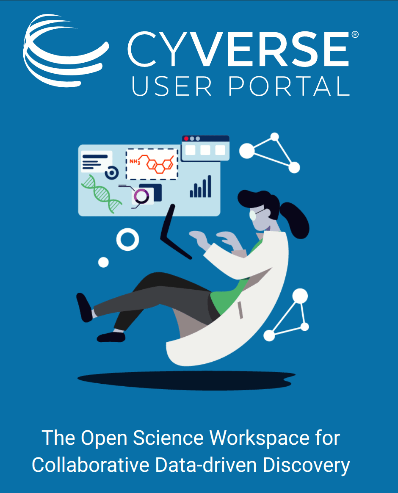
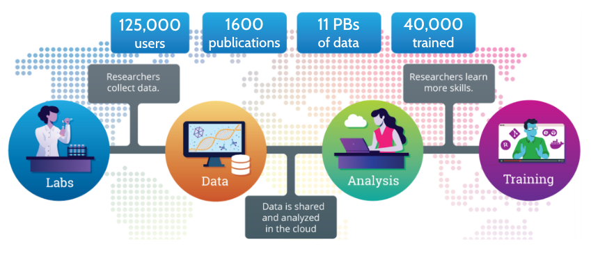

# Remote Computing with Cyverse

!!! warning "This page is a summary of what today's lesson is going to cover. For the information covered, we are going to rely on the CyVerse Learning documentation: https://learning.cyverse.org/".

<figure markdown>
  <a href="" target="blank" rel="open science">{ width="500" } </a>
    <figcaption>  </figcaption>
</figure>

## CyVerse
Housed at the University of Arizona, [CyVerse](https://cyverse.org) is a one-of-a-kind cloud computing system for the academic and research communities. It's mission is to design, deploy and expand a national cyberinfrastructure for scientific research and to train scientists how to use it. **CyVerse is an excellent platform to make your research open and reproducible!** 

Cyverse (originally called Iplant) has been in existence for 16 years; has spent $120M in research funds; has 135,000 registered users; and has facilitated 1,700 peer-reviewed publications across many scientific fields such as plant genetics, genomics, astronomy, geosciences, health, and agriculture. 

<figure markdown>
  <a href="" target="blank" rel="open science">{ width="500" } </a>
    <figcaption>  </figcaption>
</figure>

**Cyverse is completely Free for University of Arizona students, staff, and faculty.**

* [Cyverse homepage](https://cyverse.org)

* [Cyverse Self-Guided Course](https://cyverse-learning-materials.github.io/cyverse_mooc/)

 
 
 

!!! Success "Advantages of Cloud Computing"
        
    * With cloud computing, you can avoid the upfront cost and complexity of owning and maintaining your own IT infrastructure
    * Cloud computing allows groups or individuals to scale up (or down) their operations quickly as their computing needs change
    * Cloud computing allows users to access their data and applications from anywhere, on any device, at any time
    * Cloud empowers colleagues to work directly together on the same data, models, and applications
    * Easily share your work with the world

 
 
 

## CyVerse Discovery Environment

The [CyVerse Discovery Environment](https://de.cyverse.org) is where users can store and share data as well as run analysis applications with the click of a button. It is backed by robust computing resources that can help scale your analysis beyond what is possible on your laptop.

 
 

## Data Storage and Sharing

Cyverse Data Store is the ideal cloud storage to host your large (or small) datasets, share data with colleagues, and meet publication/grant archival requirements.  

* Cyverse Data Store is object cloud storage similar to Azure Blob, or Amazon S3
* Pro account has a 3TB limit
* [Moving data in or out of the Data Store](https://learning.cyverse.org/ds/move_data/) can be done through website or multiple command line tools
* Share your data with your colleagues and world with a URL
* Data can be public/private, shared with anyone, set permission levels
* Never lose your data due to hardware failure

 
 

[CyVerse Data Commons](https://datacommons.cyverse.org/) is our public facing data storage interface. It enables you to share data with people outside of CyVerse. 

_**Community Released:**_ A folder of data you want to share with colleagues, stakeholders, or the entire world. You control read/write/own permissions and make it public or private.

_**Curated:**_ Data that is tied to a peer-reviewed publication and needs permanent archival. You can apply many types of metadata templates your data as well as receive a permanent DOI.

 
 
 

## Apps

The CyVerse Discovery Environment has a large number of analysis applications that can be run on your data. These applications are pre-installed and ready to use with a few clicks. You get to choose the amount of computing resources you need to run your analysis.

Apps come in two basics flavors:

* Executable Apps: Run a script or a series of scripts on your data

* Interactive Apps: Launch software such as Jupyter notebooks, RStudio, QGIS, VScode, and more 

!!! Tip "Important Notes"
        
    * When you launch an app in Cyverse DE, you are actually launching containers such as Docker
    * When you close the app, the container is destroyed but your data can be saved in the Data Store

 
 
 

## Analysis Dashboard

The Analysis Dashboard is where you can monitor the status of Apps you have launched

* Stop and Relaunch Apps
* Extend the time of an App (beyond 72 hours)
* View you history of Apps launched

!!! Attention "Attention"
        
    If you are not using an app, please shut it down!