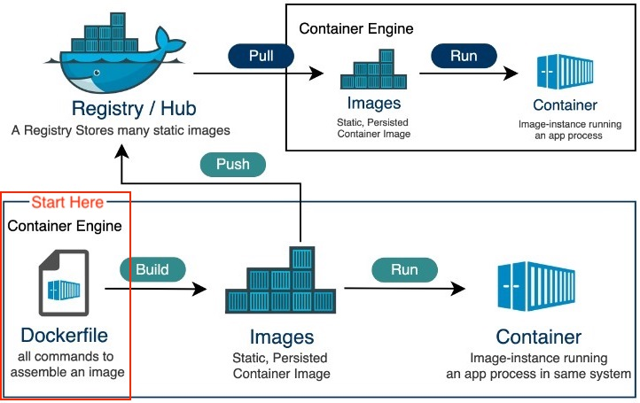
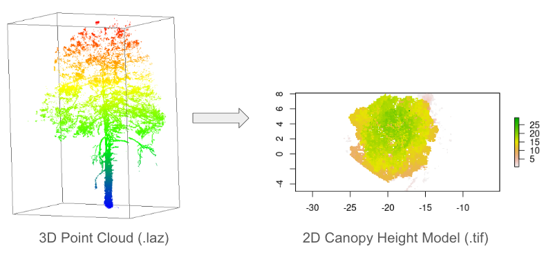
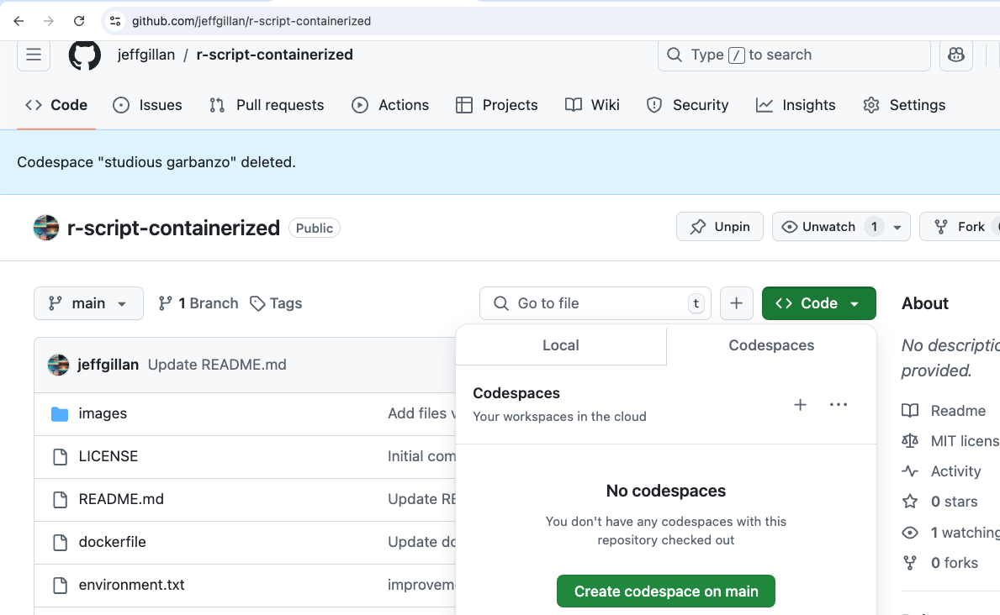
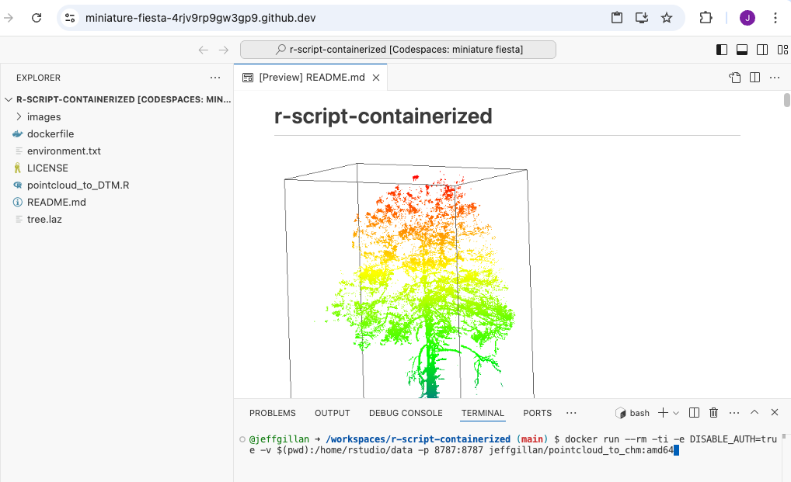
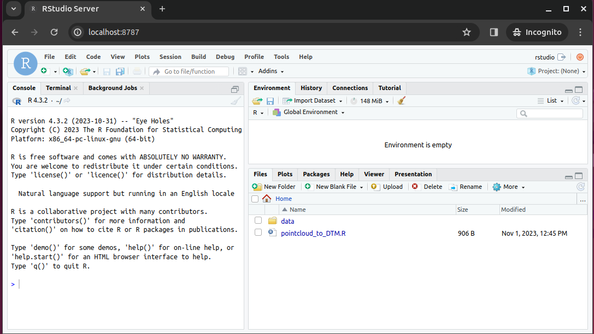
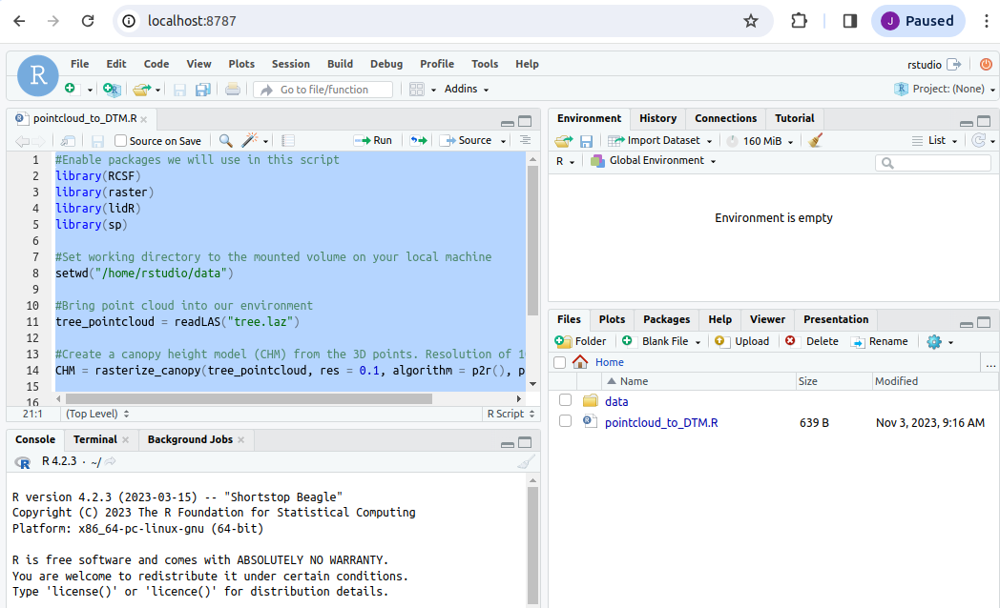
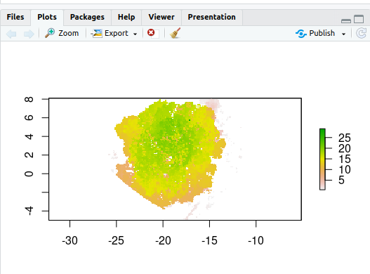
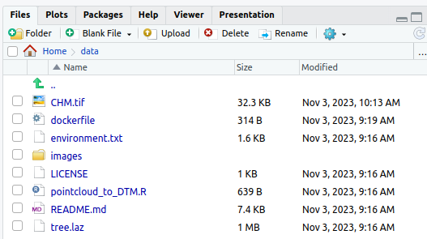

# Reproducibility III: Building Docker Containers

!!! Success "Learning Objectives"

    After this lesson, you should be able to:

    * Understand the Dockerfile structure and fields 
    * Build, execute and push your own Docker image

In [Reproducibility II](./07_reproducibility_ii.md) we saw how we can access and execute Docker containers. In this lesson, we continue to explore containerization, covering how we can create our own container and the various commands necessary in order to create them.

<br>
<br>

## Images vs Containers


|| Image | Container |
|:---:|---|---|
| **What** | A snapshot of an application <br> containing code, libraries, dependencides <br> and files needed for the application to run | A runtime instance of the Docker image |
| **When** | Created through a Dockerfile | Runtime executed after Image is created |
| **Why** | Reproducibility and consistency! | Reproducibility and consistency! |
| **Where** | Stored in an online registry (e.g., [Docker Hub](https://hub.docker.com/)) | Executed on your machine |

<br>
<br>


## General Workflow
<figure markdown>
  
    <figcaption> The container's life cycle. Figure source: [Tutorialspoint](https://www.tutorialspoint.com/docker/index.htm). </figcaption>
</figure>

<br>
<br>

## Run an Example Container

The example container is located in the following Github repository **https://github.com/jeffgillan/r-script-containerized**. The docker container launches Rstudio where a user can run an R script to convert a point cloud to a canopy height model (CHM).

<figure markdown>
  { width="600" }
    <figcaption> Rstudio running in a container</figcaption>
</figure>

<br>

#### 1. Launch Codespaces from the `r-script-containerized` repository

<figure markdown>
  { width="600" }
    <figcaption> Launch CodeSpaces from the `r-script-containerized` repository </figcaption>
</figure>

<br>
<br>

#### 2. On the codespaces terminal, run the following command to run the docker container:

```
docker run --rm -ti -e DISABLE_AUTH=true -v $(pwd):/home/rstudio/data -p 8787:8787 jeffgillan/pointcloud_to_chm:amd64
```

??? Tip "Dissecting the Docker Run Command"

    Within the command we are doing the following:

    | Flag/Option | Explanation |
    | --- | --- |
    |`--rm` | Automatically remove the container when it exits | 
    |`-ti` | Allocate a pseudo-TTY (terminal) connected to the container’s stdin. It gives you an interactive terminal session in the container, allowing you to run commands in the container just as you would in a regular terminal window. | 
    | `-e DISABLE_AUTH=true` | Disable authentication for the Rstudio server | 
    | `-v $(pwd):/home/rstudio/data` | Mount the current working directory to the `/home/rstudio/data directory` in the container. This allows us to access the data on our local machine (in this case Codespaces) from within the container. The directory is where you should have pointcloud `.laz` files. |
    |`-p 8787:8787` | Expose port 8787 on the container to port 8787 on the host machine. This allows us to access the Rstudio server from our web browser. |
    | `jeffgillan/pointcloud_to_chm:amd64` | The name and version number of the docker image we want to run. In this case, we are running the `pointcloud_to_chm` image from the `jeffgillan` repository in Docker Hub. |


<figure markdown>
  { width="600" }
    <figcaption> `docker run` command</figcaption>
</figure>

<br>
<br>

#### 3. View Rstudio in a Browser

Open a new browser tab and navigate to `localhost:8787` to access the Rstudio server running in the container. In Codespaces you can click on _Ports_ and then _Open Browser_ to access the Rstudio server.

<figure markdown>
  { width="600" }
    <figcaption> Rstudio running in a container</figcaption>
</figure>

<br>
<br>

#### 4. Run the Script

Open the script `pointcloud_to_DTM.R`

Highlight all of the code and click *Run*

<figure markdown>
  { width="600" }
</figure>

<br>
<br>

Upon completing the code, you should have a 2D plot of the tree

<figure markdown>
  { width="600" }
</figure>


You should also have a new file called `chm.tif` in the mounted `data` folder. The `chm.tif` has been written to your local machine!

<figure markdown>
  { width="600" }
</figure>


<br>
<br>

---

<br>


## Building Docker Images
<br>

<figure markdown>
  :max_bytes(150000):strip_icc():format(webp)/Simply-Recipes-Rainbow-Layer-Cake-Lead-3-341176ca14d545229c16ce0e20cc1a64.jpg){ width="400" }
    <figcaption> Docker Images are just like cakes: both are made of layers! </figcaption>
</figure>

### Writing a Dockerfile

Create a file called `Dockerfile`, and add content to it as described below, e.g.

```
$ touch Dockerfile
```

Or, since we are using Codespaces, you can click the Create File button :material-file-plus: and name it `Dockerfile`

<br>
<br>

!!! Tip "What is a Dockerfile?"


    A Dockerfile is a text file that contains a list of commands, known as **instructions** used by Docker to build an image. 
    
    **If a *Docker Image* is a cake, the *Dockerfile* is the recipe!**
    
    
    ```
    # Tells the Dockerfile which image to start from
    FROM rocker/geospatial:4.2.3             

    # Sets the initial working directory inside the container                               
    WORKDIR /home/rstudio                   

    # Copies the R script file from your localdirectory to the container                                   
    COPY pointcloud_to_DTM.R .              
                                        
    # Installs an R package                                  
    RUN R -e "install.packages('RCSF', dependencies=TRUE, repos='http://cran.rstudio.com/')"  

    #Declare the port Rstudio will run on                                        
    EXPOSE 8787

    # Starts the Rstudio server
    CMD ["/init"]      

    ```

<br>
<br>

#### Dockerfile Statements

??? Abstract "ARG"

    The only command that can come before a `FROM` statement is `ARG`

    `ARG` can be used to set arguments for later in the build, e.g.,

    ```
    ARG VERSION=latest

    FROM ubuntu:$VERSION
    ```

??? Abstract "FROM"

    A valid `Dockerfile` must start with a `FROM` statement which initializes a new build stage and sets the **base image** for subsequent layers.

    We’ll start by specifying our base image, using the FROM statement

    ```
    FROM ubuntu:latest
    ```

    If you are building on an `arm64` or Windows system you can also give the optional `--platform` flag, e.g.,

    ```
    FROM --platform=linux/amd64 ubuntu:latest
    ```

    ??? question "When to use a multi-stage build pattern?"

        Docker has the ability to build container images from one image, and run that "builder" image from a second "base" image, in what is called a "builder pattern".

        Build patterns are useful if you're compiling code from (proprietary) source code and only want to feature the binary code as an executed function in the container at run time. 

        Build patterns can greatly reduce the size of your container.

        You can use multiple `FROM` commands as build stages. The `AS` statement follows the `image:tag` as a psuedo argument. 

        ```
        # build stage
        FROM golang:latest AS build-env
        WORKDIR /go/src/app
        ADD . /go/src/app
        RUN go mod init
        RUN cd /go/src/app && go build -o hello

        # final stage
        FROM alpine:latest
        WORKDIR /app
        COPY --from=build-env /go/src/app /app/
        ENTRYPOINT ./hello
        ```

??? Abstract "LABEL"

    You can create labels which are then tagged as  JSON metadata to the image

    ```
    LABEL author="your-name" 
    LABEL email="your@email-address"
    LABEL version="v1.0"
    LABEL description="This is your first Dockerfile"
    LABEL date_created="2022-05-13"
    ```

    You can also add labels to a container when it is run:

    ```
    $ docker run --label description="this label came later" ubuntu:latest

    $ docker ps -a

    $ docker inspect ###
    ```

??? Abstract "RUN"

    Different than the `docker run` command is the `RUN` build function. `RUN` is used to create new layers atop the "base image"

    Here, we are going to install some games and programs into our base image:

    ```
    RUN apt-get update && apt-get install -y fortune cowsay lolcat
    ```

    Here we've installed `fortune` `cowsay` and `lolcat` as new programs into our base image.

    !!! Warning "Best practices for building new layers"

        Ever time you use the `RUN` command it is a good idea to use the `apt-get update` or `apt update` command to make sure your layer is up-to-date. This can become a problem though if you have a very large container with a large number of `RUN` layers. 

??? Abstract "ENV"

    In our new container, we need to change and update some of the environment flags. We can do this using the `ENV` command

    ```
    ENV PATH=/usr/games:${PATH}

    ENV LC_ALL=C
    ```

    Here we are adding the `/usr/games` directory to the `PATH` so that when we run the new container it will find our newly installed game commands

    We are also updating the "[locales](https://www.tecmint.com/set-system-locales-in-linux/)" to set the language of the container.

??? Abstract "COPY"

    The `COPY` command will copy files from the directory where `Dockerfile` is kept into the new image. You must specify where to copy the files or directories

    ```
    COPY . /app
    ```

    ??? question "When to use `COPY` vs `ADD`"

        `COPY` is more basic and is good for files

        `ADD` has some extra features like `.tar` extraction and URL support

??? Abstract "CMD"

    The `CMD` command is used to run software in your image. In general use the ["command"] syntax:

    ```
    CMD ["executable", "parameter1", "parameter2"]
    ```

??? Abstract "ENTRYPOINT"

    ENTRYPOINT works similarly to `CMD` but is designed to allow you to run your container as an executable.

    ```
    ENTRYPOINT fortune | cowsay | lolcat
    ```

    The default `ENTRYPOINT` of most images is `/bin/sh -c` which executes a `shell` command.


    `ENTRYPOINT` supports both the `ENTRYPOINT ["command"]` syntax and the `ENTRYPOINT command` syntax

??? Tip "What is an *entrypoint*?"

    An entrypoint is the initial command(s) executed upon starting the Docker container. It is listed in the `Dockerfile` as `ENTRYPOINT` and can take 2 forms: as commands followed by parameters (`ENTRYPOINT command param1 param2`)  or as an executable (`ENTRYPOINT [“executable”, “param1”, “param2”]`)

    ??? question "What is the difference in the `ENTRYPOINT` and `CMD`"

        The CMD instruction is used to define what is execute when the container is run.

        The ENTRYPOINT instruction cannot be overridden, instead it is appended to when a new command is given to the `docker run container:tag new-cmd` statement 

        the executable is defined with ENTRYPOINT, while CMD specifies the default parameter

??? Abstract "USER"

    Most containers are run as `root` meaning that they have super-user privileges within themselves

    Typically, a new user is necessary in a container that is used interactively or may be run on a remote system.

    During the build of the container, you can create a new user with the `adduser` command and set up a `/home/` directory for them. This new user would have something like 1000:1000 `uid:gid` permissions without `sudo` privileges.

    As a last step, the container is run as the new `USER`, e.g., 

    ```
    ARG VERSION=18.04

    FROM ubuntu:$VERSION

    RUN useradd ubuntu && \
        chown -R ubuntu:ubuntu /home/ubuntu

    USER ubuntu
    ```

??? Abstract "EXPOSE"

    You can open [ports](intro.md#understanding-ports) using the `EXPOSE` command.

    ```
    EXPOSE 8888
    ```

    The above command will expose port 8888.

    !!! Note
        Running multiple containers using the same port is not trivial and would require the usage of a web server such as [NGINX](https://www.nginx.com/). However, you can have multiple containers interact with each other using [Docker Compose](https://docs.docker.com/compose/).

<br>

### Summary of Instructions

| Instruction Command | Description |
| :---: | --- | 
| `ARG` | Sets environmental variables during image building |
| `FROM` | Instructs to use a specific Docker image |
| `LABEL` | Adds metadata to the image |
| `RUN` | Executes a specific command |
| `ENV` | Sets environmental variables |
| `COPY` | Copies a file from a specified location to the image |
| `CMD` | Sets a command to be executed when running a container |
| `ENTRYPOINT` | Configures and run a container as an executable |
| `USER` | Used to set User specific information |
| `EXPOSE` |  exposes a specific port |

<br>
<br>

---

<br>

### Building the Image

Once the Dockerfile has been created, we can build the image using the `docker build` command. At the codespaces terminal, run the following command:

```
docker build -t <dockerhub username>/pointcloud_to_chm:amd64 .
```

Example:

```
docker build -t jeffgillan/pointcloud_to_chm:amd64 .
```

??? "Dissecting the Docker Build Command"

- The `-t` flag allows us to tag the image with a name and version number.  
- In the command you need to add your own DockerHub username instead of `<dockerhub username>`, which acts as the address to your own DockerHub Repository; `pointcloud_to_chm` is the name of the image, and `amd64` is the version tag.    
- The `.` at the end of the command tells docker to look in the current directory for the dockerfile.

<br>
<br>

---

### Building an Executable Image

```
 _____________________________
< Avoid reality at all costs. >
 -----------------------------
        \   ^__^
         \  (oo)\_______
            (__)\       )\/\
                ||----w |
                ||     ||
```

Thus far we have worked using interactive containers such as RStudio. Not all containers are interactive, many (if not most of) are executables: containerized software that can take the raw input and output data without requiring further work from the user.

Executable containers are usually called with 

```
docker run <repository>/<image>:<tag> <potential arguments/options> <input file/folder>
```

An easy to reproduce example is **Lolcow**, which builds a small executable that outputs a "quote of the day". It does not require any input and will output to the terminal directly.

Here is the minimal recipie required to build Lolcow: 

```
FROM --platform=linux/amd64 ubuntu:22.04

RUN apt-get update && apt-get install -y fortune cowsay lolcat

ENV PATH=/usr/games:${PATH}

ENV LC_ALL=C

ENTRYPOINT fortune | cowsay | lolcat
```

Once built, you can execute it with `docker <image ID/name>` for something to brighten your day!

---

### Pushing to a Registry with :material-docker: docker push

By default `docker push` will upload your local container image to the [Docker Hub](https://hub.docker.com/){target=_blank}.

Also, make sure that your container has the appropriate [tag](07_reproducibility_ii.md#tag).

First, make sure to log into the Docker Hub, this will allow you to download private images, to upload private/public images:

```
docker login
```

Alternately, you can [link GitHub / GitLab accounts](https://hub.docker.com/settings/linked-accounts){target=_blank} to the Docker Hub.

To push the image to the Docker Hub:

```
docker push username/imagename:tag 
```

<br>
<br>

---

---

### Exercises and Additional Dockerfiles

!!! success ""

    We have a number of pre-written Dockerfiles that you can access in our [Intro 2 Docker Repository](https://github.com/cyverse-education/intro2docker).

    It contains:

    - **Alpine**: a minimal Linux distribution 
    - **Cowsay**: will output wise messages when executed
    - **Jupyter/minimal-notebook**: Jupyter Notebook accessible from your browser
    - **rstudio/verse**: RStudio containing the Tidyverse data science packages 
    - **Ubuntu**

    Clone our example repository, or work directly on the repository using Codespaces.

    Clone command:

    ```
    $ cd /workspaces

    $ git clone https://github.com/cyverse-education/intro2docker

    $ cd intro2docker/
    ```
