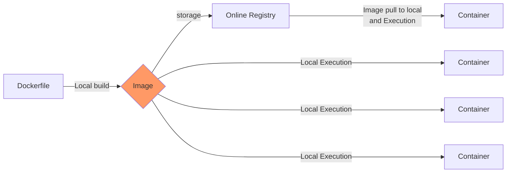
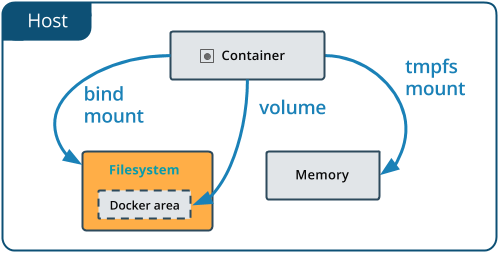

# Reproducibility III: Building Docker Containers

!!! Success "Learning Objectives"

    After this lesson, you should be able to:

    * Understand the Dockerfile structure and fields 
    * Build, execute and push your own Docker image

In [Reproducibility II](./07_reproducibility_ii.md) we saw how we can access and execute Docker containers. In this lesson, we continue to explore containerization, covering how we can create our own container and the various commands necessary in order to create them.

## Images vs Containers

As mentioned before, there are differences between what an Image is and what Containers are. Here's a table that addresses some of these differences:

|| Image | Container |
|:---:|---|---|
| **What** | A snapshot of an application <br> containing code, libraries, dependencides <br> and files needed for the application to run | A runtime instance of the Docker image |
| **When** | Created through a Dockerfile | Runtime executed after Image is created |
| **Why** | Reproducibility and consistency! | Reproducibility and consistency! |
| **Where** | Stored in an online registry (e.g., [Docker Hub](https://hub.docker.com/)) | Executed on your machine |

Once an Image is created, one can run as many Containers of it as required. Here's a Dockerfile-to-container diagram:



## Dockerfiles and Instructions

`docker run` starts a container and executes the default "entrypoint", or any other "command" that follows `run` and any optional flags. These commands are specified within a Dockerfile. 

!!! Tip "What is a Dockerfile?"


    A Dockerfile is a text file that contains a list of commands, known as **instructions** used by Docker to  build an image. 
    
    These commands can include specifying the base image to use, copying files into the image, setting environment variables, running commands, and defining entry points and default commands to run when a container is started from the image. The Dockerfile is processed by the docker build command, which creates a Docker image that can be used to run containers.
    
    ```
    FROM pdal/pdal:latest                   # Tells the Dockerfile which image to pull from
                                            # 
    WORKDIR /app                            # Sets the initial working directory
                                            #
    COPY pdal_copc.sh /app/pdal_copc.sh     # Copies a certain file from your directory to the container
                                            #
    COPY copc.json /app/copc.json           # Copies a certain file from your directory to the container
                                            #
    RUN chmod +x pdal_copc.sh               # Runs a specific command (in this case, adds specific permissions)
                                            #
    ENTRYPOINT ["/app/pdal_copc.sh"]        # Sets the first command activating the container
    ```

??? Tip "What is an *entrypoint*?"

    An entrypoint is the initial command(s) executed upon starting the Docker container. It is listed in the `Dockerfile` as `ENTRYPOINT` and can take 2 forms: as commands followed by parameters (`ENTRYPOINT command param1 param2`)  or as an executable (`ENTRYPOINT [“executable”, “param1”, “param2”]`)

## Building Docker Images

Now that we are relatively comfortable with running Docker, we can look at some advanced Docker topics, such as:

- Building our own Docker images from the `Dockerfile`
- Modify an existing Dockerfile and create a new image
- Push an image to a Registry

### Requirements

Clone our example repository with pre-written Dockerfiles From your CodeSpace, we are going to copy a second GitHub repository onto our VM. If you are working locally, make sure that you change directories away from any other Git repository that you may have been working in.

```
$ cd /workspaces

$ git clone https://github.com/cyverse-education/intro2docker

$ cd intro2docker/

```

---

## Writing a Dockerfile

!!! Note "Important"

    `Dockerfile` must be capitalized. It does not have a file extension.

Create a file called `Dockerfile`, and add content to it as described below, e.g.

```
$ touch Dockerfile
```

!!! Note "Formatting in the `Dockerfile`"

    We use a code line escape character `\` to allow single line scripts to be written on multiple lines in the Dockerfile.

    We also use the double characters `&&` which essentially mean “if true, then do this” while executing the code. The `&&` can come at the beginning of a line or the end when used with `\`.

The `Dockerfile` contains **Instructions**: a series of commands that Docker executes during the creation and execution of a container.

----

### ARG

The only command that can come before a `FROM` statement is `ARG`

`ARG` can be used to set arguments for later in the build, e.g.,

```
ARG VERSION=latest

FROM ubuntu:$VERSION
```

### FROM

A valid `Dockerfile` must start with a `FROM` statement which initializes a new build stage and sets the **base image** for subsequent layers.

We’ll start by specifying our base image, using the FROM statement

```
FROM ubuntu:latest
```

If you are building on an `arm64` or Windows system you can also give the optional `--platform` flag, e.g.,

```
FROM --platform=linux/amd64 ubuntu:latest
```

??? question "When to use a multi-stage build pattern?"

    Docker has the ability to build container images from one image, and run that "builder" image from a second "base" image, in what is called a "builder pattern".

    Build patterns are useful if you're compiling code from (proprietary) source code and only want to feature the binary code as an executed function in the container at run time. 

    Build patterns can greatly reduce the size of your container.

    You can use multiple `FROM` commands as build stages. The `AS` statement follows the `image:tag` as a psuedo argument. 

    ```
    # build stage
    FROM golang:latest AS build-env
    WORKDIR /go/src/app
    ADD . /go/src/app
    RUN go mod init
    RUN cd /go/src/app && go build -o hello

    # final stage
    FROM alpine:latest
    WORKDIR /app
    COPY --from=build-env /go/src/app /app/
    ENTRYPOINT ./hello
    ```

### LABEL

You can create labels which are then tagged as  JSON metadata to the image

```
LABEL author="your-name" 
LABEL email="your@email-address"
LABEL version="v1.0"
LABEL description="This is your first Dockerfile"
LABEL date_created="2022-05-13"
```

You can also add labels to a container when it is run:

```
$ docker run --label description="this label came later" ubuntu:latest

$ docker ps -a

$ docker inspect ###
```

### RUN

Different than the `docker run` command is the `RUN` build function. `RUN` is used to create new layers atop the "base image"

Here, we are going to install some games and programs into our base image:

```
RUN apt-get update && apt-get install -y fortune cowsay lolcat
```

Here we've installed `fortune` `cowsay` and `lolcat` as new programs into our base image.

!!! Warning "Best practices for building new layers"

    Ever time you use the `RUN` command it is a good idea to use the `apt-get update` or `apt update` command to make sure your layer is up-to-date. This can become a problem though if you have a very large container with a large number of `RUN` layers. 

### ENV

In our new container, we need to change and update some of the environment flags. We can do this using the `ENV` command

```
ENV PATH=/usr/games:${PATH}

ENV LC_ALL=C
```

Here we are adding the `/usr/games` directory to the `PATH` so that when we run the new container it will find our newly installed game commands

We are also updating the "[locales](https://www.tecmint.com/set-system-locales-in-linux/)" to set the language of the container.

### COPY

The `COPY` command will copy files from the directory where `Dockerfile` is kept into the new image. You must specify where to copy the files or directories

```
COPY . /app
```

??? question "When to use `COPY` vs `ADD`"

    `COPY` is more basic and is good for files

    `ADD` has some extra features like `.tar` extraction and URL support

### CMD

The `CMD` command is used to run software in your image. In general use the ["command"] syntax:

```
CMD ["executable", "parameter1", "parameter2"]
```

### ENTRYPOINT

ENTRYPOINT works similarly to `CMD` but is designed to allow you to run your container as an executable.

```
ENTRYPOINT fortune | cowsay | lolcat
```

The default `ENTRYPOINT` of most images is `/bin/sh -c` which executes a `shell` command.


`ENTRYPOINT` supports both the `ENTRYPOINT ["command"]` syntax and the `ENTRYPOINT command` syntax

??? question "What is the difference in the `ENTRYPOINT` and `CMD`"

    The CMD instruction is used to define what is execute when the container is run.

    The ENTRYPOINT instruction cannot be overridden, instead it is appended to when a new command is given to the `docker run container:tag new-cmd` statement 

    the executable is defined with ENTRYPOINT, while CMD specifies the default parameter

### USER

Most containers are run as `root` meaning that they have super-user privileges within themselves

Typically, a new user is necessary in a container that is used interactively or may be run on a remote system.

During the build of the container, you can create a new user with the `adduser` command and set up a `/home/` directory for them. This new user would have something like 1000:1000 `uid:gid` permissions without `sudo` privileges.

As a last step, the container is run as the new `USER`, e.g., 

```
ARG VERSION=18.04

FROM ubuntu:$VERSION

RUN useradd ubuntu && \
    chown -R ubuntu:ubuntu /home/ubuntu

USER ubuntu
```

### EXPOSE

You can open [ports](intro.md#understanding-ports) using the `EXPOSE` command.

```
EXPOSE 8888
```

The above command will expose port 8888.

!!! Note
    Running multiple containers using the same port is not trivial and would require the usage of a web server such as [NGINX](https://www.nginx.com/). However, you can have multiple containers interact with each other using [Docker Compose](compose.md).

---

### Pushing to a Registry with :material-docker: docker push

By default `docker push` will upload your local container image to the [Docker Hub](https://hub.docker.com/){target=_blank}.

Also, make sure that your container has the appropriate [tag](07_reproducibility_ii.md#tag).

First, make sure to log into the Docker Hub, this will allow you to download private limages, to upload private/public images:

```
docker login
```

Alternately, you can [link GitHub / GitLab accounts](https://hub.docker.com/settings/linked-accounts){target=_blank} to the Docker Hub.

To push the image to the Docker Hub:

```
docker push username/imagename:tag 
```

or, to a private registry, here we push to CyVerse private `harbor.cyverse.org` registry which uses "project" sub folders:

```
docker push harbor.cyverse.org/project/imagename:newtag 
```

## Summary of Instructions

| Instruction Command | Description |
| --- | --- | 
| `ARG` | Sets environmental variables during image building |
| `FROM` | Instructs to use a specific Docker image |
| `LABEL` | Adds metadata to the image |
| `RUN` | Executes a specific command |
| `ENV` | Sets environmental variables |
| `COPY` | Copies a file from a specified location to the image |
| `CMD` | Sets a command to be executed when running a container |
| `ENTRYPOINT` | Configures and run a container as an executable |
| `USER` | Used to set User specific information |
| `EXPOSE` |  exposes a specific port |

---

## Managing Data in Docker

It is possible to store data within the writable layer of a container, but there are some limitations:

- The data doesn’t persist when that container is no longer running, and it can be difficult to get the data out of the container if another process needs it.
- A container’s writable layer is tightly coupled to the host machine where the container is running. You can’t easily move the data somewhere else.
- Its better to put your data into the container **AFTER** it is built - this keeps the container size smaller and easier to move across networks.

Docker offers three different ways to mount data into a container from the Docker host:

- **Volumes**
- **tmpfs mounts**
- **Bind mounts**



When in doubt, volumes are almost always the right choice.

### Volumes

Volumes are often a better choice than persisting data in a container’s writable layer, because using a volume does not increase the size of containers using it, and the volume’s contents exist outside the lifecycle of a given container. While bind mounts (which we will see in the Advanced portion of the Camp) are dependent on the directory structure of the host machine, volumes are completely managed by Docker. Volumes have several advantages over bind mounts:

- Volumes are easier to back up or migrate than bind mounts.
- You can manage volumes using Docker CLI commands or the Docker API.
- Volumes work on both UNIX and Windows containers.
- Volumes can be more safely shared among multiple containers.
- A new volume’s contents can be pre-populated by a container.

??? Tip "When Should I Use the Temporary File System mount?"

	If your container generates non-persistent state data, consider using a `tmpfs` mount to avoid storing the data anywhere permanently, and to increase the container’s performance by avoiding writing into the container’s writable layer. The data is written to the host's memory instead of a volume; When the container stops, the `tmpfs` mount is removed, and files written there will not be kept.

Choose the `-v` flag for mounting volumes

`-v` or `--volume`: Consists of three fields, separated by colon characters (:). 

The fields must be in the correct order, and the meaning of each field is not immediately obvious.

- The **first** field is the path on your **local machine** that where the data are.
- The **second** field is the path where the file or directory are **mounted in the container**.
- The third field is optional, and is a comma-separated list of options, such as `ro` (read only).

```
-v /home/username/your_data_folder:/container_folder
```

```
$ docker run -v /home/$USER/read_cleanup:/work alpine:latest ls -l /work
```

So what if we wanted to work interactively inside the container?

```
$ docker run -it -v /home/$USER/read_cleanup:/work alpine:latest sh
```

```
$ ls -l 
$ ls -l work
```

Once you're in the container, you will see that the `/work` directory is mounted in the working directory.

Any data that you add to that folder outside the container will appear INSIDE the container. And any work you do inside the container saved in that folder will be saved OUTSIDE the container as well.

---