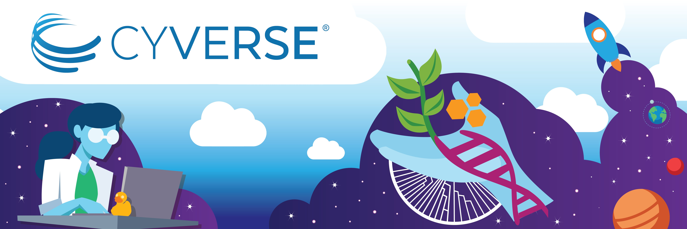

# FOSS+ Home & Schedule

<figure markdown>
  {target=_blank}
</figure>

Thank you for being with us throughout FOSS! Expanding on the concepts and activities covered throughout FOSS, we wanted to capitalize on certain aspects of reproducibility with FOSS+.

In the next 4 weeks, we are going to resume our discussion on Docker and containerization, execution of containers on the HPC and Cloud, and we are going to have 2 guests lectures from [Chris Reidy](https://datascience.arizona.edu/person/chris-reidy) ([UITS](https://it.arizona.edu/), covering the HPC in detail) and [Shashank Yadav](https://xinformatics.github.io/) ([DataLab](https://ua-datalab.github.io/), discussing SQL and databases).

The workshop structure and schedule will be the same as FOSS: Thursdays 11am - 1pm Arizona Time using the same Zoom link as before.

## Schedule

| Date | Content | Instructor(s) |
|---|---|---|
|03/21| Reproducibility III: Building Containers | Michele Cosi, Jeff Gillan |
|03/28| Executing Containers on the HPC | Michele Cosi |
|04/04| The HPC | [Chris Reidy](https://datascience.arizona.edu/person/chris-reidy) ([UITS](https://it.arizona.edu/)) |
|03/11| SQL and Databases | [Shashank Yadav](https://xinformatics.github.io/) ([DataLab](https://ua-datalab.github.io/)) |

## Expected Outcomes

!!! success ""

    - Be able to build your own Container from a public containerized image.
    - Be able to  deploy personalized images onto the HPC.
    - Understand the HPC structure.
    - Understand database structures and execute SQL commands.