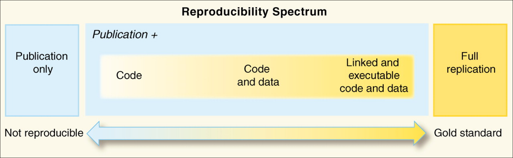

.. include:: ../cyverse_rst_defined_substitutions.txt

|CyVerse_logo|_

|Home_Icon2|_
`Learning Center Home <http://learning.cyverse.org/>`_

**Introduction to Reproducible Science**
============================================

The so-called reproducibility crisis (see |1| , |2| , |3|) is something you have
probably heard about (and maybe one of the reasons you have come to FOSS).
Headlines in the media (such as |Most scientists can't replicate studies by their peers|)
definitely give pause to researchers and ordinary citizens who hope
that the science used to recommend a course of medical treatment or design
self-driving cars is sound.

Before we go further, it's actually important to ask what is reproducibility?

  .. admonition:: Question

    How do you define reproducible science?

      .. admonition:: Answer

        In |Reproducibility vs. Replicability|, Hans Plesser gives the following
        useful definitions:

        - **Repeatability** (Same team, same experimental setup): The measurement
          can be obtained with stated precision by the same team using the same
          measurement procedure, the same measuring system, under the same operating
          conditions, in the same location on multiple trials. For computational
          experiments, this means that a researcher can reliably repeat her own
          computation.
        - **Replicability** (Different team, same experimental setup): The
          measurement can be obtained with stated precision by a different team
          using the same measurement procedure, the same measuring system, under the
          same operating conditions, in the same or a different location on multiple
          trials. For computational experiments, this means that an independent group
          can obtain the same result using the author's own artifacts.
        - **Reproducibility** (Different team, different experimental setup): The
          measurement can be obtained with stated precision by a different team,
          a different measuring system, in a different location on multiple trials.
          For computational experiments, this means that an independent group can
          obtain the same result using artifacts which they develop completely
          independently.

        The paper goes on to further simplify:

        - **Methods reproducibility**: provide sufficient detail about procedures
          and data so that the same procedures could be exactly repeated.
        - **Results reproducibility**: obtain the same results from an independent
          study with procedures as closely matched to the original study as
          possible.
        - **Inferential reproducibility**: draw the same conclusions from either an
          independent replication of a study or a reanalysis of the original study.

  .. admonition:: Discussion Question
    :class: admonition-question

    How do these definitions apply to your research/teaching?

    Work with your fellow learners to develop a shortlist of ways reproducibility
    relates to your work. Try to identify challenges and even successes you'd
    like to share.

Often, when we say "reproducibility" we mean all or at least several of the
concepts the proceeding discussion encompasses. Really, reproducibility can be
thought of as set values such as some laboratories express in a code of conduct,
(see for example |Ross-Ibarra Lab code of conduct| or |Bahlai Lab Policies|).
Reproducibility comes from our obligations and desires to work ethically,
honestly, and with confidence that the data and knowledge we produce is done
has integrity. Reproducibility is also a "spectrum of practices", not a
single step. (See figure below from |Peng 2011|).

    |spectrum|

Assuming you have taken in the potentially anxiety inducing information above,
the most important thing to know is that there is a lot of help to make
reproducibility a foundation of all of your research.

Reproducibility Tutorial
----------------------------------------------

In the following tutorial, we will introduce some of the software introduced at
FOSS in the context of creating a reproducible experiment. The goal will be
to give an example of how connecting various software pieces and practices can
generate a well-documented research project. Though the example will be drawn
from a biological example, the ideas an approaches apply to the sciences in
general.

- |Reproducibility Tutorial|

----

**Fix or improve this documentation:**

- On Github: |Github Repo Link|
- Send feedback: `Tutorials@CyVerse.org <Tutorials@CyVerse.org>`_

----

.. |Github Repo Link|  raw:: html

   <a href="https://github.com/CyVerse-learning-materials/foss/tree/master/reproducible_science/intro.rst" target="blank">Github Repo Link</a>

.. |1|  raw:: html

   <a href="https://www.nature.com/news/1-500-scientists-lift-the-lid-on-reproducibility-1.19970" target="blank">1</a>

.. |2|  raw:: html

   <a href="https://www.nature.com/collections/prbfkwmwvz" target="blank">2</a>

.. |3|  raw:: html

   <a href="https://blogs.scientificamerican.com/observations/to-fix-the-reproducibility-crisis-rethink-how-we-do-experiments/" target="blank">3</a>

.. |Most scientists can't replicate studies by their peers|  raw:: html

   <a href="https://www.bbc.com/news/science-environment-39054778" target="blank">Most scientists can't replicate studies by their peers</a>

.. |Reproducibility vs. Replicability|  raw:: html

   <a href="https://www.ncbi.nlm.nih.gov/pmc/articles/PMC5778115/" target="blank">Reproducibility vs. Replicability</a>

.. |Ross-Ibarra Lab code of conduct|  raw:: html

   <a href="http://www.rilab.org/expectations.html" target="blank">Ross-Ibarra Lab code of conduct</a>

.. |Bahlai Lab Policies|  raw:: html

   <a href="https://github.com/BahlaiLab/Policies/blob/master/Project_completion.md" target="blank">Bahlai Lab Policies</a>

.. |NSF Biological Sciences Guidance on Data Management Plans|  raw:: html

   <a href="https://www.nsf.gov/bio/biodmp.jsp" target="blank">NSF Biological Sciences Guidance on Data Management Plans</a>

.. |Reproducibility Tutorial|  raw:: html

   <a href="https://learning.cyverse.org/projects/cyverse-cyverse-reproducbility-tutorial/en/latest/index.html" target="blank">Reproducibility Tutorial</a>

.. |Peng 2011|  raw:: html

   <a href="https://science.sciencemag.org/content/334/6060/1226" target="blank">Peng 2011</a>
