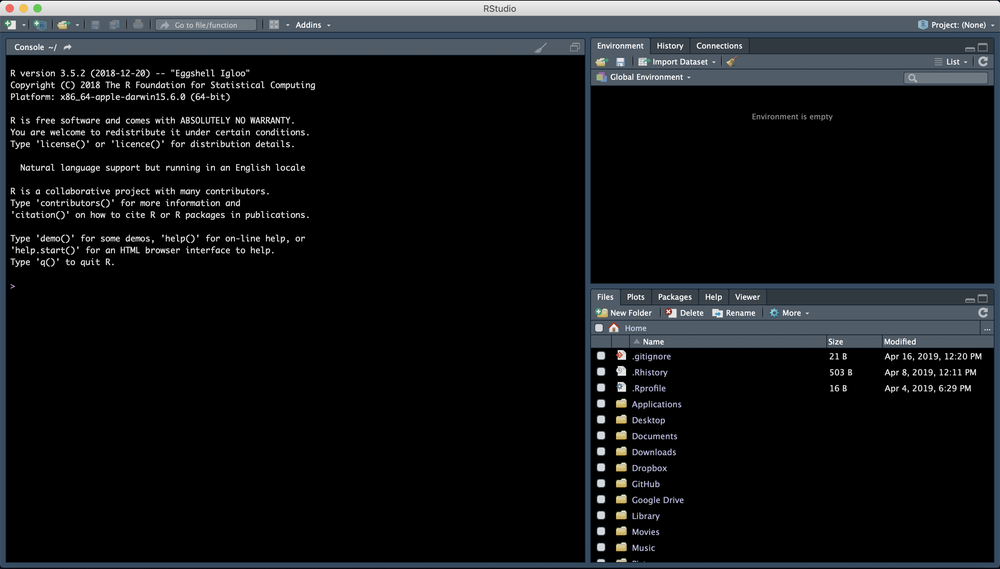

.. include:: ../cyverse_rst_defined_substitutions.txt

|CyVerse_logo|_

|Home_Icon2|_
`Learning Center Home <http://learning.cyverse.org/>`_

**Introduction to R & RStudio**
===============================

**Setup**
---------

1. You need to download R & RStudio:

   - `Download R <https://cran.r-project.org/>`_

   - `Download R Studio <https://www.rstudio.com/products/rstudio/download/#download>`_

2. Move to the Applications folder.

3. Open RStudio.

Go to Session -> Set Working Directory to set where you will pull data files from and/or save your code.

.. code-block:: R
	setwd(path)
	getwd() #see what working directory you're in

**Introduction**
----------------

We will learn how to:
- navigate & interact with R Studio
	- UI of R Studio
	- how to use "help"
	- install packages
	- upload data
- data structures
	- strings, factors, numbers, integers
	- vectors & arrays
	- matrices & lists
- explore data
	- data manipulation
	- data subsetting

R Studio makes using R programming language easier to interact with and to keep track of projects.

**Navigating & Interacting with R Studio**
------------------------------------------

Basic Layout
~~~~~~~~~~~~

|R Console|

The basic layout includes:
- Interactive R Console (left) <- most of your time will be spent here
- Environment/History (upper right)
- Files/Plots/Packages/Help/Viewer (lower right)

Once you open a new R script (File -> New File -> R Script), and editor panel should appear in the upper left.
R scripts are saved as .R files.
These can be rearranged by going into Preferences.

Calculating with R
~~~~~~~~~~~~~~~~~~

**Note** spaces don't matter unless it's in the middle of an argument

**Note** R starts counting at 1, not at 0

Using R as a calculator

.. code-block:: R

	> 2+2
	> 4

	> 1 +
	> + #R will let you know that the code is incomplete

	> 2/10000
	> 2e-04

**Exercise:**

	1. What is the output for 5e3?
	2. How would you add 5 and 3 and multiply the sum by 2?

Comparing things: Using logical operators

.. code-block:: R

	> 1 == 1 #spaces between logical arguments matter
	> TRUE

	> 1 < 2
	> TRUE

	> 1 >= 9
	> FALSE

Other logical conditions: ``&``, ``|``, ``!``

HELP!
~~~~~

help() is the most useful function in R. You will likely use this and Stack Overflow to help solve most of your problems (not life problems, you're on your own for that).

.. code-block:: R

	help(plot)

Parts of the help file:
- Description
	This describes what the function does.

- Usage
	This describes the formula and arguments for the function

- Arguments
	These are different inputs into the function that can be used.
	The argument (e.g., x, y) do not always need to be specified.
	For example,

.. code-block:: R

	plot(x = data.x, y = data.y)
	plot(data.x, data.y)

are the same thing.

- Details
	Usually these state the outputs of the function, or any other nuance within the function that may not be obvious.

- See also
	This will link to similar functions, or functions that can be called with this function.

- Examples
	Some are better than others. Generally, though, this gives examples of the arguments most commonly used in the function.

Searching for help:
- type in error message (just delete words specific to your data)
- inlcude in package name
- type "CRAN" after to help search for R programming specifically

Installing packages
~~~~~~~~~~~~~~~~~~~

.. code-block:: R

	install.packages("packageName")

To install more than one package at once you can use the ``c("package1", "package2")`` concatenate:

.. code-block:: R

	install.packages(c("package1", "package2"))

Often installing a package will install its dependencies as well. You can set the dependency installation by hand using:

.. code-block:: R

	install.packages("packageName", dependencies=TRUE)
	install.packages(c("package1", "package2"), dependencies=TRUE)

You can see installed packages with the following command:

.. code-block:: R

	installed.packages()

To use the package after it's been loaded:

.. code-blocl:: R
	#both do the same thing:
	require("package") #loads dependencies; will give a warning if it is in conflict with another package (e.g., masks)
		#can overwrite masked functions using "::" (e.g., package::function)
	library("package") #will give an error if in conflict with other packages or has missing dependencies

Uploading Data
~~~~~~~~~~~~~~

There are many ways to upload data in the R environment depending on the document type you have.

.. code-block:: R

	#General reading
	read.table("dataFile.txt", sep = "/t")

**Exercise:**

	1. What are the arguments for read.table?
	2. What arguments would you use to upload a .csv file using ``read.table()``?

.. code-block:: R

	#.csv files
	read.csv()

	#reading in from an online source or path to the directory if you're not in the right working directory
	read.table(path/to/file)

**Data Structures**
-------------------

Types of Variables
~~~~~~~~~~~~~~~~~~

Character - text that cannot have calculations done on them
	e.g., "a", "xyz"

.. code-block:: R
	as.character()

Numeric - numerical values include decimals and can have calculations performed on them
	e.g., 1, 1.5

.. code-block:: R
	as.numeric()

Integer - whole numbers only, and can also have calculations performed on them
	e.g., 2L (L stores it as an integer)

.. code-block:: R
	as.integer()

Logical - TRUE or FALSE

.. code-block:: R
	as.factor()
	#creates groupings within dataset

**Exercise:**

	1. What does the following return? What does it mean?

.. code-block:: R

	str(10)
	str("10")

Try calculations on the following.
	2. What works and what doesn't? Why or why not?

.. code-block:: R

	10*2
	"10"*2

Errors v. Warnings:
	Errors are given when R cannot perform the calculation
	Warnings mean that the function has run but perhaps with some issues.

Storing Variables
~~~~~~~~~~~~~~~~~

We can assign any of the types of data above in a "place holder".
Variables are assignee using "<-".

For example, we can store the number 10 in a letter to use later

.. code-block:: R

	a <- 10

**NOTE** Do not create variables that are already functions or arguments (e.g., c, T, F).
**NOTE** Do not overwrite variables.

**Exercise:**

	1. What does a*2 give you?

Vectors
~~~~~~~

Vectors are 1-D object that contain "*like*" data types.
You can create a string of variables and add to a vector using c(), which is short for concatenate.

**Exercise:**

	1. What are the outputs of the code below?
	2. Create your own vector using the vector() function.

.. code-block:: R

	x <- c(1, 2, 3, 4, 5)
	y <- 1:5
	z <- seq(1, 5, 1)

3. Are x, y, and z all the same structure? If not, how would you make them all the same?

Adding to vectors: the concatenate function: c()

.. code-block:: R

	d <- 1
	d <- c(d, 2)

Try adding two to every numer in the vector "x".
	3. How do you add two to every number in x?

What happens what you add a character to a vector?

.. code-block:: R
	d <- c(d, "a)
	str(d)

**ATOMIC VECTORS** are vectors which cannot be simplified anymore, and therefore "$" cannot be used on them. Yes, this error happens a lot. Yes, it is frustrating. Good luck.

Matrices & Dataframes
~~~~~~~~~~~~~~~~~~~~~

A matrix and a dataframe are both 2-D objects that are made up of vectors.

Creating a dataframe using data.frame()

**Exercise:**

	1. Play with the different types of data in the data.frame(). What happens?

You can combine dataframes:

.. code-block:: R

	hello <- data.frame (1:26, letters, words = c("hey", "you"))
	hi <- data.frame(1:26, letters, c("hey", "you"))
	howdy <- data.frame(hello, hi)

How do you name the column with the numbers 1-26?

.. code-block:: R
	hi <- data.frame(numbers = 1:26, letters, c("hey", "you"))

What are the column headers?
What happends when you do the following?

.. code-block:: R
	hola <- data.frame(1:26, letters, words = "hey", "you")

Adding columns and rows using cbind() and rbind()

.. code-block:: R

	cbind(hello, "goodbye")

We can call columns using **$** in the form of *data.frame$column* or call them using the modifier *data.frame[row#, column#]*

Calling columns:

.. code-block:: R

	hello[,2] #[] are like an index
	hello$letters

Subsetting:

.. code-black:: R

	hello[1:5, 2]
	hello$letters[1:5]

**Useful Functions to explore data types**

.. code-block:: R

	View()  #can also double click on dataframe inside the R environment tab
	str()
	summary()
	class()
	typeof()
	length()
	attributes() #can also click on dataframe inside the R environment tab
	dim()
	head()
	tail()

**Exercise**

	1. What is the output?

.. code-block:: R

	hello[,-2]

Likewise, columns and rows can be removed using "-" as a modifier

You can save a dataframe using write.table() and write.csv().

**NOTE** do not overwrite your dataset!!

If you rerun a script, you may overwrite your results or new data. Put a "#" after use!

The R Environment
~~~~~~~~~~~~~~~~~

You can view your environment either by looking at the upper left tab or by typing the following:

.. code-block:: R

	ls() #see variables in your environment

You can remove objects using the rm() function.

Exercise:

	1. How would you remove "a" from the environment? How would you check?

**Exploring Data**
------------------

Data Manipulation
~~~~~~~~~~~~~~~~~

Create the following dataframe:

.. code-block:: R

	cats <- data.frame(coat = c("calico", "black", "tabby"),
                    weight = c(2.1, 5.0,3.2),
                    likes_string = c(1, 0, 1))
	class(cats)

Let's add!

.. code-block:: R

	cats$weight + 2
	cats$coat + cats$coat

What are the outputs?

We can use the function "paste" to make more complex strings:

.. code-block:: R

	paste("My cat is", cats$coat)

What is the output?

Subsetting Data
~~~~~~~~~~~~~~~

**Exercise:**

	1. What is the function for subsetting data?
	2. What are the outputs?

.. code-block:: R
	p <- subset(cats, cats$weight <= 3)
	p

	q <- cats[cats$weight <= 3,]
	q

	cats$likes_string == 1
	cats[cats$likes_string == TRUE,]

	cats[c(1,3),]
	cats[colnames(cats) == "weight"]
	cats[cats$weight >= 2 & cats$weight <= 5]
	cats[cats$likes_string != 0,] #not equal to
	cats[!(is.na(cats$weight))] #is not

.. code-block:: R

	x <- c(a=5.4, b=6.2, c=7.1, d=4.8, e=7.5) # we can name a vector 'on the fly'
	#x is a vector
	x[c(a,c),]
	x[names(x) == "a"]
	x[names(x) == "a" | "c"]
	x[names(x) != "a"]

Terminal
--------

Can run terminal in RStudio. This is useful if you want to run a program and still be able to use R, or if you need dependencies. Also, the terminal does not interact with the R environment.

Tools --> Terminal --> New Terminal

.. CHEAT SHEETS::

   RStudio provides numerous `"cheat sheets" <https://www.rstudio.com/resources/cheatsheets/>`_ which help learners.

   `2019 Package Cheat Sheets <https://www.rstudio.com/wp-content/uploads/2019/01/Cheatsheets_2019.pdf>`_

--------------
**Fix or improve this documentation:**
- On Github: |Github Repo Link|
- Send feedback: `Tutorials@CyVerse.org <Tutorials@CyVerse.org>`_
--------------

  .. |Github Repo Link|  raw:: html

   <a href="https://github.com/CyVerse-learning-materials/foss-2019/tree/master/software_essentials/R_Studio.rst" target="blank">Github Repo Link</a>
