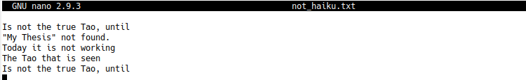

.. include:: ../cyverse_rst_defined_substitutions.txt

|CyVerse_logo2|_

|Home_Icon2|_
`Learning Center Home <http://learning.cyverse.org/>`_

**Command Line and the Unix Shell**
===================================

**Setup**
---------
1. Download `data-shell.zip <http://swcarpentry.github.io/shell-novice/data/data-shell.zip>`_ and move the file to your Desktop.

2. Unzip/extract the file. You should end up with a new folder called data-shell on your Desktop.

3. Open a terminal and type cd, then press the Enter key. 

That last step will make sure you start with your home folder as your working directory.
In the lesson, you will find out how to access the data in this folder.

`Instructions on how to identify a Unix Shell program and open a new a shell <http://swcarpentry.github.io/shell-novice/setup.html>`_

**Background**
--------------
At a high level, computers do four things:

- run programs
- store data
- communicate with each other, and
- interact with us

The **graphical user interface (GUI) is the most widely used way to interact with personal computers**. 
    - give instructions (to run a program, to copy a file, to create a new folder/directory) with mouse 
    - intuitive and very easy to learn 
    - scales very poorly
    
**The shell - a command-line interface (CLI) to make repetitive tasks automatic and fast**. 
    - can take a single instruction and repeat it 

.. admonition:: Example 

    If we have to copy the third line of each of a thousand text files stored in thousand different folders/directories and paste it into a single file line by line. 
    
    - Using the traditional GUI approach will take several hours to do this.
    - Using the shell this will only take a couple of minutes (at most).

The heart of a command-line interface is a read-evaluate-print loop (REPL). When you type a command and press **Return** 
    - the shell reads your command
    - evaluates (or “executes”) it
    - prints the output of your command
    - loops back and waits for you to enter another command

The Shell
^^^^^^^^^
The Shell is a **program which runs other programs** rather than doing calculations itself. 
    - programs can be as complicated as a climate modeling software
    - as simple as a program that creates a new folder/directory 
    - **simple programs used to perform stand alone tasks are usually refered to as commands.** 
    - most popular Unix shell is **Bash**, (the Bourne Again SHell). 
    - Bash is the default shell on most modern implementations of Unix

A typical shell window looks something like:

|shelllooklike|

**first line shows only a prompt**
    - indicates the shell is waiting for input 
    - your shell may use different text for the prompt 
    - **do not type the prompt**, only the commands that follow it

**the second line** 
   - command is ls, with an option -F and an argument / 
   - options change the behavior of a command
   - each part is separated by spaces
   - capitalization matters
   - commands can have more than one option or arugment
   - commands don't always require and option or argument
    
**lines 3-5 contain output that command produced**
    - this is a list of files and folders in the root directory (/)

**Finally**, the shell again prints the prompt and waits for you to type the next command.

Open a shell window and try executing ls -F / for yourself (don’t forget that spaces and capitalization are important!). 

.. code-block:: bash

    $ ls -F /
    
Now try

.. code-block:: bash

    $ ls-F
    ls-F: command not found

Usually this means that you have mis-typed the command - in this case we omitted the space between ls and -F.

.. hint::

    To re-enter the same command again use the up arrow to display the previous command. Press the up arrow twice to show the command before that (and so on).

**Navigating Files and Directories**
------------------------------------
File System
^^^^^^^^^^^
The part of the operating system responsible for managing files and directories is called the file system. It organizes our data into **files, which hold information**, and **directories (also called “folders”), which hold files or other directories.**

Several commands are frequently used to create, inspect, rename, and delete files and directories. To start exploring them, we’ll go to our open shell window.

**Print working directory (pwd)**
^^^^^^^^^^^^^^^^^^^^^^^^^^^^^^^^^

Directories are like places - at any time while we are using the shell we are in exactly one place, called our current working directory. **Commands mostly read and write files in the current working directory**, i.e. “here”, so knowing where you are before running a command is important. **pwd shows you where you are**:

.. code-block:: bash

    $ pwd
    /Users/nelle

Here, the computer’s response is /Users/nelle, which is Nelle’s home directory.

.. admonition:: Home Directory Variation
    The home directory path will look different on different operating systems. On Linux it may look like /home/nelle, and on Windows it will be similar to C:\Documents and Settings\nelle or C:\Users\nelle. (It may look slightly different for different versions of Windows.) In future examples, we’ve used Mac output as the default - Linux and Windows output may differ slightly, but should be generally similar.

To understand what a “home directory” is, let’s have a look at how the file system as a whole is organized. For the sake of this example, we’ll be illustrating the filesystem on our scientist Nelle’s computer. After this illustration, you’ll be learning commands to explore your own filesystem, which will be constructed in a similar way, but not be exactly identical.

On Nelle’s computer, the filesystem looks like this:

|TheFileSystem|

At the top is the **root directory** that holds everything else. We refer to it using a slash character, **/**, on its own; this is the leading slash in /Users/nelle.

Inside that directory are several other directories: 

- **bin** (which is where some built-in programs are stored)
- **data** (for miscellaneous data files)
- **Users** (where users’ personal directories are located)
- **tmp** (for temporary files that don’t need to be stored long-term)

We know that our current working directory /Users/nelle is stored inside /Users because /Users is the first part of its name. Similarly, we know that /Users is stored inside the root directory / because its name begins with /.

.. Note::
    There are two meanings for the / character. When it appears at the front of a file or directory name, it refers to the root directory. When it appears inside a name, it’s just a separator.

Underneath /Users, we find one directory for each user with an account on Nelle’s machine, her colleagues imhotep and larry.

|HomeDirectories|

The user Imhotep’s files are stored in /Users/imhotep, user Larry’s in /Users/larry, and Nelle’s in /Users/nelle. Because Nelle is the user in our examples here, this is why we get /Users/nelle as our home directory.

**Typically, when you open a new command prompt you will be in your home directory to start.**

**List files and directories (ls)**
^^^^^^^^^^^^^^^^^^^^^^^^^^^^^^^^^^^

Will let us see the contents of our own filesystem. We can see what’s in our home directory by running 

.. code-block:: bash

    $ ls
    Applications Documents    Library      Music        Public
    Desktop      Downloads    Movies       Pictures
    
Your results may be slightly different depending on your operating system and how you have customized your filesystem.

**ls prints the names of the files and directories in the current directory**. We can make its output more comprehensible by using the **option -F** (also known as a switch or an option) , which tells ls to add a marker to file and directory names to indicate what they are. A trailing / indicates that this is a directory. Depending on your settings, it might also use colors to indicate whether each entry is a file or directory. You might recall that we used ls -F in an earlier example.

.. code-block:: bash

    $ ls -F
    Applications/ Documents/    Library/      Music/        Public/
    Desktop/      Downloads/    Movies/       Pictures/

Here, we can see that our home directory contains mostly **sub-directories**. Any names in your output that don’t have trailing slashes, are plain old **files**. 

.. note:: 

    There is a space between ls and -F: without it, the shell thinks we’re trying to run a command called ls-F, which doesn’t exist.

Getting help
^^^^^^^^^^^^
**ls** has lots of other **options**. There are two common ways to find out how to use a command and what options it accepts:

We can pass a --help option to the command, such as:

.. code-block:: bash

    $ ls --help
    
We can read its manual with man, such as:

.. code-block:: bash

    $ man ls
    
Depending on your environment you might find that only one of these works (either man or --help). We’ll describe both ways below.

**The --help option**
Many bash commands, and programs that people have written that can be run from within bash, support a --help option to display more information on how to use the command or program.

.. code-block:: bash

    $ ls --help
    Usage: ls [OPTION]... [FILE]...
    List information about the FILEs (the current directory by default).
    Sort entries alphabetically if none of -cftuvSUX nor --sort is specified.

    Mandatory arguments to long options are mandatory for short options too.
    -a, --all                  do not ignore entries starting with .
    -A, --almost-all           do not list implied . and ..
        --author               with -l, print the author of each file
    -b, --escape               print C-style escapes for nongraphic characters
        --block-size=SIZE      scale sizes by SIZE before printing them; e.g.,
                               '--block-size=M' prints sizes in units of
                               1,048,576 bytes; see SIZE format below
    -B, --ignore-backups       do not list implied entries ending with ~
    -c                         with -lt: sort by, and show, ctime (time of last
                               modification of file status information);
                               with -l: show ctime and sort by name;
                               otherwise: sort by ctime, newest first
    -C                         list entries by columns
        --color[=WHEN]         colorize the output; WHEN can be 'always' (default
                               if omitted), 'auto', or 'never'; more info below
    -d, --directory            list directories themselves, not their contents
    -D, --dired                generate output designed for Emacs' dired mode
    -f                         do not sort, enable -aU, disable -ls --color
    -F, --classify             append indicator (one of */=>@|) to entries
        --file-type            likewise, except do not append '*'
        --format=WORD          across -x, commas -m, horizontal -x, long -l,
                               single-column -1, verbose -l, vertical -C
        --full-time            like -l --time-style=full-iso
    -g                         like -l, but do not list owner
        --group-directories-first
                               group directories before files;
                               can be augmented with a --sort option, but any
                               use of --sort=none (-U) disables grouping
    -G, --no-group             in a long listing, don't print group names
     -h, --human-readable      with -l and/or -s, print human readable sizes
                               (e.g., 1K 234M 2G)
         --si                   likewise, but use powers of 1000 not 1024
     -H, --dereference-command-line
                                follow symbolic links listed on the command line
        --dereference-command-line-symlink-to-dir
                               follow each command line symbolic link
                               that points to a directory
        --hide=PATTERN         do not list implied entries matching shell PATTERN
                               (overridden by -a or -A)
        --indicator-style=WORD append indicator with style WORD to entry names:
                               none (default), slash (-p),
                               file-type (--file-type), classify (-F)
    -i, --inode                print the index number of each file
    -I, --ignore=PATTERN       do not list implied entries matching shell PATTERN
     -k, --kibibytes            default to 1024-byte blocks for disk usage
     -l                         use a long listing format
     -L, --dereference          when showing file information for a symbolic
                               link, show information for the file the link
                               references rather than for the link itself
    -m                         fill width with a comma separated list of entries
    -n, --numeric-uid-gid      like -l, but list numeric user and group IDs
    -N, --literal              print raw entry names (don't treat e.g. control
                               characters specially)
    -o                         like -l, but do not list group information
    -p, --indicator-style=slash
                             append / indicator to directories
    -q, --hide-control-chars   print ? instead of nongraphic characters
        --show-control-chars   show nongraphic characters as-is (the default,
                               unless program is 'ls' and output is a terminal)
    -Q, --quote-name           enclose entry names in double quotes
        --quoting-style=WORD   use quoting style WORD for entry names:
                               literal, locale, shell, shell-always,
                               shell-escape, shell-escape-always, c, escape
    -r, --reverse              reverse order while sorting
    -R, --recursive            list subdirectories recursively
    -s, --size                 print the allocated size of each file, in blocks
    -S                         sort by file size, largest first
        --sort=WORD            sort by WORD instead of name: none (-U), size (-S),
                               time (-t), version (-v), extension (-X)
        --time=WORD            with -l, show time as WORD instead of default
                               modification time: atime or access or use (-u);
                               ctime or status (-c); also use specified time
                               as sort key if --sort=time (newest first)
        --time-style=STYLE     with -l, show times using style STYLE:
                               full-iso, long-iso, iso, locale, or +FORMAT;
                               FORMAT is interpreted like in 'date'; if FORMAT
                               is FORMAT1<newline>FORMAT2, then FORMAT1 applies
                               to non-recent files and FORMAT2 to recent files;
                               if STYLE is prefixed with 'posix-', STYLE
                               takes effect only outside the POSIX locale
    -t                         sort by modification time, newest first
    -T, --tabsize=COLS         assume tab stops at each COLS instead of 8
    -u                         with -lt: sort by, and show, access time;
                               with -l: show access time and sort by name;
                               otherwise: sort by access time, newest first
    -U                         do not sort; list entries in directory order
    -v                         natural sort of (version) numbers within text
    -w, --width=COLS           set output width to COLS.  0 means no limit
    -x                         list entries by lines instead of by columns
    -X                         sort alphabetically by entry extension
    -Z, --context              print any security context of each file
    -1                         list one file per line.  Avoid '\n' with -q or -b
        --help     display this help and exit
        --version  output version information and exit

    The SIZE argument is an integer and optional unit (example: 10K is 10*1024).
    Units are K,M,G,T,P,E,Z,Y (powers of 1024) or KB,MB,... (powers of 1000).

    Using color to distinguish file types is disabled both by default and
    with --color=never.  With --color=auto, ls emits color codes only when
    standard output is connected to a terminal.  The LS_COLORS environment
    variable can change the settings.  Use the dircolors command to set it.

    Exit status:
     0  if OK,
     1  if minor problems (e.g., cannot access subdirectory),
     2  if serious trouble (e.g., cannot access command-line argument).

`GNU coreutils online help <http://www.gnu.org/software/coreutils/>`_

`Full documentation <http://www.gnu.org/software/coreutils/ls>`_

**Unsupported command-line options**
If you try to use an option (flag) that is not supported, ls and other commands will usually print an error message similar to:

.. code-block:: bash

    $ ls -j
    ls: invalid option -- 'j'
    Try 'ls --help' for more information.

**The man command**

The other way to learn about ls is to type

.. code-block:: bash

    $ man ls
    
This will open the manual in your terminal with a description of the ls command and its options and, if you’re lucky, some examples of how to use it.

To navigate through the man pages, you may use **↑** and **↓** to move line-by-line, or try **B** and **Spacebar** to skip up and down by a full page. 

To quit the man pages, press q.

**Manual pages on the web**

Of course there is a third way to access help for commands: searching the internet via your web browser. When using internet search, including the phrase unix man page in your search query will help to find relevant results.GNU provides links to its `manuals <http://www.gnu.org/manual/manual.html>`_ including the `core GNU utilities <http://www.gnu.org/software/coreutils/manual/coreutils.html>`_ , which covers many commands introduced within this lesson.

**We can also use ls to see the contents of a different directory**. Let’s take a look at our Desktop directory by running ls -F Desktop, i.e., the command ls with the -F option and the argument Desktop. The argument Desktop tells ls that we want a listing of something other than our current working directory:

.. code-block:: bash

    $ ls -F Desktop
    data-shell/
    
Your output should be a list of all the files and sub-directories on your Desktop, including the data-shell directory you downloaded at the setup for this lesson. Take a look at your Desktop to confirm that your output is accurate.

Now that we know the data-shell directory is located on our Desktop, we can do two things.

First, we can look at its contents, using the same strategy as before, passing a directory name to ls:

.. code-block:: bash

    $ ls -F Desktop/data-shell
    creatures/          molecules/          notes.txt           solar.pdf
    data/               north-pacific-gyre/ pizza.cfg           writing/

**Change directory (cd)**
^^^^^^^^^^^^^^^^^^^^^^^^^

We can change our location to a different directory, so we are no longer located in our home directory. The command doesn’t change the directory, it changes the shell’s idea of what directory we are in.

Let’s say we want to move to the data directory we saw above. We can use the following series of commands to get there:

.. code-block:: bash

    $ cd Desktop
    $ cd data-shell
    $ cd data

These commands will move us from our home directory onto our Desktop, then into the data-shell directory, then into the data directory. You will notice that cd doesn’t print anything. This is normal. **Many shell commands will not output anything to the screen when successfully executed.** But if we run pwd after it, we can see that we are now in /Users/nelle/Desktop/data-shell/data. If we run ls without arguments now, it lists the contents of /Users/nelle/Desktop/data-shell/data, because that’s where we now are:

.. code-block:: bash

    $ pwd
    /Users/nelle/Desktop/data-shell/data
    $ ls -F
    amino-acids.txt   elements/     pdb/	        salmon.txt
    animals.txt       morse.txt     planets.txt     sunspot.txt

**We now know how to go down the directory tree, but how do we go up?** We might try the following:

.. code-block:: bash

    $ cd data-shell
    -bash: cd: data-shell: No such file or directory

But we get an error! Why is this?

With our methods so far, cd can only see sub-directories inside your current directory. There are different ways to see directories above your current location; we’ll start with the simplest.

**There is a shortcut in the shell to move up one directory level** that looks like this:

.. code-block:: bash

    $ cd ..
    
**.. is a special directory name meaning “the directory containing this one”**, or more succinctly, the parent of the current directory. Sure enough, if we run pwd after running cd .., we’re back in /Users/nelle/Desktop/data-shell:

.. code-block:: bash

    $ pwd
    /Users/nelle/Desktop/data-shell

The special directory .. doesn’t usually show up when we run ls. If we want to display it, we can give ls the -a option:

.. code-block:: bash

    $ ls -F -a
    ./   .bash_profile  data/       north-pacific-gyre/  pizza.cfg  thesis/
    ../  creatures/     molecules/  notes.txt            solar.pdf  writing/

**-a stands for “show all”**; it forces ls to show us file and directory names that begin with ., such as .. (which, if we’re in /Users/nelle, refers to the /Users directory) As you can see, it also displays **another special directory that’s just called ., which means “the current working directory”**. It may seem redundant to have a name for it, but we’ll see some uses for it soon.

.. hint::
 With most command line tools, multiple options can be combined with a single - and no spaces between the options: ls -F -a is equivalent to ls -Fa.

**Other Hidden Files**
In addition to the hidden directories .. and ., you may also see a file called .bash_profile. This file usually contains shell configuration settings. You may also see other files and directories beginning with .. These are usually files and directories that are used to configure different programs on your computer. The prefix . is used to prevent these configuration files from cluttering the terminal when a standard ls command is used.

**These then, are the basic commands for navigating the filesystem on your computer: pwd, ls and cd.** Let’s explore some variations on those commands. 

**cd without an argument will return you to your home directory**

.. code-block:: bash

    $ cd
    $ pwd
    /Users/nelle

Let’s try returning to the data directory from before. Last time, we used three commands, but we can actually **string together the list of directories to move to data in one step:**

.. code-block:: bash

    $ cd Desktop/data-shell/data

Check that we’ve moved to the right place by running pwd

.. code-block:: bash

    $ pwd
    /Users/nelle/Desktop/data-shell/data

.. admonition:: Relative vs Absolute Paths

    When you use a **relative path** with a command like ls or cd, it tries to find that **location from where we are**, rather than from the root of the file system.

    However, it is possible to specify the **absolute path** to a directory by including its **entire path from the root directory, which is indicated by a leading slash**. The leading / tells the computer to follow the path from the root of the file system, so it always refers to exactly one directory, no matter where we are when we run the command.

Absolute paths allow us to move to our data-shell directory from anywhere on the filesystem (including from inside data). To find the absolute path we’re looking for, we can use pwd and then extract the piece we need to move to data-shell.

.. code-block:: bash

    $ pwd
    /Users/nelle/Desktop/data-shell/data
    $ cd /Users/nelle/Desktop/data-shell

Run pwd to ensure that we’re in the directory we expect.

.. code-block:: bash

    $ pwd
    /Users/nelle/Desktop/data-shell
    
**More Shortcuts**

The shell interprets the character **~ (tilde)** at the start of a path to mean “**the current user’s home directory**”. For example, if Nelle’s home directory is /Users/nelle, then ~/data is equivalent to /Users/nelle/data. This only works if it is the first character in the path: here/there/~/elsewhere is not here/there/Users/nelle/elsewhere.

Another shortcut is the **- (dash)** character. cd will translate - into **the previous directory I was in**, which is faster than having to remember, then type, the full path. This is a very efficient way of moving back and forth between directories. The difference between cd .. and cd - is that the former brings you up, while the latter brings you back. You can think of it as the Last Channel button on a TV remote.

Now in her current directory data-shell, Nelle can see what files she has using the command:

.. code-block:: bash

    $ ls north-pacific-gyre/2012-07-03/

This is a lot to type, but she can let the shell do most of the work through what is called tab completion. If she types:

.. code-block:: bash

    $ ls nor

and then presses **Tab (the tab key on her keyboard), the shell automatically completes the directory name** for her:

.. code-block:: bash

    $ ls north-pacific-gyre/
    
.. hint:: 

Begin typing a file or directory and press **Tab**. The shell will autocomplete the name. If she presses **Tab again**, Bash will add 2012-07-03/ to the command, since it’s the only possible completion. Pressing Tab again does nothing, since there are 19 possibilities; pressing Tab twice brings up a list of all the files, and so on. This is called tab completion, and we will see it in many other tools as we go on.

**Working with Files and Directories**
--------------------------------------

Creating directories
^^^^^^^^^^^^^^^^^^^^
Let’s go back to our data-shell directory on the Desktop and use ls -F to see what it contains:

.. code-block:: bash

    $ pwd
    /Users/nelle/Desktop/data-shell
    $ ls -F
    creatures/  data/  molecules/  north-pacific-gyre/  notes.txt  pizza.cfg
    solar.pdf  writing/

Let’s create a new directory called thesis using the command **mkdir** thesis (which has no output):

.. code-block:: bash

    $ mkdir thesis

As you might guess from its name, **mkdir means “make directory”**. Since thesis is a relative path (i.e., does not have a leading slash, like /what/ever/thesis), the new directory is created in the current working directory:

.. code-block:: bash

    $ ls -F
    creatures/  data/  molecules/  north-pacific-gyre/  notes.txt  pizza.cfg
    solar.pdf  thesis/  writing/

.. admonition:: Good Names for Files and Directories
    
    Complicated names of files and directories can make your life painful when working on the command line. Here we provide a few useful tips for the names of your files.

    1. Don’t use spaces.

        Spaces can make a name more meaningful, but since spaces are used to separate arguments on the command line it is better to avoid them in names of files and directories. You can use - or _ instead (e.g. north-pacific-gyre/ rather than north pacific gyre/).

    2. Don’t begin the name with - (dash).

        Commands treat names starting with - as options.

    3. Stick with letters, numbers, . (period or ‘full stop’), - (dash) and _ (underscore).

        Many other characters have special meanings on the command line. We will learn about some of these during this lesson. There are special characters that can cause your command to not work as expected and can even result in data loss.

        If you need to refer to names of files or directories that have spaces or other special characters, you should surround the name in quotes ("").

Since we’ve just created the thesis directory, there’s nothing in it yet:

.. code-block:: bash

    $ ls -F thesis

Create a text file
^^^^^^^^^^^^^^^^^^
Let’s change our working directory to thesis using cd, then run a **text editor called Nano** to create a file called draft.txt:

.. code-block:: bash

    $ cd thesis
    $ nano draft.txt

.. Note::
    When we say, “nano is a text editor,” we really do mean “text”: it can only work with plain character data, not tables, images, or any other human-friendly media. We use it in examples because it is one of the least complex text editors. On Unix systems (such as Linux and Mac OS X), many programmers use Emacs or Vim (both of which require more time to learn), or a graphical editor such as Gedit. On Windows, you may wish to use Notepad++. Windows also has a built-in editor called notepad that can be run from the command line in the same way as nano for the purposes of this lesson.

Let’s type in a few lines of text. Once we’re happy with our text, we can press **Ctrl+O** (press the Ctrl or Control key and, while holding it down, press the O key) to write our data to disk (we’ll be asked what file we want to save this to: press **Return** to accept the suggested default of draft.txt).

|nano|

Once our file is saved, we can use **Ctrl-X to quit** the editor and return to the shell.

.. Note::

    Control, Ctrl, or ^ Key
    
    The Control key is also called the “Ctrl” key. There are various ways in which using the Control key may be described. For example, you may see an instruction to press the Control key and, while holding it down, press the X key, described as any of:

   - Control-X
   - Control+X
   - Ctrl-X
   - Ctrl+X
   - ^X
   - C-x
   
    In nano, along the bottom of the screen you’ll see ^G Get Help ^O WriteOut. This means that you can use Control-G to get help and Control-O to save your file.

nano doesn’t leave any output on the screen after it exits, but ls now shows that we have created a file called draft.txt:

.. code-block:: bash

    $ ls
    draft.txt

**Creating Files a Different Way**

We have seen how to create text files using the nano editor. Now, try the following command:

.. code-block:: bash

    $ touch my_file.txt

What did the touch command do? 

Use ls -l to inspect the files. How large is my_file.txt?

.. code-block:: bsah

    $ ls -l

.. Note::
    You may have noticed that  files are named “something dot something”, and in this part of the lesson, we always used the extension .txt. This is just a convention: we can call a file mythesis or almost anything else we want. However, most people use two-part names most of the time to help them (and their programs) tell different kinds of files apart. The second part of such a name is called the filename extension, and indicates what type of data the file holds.

    Naming a PNG image of a whale as whale.mp3 doesn’t somehow magically turn it into a recording of whalesong, though it might cause the operating system to try to open it with a music player when someone double-clicks it.

Moving files and directories
^^^^^^^^^^^^^^^^^^^^^^^^^^^^

Returning to the data-shell directory,

.. code-block:: bash

    $ cd ~/Desktop/data-shell/

In our thesis directory we have a file draft.txt which isn’t a particularly informative name, so let’s change the file’s name using **mv**, **which is short for “move”**:

.. code-block:: bash

    $ mv thesis/draft.txt thesis/quotes.txt

The **first argument tells mv what we’re “moving”**, while the **second is where it’s to go**. In this case, we’re moving thesis/draft.txt to thesis/quotes.txt, which has the **same effect as renaming the file**. Sure enough, ls shows us that thesis now contains one file called quotes.txt:

.. code-block:: bash

    $ ls thesis
    quotes.txt

.. warning::

    One has to be careful when specifying the target file name, since **mv will silently overwrite any existing file with the same name**, which could lead to data loss. An additional option, **mv -i (or mv --interactive), can be used to make mv ask you for confirmation before overwriting**.

**mv also works on directories**

Let’s move quotes.txt into the current working directory. We use mv once again, but this time we’ll just use the name of a directory as the second argument to tell mv that we want to keep the filename, but put the file somewhere new. (This is why the command is called “move”.) In this case, the directory name we use is the special directory name . that we mentioned earlier.

.. code-block:: bash

    $ mv thesis/quotes.txt .

The effect is to move the file from the directory it was in to the current working directory. ls now shows us that thesis is empty:

.. code-block:: bash

    $ ls thesis

Further, ls with a filename or directory name as an argument only lists that file or directory. We can use this to see that quotes.txt is still in our current directory:

.. code-block:: bash

    $ ls quotes.txt
    quotes.txt

Copying Files and Directories
^^^^^^^^^^^^^^^^^^^^^^^^^^^^^
The **cp** command works **very much like mv, except it copies** a file instead of moving it. We can check that it did the right thing using ls with two paths as arguments — like most Unix commands, ls can be given multiple paths at once:

.. code-block:: bash

    $ cp quotes.txt thesis/quotations.txt
    $ ls quotes.txt thesis/quotations.txt
    quotes.txt   thesis/quotations.txt

We can also copy a directory and all its contents by using the **recursive option -r**, e.g. to back up a directory:

.. code-block:: bash

    $ cp -r thesis thesis_backup

We can check the result by listing the contents of both the thesis and thesis_backup directory:

.. code-block:: bash

    $ ls thesis thesis_backup
    thesis:
    quotations.txt

    thesis_backup:
    quotations.txt

Removing files and directories
^^^^^^^^^^^^^^^^^^^^^^^^^^^^^^
Returning to the data-shell directory, let’s tidy up this directory by removing the quotes.txt file we created. The Unix command we’ll use for this is **rm (short for ‘remove’)**:

.. code-block:: bash

    $ rm quotes.txt

We can confirm the file has gone using ls:

.. code-block:: bash

    $ ls quotes.txt
    ls: cannot access 'quotes.txt': No such file or directory

**Using rm Safely**

If we try to remove the thesis directory using rm thesis, we get an error message:

.. code-block:: bash

    $ rm thesis
    rm: cannot remove `thesis': Is a directory

This happens because rm by default only works on files, not directories.

**rm can remove a directory and all its contents if we use the recursive option -r**, and it will do so without any confirmation prompts:

.. code-block:: bash

    $ rm -r thesis
    
.. Warning::

    **Deleting Is Forever**
    
    The Unix shell doesn’t have a trash bin that we can recover deleted files from. Instead, when we delete files, they are unlinked from the file system so that their storage space on disk can be recycled. Given that there is no way to retrieve files deleted using the shell, rm -r should be used with great caution (you might consider adding the interactive option rm -r -i).

Operations with multiple files and directories
^^^^^^^^^^^^^^^^^^^^^^^^^^^^^^^^^^^^^^^^^^^^^^
Oftentimes one needs to copy or move several files at once. This can be done by providing a list of individual filenames, or specifying a naming pattern using wildcards.

**Copy with Multiple Filenames**

For this exercise, you can test the commands in the data-shell/data directory.

In the example below, what does cp do when given several filenames and a directory name?

.. code-block:: bash

    $ mkdir backup
    $ cp amino-acids.txt animals.txt backup/

If given more than one file name followed by a directory name (i.e. the destination directory must be the last argument), cp copies the files to the named directory.

**Using wildcards for accessing multiple files at once**

**\* is a wildcard, which matches zero or more characters**. Let’s consider the data-shell/molecules directory: \*.pdb matches ethane.pdb, propane.pdb, and every file that ends with ‘.pdb’. On the other hand, p\*.pdb only matches pentane.pdb and propane.pdb, because the ‘p’ at the front only matches filenames that begin with the letter ‘p’.

**? is also a wildcard, but it matches exactly one character**. So ?ethane.pdb would match methane.pdb whereas \*ethane.pdb matches both ethane.pdb, and methane.pdb.

Wildcards can be used in combination with each other e.g. ???ane.pdb matches three characters followed by ane.pdb, giving cubane.pdb ethane.pdb octane.pdb.

**Other Useful Tools and Commands**
-----------------------------------

**head**
^^^^^^^^
**prints the first few (10 by default) lines of a file**

.. code-block:: bash

    $ head data/sunspot.txt
    (* Sunspot data collected by Robin McQuinn from *)
    (* http://sidc.oma.be/html/sunspot.html         *)

    (* Month: 1749 01 *) 58
    (* Month: 1749 02 *) 63
    (* Month: 1749 03 *) 70
    (* Month: 1749 04 *) 56
    (* Month: 1749 05 *) 85
    (* Month: 1749 06 *) 84
    (* Month: 1749 07 *) 95

**tail** 
^^^^^^^^^
**prints the last few (10 by default) lines of a file**

.. code-block:: bash

    $ tail data/sunspot.txt
    (* Month: 2004 05 *) 42
    (* Month: 2004 06 *) 43
    (* Month: 2004 07 *) 51
    (* Month: 2004 08 *) 41
    (* Month: 2004 09 *) 28
    (* Month: 2004 10 *) 48
    (* Month: 2004 11 *) 44
    (* Month: 2004 12 *) 18
    (* Month: 2005 01 *) 31
    (* Month: 2005 02 *) 29
    
**history** 
^^^^^^^^^^^
**displays the last few hundred commands that have been executed**

.. code-block:: bash

    $ history
    1988  cd ..
    1989  ls
    1990  cd data-shell/
    1991  ls
    1992  mkdir thesis
    1993  ls
    1994  ls-F
    1995  ls
    1996  cd Desktop/data-shell/data/
    1997  pwd
    1998  cd ..
    1999  pwd
    2000  ls -F
    2001  cd Desktop/data-shell/
    2002  head data/sunspot.txt 
    2003  tail data/sunspot.txt 
    2004  history

**grep** 
^^^^^^^^
**finds and prints lines in files that match a pattern**

.. code-block:: bash

    $ cd
    $ cd Desktop/data-shell/writing
    $ cat haiku.txt
    The Tao that is seen
    Is not the true Tao, until
    You bring fresh toner.

    With searching comes loss
    and the presence of absence:
    "My Thesis" not found.

    Yesterday it worked 
    Today it is not working
    Software is like that.

.. code-block:: bash

    $ grep not haiku.txt
    Is not the true Tao, until
    "My Thesis" not found
    Today it is not working

**find**
^^^^^^^^
**finds files**

To find all the files in the 'writing' directory and sub-directories

.. code-block:: bash

    $ find .
    .
    ./thesis
    ./thesis/empty-draft.md
    ./tools
    ./tools/format
    ./tools/old
    ./tools/old/oldtool
    ./tools/stats
    ./haiku.txt
    ./data
    ./data/two.txt
    ./data/one.txt
    ./data/LittleWomen.txt

To find all the files that end with '.txt'

.. code-block:: bash

    $find -name *.txt
    ./haiku.txt

**echo**
^^^^^^^^^
**print stings (text)** 

This is especially useful when writing Bash scripts

.. code-block:: bash

    $echo hello world
    hello world

**>**
^^^^^
**prints output to a file rather than the shell**

.. code-block:: bash

    $ grep not haiku.txt > not_haiku.txt
    $ ls
    data  haiku.txt  not_haiku.txt  thesis  tools

**>>** 
^^^^^^^
**appends output to the end of a file**

.. code-block:: bash

    $ grep Tao haiku.txt >> not_haiku.txt
    $ nano not_haiku.txt

|nano>>|

**|**
^^^^^^
**directs output from the first command into the second command (and the second into the third)**

.. code-block:: bash

    $ cd ../north-pacific-gyre/2012-07-03
    $ wc -l *.txt | sort -n | head -n 5
    240 NENE02018B.txt
    300 NENE01729A.txt
    300 NENE01729B.txt
    300 NENE01736A.txt
    300 NENE01751A.txt
    

.. Note::
    This is was just a brief summary of how to use the command line. There is much, much more you can do. For more information check out the `Software Caprentry <https://software-carpentry.org/workshops/>`_ page. 

-------------
**Fix or improve this documentation:**

- On Github: |Github Repo Link|
- Send feedback: `Tutorials@CyVerse.org <Tutorials@CyVerse.org>`_
------------------

.. |shelllooklike| image:: ../img/cmd1.png
  :width: 750
  :height: 150

.. |TheFileSystem| image:: ../img/cmd2.png
  :width: 400
  :height: 250

.. |HomeDirectories| image::  ../img/cmd3.png
  :width: 400
  :height: 400

.. |nano| image:: ../img/cmd15.png
  :width: 750
  :height: 200

.. |Github Repo Link|  raw:: html

   <a href="https://github.com/CyVerse-learning-materials/foss-2019/tree/master/software_essentials/commandline.rst" target="blank">Github Repo Link</a>

