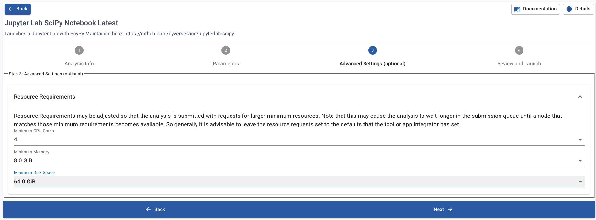
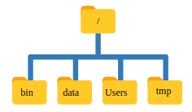
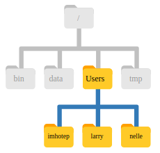

.. include:: ../cyverse_rst_defined_substitutions.txt
.. include:: ../custom_urls.txt

|CyVerse_logo|_

|Home_Icon2|_
`Learning Center Home <http://learning.cyverse.org/>`_

**Command Line and the Unix Shell**
------------------------------------

.. admonition:: learning-objectives

       - Know the command line's utility
       - Define what the filesysem is
       - Use basic navigation commands to interact with the file system
       - Recognize the similarities between shell commands and iRODS
       - Describe resources to continue learning command line applications

Why should you care about the shell?
~~~~~~~~~~~~~~~~~~~~~~~~~~~~~~~~~~~~

.. #### Comment: Introduction to commandline principles

*At a high level, computers do four things:*

#. run programs
#. store data
#. communicate with each other
#. interact with users

*The graphical user interface (GUI)*

 The GUI is the most widely used way to interact with computers

    - Often the first way people learn to interact with a computer
    - Give instructions with mouse (ex. run a program, create a folder/directory, move files, etc.)
    - Difficult to scale since it requires human interaction

*The shell - a command-line interface (CLI)*.

Less common way to interact with personal computers.
Enables remote access to servers and analyses.

    - Can automate repetitive tasks
    - Commands are reproducible

.. admonition:: Example

      If we have to copy the third line of each of a thousand text files stored
      in thousand different folders/directories and paste it into a single file line by line.

      - Using the traditional GUI approach will take several hours to do this.
      - Using the shell this will only take a couple of minutes (at most).

The Shell is a **program which runs other programs** rather than doing calculations itself.

    - programs can be as complicated as a climate modeling software
    - as simple as a program that creates a new folder/directory
    - **simple programs used to perform stand alone tasks are usually refered to as commands.**
    - most popular Unix shell is **Bash**, (the Bourne Again SHell).
    - Bash is the default shell on most modern implementations of Unix

Whether accessed through the graphical user interface or the shell, all computers contain a file system.

|TheFileSystem|

----

Setting up Our Shell Environment:
~~~~~~~~~~~~~~~~~~~~~~~~~~~~~~~~~

*Launch JupyterLab VICE Application:*

Search for the application `Jupyter Lab SciPy Notebook Latest` here:

|App Search DE2|

*Setup Outputs:*

|DE2 App Outputs|

*Add Our Input Folder:*

|Add input folder DE2|

|Select Folder|

*Memory Allocation:*

|Set Memory for Container DE2|

*Launch Application on DE2:*

|Launch App|

*Launch the Shell in JupyterLab:*

|Jupyter Shell Icon Screenshot|

*Command Prompt:*

|Jupyter Shell Prompt|

*Optional: Change to JupyterLab Dark Theme*

|Dark Theme|

.. admonition:: Question

      In small, groups help each other get the shell prompt open inside JupyterLab.

      If you all have JupyterLab's shell launched, please discuss the following question.

      1. How does learning aspects of the shell help us create FAIR data?

      2. Do you think we can use the shell to do data tasks on the CyVerse Data Store?

----

Introduction to Shell Commands
~~~~~~~~~~~~~~~~~~~~~~~~~~~~~~

*Print working directory (pwd)*

Directories are equivalent to folders on a desktop computer, but are like an address for the computer's file system.

To find  “where” you are we can use the command `pwd`:

.. code-block:: bash

  $ pwd
  /home/jovyan/work

*List files and directories (ls)*

We can see the contents of our current directory by running `ls`.

.. code-block:: bash

    $ ls
    data-shell  downloads.stderr.log  downloads.stdout.log

Your results may be slightly different depending on your operating system and any system modifications.

*Adding Options to ls*

With the option, or flag, `-F` we can differentiate between files and folders.
All folders will appear in the shell prompt with a `/` appended to their names.

.. code-block:: bash

    $ ls -F
    data-shell/  downloads.stderr.log  downloads.stdout.log

*Changing Directories*

After running `pwd` we know we're in the directory `/home/joyvan/work`.

How can we change our location to the `data-shell` directory?
The `cd` or change directory command.

.. code-block:: bash

    $ cd data-shell

*Making Directories*

To make directories in the command line we can use the command `mkdir`

.. code-block:: bash

    $ mkdir thesis
    $ ls -F
    creatures/  data/  molecules/  north-pacific-gyre/  notes.txt  pizza.cfg
    solar.pdf  thesis/  writing/

Now let's change into our directory `thesis/`

.. code-block:: bash

    $ cd thesis
    $ ls -F

When we run `ls -F` we don't see any output in the terminal.

So let's make some files in this directory.

*Creating Files in the Shell*

.. admonition:: Good Names for Files and Directories

    1. Don’t use spaces.

        Spaces are used to separate arguments on the command line it is better to avoid them in names of files and directories.
        You can use - or _ instead (e.g. north-pacific-gyre/ rather than north pacific gyre/).

    2. Don’t begin the name with - (dash).

        Commands treat names starting with - as options or flags.

    3. Stick with letters, numbers, . (period or ‘full stop’), - (dash) and _ (underscore).

        If you need to refer to names of files or directories that already have spaces or other special characters,
        you should surround the name in quotes ("").

.. code-block:: bash

          $ nano draft.txt

Let’s type in a few lines of text.
Once we’re happy with our text, we can press **Ctrl+O**
(press the Ctrl or Control key and, while holding it down, press the O key) to write our data to disk (we’ll be asked what file we want to save this to: press **Return** to accept the suggested default of draft.txt).

        |nano|

Once our file is saved, we can use **Ctrl-X to quit** the editor and return to the shell.

In nano, along the bottom of the screen you’ll see ^G Get Help ^O WriteOut. This means that you can use Control-G to get help and Control-O to save your file.

nano doesn’t leave any output on the screen after it exits, but ls now shows that we have created a file called draft.txt:

.. code-block:: bash

        $ ls
        draft.txt

We can also use the `touch` command to create files.

.. code-block:: bash

    $ touch my_file.txt

How large is `my_file.txt`?? What command can we use to check this?

*Getting help with commands*

We can pass a --help option to the command, such as:

.. code-block:: bash

    $ ls --help

*The man command*

.. note::

	The man command will only work in the command line with certain systems.
  The GNU website manual will be useful if this is not available (like in our Docker container).

.. code-block:: bash

    $ man ls

This will open the manual in your terminal with a description of the ls command and its options and, if you’re lucky, some examples of how to use it.

To navigate through the man pages, you may use **↑** and **↓** to move line-by-line, or try **B** and **Spacebar** to skip up and down by a full page.

To quit the man pages, press q.

*Manual pages on the web*

GNU provides links to its `manuals <http://www.gnu.org/manual/manual.html>`_
including the `core GNU utilities <http://www.gnu.org/software/coreutils/manual/coreutils.html>`_ , which covers many commands introduced within this lesson.

----

Accessing the Data Store via the Shell
~~~~~~~~~~~~~~~~~~~~~~~~~~~~~~~~~~~~~~~

We can access the data store with a command line toolset called **iRODS**.
iRODS allows us to move files from the Discovery Environment container to other
directories in the Data Store.

*Configuring iRODS*

First let's configure iRODS with the command `iinit`

.. code-block:: bash

  $ iinit

    Enter the host name (DNS) of the server to connect to: data.cyverse.org
    Enter the port number: 1247
    Enter your irods user name: <your_cyverse_username>
    Enter your irods zone: iplant
    Enter your current iRODS password: <your_cyverse_password>

*Working Directory on the Data Store*

.. code-block:: bash

  $ ipwd
  /iplant/home/<Your Cyverse Username>

*Changing Directories in the Data Store*

.. code-block:: bash

  $ icd /iplant/home/shared/foss/spring-2021

*Optional: Create a folder in the data store*

This can be done via the web GUI, like we did earlier.
Or you can use the command line and iRODS to make
a folder with the same name as your CyVerse username in the path
`/iplant/home/shared/foss/spring-2021`. For example after using `icd` above,
I would write the following:

.. code-block:: bash

  $ ipwd
  /iplant/home/shared/foss/spring-2021
  $ imkdir rbartelme
  $ ils
  /iplant/home/shared/foss/spring-2021:
  C- /iplant/home/shared/foss/spring-2021/data-shell
  C- /iplant/home/shared/foss/spring-2021/rbartelme

.. admonition:: FAIR Data Group Challenge

    In small groups determine how you can use `irsync` with the flags `-rKva`
    to transfer the folder `molecules` from the `data-shell` directory
    to the data store folder you created in the foss directory in the Data Store.
    From the |irsync manual| determine as a group what makes the command "FAIR".

.. hint::

    - You need to add `i:` to the beginning of the file/folder argument to tell iRODS the location of items in the data store.
    - `irsync` behaves differently with `/` after the folder name than without the slash.
    - Look up the flags provided above in the irsync manual. Which flag enables a method that checks the validity of the data?

----

Further Practice
~~~~~~~~~~~~~~~~

.. Note::
    This is was just a brief summary of how to use the command line.
    There is much, much more you can do.

For more information check out the |The Carpentries Shell| page.
This lesson uses the folder `data-shell` which is already in your Jupyter Lab instance.
Work through these lessons on your own or in groups as homework.

-------------
**Fix or improve this documentation:**

- On Github: |Github Repo Link|
- Send feedback: `Tutorials@CyVerse.org <Tutorials@CyVerse.org>`_
------------------

.. |The Carpentries Shell| raw:: html

	<a href="https://swcarpentry.github.io/shell-novice/" target="blank">The Carpentries Shell Lesson</a>

.. |irsync manual| raw:: html

	<a href="https://docs.irods.org/master/icommands/user/#irsync target="blank">iRODS irsync manual</a>

.. |App Search DE2| image:: ../img/jupyter_de2search.png

.. |DE2 App Outputs| image:: ../img/jupyter_outputs.png

.. |Add input folder DE2| image:: ../img/jupyter_input_folder1.png

.. |Launch App| image:: ../img/launch_app_de2.png

.. |Jupyter Shell Icon Screenshot| image:: ../img/launch_terminal_jupyter.png

.. |Dark Theme| image:: ../img/jupyter_dark_theme.png

.. |shelllooklike| image:: ../img/cmd1.png
  :width: 750
  :height: 150

.. |nano| image:: ../img/cmd15.png
  :width: 750
  :height: 200

.. |Github Repo Link| raw:: html

  <a href="https://github.com/CyVerse-learning-materials/foss/tree/master/software_essentials/commandline.rst" target="blank">Github Repo Link</a>
